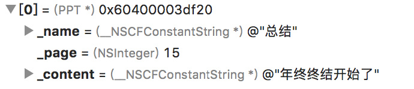

# iOS中NSPredicate的使用

在说NSPredicate之前，说一下数组的一个KVC特性`valueForKeyPath`,在开发中可能会很实用！

## 获取数组里的,最大、最小、平均、求和、删除重复数据

定义数组：
```
NSArray *array = @[@"12",@"3",@2,@9.5,@"12"];
```

### 求最大值

```
NSNumber *max = [array valueForKeyPath:@"@max.floatValue"];
```
### 求最小值
```
NSNumber *min = [array valueForKeyPath:@"@min.floatValue"];
```

### 求平均值
```
NSNumber *avg = [array valueForKeyPath:@"@avg.floatValue"];
```

### 求和
```
NSNumber *sum = [array valueForKeyPath:@"@sum.floatValue"];
```
### @distinctUnionOfObjects 和 @unionOfObjects
`@distinctUnionOfObjects`操作符返回被操作对象指定属性的集合并做去重操作.`@unionOfObjects`则允许重复
```
NSArray *newArray = [array valueForKeyPath:@"@distinctUnionOfObjects.self"];
NSLog(@"max:%@",max);//max:12
NSLog(@"min:%@",min);//min:2
NSLog(@"avg:%@",avg);//avg:7.7
NSLog(@"sum:%@",sum);//sum:38.5
NSLog(@"newArray:%@",newArray);//newArray:(3,"9.5",12,2)
```
返回值为NSNumber类型，去重后新数组的顺序也是改变的。

### 数组合并
```
NSArray *tasks = [@[dataTasks, uploadTasks, downloadTasks] valueForKeyPath:@"@unionOfArrays.self"];
```

## 数据查询
将集合对象中，所有对象name属性值放在一个数组中并返回
```
NSDictionary *dic1 = @{@"name":@"xxx",@"title":@"ooo"};
NSDictionary *dic2 = @{@"name":@"ppp",@"title":@"qqq"};
NSDictionary *dic3 = @{@"name":@"kkk",@"title":@"mmm"};
NSArray *array = @[dic1,dic2,dic3];
    
NSArray *names = [array valueForKeyPath:@"name"];
//输出：(xxx,ppp,kkk)
```
 **查询对象数组中某个属性值：**
 创建一个PPT的类
```
@interface PPT : NSObject
@property(nonatomic,copy)NSString *name;
@property(nonatomic,assign)NSInteger page;
@property(nonatomic,copy)NSString *content;
@end
```
处理如下：
```
PPT *ppt1 = [PPT new];
ppt1.name = @"总结";
ppt1.page = 10;
ppt1.content = @"年终终结开始了";
    
PPT *ppt2 = [PPT new];
ppt2.name = @"报告";
ppt2.page = 15;
ppt2.content = @"收益报告总结";

NSArray *objcArray = @[ppt1,ppt2];
//求对象中属性page的最大值。integerValue
NSNumber *maxPpt = [objcArray valueForKeyPath:@"@max.page.floatValue"];
NSLog(@"maxPpt:%@",maxPpt);//maxPpt:15
```

## NSSortDescriptor排序

* sortedArrayUsingDescriptors

```
//根据key倒序排序 ascending:YES为升序排列；No降序排列 
//arrayData为不可变数组 
NSArray *sortedArray = [arrayData sortedArrayUsingDescriptors:@[[NSSortDescriptor sortDescriptorWithKey:@"key" ascending:NO]]];
```

* sortUsingDescriptors

```
//arrayData为可变数组
[arrayData sortUsingDescriptors:@[[NSSortDescriptor sortDescriptorWithKey:@"key" ascending:NO]]];
```

* sortedArrayUsingComparator

```
//arrayData为不可变数组
NSArray *sortedArray = [arrayData sortedArrayUsingComparator:^NSComparisonResult(id  _Nonnull obj1, id  _Nonnull obj2) {
            return [obj1[@"key"] compare:obj2[@"key"]];
        }];
```

* sortUsingComparator

```
//arrayData为可变数组
  [arrayData sortUsingComparator:^NSComparisonResult(id  _Nonnull obj1, id  _Nonnull obj2) {
            return [obj1[@"key"] compare:obj2[@"key"]];
        }];

```

## NSPredicate谓词
谓词表达式由表达式、运算符和值构成。

**比较运算符**

* =、==：判断两个表达式是否相等，在谓词中=和==是相同的意思都是判断，不是赋值。
	使用上面PPT的类：
	```
	NSPredicate *predicate = [NSPredicate predicateWithFormat:@"SELF = %@",ppt1];
	    if ([predicate evaluateWithObject:ppt1]) {
	        NSLog(@"name = %@",ppt1.name);
	    }
	打印：name = 总结
	```

* >=，=>：判断左边表达式的值是否大于或等于右边表达式的值。
* <=，=<：判断右边表达式的值是否小于或等于右边表达式的值。
* >：判断左边表达式的值是否大于右边表达式的值。
* <：判断左边表达式的值是否小于右边表达式的值。
* !=、<>：判断两个表达式是否不相等。
* BETWEEN：BETWEEN表达式必须满足表达式 BETWEEN {下限，上限}的格式，要求该表达式必须大于或等于下限，并小于或等于上限。
	```
	NSPredicate *predicate = [NSPredicate predicateWithFormat:@"SELF BETWEEN {10, 20}"];
    if ([predicate evaluateWithObject:@15]) {
        NSLog(@"符合条件");
    }else{
      NSLog(@"不符合条件");
    }
//打印：2018-03-02 17:20:56.003518+0800 VCM[7915:3769434] 符合条件
```

**逻辑运算符**

* AND、&&：逻辑与，要求两个表达式的值都为YES时，结果才为YES。

```
	NSArray *testArray = @[@1, @2, @3, @4, @5, @6];
  NSPredicate *predicate = [NSPredicate predicateWithFormat:@"SELF > 2 && SELF < 5"];
  NSArray *filterArray = [testArray filteredArrayUsingPredicate:predicate];
  NSLog(@"filterArray:%@", filterArray);

//打印：2018-03-02 17:20:56.003518+0800 VCM[4531:89537] filterArray:(
//	  3,
//	  4
//	)
```

* OR、||：逻辑或，要求其中一个表达式为YES时，结果就是YES。
* NOT、 !：逻辑非，对原有的表达式取反。

**字符串比较运算符**

1. BEGINSWITH：检查某个字符串是否以指定的字符串开头（如判断字符串是否以a开头：BEGINSWITH 'a'）。
2. ENDSWITH：检查某个字符串是否以指定的字符串结尾。
3. CONTAINS：检查某个字符串是否包含指定的字符串。
4. LIKE：检查某个字符串是否匹配指定的字符串模板。其之后可以跟?代表一个字符和*代表任意多个字符两个通配符。比如"name LIKE 
'*ac*'"，这表示name的值中包含ac则返回YES；"name LIKE '?ac*'"，表示name的第2、3个字符为ac时返回YES。
5. MATCHES：检查某个字符串是否匹配指定的正则表达式。虽然正则表达式的执行效率是最低的，但其功能是最强大的，也是我们最常用的。

**注：**字符串比较都是区分大小写和重音符号的。如：café和cafe是不一样的，Cafe和cafe也是不一样的。如果希望字符串比较运算不区分大小写和重音符号，请在这些运算符后使用[c]，[d]选项。其中[c]是不区分大小写，[d]是不区分重音符号，其写在字符串比较运算符之后，比如：name
 LIKE[cd] 'cafe'，那么不论name是cafe、Cafe还是café上面的表达式都会返回YES。

**集合运算符**

1. ANY、SOME：集合中任意一个元素满足条件，就返回YES。
2. ALL：集合中所有元素都满足条件，才返回YES。
3. NONE：集合中没有任何元素满足条件就返回YES。如:NONE person.age < 18，表示person集合中所有元素的age>=18时，才返回YES。
4. IN：等价于SQL语句中的IN运算符，只有当左边表达式或值出现在右边的集合中才会返回YES。我们通过一个例子来看一下：

```
NSArray *filterArray = @[@"ab", @"abc"];
  NSArray *array = @[@"a", @"ab", @"abc", @"abcd"];
  NSPredicate *predicate = [NSPredicate predicateWithFormat:@"NOT (SELF IN %@)", filterArray];
  NSLog(@"%@", [array filteredArrayUsingPredicate:predicate]);

打印：2018-03-02 17:20:56.003518+0800 VCM[6701:136206] (
  a,
  abcd
)
```

**直接量**<br>
在谓词表达式中可以使用如下直接量

1. FALSE、NO：代表逻辑假。
2. TRUE、YES：代表逻辑真。
3. NULL、NIL：代表空值。
4. SELF：代表正在被判断的对象自身。
5. "string"或'string'：代表字符串。
6. 数组：和c中的写法相同，如：{'one', 'two', 'three'}。
7. 进制数：0x开头十六进制数字、0o开头八进制数字、0b开头二进制数字。

## 谓词的用法

### 过滤page值大于10的对象：
```
NSPredicate *predicate = [NSPredicate predicateWithFormat:@"page > 10"];
   
NSArray *filterArray = [objcArray filteredArrayUsingPredicate:predicate];
   
NSLog(@"filterArray =%@",filterArray);
```
打印：filterArray =(
    "< PPT: 0x60400003df20 >"
)



### name包含某个字符串匹配

```
NSPredicate *predicate = [NSPredicate predicateWithFormat:@"name CONTAINS %@",@"报告"];
```

### 根据属性获取元素，修改元素的另一个属性值
```
NSPredicate *predicate = [NSPredicate predicateWithFormat:@"name = %@",@"总结"];
 NSArray *filterArray = [objcArray filteredArrayUsingPredicate:predicate];
   
 NSLog(@"ppt1 = %@\n filter =%@",ppt1,filterArray.firstObject);
 ((PPT*)filterArray.firstObject).content = @"ooxx";
 NSLog(@"ppt1.content = %@",ppt1.content);
```

打印：2018-03-02 18:13:00.770557+0800 VCM[8318:3816293]
 ppt1 =< PPT: 0x60000003c140 >
 filter =< PPT: 0x60000003c140 >
2018-03-02 18:13:00.770676+0800 VCM[8318:3816293] ppt1.content = ooxx打印：2018-03-02 18:13:00.770557+0800 VCM[8318:3816293]
 ppt1 =< PPT: 0x60000003c140 >
 filter =< PPT: 0x60000003c140 >
2018-03-02 18:13:00.770676+0800 VCM[8318:3816293] ppt1.content = ooxx

打印中可以看到，过滤后的数据和原数据的地址一样。返回数据并非使用copy操作。

### 使用占位符参数

第一种：
```
NSPredicate *predTemp = [NSPredicate predicateWithFormat:@"%K = %@",@"name",@"总结"];
```
第二种：
```
//  创建谓词，属性名改为page，要求这个page包含$VALUE字符串
  NSPredicate *predTemp = [NSPredicate predicateWithFormat:@"%K >= $VALUE", @"page"];
  // 指定$VALUE的值为 15
  NSPredicate *pred1 = [predTemp predicateWithSubstitutionVariables:@{@"VALUE" : @15}];
  NSArray *newArray1 = [objcArray filteredArrayUsingPredicate:pred1];
  NSLog(@"newArray1:%@", newArray1);
   
  //  修改 $VALUE的值为10，
  NSPredicate *pred2 = [predTemp predicateWithSubstitutionVariables:@{@"VALUE" : @10}];
  NSArray *newArray2 = [objcArray filteredArrayUsingPredicate:pred2];
  NSLog(@"newArray2:%@", newArray2);

```
查看newArray1，newArray2:


