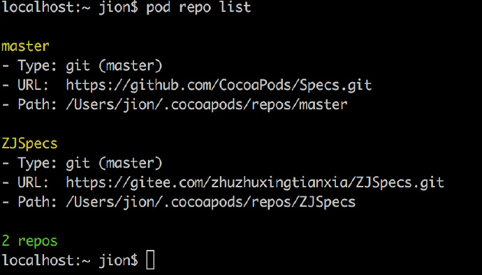

# iOS创建Pod库方法

## 本地Pod库

#### 一、新建lib库
在工程目录新建文件夹，名称XXXLib（随便什么名字，最好可读性较强，带有集成库的含义即可）

#### 二、新建同名文件夹
在上述库中新建与你想要集成库**同名**文件夹
我要集成的文件是`NTalkerSDK`，所以新建了该文件夹

#### 三、创建 .podspec 文件
pod 命令会生成 `.podspec` 文件
```
cd NTalkerSDK
pod spec create NTalkerSDK
```

#### 四、配置 .podspec 文件
```
Pod::Spec.new do |spec|

  spec.name         = "NTalkerSDK"
  spec.version      = "2.6.5"
  spec.summary      = "NTalkerSDK小能客服"

  spec.description  = <<-DESC
  DOTO: NTalkerSDK实时在线客服聊天服务系统
                   DESC

  spec.homepage     = "http://doc3.xiaoneng.cn/ntalker.php"
  # spec.screenshots  = "www.example.com/screenshots_1.gif"
  spec.license      = "MIT"
  # spec.license      = { :type => "MIT", :file => "LICENSE" }

  spec.author             = { "作者" => "作者邮箱" }
  spec.platform     = :ios, "8.0"

  # spec.ios.deployment_target = "8.0"

  spec.source       = { :git => "https://github.com/NTalkerSDK.git", :tag => "#{spec.version}" }

  # spec.source_files  = "NTalkerSDK*"
  # spec.exclude_files = "Classes/Exclude"
  # spec.public_header_files = "Classes*.h"

  # spec.resource  = "icon.png"
  spec.resources = "NTalkerSDK/NTalkerColorful.bundle", "NTalkerSDK/NTalkerDefault.bundle", "NTalkerSDK/NTalkerGuest.bundle"
  # spec.preserve_paths = "FilesToSave", "MoreFilesToSave"

  # 使用了第三方静态库
  # spec.vendored_libraries = 'TalkingData/libTalkingData.a'
  spec.vendored_frameworks = 'NTalkerSDK/NTalkerGuestIMKit.framework', 'NTalkerSDK/NTalkerIMCore.framework'

  spec.frameworks = 'AVFoundation', 'Contacts', 'CoreTelephony', 'AddressBook'
  spec.libraries = 'sqlite3.0','xml2.2','stdc++','c++'

  # spec.requires_arc = true
  spec.static_framework  =  true

  # spec.xcconfig = { "HEADER_SEARCH_PATHS" => "$(SDKROOT)/usr/include/libxml2" }
  # spec.dependency "JSONKit", "~> 1.4"
# 添加子依赖，可以让库实现两级目录
  #
  #s.subspec 'NSURLSession' do |ss|
  #    ss.dependency 'AFNetworking/Serialization'
  #    ss.dependency 'AFNetworking/Security'
     
  #     ss.source_files = 'AFNetworking/AF{URL,HTTP}SessionManager.{h,m}', 'AFNetworking/AFCompatibilityMacros.h'
  #     ss.public_header_files = 'AFNetworking/AF{URL,HTTP}SessionManager.h', 'AFNetworking/AFCompatibilityMacros.h'
  #    ss.frameworks = 'SystemConfiguration'
  #end

  # 添加spec.pod_target_xcconfig，执行pod lib lint --skip-import-validation 否则不支持i386和x86_64编译
   spec.pod_target_xcconfig = { 'VALID_ARCHS[sdk=iphonesimulator*]' => '' }

end
```

#### 五、检查 .podspec
切换到`NTalkerSDK.podspec` 路径，执行命令：
```
pod lib lint
```
会出现一些问题，可根据提示排查

**问题:**模拟器下编译不通过问题
在`pod lib lint --verbose` 阶段就不能通过，直接报错！

```
Ld /Users/jion/Library/Developer/Xcode/DerivedData/App-dphkvfphtohrwobsykxtcixkolaq/Build/Intermediates.noindex/App.build/Release-iphonesimulator/App.build/Objects-normal/i386/App normal i386 (in target: App)
```
或
```
Ld /Users/jion/Library/Developer/Xcode/DerivedData/App-dphkvfphtohrwobsykxtcixkolaq/Build/Intermediates.noindex/App.build/Release-iphonesimulator/App.build/Objects-normal/x86_64/App normal x86_64 (in target: App)
```

解决方法：

1. 在 `podspec` 文件中添加 `s.pod_target_xcconfig = { 'VALID_ARCHS[sdk=iphonesimulator*]' => '' }`，如果项目已经设置 `pod_target_xcconfig`，添加到已有值的后面。设置此处将在 模拟器编译时不产生二进制文件。
2. `pod lib lint`命令添加 `--skip-import-validation`参数，lint 将跳过验证 pod 是否可以导入。
3. 如果上传则 `pod repo push` 命令添加 `--skip-import-validation` 参数，push 将跳过验证 pod 是否可以导入。 

**编译报错：** `(maybe you meant: ___llvm_profile_runtime_user)`<br/>
 解决：Other Linker Flags中添加`-fprofile-instr-generate`

## 公共Pod库

#### 一、注册CocoaPods账户信息
1.创建一个开源pod库，首先要安装CocoaPods，安装方法不在赘述。然后注册到CocoaPods，
终端执行：
```
pod trunk register 邮箱地址 '用户名' --verbose
```
2.一般使用github邮箱和用户名, 然后在你的邮箱中会收到确认邮件, 在浏览器中点击链接确认即注册成功, 成功之后可以终端执行: 
```
pod trunk me
```
可以查看到自己的注册信息和已经发布的开源库！

#### 二、创建一个全新的工程

###### 1. 创建共享文件，使用终端命令:
```
cd 文件路径
pod lib create 库名 #命名不能和已有的库名重名
```
去根据需要选择各项配置后创建一个标准的工程，将该工程上传到GitHub。

###### 2. 编辑.podspec文件

```
Pod::Spec.new do |s|
  s.name             = 'ZJ_Hello'
  s.version          = '0.1.1' //版本号
  s.summary          = 'ZJ_Hello简介' //简介pod搜索的时候会显示

  s.description      = <<-DESC
   TODO: 这个库的功能说明.
                            DESC
  s.homepage         = 'https://github.com/zhuzhuxingtianxia/ZJ_Hello' //主页路径，和上传的github的地址要保持一致。
  # s.screenshots     = 'www.example.com/screenshots_1', 'www.example.com/screenshots_2'
  s.license          = { :type => 'MIT', :file => 'LICENSE' }
  s.author           = { '作者' => '联系方式' }
  s.source           = { :git => 'https://github.com/zhuzhuxingtianxia/ZJ_Hello.git', :tag => s.version.to_s } //github下载地址
  # s.social_media_url = 'https://twitter.com/'
  s.platform     = :ios, '8.0' //支持的平台
  s.ios.deployment_target = '8.0'  //目标的平台 

  s.source_files = 'ZJ_Hello****/*.h'
  # s.libraries = 'sqlite3.0' //依赖的lib 
  # s.frameworks = 'UIKit', 'MapKit' //依赖的frameworks  
  # s.dependency 'AFNetworking', '~> 2.3' //依赖的第三方库 :source=>'' 未经过验证
end
```
编辑好后，提交到GitHub。

###### 3. 验证.podspec文件的合法性

终端cd到.podspec文件所在文件夹,执行命令：

```
pod lib lint xxx.podspec
```
提示:
```
-> xxx (0.1.0) 
Xxx passed validation.
```
表示验证成功。<br/>

**注意：** 如果homepage地址不正确，会报错误信息！文件`s.summary` 和`s.description`如果没有做任何修改的话,还会出现两个警。

###### 4. 添加自己的代码文件

找到工程中ReplaceMe文件,替换就可以。(我们也可以把他修改成.h文件，用于存放所有的.h文件)但是要放在ReplaceMe文件的相同路径下！Show in Finder查看下ReplaceMe所在的文件路径！添加好自己的文件代码，记得提交到远端！<br/>

如果你在创建工程时候创建了一个包含demo的工程,那么你可以先切换到工程的Example文件目录下面使用命令：
```
pod install
```

###### 5. 打tag, 发布一个release版本

一切准备就绪后, 我们需要在你的git仓库里面存在一个与`.podspec`文件中一致的version, 
这里你可以在你的git仓库中的releases一项去手动发布，这个也比较简单。


也可以在当前文件夹下使用终端命令：
```
git tag  0.1.0 或 git tag -m “标题”  0.1.0
git push --tags #推送tag到远端仓库
```
验证是否通过：
```
pod spec lint xxx.podspec #验证是否通过
```
功之后即可在你的releases里面看到这个tag的版本,如上图所示！

###### 6. 提交pod 到Specs仓库

在当前文件夹下使用终端命令：
```
pod trunk push xxx.podspec
```


表示提交成功！<br/>
如果提示：


或着提示


> 注：Unable to accept duplicate entry for:xxx(0.1.0)

说明specs中push过这个版本或者可能push失败，需要修改版本号重新走一遍。
首先修改`.podspec`文件中的版本号并提交，然后重新打`tag`, 发布一个新的`release`版本，最后提交pod 到Specs仓库。

###### 7. pod search 查找发布的库

终端输入：
```
rm ~/Library/Caches/CocoaPods/search_index.json
```
然后：
```
pod search xxx
```

###### 8. 废除某个pod库
```
pod trunk deprecate  NAME  //废除这个pod
pod trunk delete NAME VERSION //（删除远端的一个pod版本）
pod repo remove NAME  //废去pod的某个版本
```
**注：**以上命令都试过了，但是还是可以search到。移除`CocoaPods/search_index.json`文件还是可以search到。此时`pod install`的时候是找不到资源的！这点需要注意！

## 私有Pod库

私有Pod库和公有Pod库的创建方式没有什么区别, 不一样的是管理他们的spec repo不一样。<br/>
所以我们需要自己创建一个跟[CocoaPods/Specs](https://github.com/CocoaPods/Specs)类似的仓库来管理内部创建的Pod库的podspec文件, 供内部人员更新和依赖使用内部Pod组件库.
私有repo的构建形式有两种, 一种是私有git服务器上面创建，一种是本机创建。
本机创建请参考官方文档:[Private Pods](https://guides.cocoapods.org/making/private-cocoapods.html)
这里介绍的是在内部搭建的git服务器上面创建整个服务的方式.

#### 1. 创建私有Spec Repo

* 先创建ZJSpecs仓库
* `pod repo add ZJSpecs https://gitee.com/zhuzhuxingtianxia/ZJSpecs.git`
* 因为我创建的是给私人库，执行命令时需要输入码云账户和密码。
* 添加成功后可以在：`~/.cocoapods/repos` 目录下可以看到官方的specs:master和刚刚加入的specs:ZJSpecs
* 执行：`pod repo list` 查看repo列表

	
	
* 如果有其他合作人员共同使用这个私有Spec Repo的话在他**有对应Git仓库的权限的前提下**执行相同的命令添加这个Spec Repo即可.

#### 2. 创建私有Pod组件库

* 首先查看要创建的私有仓库在pods中是否已经存在。
    然后在服务端即码云，创建一个私有远程仓库HelloLib,用来建立需要共享的内部组件。
* 执行命令：
	```
   cd MyGithub #在MyGithub文件夹下
	 pod lib create HelloLib
	```
* 打开Sourcetree,新建->添加已经存在的本地仓库 ->选择刚刚创建的HelloLib工程->双击HelloLib工程->右键选择远端 ->新建远程->输入远程仓库名称HelloLib,输入远端仓库的URL地址。这样就关联了本地和远程仓库。
	或终端：
	```
	cd HelloLib
	git remote add origin https://gitee.com/zhuzhuxingtianxia/HelloLib.git
	git push -u origin master
	```

* 编辑修改podspec文件，修改homepage和source路径为在码云仓库的路径。<br/>
**值得注意的是**:podspec文件中的homepage和source不支持ssh协议地址,所以我们得放入http/https地址。

* 提交上传本地代码到远端！
* 验证podspec文件，cd到目录下：
	```
	pod lib lint HelloLib.podspec
	```
	   如果你的spec为私有的，则会提示：
```
[!] HelloLib did not pass validation, due to 1 warning (but you can use `--allow-warnings` to ignore it) 
and all results apply only to public specs, 
but you can use `--private` to ignore them if linting the specification for a private pod.
You can use the `--no-clean` option to inspect any issue.
```
根据提示，你可以使用命令：
```
pod lib lint HelloLib.podspec --private
```
出现这个的原因是我们把仓库设置为私有的！

* 检查podspec文件中的version版本号，然后是否有未提交的代码，将未提交的代码push到仓库。
* 打tag值，当前文件夹下使用终端命令:
```
git tag  0.1.0 # git tag -m "first release" 0.1.0
git push --tags #推送tag到远端仓库
pod spec lint HelloLib.podspec #验证是否通过
```


如果是私有的则使用：
```
pod spec lint HelloLib.podspec --private
```

#### 3. 将podspec加入私有Sepc repo中

* 公有库使用trunk方式将.podspec文件发布到CocoaPods/Specs, 内部的pod组件库则是添加到ZJSpecs即我们第一步创建的私有Spec repo中去, 在终端执行:
```
pod repo push ZJSpecs HelloLib.podspec  
```
* 前往**~/.cocoapods/repos**下的ZJSpecs文件夹中查看是否存在HelloLib库文件信息，同时远端也会有更新。

#### 4. 查找和使用内部组件库

* pod search HelloLib然后并没有搜索到！这是因为HelloLib为私有库的原因！将**私有的**设置为**公开的**，然后再search试试！
如果和公有库重名，可以使用下面这种添加私有的soure地址的方式，两个都加的话，则会加载最新的版本!**所有一定不要重名！！**

* 值得注意的是:必须在Podfile前面需要添加你的私有Spec repo的git地址source（私有版本库地址）, pod install时, 才能在私有repo中查找到私有库, 像这样:
```
source 'https://gitee.com/zhuzhuxingtianxia/ZJSpecs.git'
```
若Podfile中有私有库与公有库的话，需要把公有源加上：
```
source 'https://github.com/CocoaPods/Specs.git'
```

