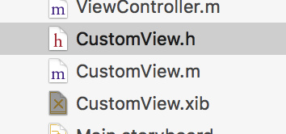
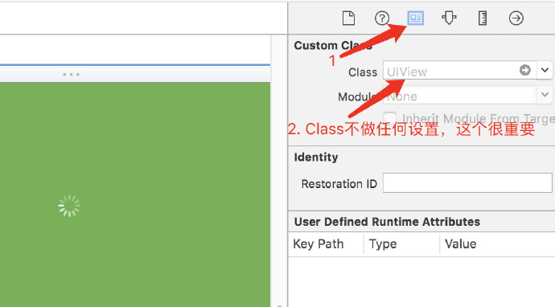
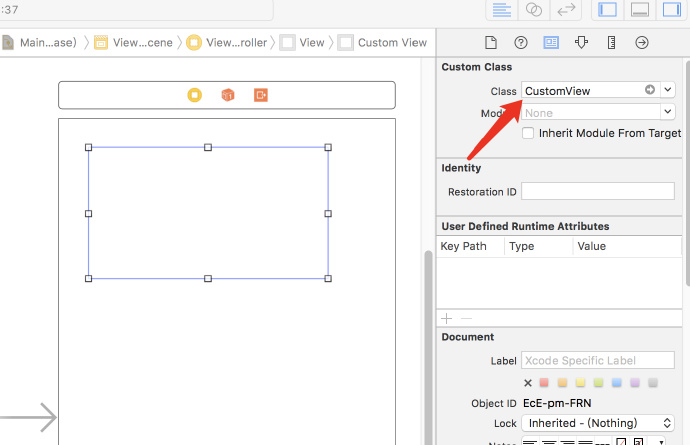

# iOS在storyboard或xib中添加另一个xib
在开发过程中有时候使用storyboard开发复杂界面的时候，会出现很多图层遮盖的问题。这样在storyboard中有些控件被遮盖，不容易修改或直观的看到。这样我们就可以另外建一个xib文件，在这个文件中添加布局！

## 新建一个工程
添加一个自定义的CustomView,然后添加一个xib命名为CustomView。如下图：



## 设置xib
打开CustomView.xib，在该xib上添加控件，设置背景色。该**xib的Class不要设置为CustomView**，此处不需要做任何设置。



## 代码设置
在CustomView.m文件中定义一个view属性：
```
// 这个view才是xib里面的view
@property (strong, nonatomic) UIView *view;

//然后： 初始化CustomView的时候添加xib上的view
- (instancetype)initWithCoder:(NSCoder *)aDecoder {
    self = [super initWithCoder:aDecoder];
    if (self){
        [self addSubview:self.view];
    }
    return self;
}
// 获取xib中的view
- (UIView *)view{
    if (!_view) {
        _view = [[NSBundle mainBundle] loadNibNamed:@"CustomView" owner:self options:nil].lastObject;
    }
    return _view;
}

- (void)layoutSubviews{
    [super layoutSubviews];
   //设置大小
   self.view.frame = self.bounds;
}
```

## 设置将xib添加到storyboard
打开Main.storyboard，添加一个view，让view类继承`CustomView`,如图：



运行项目，看下结果！这样就完成了！

