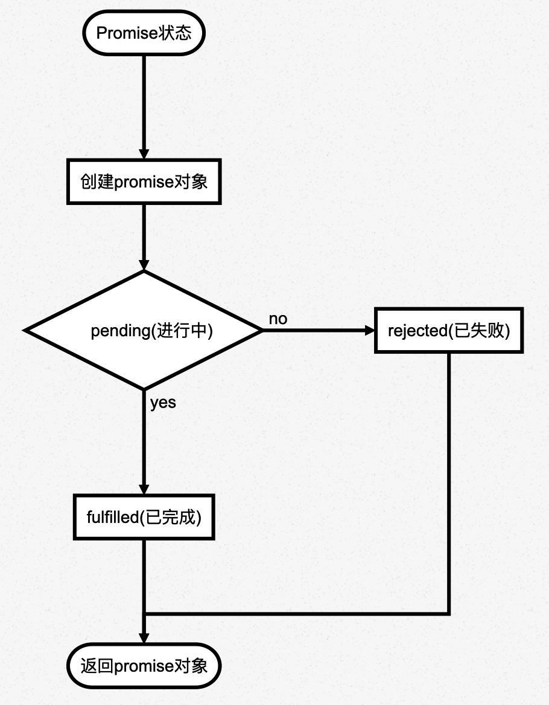

# weex之promise异步编程


## Promise的含义
promise是异步编程的一种解决方法,比传统的回调函数和事件更合理更强大
。promise里面保存着某个未来才会结束的事件（通常是一个异步操作）的结果，从语法上说，promise是一个对象，从它可以获取异步操作的消息，promise提供了统一的API，各种异步操作都可以用同样的方法进行处理。

## Promise优缺点



* Promise对象可以将异步操作以同步操作的流程表达出来，避免了层层嵌套的回调函数。
* Promise的缺点：<br/>
  1. 首先，无法取消Promise，一旦新建它就会立即执行，无法中途取消。
  2. 其次，如果不设置回调函数，Promise内部抛出的错误，不会反应到外部。
  3. 第三，当处于pending状态时，无法得知目前进展到哪一个阶段（刚刚开始还是即将完成）。

## Promise实例
使用构造函数创建一个promise对象实例
```
var promise = new Promise( function( resolve, reject) {
       //异步操作成功 
      if(value){
        	 resolve(value);
       }else{
         reject(error);
       }
});

```
**参数：**resolve和reject，是两个函数，由Javascript引擎提供，不用自己部署。
`resolve函数的作用`：将promise对象的状态从“pending”变为“resolved”，在异步操作成功时调用，并将异步操作的结果，作为参数传递出去；

`reject函数的作用是`：将Promise对象的状态从“未完成”变为“失败”（即从 pending 变为 rejected），在异步操作失败时调用，并将异步操作报出的错误，作为参数传递出去。

promise实例生成以后，可以用then方法分别指定resolved状态和rejected状态的回调函数,使用如下：
```
promise.then(
    function(value){
   		//success
   },
    function(error){
   		//failure
 });

```
then()方法回调函数说明：

* 第一个回调函数是promise对象的状态变为resolved时调用；
* 第二个函数是可选的，是promise对象的状态变为rejected时调用；

这两个函数都接受promise对象传出的值作为参数。

如果调用resolve函数和reject函数时带有参数，那么他们的参数会被传递给回调函数，reject函数的参数通常是Error对象的实例，表示抛出的错误，resolve函数的参数除了正常的值以外，还可以是另一个promise实例；
```
var p1 = new Promise(function (resolve, reject) {
  // ...
});

var p2 = new Promise(function (resolve, reject) {
  // ...
  resolve(p1);
})

```
p1和p2都是 Promise 的实例，但是p2的resolve方法将p1作为参数，即一个异步操作的结果是返回另一个异步操作。
这时p1的状态就会传递给p2，也就是说，p1的状态决定了p2的状态。如果p1的状态是pending，那么p2的回调函数就会等待p1的状态改变；如果p1的状态已经是resolved或者rejected，那么p2的回调函数将会立刻执行。

## Promise执行顺序问题

看下这段代码输入：
```
let promise = new Promise(function(resolve, reject) {
  console.log('Promise');
  resolve();
});

promise.then(function() {
  console.log('resolved.');
});

console.log('Hi!');

// Promise
// Hi!
// resolved

```
Promise新建后就会立即执行,所以首先输出的是Promise。然后，then方法指定的回调函数，将在当前脚本所有同步任务执行完才会执行，所以resolved最后输出。

**注意**，调用resolve或reject并不会终结 Promise 的参数函数的执行
```
new Promise((resolve, reject) => {
  resolve(1);
  console.log(2);
}).then(r => {
  console.log(r);
});
// 2
// 1
```
调用resolve(1)以后，后面的console.log(2)还是会执行，并且会首先打印出来。这是因为立即 resolved 的 Promise 是在本轮事件循环的末尾执行，总是晚于本轮循环的同步任务。
一般来说，调用resolve或reject以后，Promise 的使命就完成了，后继操作应该放到then方法里面，而不应该直接写在resolve或reject的后面。所以，最好在它们前面加上return语句，这样就不会有意外。
```
new Promise((resolve, reject) => {
  return resolve(1);
  // 后面的语句不会执行
  console.log(2);
})

```
## weex使用Promise

storage使用Promise
```
getItem: function(key) {
        const storage = weex.requireModule("storage");
        return new Promise(function(resolve, reject) {
            try {
                storage.getItem(key, e => {
                    if (e.result === 'success') {
                        resolve(e);
                    } else {
                        console.log('获取本地数据失败')
                        reject(e);
                    }
                });
            } catch (e) {
                console.log('获取本地数据异常')
                let event = {
                    result: 'fail',
                }
                reject(event);
            }
        });
    }
```

使用时

```
getItem('key').then(r => {
    
});

```
### 网络请求
promise对象实现stream操作的例子
```
 post: function(url,param){
    		var promise = new Promise( function(resolve,reject ) {
              const stream = weex.requireModule('stream');
    				var HTTPHeader = { 'Content-Type': 'application/json' }
    				var jsonType = 'text'
    				stream.fetch({
    			        method: 'POST',
    			        // timeout: 30000,//30s
    			        url: url,
    			        type: jsonType,
    			        headers: HTTPHeader,
    			         body: JSON.stringify(param)
    			    }, function(ret){
    			    		if(!ret.ok){
    			    			let err = new Error('请求失败')
    							reject(err);
    			    		}else{
    			    			
    							resolve(ret.data);
    			    		}
    			    		
    			    })
         });
         
    		return promise;		
    }

```

发起请求

```
const body = {title:'标题', article:'内容'};
const API = 'https://jsonplaceholder.typicode.com/posts';
this.post(API,body).then(data =>{
       modal.alert({message:data})
       //{"title":"标题", "article":"内容","id":"101"}
 })
 
```

`then()`方法返回的是一个新的Promise实例（不是原来那个Promise实例），因此可以采用链式写法，即then方法后面再调用另一个then方法
```
post(url,param).then(function (respone){
           return respone;
}).then(function(data){
           //...
});

```
采用链式的then，可以指定一组按照次序调用的回调函数。这时前一个回调函数，有可能返回的还是一个promise对象(即有异步操作)，这时后一个回调函数，就会等待该promise对象的状态发生变化，才会被调用。例如两个网络请求，第二个依赖于第一个请求返回的数据：

```
const self = this;
this.post(API,body).then(function(data){
       //{"title":"标题", "article":"内容","id":"101"}
       let objc = JSON.parse(data)
       let newBody = {title:objc.article,article:objc.title}
       return  self.post(API,newBody)
 }).then(function  funA(result) {
         console.log("resolved:" ,result);
}, function funB(err){
        console.log("rejected：", err);
})

```
上面第一个then方法指定的回调函数，返回的是另一个promise对象，这时，第二个then方法指定的回调函数，就会等待这个新的Promise对象状态发生变化。如果变为resolved，就调用funA，如果状态变为rejected，就调用funB。改为箭头函数，代码更简洁:

```
const self = this;
this.post(API,body).then(data => {
       //{"title":"标题", "article":"内容","id":"101"}
       let objc = JSON.parse(data)
       let newBody = {title:objc.article,article:objc.title}
       return  self.post(API,newBody)
 }).then(result => {
         console.log("resolved:" ,result);
}, err => {
        console.log("rejected：", err);
})

```


## 自实现Promise

* 定义Promise类，并定义状态state(初始状态为pending)
* 该类接收一个函数`fn`作为参数,该函数接收`resolve`和`reject`两个函数作为参数，参数为非必传项
* `fn`立即执行
* Promise类还存在一个`then`方法回调，包含`succeed`和`fail`
* 定义存储then回调的数组`callbacks`,每次调用then函数，都将收到的`succeed`和`fail`函数传入存储数组中
* 当`resolve`的时候，Promise内部的状态就变为了`fulfilled`，且只能从`pending`状态变为`fulfilled`
* `callbacks`里存储的都是回调，调用的时候需要进行异步处理
* `reject`的处理方式和`resolve`相同
* then链式调用处理

```
class MyPromise {
	state = 'pending'
	
	callbacks = []
	
	resolve = (res)=> {
		if(this.state !== 'pending') return
		this.state = 'fulfilled'
		//异步调用
		setTimeout(()=>{
			this.callbacks.forEach(handle => {
				let _res;
				if(typeof handle.succeed == 'function') {
				try {
					_res = handle.succeed(res)
				} 
				catch(error) {
					return handle.promise.reject(error)
				}
					
				}
				handle.promise.resolve(_res)
			})
		}, 0)
	}
	
	reject = (res) => {
		if(this.state !== 'pending') return
		this.state = 'rejected'
		setTimeout(()=>{
			this.callbacks.forEach(handle => {
				let _res;
				if(typeof handle.fail == 'function') {
				try {
					_res = handle.fail(res)
				} 
				catch(error) {
					return handle.promise.reject(error)
				}
					
				}
				handle.promise.resolve(_res)
			})
		}, 0)
	}
	
	constructor(fn) {
		if(typeof fn !== 'function') {
			throw new Error('参数必须是一个函数')
		}
		// fn立即执行
		fn(this.resolve, this.reject)
	}
	
	then = (succeed?, fail?) => {
		const handle = {}
		if(typeof succeed === 'function') {
			handle.succeed = succeed
		}
		if(typeof fail === 'function') {
			handle.fail = fail
		}
		
		handle.promise = new MyPromise(()=>{})
		
		this.callbacks.push(handle)
		
		return handle.promise
	}
	
}
```


