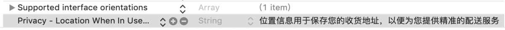

# weex之百度地图组件开发
## 一、前期准备
使用百度账号，登陆[百度地图开发平台](http://lbsyun.baidu.com/)申请AK。

首先“创建应用”


然后填写应用名称，选择应用类型和输入安全码，安全码为应用的**Bundle Identifier**，不对应的话则不会鉴权成功。


在应用列表界面会获得访问应用的AK。

使用 CocoaPods 安装 SDK。
```
platform :ios, '7.0' #手机的系统
target 'YourProjectTarget'
do #工程名字
pod “BaiduMapKit” #百度地图SDK
pod 'BMKLocationKit' #百度定位SDK
```
执行安装命令：
```
pod install
```
最后打开Xcode找到项目的info.plist文件，添加定位访问权限。

我们只在打开应用时使用定位，所以选择Privacy - Location When In Use Usage Description。
当然还有响应的具体描述，否则在上架时会**被拒**。



## 二、接口设计
 提供定位、地理编码、地理反编码、POI城市内检索、地图展示、添加自定义标注等基本功能，

配合[百度开发平台](http://lbsyun.baidu.com/index.php?title=iossdk/guide/route/drive)开发者文档做如下定义：
1.定义一个定位模块WXLocationModule，提供定位、地理编码、地理反编码、POI城市内检索
1）WX_EXPORT_METHOD(@selector(location:));
 说明：返回经纬度及位置信息
 返回结果：
```
 {
    result:failed,
    data:'错误信息说明'
 }
 {
     result:success,
     data:{
         latitude:'纬度',
         longitude:'经度',
         province:'省',
         city:'市',
         district:'区名字',
         street:'街道名字',
         streetNumber:'街道号码属性',
         cityCode:'城市编码',
         adCode:'行政区划编码属性',
         locationDescribe:'位置语义化结果的定位点在什么地方周围的描述信息，例如：东方明珠'
     }
 }
```
（2）WX_EXPORT_METHOD(@selector(geoCode: result:));
 说明：根据位置信息返回经纬度；
 参数：{"city":"城市名称","address":"街道地址"}
 返回结果：
```
 {
 result:failed,
 data:'错误信息说明'
 }
 {
 result:success,
 data:{
     latitude:'纬度',
     longitude:'经度',
     level:'地理类型包含：UNKNOWN、国家、省、商圈、生活服务等等',
     precise:'是否是精准查找',//true:准确查找，false:不精确
     }
 }
```
（3）WX_EXPORT_METHOD(@selector(reverseGeoCode: result:));
 说明：根据地理编码返回结果
 参数：{"latitude":"纬度","longitude":"经度"}
 返回结果：
```
{
     result:failed,
     data:'错误信息说明'
 }
 {
     result:success,
     data:{
         province:'省',
         city:'市',
         district:'区名字',
         address:"地址名",
         businessCircle:"商圈名",
         latitude:'纬度',
         longitude:'经度',
         poiList:[{
             name:"poi名称",
             address:"poi地址信息",
             province:'POI所在省份',
             city:'POI所在城市',
             area:"POI所在行政区域",
             distance:"距离坐标点距离",
             latitude:'纬度',
             longitude:'经度'
         }]
     }
 }
```
4）WX_EXPORT_METHOD(@selector(POISearch: result:));
 说明：城市POI搜索服务
 参数：{"city":"城市名称","keyword":"关键字"}
 返回结果：
```
 {
     result:failed,
     data:'错误信息说明'
 }
 {
 result:success,
     data:[{
         name:"poi名称",
         address:"poi地址信息",
         province:'POI所在省份',
         city:'POI所在城市',
         area:"POI所在行政区域",
         distance:"距离坐标点距离",
         latitude:'纬度',
         longitude:'经度'
     }]
 }
```
2.定义一个地图组件WXMapComponent,提供展示、添加自定义标注、点聚合、运动轨迹
（1）定义提供给weex使用的属性：
  zoomLevel：比例尺等级，默认14。取值范围：4-21；
  zoomControlsEnabled：是否展示地图缩放按钮，默认false。ios不支持；
  showTraffic：是否实时显示路况信息,默认false；
  userLocation：用户位置的经纬度，例：{latitude:'31.242727',longitude:'121.513295'}
  showScaleBar：是否显式比例尺，默认true
  scaleBarPosition：比例尺的位置，例如：{x:10,y:10}
（2）定义提供给weex使用的事件方法：
  mapLoaded：地图加载完成事件；
  selectBubble：选中标注事件；
  autoAddAnnotation：点击地图空白处添加标注事件,不实现该方法，无法添加。
 (3)地图元素添加标注方法：
   WX_EXPORT_METHOD(@selector(addAnnotation:));
  weex使用：
   this.$refs.map.addAnnotation(annotationConfig)
  annotationConfig配置对象参数说明：
    pointType:0:默认标注 1:自定义标注图标
    paopaoType:0:默认泡泡，1:自定义泡泡
    canShowCallout:设置气泡是否可以弹出true或false
    select:设置标注是否弹出气泡true或false，只能选中一个
    pinColor:pointType为0时有效 pinColor取值：red,green,purple
    image:设置标注图片,在pointType为1时有效；设置泡泡图片paopaoType为1时有效
    title:若title为nil，则无法弹出泡泡
    subtitle:副标题

##  三、组件开发
1.新建TCMLocationManager.h类
```
#import < Foundation/Foundation.h >
//定位相关
#import < BMKLocationkit/BMKLocationComponent.h >
//地理编码
#import < BaiduMapAPI_Base/BMKBaseComponent.h >
#import < BaiduMapAPI_Search/BMKSearchComponent.h >

//定位回调
typedef void(^LocationCallBack)(NSError * _Nullable err,BMKLocation * _Nullable location);
//BMKLocatingCompletionBlock单次定位回调

@interface TCMLocationManager : NSObject

+ (nonnull instancetype)instance;

+(NSString*)appKey;

//是否持续定位，默认NO
@property(nonatomic,assign)BOOL allwaysLocation;

/ **
 注册

 @param AK appKey
 * /
-(void)registerWithKey:(NSString*)AK;
-(void)registerWithKey:(NSString*)AK result:(void(^)(BMKLocationAuthErrorCode authCode))block;
/ **
 开启定位

 @param callBack 定位结果回调
 * /
-(void)startWithLocation:(LocationCallBack)callBack;

//正地理编码（即地址转坐标）
-(void)geoCodeWithCity:(NSString*)city ByAddress:(NSString*)address result:(void(^)(NSError * _Nullable err,BMKGeoCodeSearchResult * _Nullable searchResult))block;

//逆地理编码（即坐标转地址）
-(void)reverseGeoCode:(CLLocationCoordinate2D)coordinate result:(void(^)(NSError * _Nullable err, BMKReverseGeoCodeSearchResult * _Nullable searchResult))block;

//POI城市内检索
-(void)poiSearchWithCity:(NSString*)city keyword:(NSString*)keyword result:(void(^)(NSError * _Nullable err, NSArray< BMKPoiInfo * > * _Nullable searchResult))block;

//停止地图定位引擎
-(void)stopManager;

@end

```
2.新建TCMLocationModule.h类，实现WXModuleProtocol。
```
// 暴露给js的方法
WX_EXPORT_METHOD(@selector(location:));
WX_EXPORT_METHOD(@selector(geoCode: result:));
WX_EXPORT_METHOD(@selector(reverseGeoCode: result:));
WX_EXPORT_METHOD(@selector(POISearch: result:));
```
3.新建WXMapComponent.h类继承WXComponent 。
(1)WXMapComponent.h文件定义声明如下:
```
#import "WXComponent.h"
#import < WeexSDK/WeexSDK.h >
#import < BaiduMapAPI_Base/BMKBaseComponent.h >
#import < BaiduMapAPI_Map/BMKMapComponent.h >

@interface WXMapComponent : WXComponent
/ *
 添加点标记
 参数：
 @{
     @"latitude":@"31.242727",//纬度
     @"longitude":@"121.513295",//经度
     @"title":@"上海",
     @"subtitle":@"陆家嘴金融中心"
 };
 * /
-(void)addAnnotation:(NSDictionary*)dicAnnotation;

@end
```
(2)在WXMapComponent.m中定义相关属性和实现BMKMapViewDelegate.
```
@interface WXMapComponent ()< BMKMapViewDelegate >
//用来记录该事件是否生效
@property (nonatomic,assign)BOOL mapLoaded;
//点击标注上泡泡事件
@property (nonatomic,assign)BOOL selectBubble;
//是否显示用户位置
@property (nonatomic,assign)BOOL showsUserLocation;
//用户位置
@property(nonatomic,strong)NSDictionary *userLocation;
//是否实时显示路况信息
@property(nonatomic,assign)BOOL showTraffic;
//是否展示地图缩放按钮
@property (nonatomic,assign)BOOL zoomControlsEnabled;
//缩放等级:4-21
@property(nonatomic,assign)CGFloat zoomLevel;
//是否显式比例尺
@property(nonatomic,assign)BOOL showScaleBar;
// 比例尺的位置，设定坐标以BMKMapView左上角为原点，向右向下增长
@property (nonatomic) CGPoint scaleBarPosition;
//是否可自动添加标注
@property(nonatomic,assign)BOOL autoAddAnnotation;
@property (nonatomic,strong)id < BMKAnnotation > autoAnnotation;

@property (nonatomic,strong)BMKMapView *mapView;
@property (nonatomic,strong)TCMLocationManager *locationManager;
//用于临时存储选中的标注
@property (nonatomic,strong)id< BMKAnnotation > selectAnnotation;

@end
```

(3)实现属性绑定,重写initWithRef方法
```
//自定义属性
- (instancetype)initWithRef:(NSString *)ref type:(NSString *)type styles:(NSDictionary *)styles attributes:(NSDictionary *)attributes events:(NSArray *)events weexInstance:(WXSDKInstance *)weexInstance {
    if(self = [super initWithRef:ref type:type styles:styles attributes:attributes events:events weexInstance:weexInstance]) {
       
        if (attributes[@"userLocation"]) {
            _userLocation = attributes[@"userLocation"];
            if (_userLocation[@"latitude"]&&_userLocation[@"longitude"]) {
                _showsUserLocation = YES;
            }
        }
       
        if (attributes[@"showTraffic"]) {
            _showTraffic = [WXConvert BOOL: attributes[@"showTraffic"]];
        }else{
            _showTraffic = NO;
        }
        if (attributes[@"zoomLevel"]) {
            _zoomLevel = [WXConvert CGFloat: attributes[@"zoomLevel"]];
        }else{
            _zoomLevel = 14;
        }
       
        if (attributes[@"zoomControlsEnabled"]) {
            _zoomControlsEnabled = [WXConvert BOOL: attributes[@"zoomControlsEnabled"]];
        }else{
            _zoomControlsEnabled = NO;
        }
        if (attributes[@"showScaleBar"]) {
            _showScaleBar = [WXConvert BOOL: attributes[@"showScaleBar"]];
        }else{
            _showScaleBar = YES;
        }
       
        if (attributes[@"scaleBarPosition"]) {
            NSDictionary *barPoint = attributes[@"scaleBarPosition"];
            CGFloat x = barPoint[@"x"]?[WXConvert WXPixelType: barPoint[@"x"] scaleFactor:self.weexInstance.pixelScaleFactor]:1;
            CGFloat y =  barPoint[@"y"]?[WXConvert WXPixelType: barPoint[@"y"] scaleFactor:self.weexInstance.pixelScaleFactor]-20:1;
            CGPoint position = CGPointMake(x,y);
            _scaleBarPosition = position;
        }
       
    }
    return self;
}
```
(4)重写WXMapComponent.m的loadView方法加载地图视图并设置默认中心位置
```
- (UIView *)loadView {
    _mapView = [BMKMapView new];
    [_mapView setCenterCoordinate:CLLocationCoordinate2DMake(31.242727, 121.513295) animated:NO];
    return _mapView;
}
```
(5)添加事件
```
#pragma mark -- 事件
- (void)addEvent:(NSString *)eventName {
    if ([eventName isEqualToString:@"mapLoaded"]) {
        _mapLoaded = YES;
    }
    if ([eventName isEqualToString:@"selectBubble"]) {
        _selectBubble = YES;
    }
    if ([eventName isEqualToString:@"autoAddAnnotation"]) {
        _autoAddAnnotation = YES;
    }
   
}
```
其他具体细节实现[详见demo](https://github.com/ZJWeex/wxbaidumap).

## 四、组件在weex中的使用方法
1）WXLocationModule在weex中的使用
```
const location = weex.requireModule("location");
//获取用户位置
location.location(function(result){
  if(result.result == 'success')
         console.log('location返回：',result.data);
   }else{

   }
})

//正向地理编码
var geoCodeParam = {'city':'上海市'}
location.geoCode(geoCodeParam,function(result){
  console.log('根据城市返回：',result);
  if(result.result == 'success'){

   }else{

   }

})

//逆向地理编码
var coordinate = {longitude:'',latitude:''}
location.reverseGeoCode(coordinate,function(result){

      console.log('逆向地理编码结果：',result);

}

//poi城市内检索
location.POISearch({city:self.cityName,keyword:this.inputStr},function(event){

     modal.alert({message:'搜索结果:'+JSON.stringify(event)},call=>{})

})

```
2）WXMapComponent在weex中的使用
```
<map class="map-div"
          ref='map'
          @mapLoaded="mapLoaded"
          @selectBubble="selectBubble"
          zoomLevel='18'
          showTraffic='false'
          :userLocation="userLocation"
          showScaleBar="true"
         :scaleBarPosition="{x:10,y:40}"
></map >

//methods事件：

mapLoaded(){
   console.log('地图记载完成')

   //添加标注
   let annotationConfig3={
                      latitude:"31.242727",//纬度
                       longitude:"121.383295",//经度
                       title:"上海",
                        subtitle:"自定义标注，自定义泡泡",
                        pointType:'1',
                         paopaoType:'1',
                         pinColor:'red',
                          canShowCallout:'false',
                           image:'http://tcmdefaultbucket-1253294191.cossh.myqcloud.com/img/upload/avatar/654b64f2-e820-490a-81f1-a29a2b75da8e.jpg_small.jpg'
}

     this.$refs.map.addAnnotation(annotationConfig3)

 },

selectBubble(event){
    //点击标注泡泡的方法
    modal.alert({message:'泡泡:'+JSON.stringify(event.rawData)},ev=>{})
},

```


