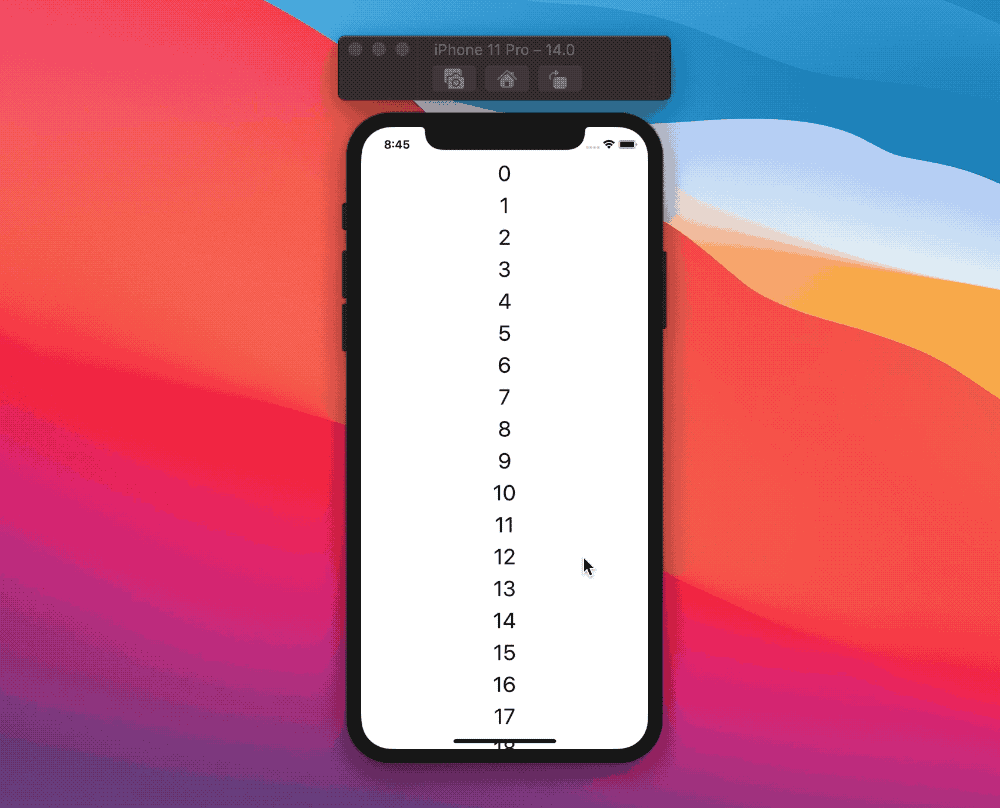
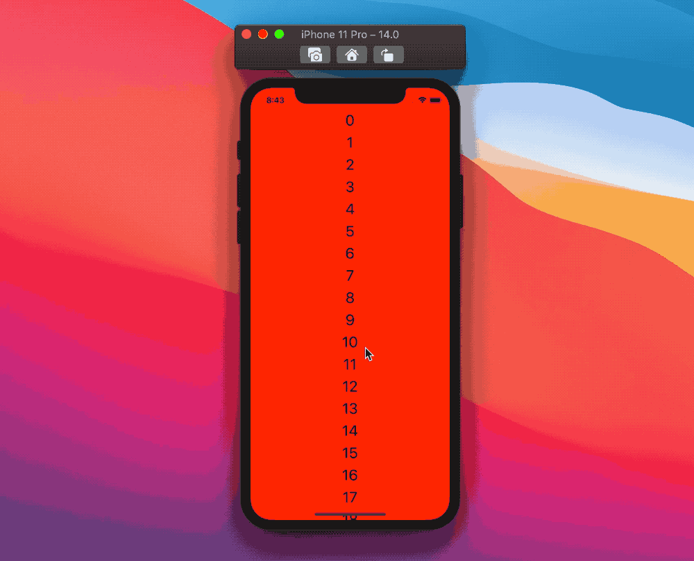

# SwiftUI: ScrollView offset

在线搜索“SwiftUI ScrollView offset”会得到很多关于如何控制`ScrollView`滚动位置的讨论:随着iOS 14的发布，SwiftUI新增了`ScrollViewReader`.

这是否意味着我们不再需要`ScrollView`偏移量offset?
在本文中，我们将探讨如何获得`offset`偏移量以及它的一些用途.

## ScrollView offset
类似`UIScrollView`,`ScrollView`由两个`layer`组成:
* `frame layer`在视图结构中定位`ScrollView`
* `content layer`所有子组件存放的容器

如果我们查看一个垂直滚动视图(本文将使用这个视图)，则偏移量表示`frame layer`层的y坐标的最小值与`content layer`内容层的y坐标的最小值之间的差值。

## 获取 offset
SwiftUI的`ScrollView`初始化方法:
```
public struct ScrollView<Content: View>: View {
  ...
  public init(
    _ axes: Axis.Set = .vertical, 
    showsIndicators: Bool = true, 
    @ViewBuilder content: () -> Content
  )
}
```
除了`content`视图构建器之外，我们没有什么可以使用的.
让我们创建一个简单的`ScrollView`的例子，用一些`Text`文本填充：
```
ScrollView {
  Text("A")
  Text("B")
  Text("C")
}
```
偏移量将与内容中第一个元素`Text("A")`的偏移量相同,我们如何得到这个元素的偏移量?
再一次，我们需要用到SwiftUI的`GeometryReader`，以及一个新的`PreferenceKey`。

首先，让我们定义preference key:
```
private struct OffsetPreferenceKey: PreferenceKey {
  static var defaultValue: CGFloat = .zero
  static func reduce(value: inout CGFloat, nextValue: () -> CGFloat) {}
}
```
其次，我们为视图的`.background`修饰器添加`GeometryReader`:
```
ScrollView {
  Text("A")
    .background(
      GeometryReader { proxy in
        Color.clear
          .preference(
            key: OffsetPreferenceKey.self,
            value: proxy.frame(in: .local).minY
          )
      }
    )
  Text("B")
  Text("C")
}
```
geometry reader就像我们在[SwiftUI:GeometryReader](https://www.jianshu.com/p/bb7005502299)中看到的一样，是用来分享视图层次结构中元素的信息:我们使用它来提取视图的y坐标的最小值,计算出偏移量。

然而它并不能正常执行：
我们正在为局部坐标空间中的框架查询`GeometryProxy`，该空间是我们的`.background`背景视图中建议的空间。
简而言之，就是`Color.clear`的`minY`在`.local`局部坐标一直是0.
修改为`.global`全局坐标，从设备屏幕的坐标系来看是有问题的，`Scrollview`可以放在视图层次结构的任何地方,`.global`全局坐标系并没有什么帮助。

如果我们把`GeometryReader`放在`Text("A")`上面会发生什么?

```
ScrollView {
  GeometryReader { proxy in
    Color.clear
      .preference(
        key: OffsetPreferenceKey.self,
        value: proxy.frame(in: .local).minY
      )
  }
  Text("A")
  Text("B")
  Text("C")
}
```
这可能看起来更有希望，但它仍然不会工作:
在这种情况下,`.local`的坐标系是`ScrollView`的`content layer`,但是我们需要把它显示在`ScrollView`的`frame layer`。

根据我们的`ScrollView`的`frame layer`获得到`GeometryProxy`,我们需要在`ScrollView`上定义一个新的坐标空间,并在`GeometryReader`中引用它:
```
ScrollView {
  Text("A")
    .background(
      GeometryReader { proxy in
        Color.clear
          .preference(
            key: OffsetPreferenceKey.self,
            value: proxy.frame(in: .named("frameLayer")).minY
          )
      }
    )
  Text("B")
  Text("C")
}
.coordinateSpace(name: "frameLayer") // the new coordinate space!
```
这是可行的，因为`ScrollView`把`frame layer`暴露在的外层。现在正确的`ScrollView`的`offset`偏移量在视图层次结构中可用。
```
func offset(_ proxy:GeometryProxy) -> some View {
        let minY = proxy.frame(in: .named("frameLayer")).minY
        print("minY:\(minY)")
        return Color.clear
    }
    
    var body: some View {
        ScrollView {
          Text("A")
            .background(
                GeometryReader { proxy in
                    self.offset(proxy)
              }
            )
          Text("B")
          Text("C")
            Spacer().frame(maxWidth: .infinity)
        }
        .background(Color.orange)
        .coordinateSpace(name: "frameLayer")
    }
```
简单修改下，在控制台看下结果！！

## 创建ScrollViewOffset View

我们在开发中需要抽取封装，可以在需要时轻松地获得偏移量。
`ScrollView`接受`content`内容视图构建器，这使得我们无法获得该内容的第一个元素(如果你知道方法，请联系我).

我们可以申请`.background`修饰器作用于整个`content`上，但是这并没有考虑到`content`内容本身可能是一个`Group`组的可能性,在这种情况下，修饰符将应用于组的每个元素，这不是我们想要的。

一种解决方案是将`geometry reader`移动到`ScrollView`内容的上方,然后在实际内容上用负的`padding`来隐藏它：
```
struct ScrollViewOffset<Content: View>: View {
  let content: () -> Content

  init(@ViewBuilder content: @escaping () -> Content) {
    self.content = content
  }

  var body: some View {
    ScrollView {
      offsetReader
      content()
        .padding(.top, -8)
      // 👆🏻 this places the real content as if our `offsetReader` was 
      // not there.
    }
    .coordinateSpace(name: "frameLayer")
  }

  var offsetReader: some View {
    GeometryReader { proxy in
      Color.clear
        .preference(
          key: OffsetPreferenceKey.self,
          value: proxy.frame(in: .named("frameLayer")).minY
        )
    }
    .frame(height: 0) 
    // this makes sure that the reader doesn't affect the content height
  }
}
```
类似于[`readSize`](https://www.jianshu.com/p/bb7005502299)修饰器,我们也可以让`ScrollViewOffset`在每次偏移量改变时触发回调方法：
```
struct ScrollViewOffset<Content: View>: View {
  let onOffsetChange: (CGFloat) -> Void
  let content: () -> Content

  init(
    onOffsetChange: @escaping (CGFloat) -> Void,
    @ViewBuilder content: @escaping () -> Content
  ) {
    self.onOffsetChange = onOffsetChange
    self.content = content
  }

  var body: some View {
    ScrollView {
      offsetReader
      content()
        .padding(.top, -8)
    }
    .coordinateSpace(name: "frameLayer")
    .onPreferenceChange(OffsetPreferenceKey.self, perform: onOffsetChange)
  }

  var offsetReader: some View {
    GeometryReader { proxy in
      Color.clear
        .preference(
          key: OffsetPreferenceKey.self,
          value: proxy.frame(in: .named("frameLayer")).minY
        )
    }
    .frame(height: 0)
  }
}

```
然后我们就可以这样使用：
```
ScrollViewOffset { offset in
  print("New ScrollView offset: \(offset)") 
} content: {
  Text("A")
  Text("B")
  Text("C")
}
```

## 用法
现在我们有了这个强大的组件，就可以做我们要做的了。
最常见的用法可能是在滚动时改变顶部安全区域的颜色：


```
struct ContentView: View {
  @State private var scrollOffset: CGFloat = .zero

  var body: some View {
    ZStack {
      scrollView
      statusBarView
    }
  }

  var scrollView: some View {
    ScrollViewOffset {
      scrollOffset = $0
    } content: {
      LazyVStack {
        ForEach(0..<100) { index in
          Text("\(index)")
        }
      }
    }
  }

  var statusBarView: some View {
    GeometryReader { geometry in
      Color.red
        .opacity(opacity)
        .frame(height: geometry.safeAreaInsets.top, alignment: .top)
        .edgesIgnoringSafeArea(.top)
    }
  }

  var opacity: Double {
    switch scrollOffset {
    case -100...0:
      return Double(-scrollOffset) / 100.0
    case ...(-100):
      return 1
    default:
      return 0
    }
  }
}
```

这是一个基于滚动位置改变背景颜色的视图:



```
struct ContentView: View {
  @State var scrollOffset: CGFloat = .zero

  var body: some View {
    ZStack {
      backgroundColor
      scrollView
    }
  }

  var backgroundColor: some View {
    Color(
      //         This number determines how fast the color changes 👇🏻
      hue: Double(abs(scrollOffset.truncatingRemainder(dividingBy: 3500))) / 3500,
      saturation: 1,
      brightness: 1
    )
    .ignoresSafeArea()
  }

  var scrollView: some View {
    ScrollViewOffset {
      scrollOffset = $0
    } content: {
      LazyVStack(spacing: 8) {
        ForEach(0..<100) { index in
          Text("\(index)")
            .font(.title)
        }
      }
    }
  }
}
```
### truncatingRemainder(dividingBy:)
浮点数取余：商取整数，余数还是浮点数
类似整型的`%`,
```
let value1 = 5.5
let value2 = 2.2
let div = value1.truncatingRemainder(dividingBy: value2)
//div=1.1
//即商是2，余数为1.1。
```

## iOS13 vs iOS14
我们在ios14上看到的一切都很好，但是在ios13上，最初的偏移量是不同的。

在iOS13中，偏移量考虑了顶部安全区域:例如，嵌入大标题的`NavigationView`中的`ScrollViewOffset`的初始偏移量为`140`，iOS14中的相同视图的初始(正确)偏移量值为`0`。
这点是需要特别注意的！！！

## 结论
有了`ScrollViewReader`，在大多数用例中，我们不再需要访问`ScrollView`偏移量:对于其余的用例，`GeometryReader`都是可以做到的.


