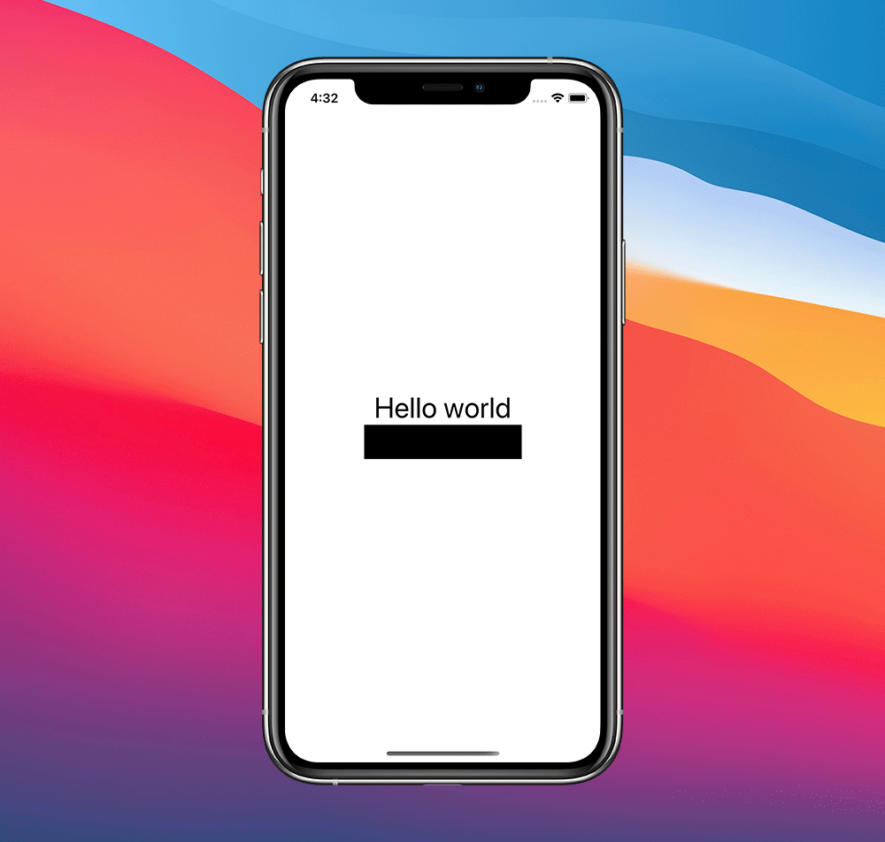

# SwiftUI: 创建自定义的.redacted效果

在Xcode12中，SwiftUI新增了`.redacted(reason:)`修饰符。
这个新的修饰符接受一个`RedactionReasons`实例，在beta 3中，它有一个可用的选项:`.placeholder`。

虽然这很棒，而且我相信在未来会有更多的选择，但是效果并不是非常可定制的,在本文中，让我们看看如何扩展SwiftUI提供的功能满足我们自己的`effect`效果。


## 扩展RedactionReasons
如果我们的目标是iOS14及以后的版本，一种方法是利用当前的api并定义我们自己的`RedactionReasons`实例，因为这种类型符合`OptionSet`:
```
extension RedactionReasons {
  public static let confidential = RedactionReasons(rawValue: 1 << 10)
}
```
> 选择这个高数字是为了避免与未来SwiftUI团队的新成员产生冲突。

我们可以创建一个新的视图修饰符来检查`redactionReasons`的`environment`,如果找到了`reason`就修改视图。
```
struct Redactable: ViewModifier {
  @Environment(\.redactionReasons) private var reasons

  @ViewBuilder
  func body(content: Content) -> some View {
    if reasons.contains(.confidential) {
      content
        .accessibility(label: Text("Confidential"))
        .overlay(Color.black)
    } else {
      content
    }
  }
}
```
在调用站点上，我们可以创建一个视图扩展，而不是在任何需要的地方调用`.modifier(Redactable())`:
```
extension View {
  func redactable() -> some View {
    self
      .modifier(Redactable())
  }
}
```
我们是这样使用它的:
```
struct ContentView: View {
  var body: some View {
    VStack {
      Text("Hello world")

      Text("Hello world")
        .redactable()
        .redacted(reason: .confidential)
    }
    .font(.title)
  }
}
```



虽然这是可行的，但我们使用的api不是我们自己的，也没有任何内在的见解:这使得我们的解决方案很脆弱。在未来的任何版本中，SwiftUI团队都可能会无意中破坏我们的代码。

为了避免这种情况，我们可以创建自己的API。

## 构建自己的Redacted API
开始我们的定义：
```
public enum RedactionReason {
  case placeholder
  case confidential
  case blurred
}
```
> 此enum定义不会与SwiftUI的`RedactionReasons`冲突，因为我们省略了类型末尾的`s` (SwiftUI `RedactionReasons`是一个`OptionSet`选项集，因此类型名中使用了复数)。

然后定义每一个修饰符：
```
struct Placeholder: ViewModifier {
  func body(content: Content) -> some View {
    content
      .accessibility(label: Text("Placeholder"))
      .opacity(0)
      .overlay(
        RoundedRectangle(cornerRadius: 2)
          .fill(Color.black.opacity(0.1))
          .padding(.vertical, 4.5)
    )
  }
}

struct Confidential: ViewModifier {
  func body(content: Content) -> some View {
    content
      .accessibility(label: Text("Confidential"))
      .overlay(Color.black)
    )
  }
}

struct Blurred: ViewModifier {
  func body(content: Content) -> some View {
    content
      .accessibility(label: Text("Blurred"))
      .blur(radius: 4)
  }
}
```
像之前一样，我们定义了一个`Redactable`可编辑的视图修饰符:
```
struct Redactable: ViewModifier {
  let reason: RedactionReason?

  @ViewBuilder
  func body(content: Content) -> some View {
    switch reason {
    case .placeholder:
      content
        .modifier(Placeholder())
    case .confidential:
      content
        .modifier(Confidential())
    case .blurred:
      content
        .modifier(Blurred())
    case nil:
      content
    }
  }
}
```
正如结论中所描述的，让我们的`RedactionReason`在环境`environment`中可用，而不是直接将它传递给视图修饰符，这样并不优雅。因此，我选择了更简单的API:
```
extension View {
  func redacted(reason: RedactionReason?) -> some View {
    self
      .modifier(Redactable(reason: reason))
  }
}
```
使用如下：
```
struct ContentView: View {
  var body: some View {
    VStack {
      Text("Hello World")
        .redacted(reason: nil)
      Text("Hello World")
        .redacted(reason: .placeholder)
      Text("Hello World")
        .redacted(reason: .confidential)
      Text("Hello World")
        .redacted(reason: .blurred)
    }
  }
}
```
就像这样，我们有自己的编辑API，也能兼容iOS13。


## 总结
SwiftUI的新修饰器很棒，我相信我们会发现它有很多很棒的用途，尤其是当更多的效果被添加进来的时候。目前，如果SwiftUI提供的还不足以满足我们的需求，我们可以不用太麻烦地创造自己的效果。
公平地说，由于我们并不拥有每个视图的实际渲染，我们的自定义效果比SwiftUI的`.redacted`效果更有限:
例如，我们没有简单的方法来获得`environment`环境的`.foregroundcolor()`，即使嵌套视图已经用`.unredacted()`标记，我们的效果也会发生。


