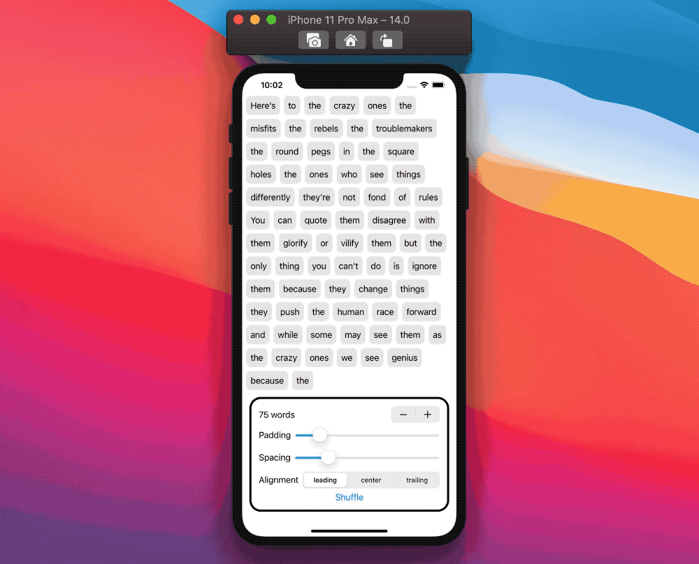

# SwiftUI：灵活的布局

WWDC20 swiftUI新增`LazyVGrid`和`LazyHGrid`两种布局方式，我们可以使用它们做网格布局。

虽然这些新组件解锁了非常强大的布局，但SwiftUI还没有提供`UICollectionView`那样的灵活性。
我指的是在同一个容器中有不同大小的多个视图的可能性，并在没有更多可用空间时使容器自动换行到下一行。

在本文中，让我们探索如何构建我们自己的`FlexibleView`，这里是最终结果的预览:



## 介绍
从上面的预览应该很清楚我们的目标是什么，让我们看看我们的视图要怎么实现它：
1. 获得水平方向的可用空间
2. 获取每个元素的size
3. 一种将每个元素分配到正确位置的方法

## 获取Size of View

这个文章将使用[SwiftUI:GeometryReader](https://www.jianshu.com/p/bb7005502299)一文中的扩展方法：
```
extension View {
  func readSize(onChange: @escaping (CGSize) -> Void) -> some View {
    background(
      GeometryReader { geometryProxy in
        Color.clear
          .preference(key: SizePreferenceKey.self, value: geometryProxy.size)
      }
    )
    .onPreferenceChange(SizePreferenceKey.self, perform: onChange)
  }
}

private struct SizePreferenceKey: PreferenceKey {
  static var defaultValue: CGSize = .zero
  static func reduce(value: inout CGSize, nextValue: () -> CGSize) {}
}
```

### 1.获得水平方向的可用空间
`FlexibleView`需要的第一个信息是总水平可用空间:
用`Color`做个例子
```
var body: some View {
  Color.clear
    .frame(height: 1)
    .readSize { size in
      // the horizontal available space is size.width
    }
}
```
因为第一个组件仅用于获取布局信息，所以我们使用`Color.clear`。清晰有效地，它是一个不可见的层，不会阻挡视图的其余部分。

我们也可以设置一个`.frame`修饰符限制`Color`的高为1，确保视图组件有足够的高度。

`Color`不是视图层次结构的一部分，我们可以用`ZStack`隐藏它:
```
var body: some View {
  ZStack {
    Color.clear
      .frame(height: 1)
      .readSize { size in
        // the horizontal available space is size.width
      }

    // Rest of our implementation
  }
}
```
最后，让我们利用回调从`readSize`存储我们的可用水平空间在`FlexibleView`中:
```
struct FlexibleView: View {
  @State private var availableWidth: CGFloat = 0

  var body: some View {
    ZStack {
      Color.clear
        .frame(height: 1)
        .readSize { size in
          availableWidth = size.width
        }

      // Rest of our implementation
    }
  }
}
```
在这一点上，我们有一个视图，它填满了所有可用的水平空间，并且只在高度上取一点。我们可以进入第二步。

### 2.获取每个元素的size

在讨论如何获取每个元素大小之前，让我们先设置视图来接受元素。
为了简单起见，也为了后面更清楚，我们将要求:
1. `Collection`集合中的元素实现`Hashable`协议
2. 一个方法，给定该集合的一个元素，该方法返回一个视图View

```
struct FlexibleView<Data: Collection, Content: View>: View 
  where Data.Element: Hashable {
  let data: Data
  let content: (Data.Element) -> Content

  // ...

  var body: some View {
    // ...
  }
}
```
让我们忘记最终的布局，只关注每个元素的大小:
```
struct FlexibleView<...>: View where ... {
  let data: Data
  let content: (Data.Element) -> Content
  @State private var elementsSize: [Data.Element: CGSize] = [:]

  // ...

  var body: some View {
    ZStack {
      // ...

      ForEach(data, id: \.self) { element in
        content(element)
          .fixedSize()
          .readSize { size in
            elementsSize[element] = size
          }
      }
    }
  }
}
```
注意我们是如何在元素视图上使用`.fixedsize`修饰符的，让它根据需要占用尽可能多的空间，而不管实际有多少空间可用。

这样，我们就有了每个元素的大小!是时候面对最后一步了。

### 3.一种将每个元素分配到正确位置的方法

这就是所有`FlexibleView`需要将元素视图分布到多行中:
```
struct FlexibleView<...>: View where ... {
  // ...

  func computeRows() -> [[Data.Element]] {
    var rows: [[Data.Element]] = [[]]
    var currentRow = 0
    var remainingWidth = availableWidth

    for element in data {
      let elementSize = elementSizes[element, default: CGSize(width: availableWidth, height: 1)]

      if remainingWidth - elementSize.width >= 0 {
        rows[currentRow].append(element)
      } else {
        // start a new row
        currentRow = currentRow + 1
        rows.append([element])
        remainingWidth = availableWidth
      }

      remainingWidth = remainingWidth - elementSize.width
    }

    return rows
  }
}
```
`computeRows`将所有元素分布在多行中，同时保持元素的顺序，并确保每一行的宽度不超过之前获得的可用宽度。

换句话说，该函数返回一个行数组，其中每行包含该行的元素数组。

然后，我们可以将这个新函数与`HStacks`和`Vstack`结合起来，得到最终的布局:
```
struct FlexibleView<...>: View where ... {
  // ...

  var body: some View {
    ZStack {
      // ...

      VStack {
        ForEach(computeRows(), id: \.self) { rowElements in
          HStack {
            ForEach(rowElements, id: \.self) { element in
              content(element)
                .fixedSize()
                .readSize { size in
                  elementsSize[element] = size
                }
            }
          }
        }
      }
    }
  }

  // ...
}
```
> 在这一点上，`FlexibleView`将只采取这个`VStack`的高度

有了这个，我们就结束了!最终的项目还处理了元素之间的间距和不同的排列:一旦理解了上面的基本原理，添加这些特性就变得很简单了。

完整代码：
```
//ContentView.swift
import SwiftUI

class ContentViewModel: ObservableObject {

  @Published var originalItems = [
    "Here’s", "to", "the", "crazy", "ones", "the", "misfits", "the", "rebels", "the", "troublemakers", "the", "round", "pegs", "in", "the", "square", "holes", "the", "ones", "who", "see", "things", "differently", "they’re", "not", "fond", "of", "rules", "You", "can", "quote", "them", "disagree", "with", "them", "glorify", "or", "vilify", "them", "but", "the", "only", "thing", "you", "can’t", "do", "is", "ignore", "them", "because", "they", "change", "things", "they", "push", "the", "human", "race", "forward", "and", "while", "some", "may", "see", "them", "as", "the", "crazy", "ones", "we", "see", "genius", "because", "the", "ones", "who", "are", "crazy", "enough", "to", "think", "that", "they", "can", "change", "the", "world", "are", "the", "ones", "who", "do"
  ]

  @Published var spacing: CGFloat = 8
  @Published var padding: CGFloat = 8
  @Published var wordCount: Int = 75
  @Published var alignmentIndex = 0

  var words: [String] {
    Array(originalItems.prefix(wordCount))
  }

  let alignments: [HorizontalAlignment] = [.leading, .center, .trailing]

  var alignment: HorizontalAlignment {
    alignments[alignmentIndex]
  }
}

struct ContentView: View {
  @StateObject var model = ContentViewModel()

  var body: some View {
    ScrollView {
      FlexibleView(
        data: model.words,
        spacing: model.spacing,
        alignment: model.alignment
      ) { item in
        Text(verbatim: item)
          .padding(8)
          .background(
            RoundedRectangle(cornerRadius: 8)
              .fill(Color.gray.opacity(0.2))
           )
      }
      .padding(.horizontal, model.padding)
    }
    .overlay(Settings(model: model), alignment: .bottom)
  }
}

struct Settings: View {
  @ObservedObject var model: ContentViewModel
  let alignmentName: [String] = ["leading", "center", "trailing"]

  var body: some View {
    VStack {
      Stepper(value: $model.wordCount, in: 0...model.originalItems.count) {
        Text("\(model.wordCount) words")
      }

      HStack {
        Text("Padding")
        Slider(value: $model.padding, in: 0...60) { Text("") }
      }

      HStack {
        Text("Spacing")
        Slider(value: $model.spacing, in: 0...40) { Text("") }
      }

      HStack {
        Text("Alignment")
        Picker("Choose alignment", selection: $model.alignmentIndex) {
          ForEach(0..<model.alignments.count) {
            Text(alignmentName[$0])
          }
        }
        .pickerStyle(SegmentedPickerStyle())
      }

      Button {
        model.originalItems.shuffle()
      } label: {
        Text("Shuffle")
      }
    }
    .padding()
    .background(Color(UIColor.systemBackground))
    .clipShape(RoundedRectangle(cornerRadius: 20))
    .overlay(
         RoundedRectangle(cornerRadius: 20)
             .stroke(Color.primary, lineWidth: 4)
     )
    .padding()
  }
}

struct ContentView_Previews: PreviewProvider {
  static var previews: some View {
    ContentView()
  }
}

```

```
//FlexibleView.swift
struct FlexibleView<Data: Collection, Content: View>: View where Data.Element: Hashable {
  let data: Data
  let spacing: CGFloat
  let alignment: HorizontalAlignment
  let content: (Data.Element) -> Content
  @State private var availableWidth: CGFloat = 0

  var body: some View {
    ZStack(alignment: Alignment(horizontal: alignment, vertical: .center)) {
      Color.clear
        .frame(height: 1)
        .readSize { size in
          availableWidth = size.width
        }

      _FlexibleView(
        availableWidth: availableWidth,
        data: data,
        spacing: spacing,
        alignment: alignment,
        content: content
      )
    }
  }
}

```

```
//_FlexibleView.swift
struct _FlexibleView<Data: Collection, Content: View>: View where Data.Element: Hashable {
  let availableWidth: CGFloat
  let data: Data
  let spacing: CGFloat
  let alignment: HorizontalAlignment
  let content: (Data.Element) -> Content
  @State var elementsSize: [Data.Element: CGSize] = [:]

  var body : some View {
    VStack(alignment: alignment, spacing: spacing) {
      ForEach(computeRows(), id: \.self) { rowElements in
        HStack(spacing: spacing) {
          ForEach(rowElements, id: \.self) { element in
            content(element)
              .fixedSize()
              .readSize { size in
                elementsSize[element] = size
              }
          }
        }
      }
    }
  }

  func computeRows() -> [[Data.Element]] {
    var rows: [[Data.Element]] = [[]]
    var currentRow = 0
    var remainingWidth = availableWidth

    for element in data {
      let elementSize = elementsSize[element, default: CGSize(width: availableWidth, height: 1)]

      if remainingWidth - (elementSize.width + spacing) >= 0 {
        rows[currentRow].append(element)
      } else {
        currentRow = currentRow + 1
        rows.append([element])
        remainingWidth = availableWidth
      }

      remainingWidth = remainingWidth - (elementSize.width + spacing)
    }

    return rows
  }
}

```

```
//SizeReader.swift
extension View {
  func readSize(onChange: @escaping (CGSize) -> Void) -> some View {
    background(
      GeometryReader { geometryProxy in
        Color.clear
          .preference(key: SizePreferenceKey.self, value: geometryProxy.size)
      }
    )
    .onPreferenceChange(SizePreferenceKey.self, perform: onChange)
  }
}

private struct SizePreferenceKey: PreferenceKey {
  static var defaultValue: CGSize = .zero
  static func reduce(value: inout CGSize, nextValue: () -> CGSize) {}
}

```


