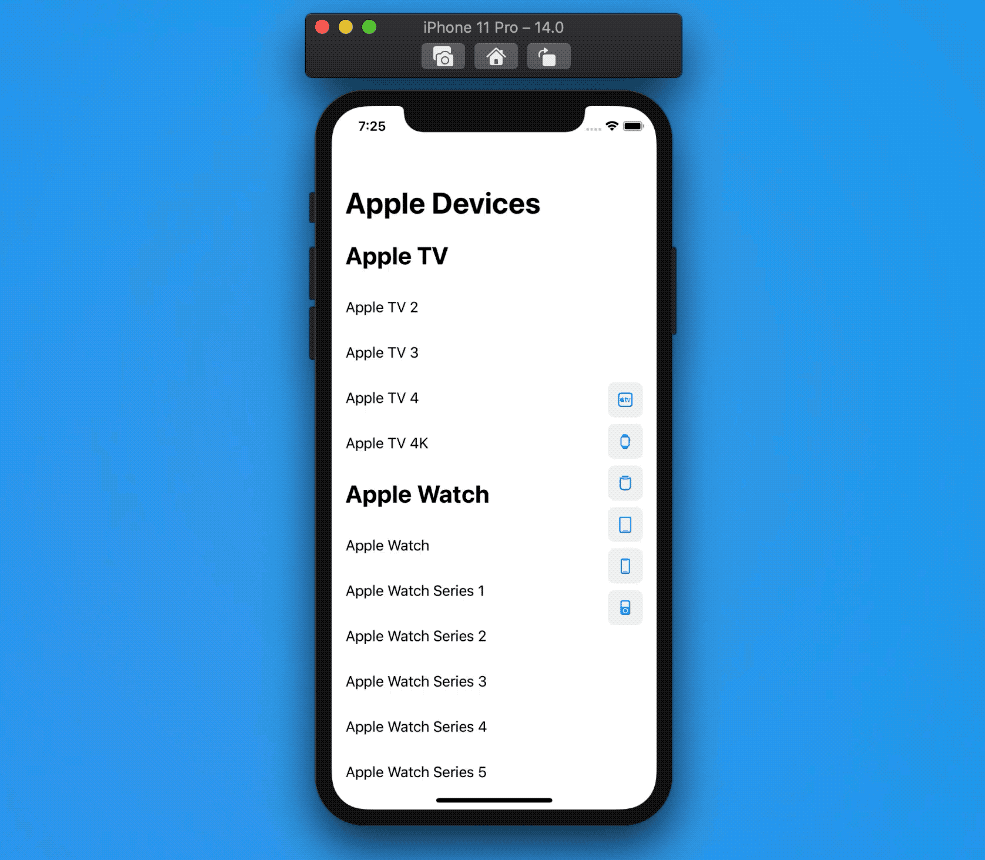
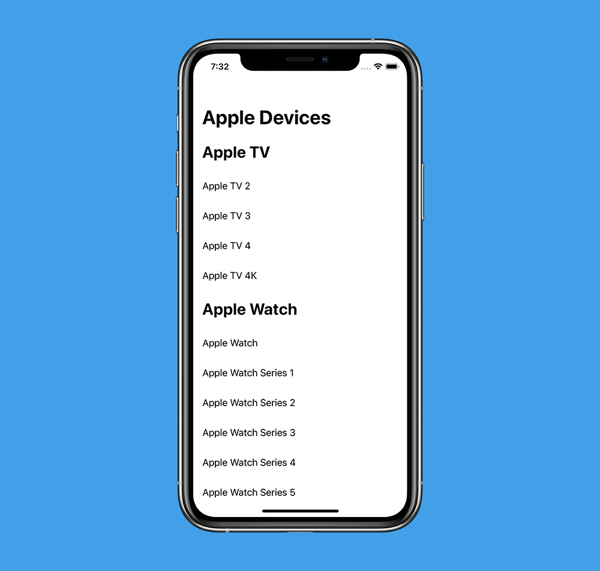
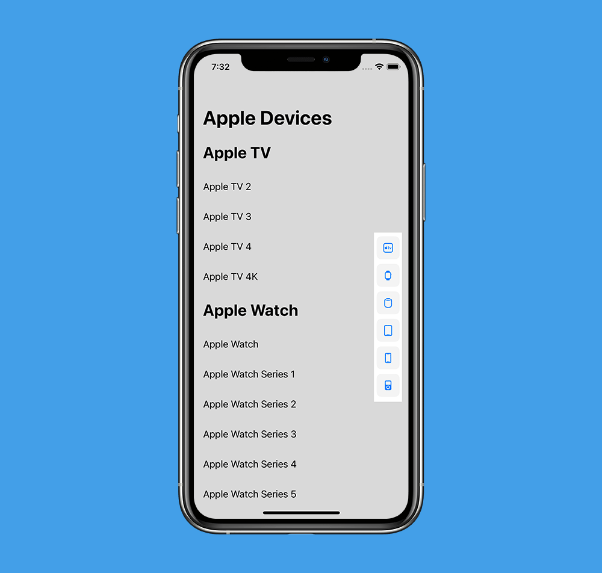
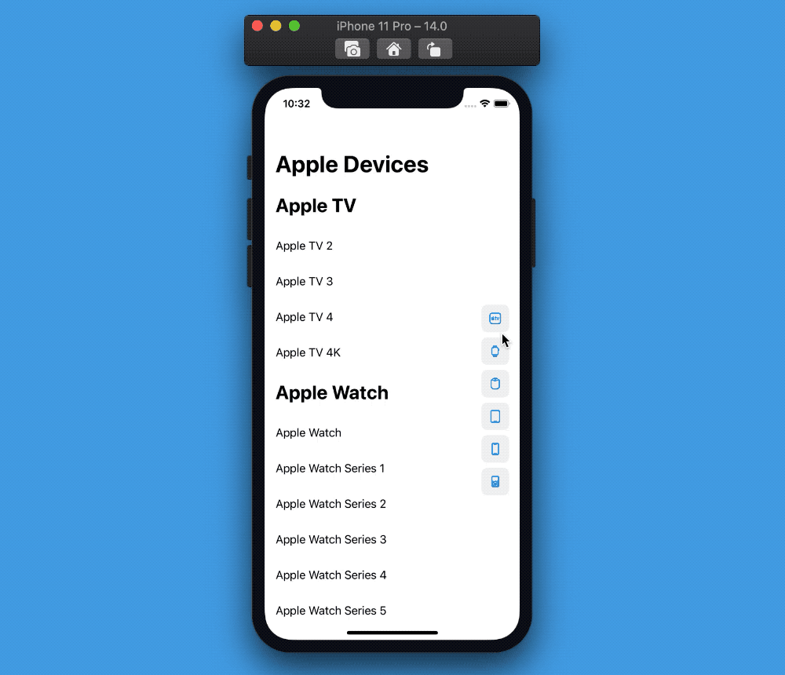

# SwiftUI:用ScrollViewReader和DragGesture桥接UIKit


在推出SwiftUI时，我们是不能控制`ScrollView`的偏移量offset的：在Xcode12和iOS14中，我们可以使用`ScrollViewReader`来解决这个问题。
另一个特性是将`sectionIndexTitles`添加到了`List`，这是放置在List侧边的索引列表(例如`A`到`Z`)，用于快速跳转到特定部分。
在这篇文章中，我们使用`ScrollViewReader`和`DragGesture`来实现我们自定义的`SectionIndexTitles`。



这个屏幕中进行了很多操作:让我们逐个构建每个组件。

## List



* 我们将使用一个`ScrollView`和`ScrollViewReader`()
* 虽然我们使用了一个`ScrollView`，但我们仍然想要我们的UI元素使用懒加载，这个时候我们可以使用`LazyVstack`
* 最后，设备数据是字典类型，其中keys是section headers,vaules是section content.

```
let database: [String: [String]] = [

"iPhone": [

"iPhone", "iPhone 3G", "iPhone 3GS", "iPhone 4", "iPhone 4S", "iPhone 5", "iPhone 5C", "iPhone 5S", "iPhone 6", "iPhone 6 Plus", "iPhone 6S", "iPhone 6S Plus", "iPhone SE", "iPhone 7", "iPhone 7 Plus", "iPhone 8", "iPhone 8 Plus", "iPhone X", "iPhone Xs", "iPhone Xs Max", "iPhone Xʀ", "iPhone 11", "iPhone 11 Pro", "iPhone 11 Pro Max", "iPhone SE 2"

],

"iPad": [

"iPad", "iPad 2", "iPad 3", "iPad 4", "iPad 5", "iPad 6", "iPad 7", "iPad Air", "iPad Air 2", "iPad Air 3", "iPad Mini", "iPad Mini 2", "iPad Mini 3", "iPad Mini 4", "iPad Mini 5", "iPad Pro 9.7-inch", "iPad Pro 10.5-inch", "iPad Pro 11-inch", "iPad Pro 11-inch 2", "iPad Pro 12.9-inch", "iPad Pro 12.9-inch 2", "iPad Pro 12.9-inch 3", "iPad Pro 12.9-inch 4"

],

"iPod": [

"iPod Touch", "iPod Touch 2", "iPod Touch 3", "iPod Touch 4", "iPod Touch 5", "iPod Touch 6"

],

"Apple TV": [

"Apple TV 2", "Apple TV 3", "Apple TV 4", "Apple TV 4K"

],

"Apple Watch": [

"Apple Watch", "Apple Watch Series 1", "Apple Watch Series 2", "Apple Watch Series 3", "Apple Watch Series 4", "Apple Watch Series 5"

],

"HomePod": [

"HomePod"

]

]
struct ContentView: View {
  let devices: [String: [String]] = database

  var body: some View {
    ScrollView {
      LazyVStack {
        devicesList
      }
    }
    .navigationBarTitle("Apple Devices")
  }

  var devicesList: some View {
    ForEach(devices.sorted(by: { (lhs, rhs) -> Bool in
      lhs.key < rhs.key
    }), id: \.key) { categoryName, devicesArray in
      Section(
        header: HeaderView(title: categoryName)
      ) {
        ForEach(devicesArray, id: \.self) { deviceName in
          RowView(text: deviceName)
        }
      }
    }
  }
}

```
在这里还有几个辅助视图`RowView`和`HeaderView`,具体代码如下：
```
struct HeaderView: View {
  let title: String

  var body: some View {
    Text(title)
      .font(.title)
      .fontWeight(.bold)
      .padding()
      .frame(maxWidth: .infinity, alignment: .leading)
  }
}

struct RowView: View {
  let text: String

  var body: some View {
    Text(text)
      .padding()
      .frame(maxWidth: .infinity, alignment: .leading)
  }
}

```

## Section Index Titles



这是另一个完全独立的视图。为了让它更有趣，我用`SF Symbols`代替text文本：
```
struct SectionIndexTitles: View {
  let titles: [String]

  var body: some View {
    VStack {
      ForEach(titles, id: \.self) { title in
        SectionIndexTitle(image: sfSymbol(for: title))
      }
    }
  }

  func sfSymbol(for deviceCategory: String) -> Image {
    let systemName: String
    switch deviceCategory {
    case "iPhone": systemName = "iphone"
    case "iPad": systemName = "ipad"
    case "iPod": systemName = "ipod"
    case "Apple TV": systemName = "appletv"
    case "Apple Watch": systemName = "applewatch"
    case "HomePod": systemName = "homepod"
    default: systemName = "xmark"
    }
    return Image(systemName: systemName)
  }
}

```

和前面一样，我引入了一个新的视图`SectionIndexTitle`来提高可读性.
```
struct SectionIndexTitle: View {
  let image: Image

  var body: some View {
    RoundedRectangle(cornerRadius: 8, style: .continuous)
      .foregroundColor(Color.gray.opacity(0.1))
      .frame(width: 40, height: 40)
      .overlay(
        image
          .foregroundColor(.blue)
      )
  }
}

```

## 视图混合
现在我们有了`devices list`和`SectionIndexTitles`,我们可以把它们叠加放在一起:
```
struct ContentView: View {
  ...

  var body: some View {
    ScrollView {
      LazyVStack {
        devicesList
      }
    }
    .overlay(sectionIndexTitles)
    .navigationBarTitle("Apple Devices")
  }

  ...

  var sectionIndexTitles: some View {
    SectionIndexTitles(titles: devices.keys.sorted())
      .frame(maxWidth: .infinity, alignment: .trailing)
      .padding()
  }
}

```
> 我们也可以使用`ZStack`,但是我们希望我们的`SectionIndexTitles`在`ScrollView`的顶部，并避免标题扩展到`ScrollView`本身之外。

## ScrollViewReader

使用`ScrollViewReader`组件.
把`ScrollView`包装到`ScrollViewReader`中,我们得到了一个`ScrollViewProxy`实例，用于以编程方式触发滚动:
这是通过调用实例上的`scrollTo(_:)`方法，并传递我们希望滚动到的视图的`id`来实现的。
> 注意，我们想要滚动到的元素可能还没有加载:`ScrollViewProxy`仍然会按预期执行。

```
struct ContentView: View {
  ...

  var body: some View {
    ScrollViewReader { proxy in
      ScrollView {
        LazyVStack {
          devicesList
        }
      }
      .overlay(sectionIndexTitles)
    }
    .navigationBarTitle("Apple Devices")
  }

  ...
}
```

## ScrollViewProxy
在我们的尝试中，我们把每个`section title`作为一个button跳转到对应的`section`，为此我们需要这样做：
* 把proxy传到`SectionIndexTitles`
* 把`SectionIndexTitle`包装到button中，以便出发事件后滚动到对应的`section`

```
struct SectionIndexTitles: View {
  let proxy: ScrollViewProxy
  let titles: [String]

  var body: some View {
    VStack {
      ForEach(titles, id: \.self) { title in
        Button {
          proxy.scrollTo(title)
        } label: {
          SectionIndexTitle(image: sfSymbol(for: title))
        }
      }
    }
  }

  ...
}
```
这两个步骤将使我们的`SectionIndexTitles`工作:
我们不需要在`ScrollView`的sections中添加显式的`.id`修饰符，因为我们的`devicesList`是通过`ForEach`定义的,其中每个视图都有一个隐式标识符`id: \.key`(在ForEach中设置),它等于我们的设备类别(device categorie)。



## DragGesture
虽然上面的可以运行了，但是它并没有完全模仿`UITableView`的`sectionIndexTitles`:
`sectionIndexTitles`的工作方式是用手指在标题上拖动，也会让`tableView`滚动到右边对应`section`。

第二步我们将在整个`SectionIndexTitles`添加拖拽手势，然后当手指在其中一个索引标题上时将出发右边的`scrollTo`动作.

方法步骤：
* 存储全局的`dragLocation`在一个`@GestureState`变量中
* 给每个`SectionIndexTitle`中添加一个拖动位置变化的监听，当手势发生变化时，触发`scrollTo`动作

```
struct SectionIndexTitles: View {
  let proxy: ScrollViewProxy
  let titles: [String]
  @GestureState private var dragLocation: CGPoint = .zero

  var body: some View {
    VStack {
      ForEach(titles, id: \.self) { title in
        SectionIndexTitle(image: sfSymbol(for: title))
          .background(dragObserver(title: title))
      }
    }
    .gesture(
      DragGesture(minimumDistance: 0, coordinateSpace: .global)
        .updating($dragLocation) { value, state, _ in
          state = value.location
        }
    )
  }

  func dragObserver(title: String) -> some View {
    GeometryReader { geometry in
      dragObserver(geometry: geometry, title: title)
    }
  }

  // This function is needed as view builders don't allow to have 
  // pure logic in their body.
  private func dragObserver(geometry: GeometryProxy, title: String) -> some View {
    if geometry.frame(in: .global).contains(dragLocation) {
      // we need to dispatch to the main queue because we cannot access to the
      // `ScrollViewProxy` instance while the body is rendering
      DispatchQueue.main.async {
        proxy.scrollTo(title, anchor: .center)
      }
    }
    return Rectangle().fill(Color.clear)
  }

  ...
}
```
有了这些，我们就实现了我们要的!🎉


## 结论
SwiftUI并没有提供UIKit所拥有的一切，可能永远也不会，但这不应该阻止我们尝试并提出我们自己的SwiftUI解决方案，让我们更容易迁移到SwiftUI。

我个人真的很喜欢上面的例子，因为现在我们的`SectionIndexTitles`只是另一个SwiftUI视图，这使得进一步定制它变得非常容易(如果SF Symbols对你来说还不够好)，而这在UIKit中是不可能的。

