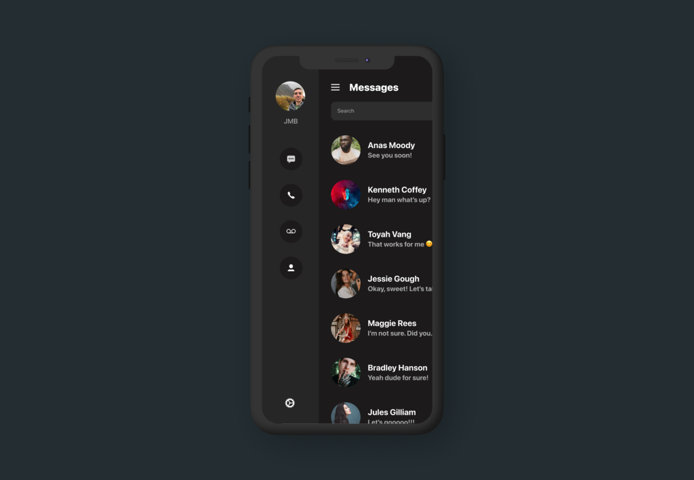

# SwiftUI:设计一个Sidebar


<!----- https://trailingclosure.com/create-a-sidebar-menu/ ---->
<!--- 
import SwiftUI

private struct OffsetPreferenceKey: PreferenceKey {
  static var defaultValue: CGFloat = .zero
  static func reduce(value: inout CGFloat, nextValue: () -> CGFloat) {}
}
struct PullScrollView<Content: View>: View {
    @State private var preOffset: CGFloat = 0
    @State private var offset: CGFloat = 0
    @State private var frozen = false
    @State private var rotation: Angle = .degrees(0)
    @State private var updateTime: Date = Date()
    
    var threshold: CGFloat = 80
    @Binding var refreshing: Bool
    
    let onOffsetChange: ((CGFloat) -> Void)?
    let content: () -> Content

    init(_ refreshing: Binding<Bool> = .constant(false),threshold: CGFloat = 80,onOffsetChange: ((CGFloat) -> Void)? = nil,@ViewBuilder content: @escaping () -> Content) {
        self.threshold = threshold
        self._refreshing = refreshing
        self.onOffsetChange = onOffsetChange
        self.content = content
  }

  var body: some View {
    ScrollView {
        ZStack(alignment: .top) {
            offsetReader
            RefreshHeader(height: self.threshold,
                  loading: self.refreshing,
                  frozen: self.frozen,
                  rotation: self.rotation,
                  updateTime: self.updateTime)
            VStack{
                content()
            }
            .alignmentGuide(.top, computeValue: { _ in
                  (self.refreshing && self.frozen) ? -self.threshold : 0
              })
        }
      
        
    }
    .coordinateSpace(name: "frameLayer")
    .onPreferenceChange(OffsetPreferenceKey.self, perform: { (ff) in
        print("\(ff)")
        self.handleOffset(ff - 88)
        if self.onOffsetChange != nil {
            self.onOffsetChange!(ff)
        }
        
    })
    
  }

   var offsetReader: some View {
      GeometryReader { proxy in
        Color.clear
          .preference(
            key: OffsetPreferenceKey.self,
            value: proxy.frame(in: .named("frameLayer")).minY
          )
      }
      .frame(height: 0)
    }
    
    func handleOffset(_ ofset:CGFloat) {
        self.offset = ofset
        self.rotation = self.headerRotation(self.offset)
        /// 触发刷新
        if !self.refreshing, self.offset > self.threshold, self.preOffset <= self.threshold {
            self.refreshing = true
        }
        
        if self.refreshing {
            if self.preOffset > self.threshold, self.offset <= self.threshold {
                self.frozen = true
            }
        } else {
            self.frozen = false
        }
        
        self.preOffset = self.offset
        
    }
    func headerRotation(_ scrollOffset: CGFloat) -> Angle {
        if scrollOffset < self.threshold * 0.60 {
            return .degrees(0)
        } else {
            let h = Double(self.threshold)
            let d = Double(scrollOffset)
            let v = max(min(d - (h * 0.6), h * 0.4), 0)
            return .degrees(180 * v / (h * 0.4))
        }
    }
    
    struct RefreshHeader: View {
        var height: CGFloat
        var loading: Bool
        var frozen: Bool
        var rotation: Angle
        var updateTime: Date
        
        let dateFormatter: DateFormatter = {
            let df = DateFormatter()
            df.dateFormat = "MM月dd日 HH时mm分ss秒"
            return df
        }()
        
        var body: some View {
            HStack(spacing: 20) {
                Spacer()
                
                Group {
                    if self.loading {
                        VStack {
                            Spacer()
                            ActivityView()
                            Spacer()
                        }
                    } else {
                        Image(systemName: "arrow.down")
                            .resizable()
                            .aspectRatio(contentMode: .fit)
                            .rotationEffect(rotation)
                    }
                }
                .frame(width: height * 0.25, height: height * 0.8)
                .fixedSize()
                .offset(y: (loading && frozen) ? 0 : -height)
                
                VStack(spacing: 5) {
                    Text("\(self.loading ? "正在刷新数据" : "下拉刷新数据")")
                        .foregroundColor(.secondary)
                        .font(.subheadline)
                    
                    Text("\(self.dateFormatter.string(from: updateTime))")
                        .foregroundColor(.secondary)
                        .font(.subheadline)
                }
                .offset(y: -height + (loading && frozen ? +height : 0.0))
                
                Spacer()
            }
            
        }
    }
    
}

private struct ActivityView: UIViewRepresentable {
    func makeUIView(context: UIViewRepresentableContext<ActivityView>) -> UIActivityIndicatorView {
        return UIActivityIndicatorView()
    }
    
    func updateUIView(_ uiView: UIActivityIndicatorView, context: UIViewRepresentableContext<ActivityView>) {
        uiView.startAnimating()
    }
}

--->
在SwiftUI中创建一个弹出式侧边栏菜单。这个自定义视图还允许在`NavigationView`中包装你的`content`view视图，维护与用户的导航交互。



我们定义一个侧边栏`SideBarStack`,如下所示：
```
struct SideBarStack<SidebarContent: View, Content: View>: View {
    
    let sidebarContent: SidebarContent
    let mainContent: Content
    let sidebarWidth: CGFloat
    @Binding var showSidebar: Bool
    
    init(sidebarWidth: CGFloat, showSidebar: Binding<Bool>, @ViewBuilder sidebar: ()->SidebarContent, @ViewBuilder content: ()->Content) {
        self.sidebarWidth = sidebarWidth
        self._showSidebar = showSidebar
        sidebarContent = sidebar()
        mainContent = content()
    }
    
    var body: some View {
        ZStack(alignment: .leading) {
            sidebarContent
                .frame(width: sidebarWidth, alignment: .center)
                .offset(x: showSidebar ? 0 : -1 * sidebarWidth, y: 0)
                .animation(Animation.easeInOut.speed(2))
            mainContent
                .overlay(
                    Group {
                        if showSidebar {
                            Color.white
                                .opacity(showSidebar ? 0.01 : 0)
                                .onTapGesture {
                                    self.showSidebar = false
                                }
                        } else {
                            Color.clear
                            .opacity(showSidebar ? 0 : 0)
                            .onTapGesture {
                                self.showSidebar = false
                            }
                        }
                    }
                )
                .offset(x: showSidebar ? sidebarWidth : 0, y: 0)
                .animation(Animation.easeInOut.speed(2))
                
        }
    }
}
```

我们使用@ViewBuilder属性包装器自定义视图View，允许您为侧边栏和实际视图内容`content`传递自定义内容。
自定义的`SideBarStack`需要传入两个参数：`sidebarWidth`和`showSidebar`.
第一个参数选项允许视图在侧边栏打开和关闭时正确地转换侧边栏和`content`内容，会根据设置的宽度设置两个视图的偏移量。
第二个参数`showSidebar`控制侧边栏是否显示，用`@Binding`传入用于将`TapGesture`放在`content`内容上.这允许用户点击`conent`内容和菜单按钮都可以关闭侧边栏。这样让代码看起来更清晰。SwiftUI不会触发`Color.clear`和`.opacity`为0的View视图的点击手势。

## 如何使用
使用方法如下：
```
struct ContentView: View {
    
    // Controls display of sidebar
    @State var showSidebar: Bool = false
    
    var body: some View {
        SideBarStack(sidebarWidth: 125, showSidebar: $showSidebar) {
           // Sidebar content here
        } content: {
           // Main content here
        }.edgesIgnoringSafeArea(.all)
    }
}
```
侧边栏内容和`content`视图可根据需要自定义View!!


