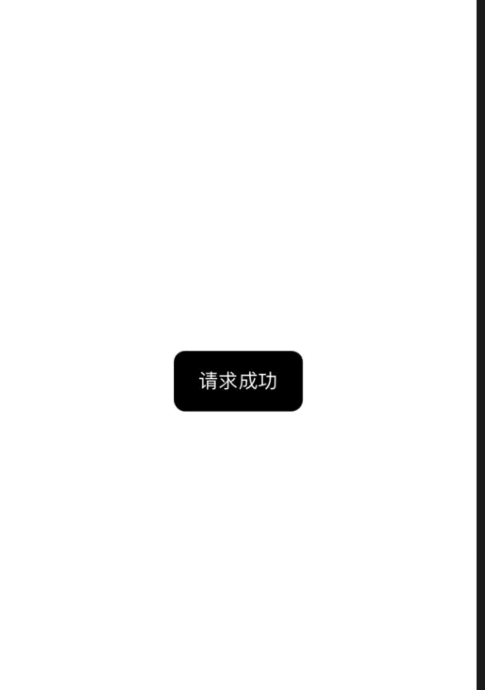

# SwiftUI:设计一个简单的ToastView

使用ZStack做一个简单的实现，效果如下：



## 使用如下
```
import SwiftUI

struct ContentView: View {
    
    @State var showToast = false
    
    var body: some View {
        Button(action: {
            self.showToast.toggle()
        }, label: {
            Text("Button")
        })
        .toast(isShow: $showToast, info: "请求成功")
    }
}

```

## Toast代码
```
import SwiftUI

extension View {
    func toast(isShow:Binding<Bool>, info:String = "",  duration:Double = 0.5) -> some View {
        ZStack {
            self
            if isShow.wrappedValue {
                ToastView(isShow:isShow, info: info, duration: duration)
            }
        }
        
     }
        
}

```

```
struct ToastView: View {
    
    @Binding var isShow:Bool
    let info: String
    
    init(isShow:Binding<Bool>,info: String = "", duration:Double = 0.5) {
        self._isShow = isShow
        self.info = info

        changeShow(duration: duration)
    }

    private func changeShow(duration:Double) {
        DispatchQueue.main.asyncAfter(deadline: .now() + duration) {
            self.isShow = false
        }
    }
    
    var body: some View {
        ZStack {
            Text(info)
                .foregroundColor(.white)
                .frame(minWidth: 80, alignment: Alignment.center)
                .zIndex(1.0)
                .padding()
                .background(RoundedRectangle(cornerRadius: 10).foregroundColor(.black))
            
        }
        .padding()
        .animation(.easeIn(duration: 0.3))
        .edgesIgnoringSafeArea(.all)
    }
}

#if DEBUG
struct ToastView_Previews: PreviewProvider {
    static var previews: some View {
        ToastView(isShow: .constant(true), info: "ToastView")
    }
}
#endif

```

