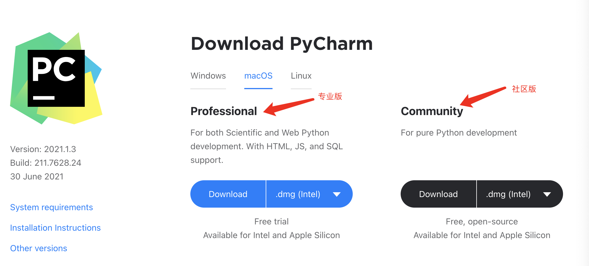
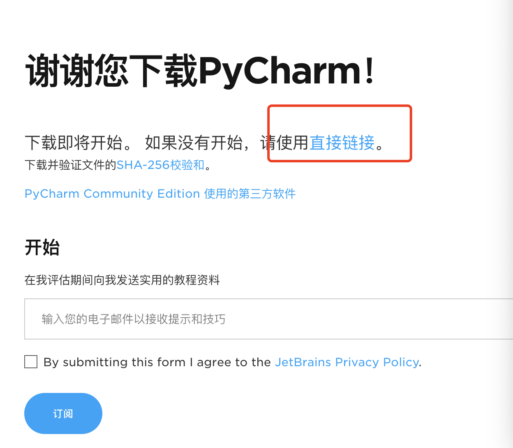
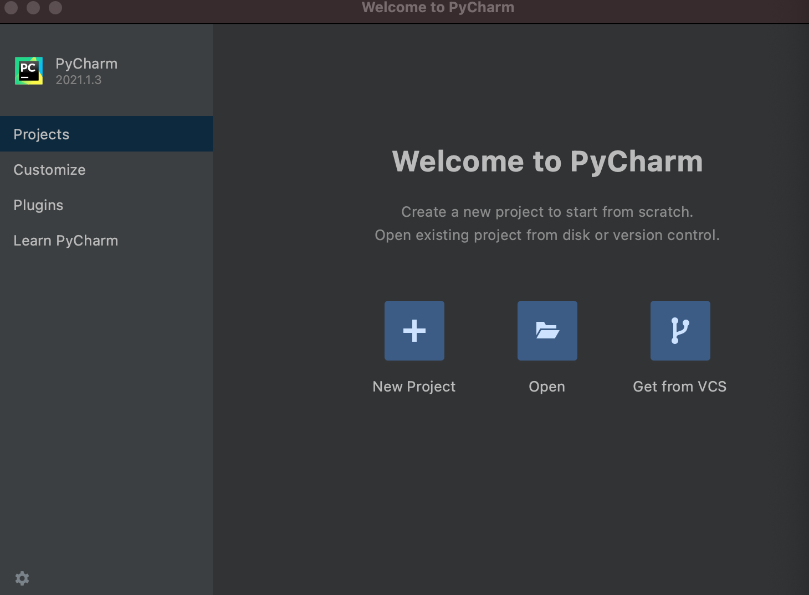
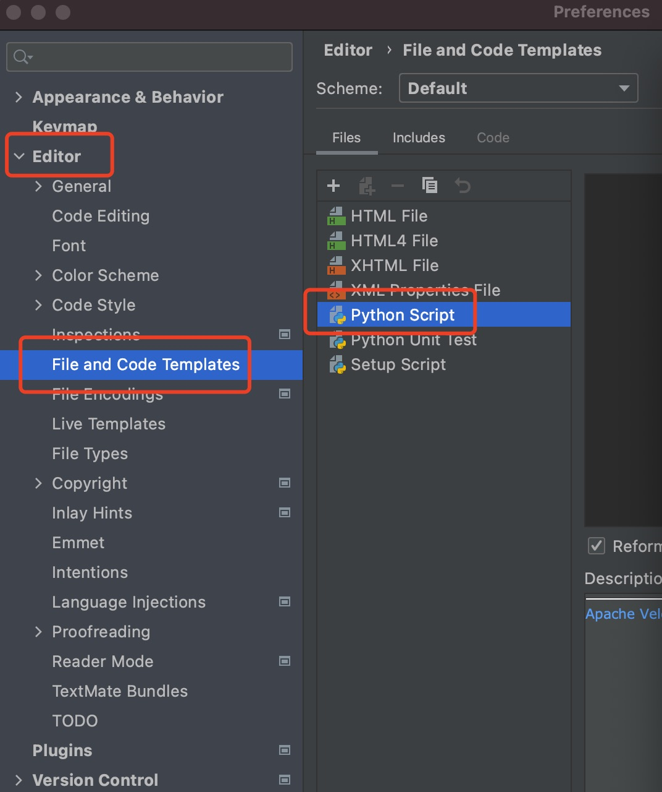
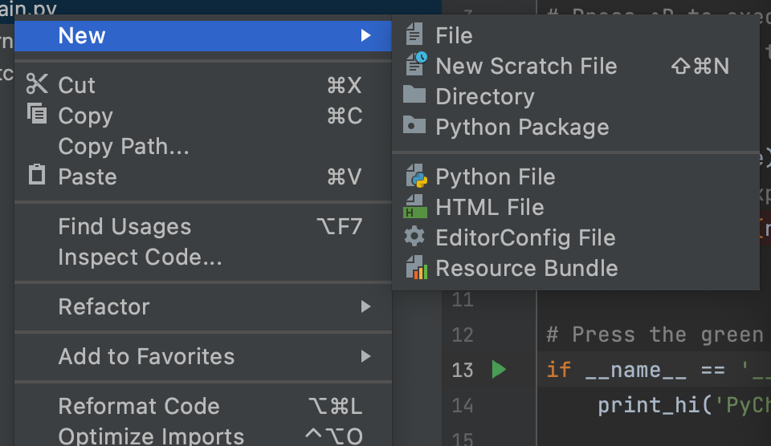
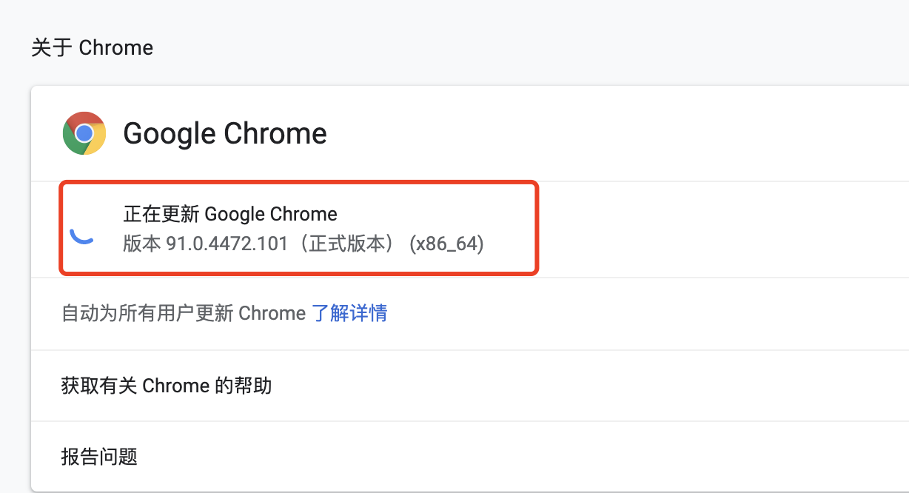
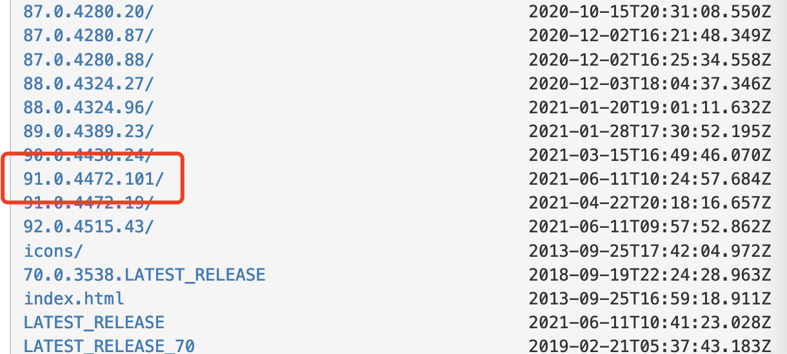
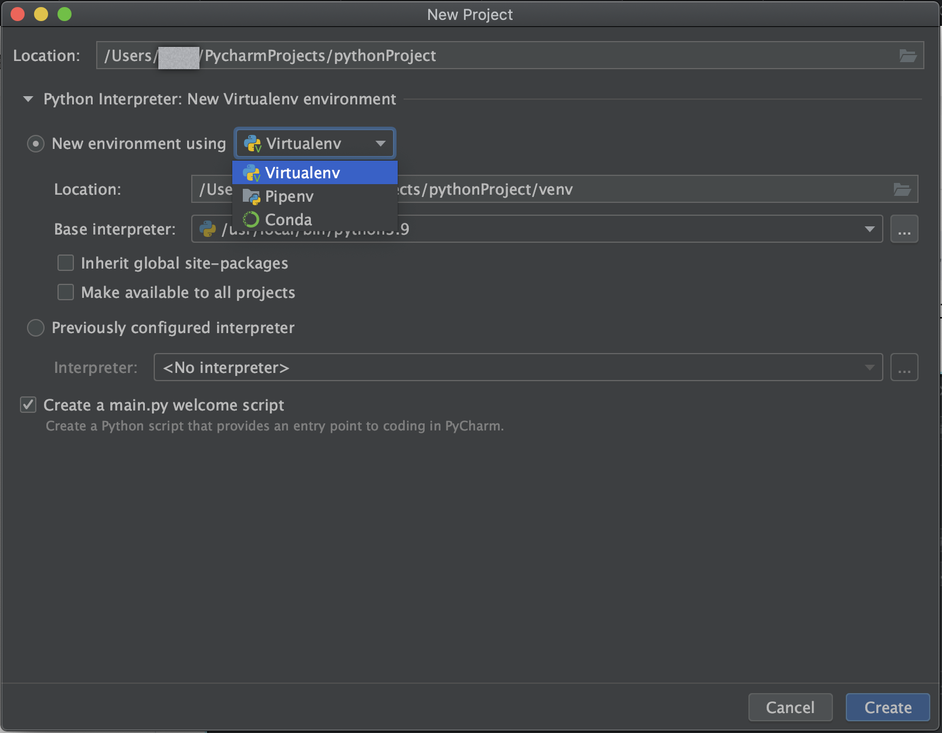
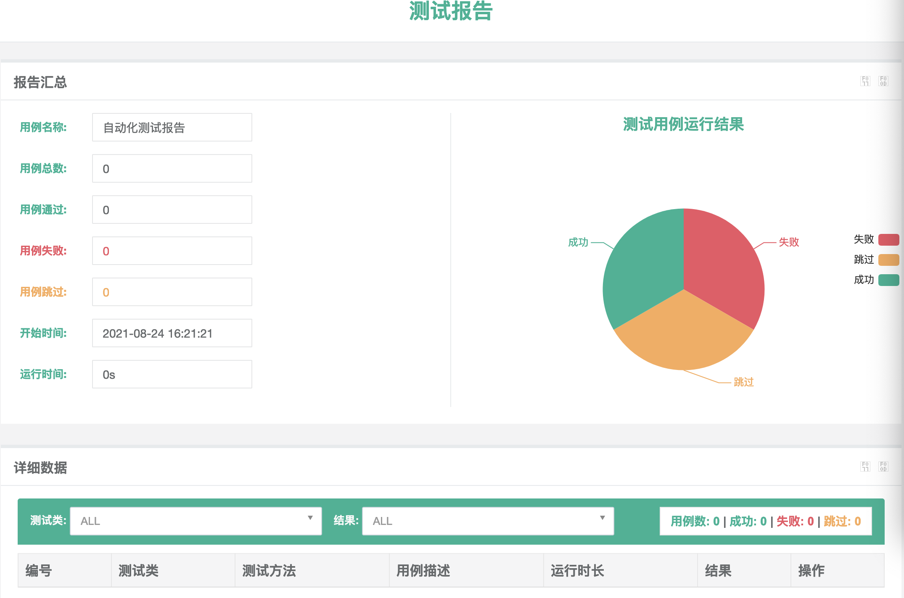

# Python：自动化环境配置

## 安装PyCharm

首先到[PyCharm官网](https://www.jetbrains.com/pycharm/)下载IDE



专业版比较强大，可以做其他的开发但是需要付费。社区版只能开发python，适合一般的开发使用。

选择.dmg(Intel),M1的设备可选择.dmg(Apple Silicon)

也可以选择其他版本的PyCharm。



选择直接下载，下载完成后安装即可。

启动PyCharm,



可以选择创建项目或打开已有的项目。

## 设置python文件模版

打开PyCharm设置项Preferences->Editor->File and Code Templates->Python Script



设置文件模版：
```
# -*- coding: utf-8 -*-
"""
@Project: ${PROJECT_NAME}
@File: ${NAME}.py
@Time: ${DATE}
@Author: ${USER}
@Desc: 
~~~~~~~~~~~~~~~~~~~~~~~~
"""


```

新建文件：


1. New->Directory 新建文件夹
2. New-> Python Package 新建python模块，也是一个文件夹，会自动生成`__init__.py`文件
3. New-> File 新建文件，例如：`test.py`,但不会引入py模版
4. New-> Python File 新建py文件，无需添加后缀，自动引入添加的py模版


## 配置pip镜像源

pip类似`npm`或`cocoapods`，是包管理工具。
pip默认的镜像源是：**https://pypi.org/simple/**

添加或修改镜像源:

* 进入根目录：cd ~/
* 进入.pip目录：cd .pip
* 如果不存在则新建文件：mkdir .pip
* 再次进入.pip目录：cd .pip
* 创建pip.conf文件：touch pip.conf
* 修改pip.conf文件：open pip.conf
```
[global]
timeout=600
index-url=https://mirrors.aliyun.com/pypi/simple/
[install]
trusted-host=mirrors.aliyun.com
```
这里我们将阿里云的镜像源添加到配置文件中。

如果修改临时镜像源，可以这么做：
```
//临时修改为清华大学的镜像
pip3 install scrapy -i https://pypi.tuna.tsinghua.edu.cn/simple/
```

## 安装Python依赖包

PyCharm创建工程后不像其他前端工具一样会生成一个`package.json`文件，可以在`package.json`文件需要的依赖包。
所以安装的时候只能一个一个执行安装，如下：
 ```
 pip install requests
 或
 pip3 install requests
 ```
 安装指定版本的依赖包：
 ```
 pip install pandas==0.23.4
 ```

同时安装多个pip包时，只需将它们以空格分隔传递可以：
```
//ddt和测试框架unittest一起使用，用于管理测试数据
pip install wsgiref boto ddt
```

## 下载ChromeDriver

[ChromeDriver](http://npm.taobao.org/mirrors/chromedriver/)可以到这里去下载。该工具用于驱动Chrome浏览器。
在下载之前首先去看下你的Chrome的版本号：



然后在下载中找到ChromeDriver对应的版本



下载解压后保存到`/usr/local/bin`这个目录下。

在终端查看chromedriver版本，执行：
```
chromedriver
```

也可通过命令行安装,这个需要之前有安装homebrew才可以：
```
brew cask install chromedriver
```
这种方式能不能指定版本暂没找到方法？？

这是另外一篇相关的[文章](https://www.cnblogs.com/wxhou/p/chromedriver-py.html)


验证一下，终端输入：
```
python3
>>> from selenium import webdriver
>>> browser = webdriver.Chrome()
```

执行上面的代码后就会打开Chrome浏览器，说明安装成功了！

## 自动化测试开发

### 1.创建工程
打开PyCharm，新建项目：



其他的不多说，我们来看下`New environment using`选项，我们点开这个下拉框可以看到，虚拟环境可以使用三种工具，Virtualenv、pipnev、conda。 

* Virtualenv: 本身是一款Python工具，具有Python所必须的依赖库，用于创建独立的Python虚拟环境，方便管理不同版本的python模块。零基础就选它。 
* pipenv: 可以说是`virtualenv`和`pip`的结合体，它不但会自动为你的项目创建和管理virtualenv（就是第一个选项），而且在安装/卸载软件包时通过`Pipfile`文件自动添加/删除软件包。所以对于管理包来说是非常好用的。但暂时作为初入门的人来说东西有点多，短时间是用不上的。
* conda: conda非常强大，conda是一个不仅支持Python，它还支持C或C ++库等许多语言的软件包、依赖库和环境管理的工具。 如果你选择conda的话，项目文件夹会在.conda下面，同时你还可以用Anaconda的非常受欢迎的数据科学、机器学习和AI框架的软件包。 这个暂时也不适用于新手 

我们选择`Virtualenv`,并设置项目名称和路径，然后点击create，至此我们的项目就创建完成了。
运行控制台将打印：`Hi, PyCharm`。

打开项目终端，安装用于测试网站的自动化测试工具`selenium`:
```
pip3 install selenium
```

### 2. 如何用Chrome打开一个网站

这里我们写一个简单的程序，打开一个网站，等待10s后退出程序：
```
class UIAuto:
    driver = None

    def __init__(self):
        self.get_driver_instance()
        self.open_url('http://www.baidu.com')
        # self.load_wait_by_located()
        # self.save_screenshot_to_file("百度截屏")
        # self.test_output_report()
        self.wait_exit()

    def get_driver_instance(self):
        if not self.driver:
            self.driver = webdriver.Chrome()
            pass

    def open_url(self, url=None):
        if not url:
            print('url is not none')
        else:
            try:
                self.driver.get(url)
            except Exception as ex:
                print(f'Exception: {ex}')

    def wait_exit(self):
        runLoop = 10
        while runLoop:
            runLoop -= 1
            time.sleep(1)
        if self.driver is not None:
        		self.driver.quit()
        		self.driver = None
        		sys.exit()
```

运行即可看到打开百度网站，10s后浏览器窗口关闭。

### 元素定位

元素定位可通过一下几种方法：

* ID
* XPATH
* LINK_TEXT
* PARTIAL_LINK_TEXT
* NAME
* TAG_NAME
* CLASS_NAME
* CSS_SELECTOR

XPath用法举例：

* `//div[@class="button" and text()="确定"]` : 获取class为`button`并且文本为`确定`的div元素
* `//span[normalize-space(text())="xxx"]` :获取元素中含有文本和其他元素
* `//span[@id="kw"]/parent::div` : 获取id为kw的span元素的div父元素
* `//div[contains(@class,"header")]`: 获取class中包含`header`字符的div元素
* `//div[@class="table"]//tbody`: 以class为table的`div`元素为根元素的tbody元素
* `//div[@class="table"]//*[text()="%s"] % name` : 根据name值动态匹配获取元素

他们有一个公共的方法`find_element(self, by=By.ID, value=None)`,也有自己独立的方法，例如`XPATH`对应的是`find_element_by_xpath`。

下面我们要找到百度首页的搜索框，输入内容，点击百度一下。
在`wait_exit`方法上面添加代码：
```
def load_wait_by_located(self):
    # xpath获取百度搜索输入框
    inputXpath = "//input[@id='kw']"
    wait = WebDriverWait(self.driver, 20)
    try:
        wait.until(self.driver.find_element(By.XPATH, inputXpath))
    except Exception as e:
        print(e)
    # 输入框获取焦点
    self.driver.find_element_by_xpath(inputXpath).click()
    # 输入数据
    self.driver.find_element_by_xpath(inputXpath).send_keys('python应用开发')
    # 暂停一秒
    time.sleep(1)
    # 获取元素的value属性值，并打印出来
    value = self.driver.find_element_by_xpath(inputXpath).get_attribute('value')
	  print('value:%s' % value)

    # 点击百度搜索按钮
    self.driver.find_element_by_id('su').click()
    
```
### 生成网站截图

调用方法`self.save_screenshot_to_file("百度截屏" + time.strftime("%Y-%m-%d %H:%M:%S", time.localtime()))`:

```
def save_screenshot_to_file(self, img_name):
    """
    生成一个名字为img_name的图片截屏，并保存到指定的文件路径下
    :param img_name:
    :return:
    """
    filename = img_name if img_name.endswith('.png') else img_name + '.png'
    shots_dir_path = os.path.dirname(__file__) + "/Screenshots"
    if os.path.exists(shots_dir_path) is not True:
        os.mkdir(shots_dir_path)
    filepath = os.path.join(shots_dir_path, filename)
    self.driver.get_screenshot_as_file(filepath)
```

### 生成测试报告
打开项目终端，安装用于生成报告的工具`BeautifulReport`:
```
pip3 install BeautifulReport
```
如何使用：
```
def test_output_report(self):
    """导出测试报告"""
    # 1.实例化报告对象的执行者
    suites = unittest.TestSuite()
    # 2.实例化报告对象
    reportInstance = BeautifulReport(suites)
    # 3.生成报告
    reportInstance.report(
        description="自动化测试报告",
        filename="reportName",
        report_dir=os.path.dirname(__file__),
        theme="theme_cyan")

```




## 程序封装

