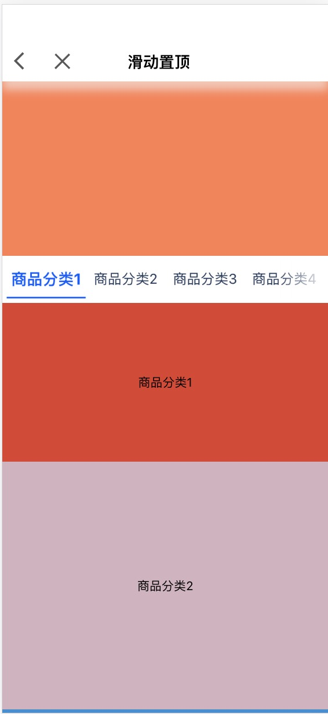
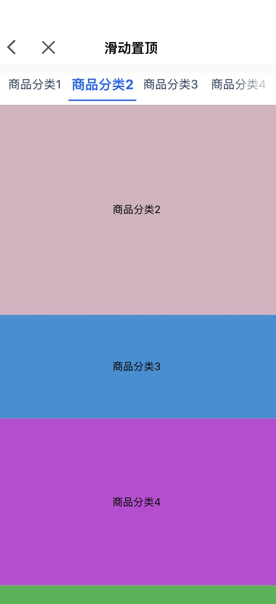
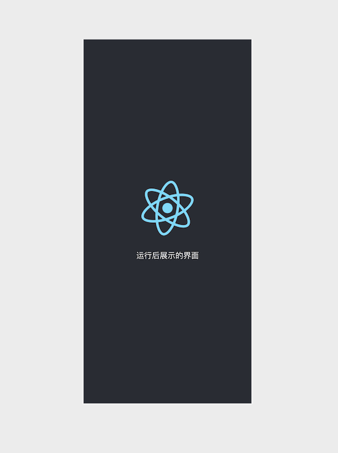
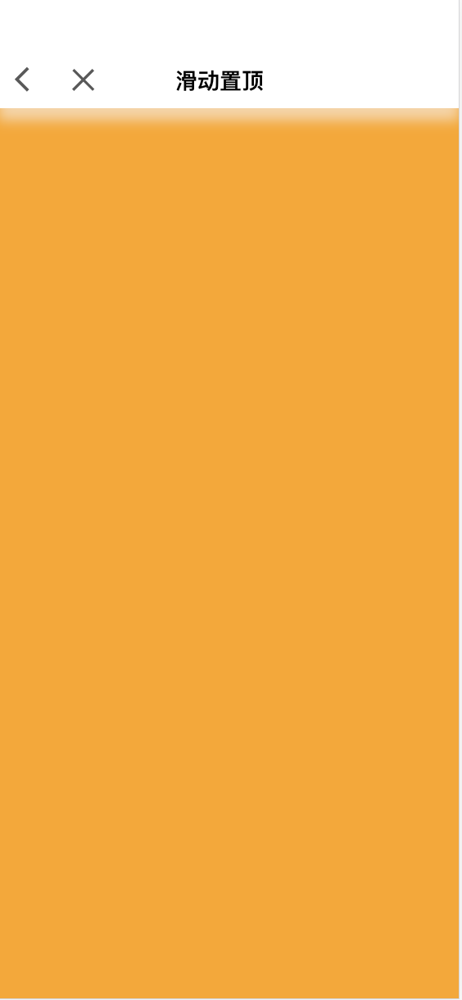
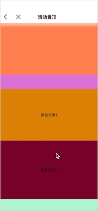

# React：吸顶+滚动tab联动



在这篇文章中，我将演示如何使用React创建一个tab不固定在顶部，滑动到顶部自动吸顶。点击tab切换滚动到指定位置，滑动界面滚动到指定商品分类时，tab跟随切换。



最终要实现的效果是这样的：


## 创建react工程

如果之前没有开发过react项目的话，需要首先安装一下脚手架：
```
npm install -g create-react-app
```
安装完脚手架后就可以开始创建项目了,我们创建一个名称为`sticky-demo
`的工程：
```
create-react-app sticky-demo
```

运行一下试试吧：
```
cd sticky-demo
npm start
```
运行后的界面是这样的：



## 引入 antd-mobile
具体如何导入可以查看[官方文档](https://mobile.ant.design/docs/react/use-with-create-react-app-cn)

安装antd-mobile:
```
npm install antd-mobile --save
```

然后需要安装：
```
npm install react-app-rewired customize-cra --save-dev
```
修改`package.json`文件如下：
```
"scripts": {
        "start": "react-app-rewired start",
        "build": "react-app-rewired build",
        "test": "react-app-rewired test --env=jsdom",
        "eject": "react-scripts eject"
   }
```

然后在项目根目录创建一个 config-overrides.js 用于修改默认配置
```
module.exports = function override(config, env) {
  // do stuff with the webpack config...
  return config;
};
```

接着使用 babel-plugin-import, babel-plugin-import 是一个用于按需加载组件代码和样式的 babel 插件（原理），现在我们尝试安装它并修改 config-overrides.js 文件。

修改成如下：
```
const { 
    override, 
    fixBabelImports, 
    addLessLoader,
    addDecoratorsLegacy,
    addWebpackResolve
} = require('customize-cra');

const path = require('path')

module.exports = override(
    fixBabelImports('import', {
        libraryName: 'antd-mobile',
        style: true,
    }),
    addLessLoader({
        javascriptEnabled: true
    }),
    addDecoratorsLegacy(),
    addWebpackResolve({
        extensions: ['.js', '.jsx', '.json'],
        alias: {
        }
    })
);
```

添加完依赖后，就可以继续下面的工作了。因为这里我们用到了`antd-mobile`的`Tabs`组件。

添加less依赖：
```
npm i less
npm i less-loader
```

## 构建界面

添加一个`stickyPage`的文件，添加`index.jsx`和`index.less`

```
import React, { useState } from 'react';

const StickyPage = (props) => {
    return (
        <div>StickyPage</div>
    )
}
export default StickyPage;
```
打开根目录`index.js`，将`import APP from './App'`注释，添加`import StickyPage from './stickyPage/index'`

修改后如下：
```
//import APP from './App'
import StickyPage from './stickyPage/index'
```
然后将`ReactDOM.render`中的`APP`改为`StickyPage`。保存，看界面是不是发生了变化。

来到`stickyPage/index.jsx`文件,引入已经写好的`Header`组件。修改代码如下：

```
//index.jsx
import React, { useState } from 'react';
import { Header } from "@com";
import './index.less';

const StickyPage = (props) => {
	return (
        <div className={'ft_detail'}>
            <Header title={'滑动置顶'}/>
            <div className={'ft_detail__ft_body'}>
            </div>
        </div>
    )

}

export default StickyPage;
```
样式是这样的：
```
//index.less
.ft_detail {
    height: 100vh;
    display: flex;
    flex-direction: column;
    overflow: hidden;
    &__ft_body {
        position: relative;
        flex: 1;
        flex-direction: column;
        background: orange;
		}
}
```
运行后界面是这样的：



## Header组件
Header组件的代码如下
index.jsx
```
import React from 'react'
import { NavBar, Icon } from "antd-mobile";

import './index.less'

class Header extends React.Component {

    iconOffset = () => {
        const w = document.documentElement.clientWidth;
        let style = { marginLeft: 15 }
        if(w < 375) {
            style = { marginLeft: 5 }
        }

        return style;
    }

    render() {
        return (
            <div className='headerComponent'>
                <NavBar
                    mode={'light'}
                    icon={
                        <div style={{whiteSpace:'nowrap'}}>
                            <Icon style={{marginLeft:0}}
                                type={'left'}
                                size={'lg'}
                                color={'rgba(0,0,0,0.65)'}
                                onClick={this.props.onLeftClick || window.appHistory.goBack}
                            />
                            <Icon type={'cross'}
                                size={'lg'}
                                color={'rgba(0,0,0,0.65)'}
                                style={ this.iconOffset() }
                                onClick={()=> {
                                    if(this.props.appClose) {
                                        this.props.appClose()
                                    }else {
                                        window.appClose && window.appClose()
                                    }
                                }}
                            />
                        </div>
                    }
                    rightContent={this.props.rightContent || []}
                    className={'headerComponent__navBar'}
                    style={{fontWeight:'bold'}}
                >
                    { this.props.title || this.props.children }
                </NavBar>
            </div>
        )
    }

}

export default Header;
```
index.less
```

.headerComponent {
    position: sticky;
    left: 0;
    top:0;
    z-index: 1999;
    &__navBar {
        height: 44px;
        padding-top: 20px;
        box-shadow: 0 10px 10px hsla(0,0%,95.7%,0.6);
        .am-navbar-left {
            padding-left: 0;
        }
        .am-navbar-title {
            font-size: 18px;
            font-weight: bold;
        }

    }

    //华为p40-780，iPhonex-812,iphonePlus-736
    @media screen and (min-height: 780px) {
        &__navBar {
            padding-top: 44px;
        }
    }
}

```

## 设置滑动吸顶
首先我们定义一组测试：
```
const getRandomColor = () => {
    return '#' + Math.floor(Math.random() * 0xffffff).toString(16);
}
const getRandomHeight = () => {
    return  (Math.floor(Math.random() * 200)) + 100;
}

const ftDatas = [
    {
        key:'key1',
        title:'商品分类1',
        color: getRandomColor(),
        height:getRandomHeight()
    },
    {
        key:'key2',
        title:'商品分类2',
        color: getRandomColor(),
        height:getRandomHeight()
    },
    {
        key:'key3',
        title:'商品分类3',
        color: getRandomColor(),
        height:getRandomHeight()
    },
    {
        key:'key4',
        title:'商品分类4',
        color: getRandomColor(),
        height:getRandomHeight()
    },
    {
        key:'key5',
        title:'商品分类5',
        color: getRandomColor(),
        height:getRandomHeight()
    },
    {
        key:'key6',
        title:'商品分类6',
        color: getRandomColor(),
        height:getRandomHeight()
    },
    {
        key:'key7',
        title:'商品分类7',
        color: getRandomColor(),
        height:getRandomHeight()
    },
    {
        key:'key8',
        title:'商品分类8',
        color: getRandomColor(),
        height:getRandomHeight()
    },
    {
        key:'key9',
        title:'商品分类9',
        color: getRandomColor(),
        height:getRandomHeight()
    },
    {
        key:'key10',
        title:'商品分类10',
        color: getRandomColor(),
        height:getRandomHeight()
    },
]
```

然后修改`stickyPage/index.jsx`文件如下：
```
//index.jsx
	...
	
	const StickyPage = (props) => {
	return (
        <div className={'ft_detail'}>
            <Header title={'滑动置顶'}/>
            <div className={'ft_detail__ft_body'}>
            	<div className={'card_header'}></div>
                <div className={'card_modules'}>
                    <div className={'card_sticky'}>
                    </div>
                    <div className={'card_modules__content'} 
                        id={'content'}
                    >
                        {
                            ftDatas &&
                            ftDatas.map((card,index) => {
                                return (
                                    <div key={index} id={card.key} 
                             	  style={{background:card.color,height:card.height}}>
                                        {card.title}
                                    </div>
                                )
                            })
                        }
                    </div>
                </div>
            </div>
        </div>
    )

}

export default StickyPage;

```


修改`stickyPage/index.less`文件如下

```
//index.less
.ft_detail {
    ...
    &__ft_body {
        position: relative;
        flex: 1;
        flex-direction: column;
        overflow-y: auto;
        .card_header {
            display: flex;
            height: 200px;
            background-color: coral;
        }
			.card_modules {
            .card_sticky {
                position: sticky;
                z-index: 1998;
                top: 0;
                background: white;
                padding: 5px 0;
                display: flex;
                flex-direction: row;
                overflow-x: auto;
                background-color: orchid;
                height: 44px;
                &::-webkit-scrollbar {
                    display: none;
                }
                
            }

            &__content {
                position: relative;
                display: flex;
                flex-direction: column;
                > div {
                    // height: 200px;
                    display: flex;
                    justify-content: center;
                    align-items: center;
                }
            }

        }

		}
}
```

保存后，看到的运行结果如下：



滑动吸顶到这里我们就已经实现了，而这里的关键是`.card_sticky`下的这三个样式：
```
position: sticky;
z-index: 1998;
top: 0;
```

## 添加Tabs并点击滚动到指定位置
首先在`className={'card_sticky'}`的标签中添加`Tabs`,设置tab的点击方法和page显示的数量：
```
<Tabs tabs={ftDatas}
   page={selectPage}
   renderTabBar={props => <Tabs.DefaultTabBar {...props} page={4}/>}
   onTabClick={onTabClick}
></Tabs>
```

在添加`onTabClick`方法之前我们需要添加一个`selectPage`用于记录和改变选中的索引：
```
const [selectPage,setSelectPage] = useState(0)

```
然后添加`onTabClick`方法：
```
const onTabClick = (tab,index) => {

   setSelectPage(index)
   const contentNode = document.getElementById('content')
   const domNode = contentNode.childNodes[index]
   domNode.scrollIntoView({behavior: 'smooth', block: 'start'})

}
```

在`stickyPage/index.less`修改`Tabs`的样式，也就是修改`.card_sticky`中的样式属性：
```
.card_sticky {
	 position: sticky;
	 z-index: 1998;
	 top: 0;
	 background: white;
	 padding: 5px 0;
	 display: flex;
	 flex-direction: row;
	 overflow-x: auto;
	 &::-webkit-scrollbar {
	     display: none;
	 }
	 .am-tabs-tab-bar-wrap {
	     .am-tabs-default-bar {
	         padding: 0 5px;
	         .am-tabs-default-bar-content {
	
	             .am-tabs-default-bar-tab {
	                 overflow: hidden;
	                 white-space: nowrap;
	                 color: #22385a;
	                 font-size: 16px;
	                 &::after {
	                     content: none;
	                 }
	                 &.am-tabs-default-bar-tab-active {
	                     color: #0c59ff;
	                     font-weight: bold;
	                     font-size: 18px;
	                 }
	             }
	
	             .am-tabs-default-bar-underline {
	                 border:1px #0c59ff solid;
	             }
	
	         }
	     }
	 }
}
```

到这里，我们就可以点击tab选项，滚动到指定元素了。然而细心的你可能发现有一个小问题，就是元素滚动后有一些偏移，被`card_sticky`这个吸顶元素遮挡了，遮挡的部分就是`card_sticky`的高度。看起来这个实现是有点问题的，那么如何解决呢？

## 解决吸顶元素遮挡
为了解决这个遮挡问题，我们需要计算点击`tab`后需要滚动的元素的累计高度，并且需要去掉`card_sticky`的高度。我们需要先给`ft_detail__ft_body`元素设置一个`id={'ftbody'}`,方便元素的获取。
接着修改`onTabClick`方法如下：
```
const onTabClick = (tab,index) => {

   setSelectPage(index)
   const contentNode = document.getElementById('content')
  const domNode = document.getElementById('ftbody')
  const stickyNode = document.getElementsByClassName('card_sticky')[0]
  
  let tmpIndx = 0;
  let offsetY = contentNode.offsetTop - stickyNode.clientHeight;
  while(tmpIndx < index){
      offsetY += contentNode.childNodes[tmpIndx].clientHeight;
      tmpIndx++
  }
	
	domNode.scrollTo(0,offsetY)

}
```
运行看下效果怎么样吧？可以精确的定位了，然而动画效果没有了。

换种写法试试，把`domNode.scrollTo(0,offsetY)`修改成这样：
```
const scrollOption = {
     top:offsetY,
     left:0,
     behavior:'smooth'
 }
 domNode.scrollTo(scrollOption)
 ```
动画效果再次出现了。在iOS的模拟器上看看怎么样吧，然而动画效果再次消失了，iOS上不支持`behavior:'smooth'`,那就只能自己动画实现了。使用`jquery`动画是个不错的选择，引入：
```
npm i jquery
```
好了，可以导入进来了
```
import $ from 'jquery'
```
使用如下：
```
$('#ftbody').animate({scrollTop: offsetY}, 300)
```

在浏览器和模拟器试了试，效果一致。

## 滑动界面切换tab
监听滑动，我们需要给`ftbody`元素添加滑动方法,和手势方法：
```
onScroll={onScroll}
onTouchMove={onTouchMove}
onTouchEnd={onTouchEnd}

```
因为在tab点击切换时发现`onScroll`方法也是会执行的，所以添加手势方法用于区分是点击事件还是滑动事件,这里我们设置一个变量`isDragging`。
在`const StickyPage`的上方添加：
```
let isDragging = false
let pageY = 0
```
方法实现如下：
```
const onScroll = (e) => {
   if(isDragging) {
       const contentNode = document.getElementById('content')
       let selectIndex = 0
       if(e.target.scrollTop > contentNode.offsetTop){
           const stickyNode = document.getElementsByClassName('card_sticky')[0]
           let offsetY = contentNode.offsetTop - stickyNode.clientHeight + contentNode.childNodes[selectIndex].clientHeight;
           while(e.target.scrollTop > offsetY) {
               selectIndex += 1
               offsetY += contentNode.childNodes[selectIndex].clientHeight;
           }
       } 
       if(selectIndex !== selectPage) {
           setSelectPage(selectIndex)
       }
   }
}
	
const onTouchMove = (e) => {
   isDragging = true
   
   if (pageY > e.touches[0].pageY) {
       console.log('👆')
   }else if(pageY < e.touches[0].pageY) {
       console.log('👇')
   }
}
	
const onTouchEnd = () => {
   isDragging = false
}
```

运行下，滑动一下，切换一下。看起来一切都没问题了。

滑动最后迅速拉下来，发现滚动到顶部停止后tab没有切换到第一个位置，太尴尬啊！

## 如何解决滑动缓冲问题

如何知道滚动缓冲后停止这个动作呢，我们并没有类似`onScrollStop`这样烦人api可以使用。这确实是个让人头疼的事件。
我们可以发现，在`isDragging`为`true`时是允许执行`onScroll`的代码的。这一切是为了防止`onTabClick`这个方法在执行滚动时不执行`onScroll`的代码。那么我们可以想一种方案，在`onTabClick`中添加一个变量`isClick`，当`onTabClick`执行完滚动后改变变量`isClick`的状态。

那么什么时候滚动停止呢，这里我们设置一个延时操作。定义变量如下：
```
let isDragging = false
let pageY = 0
let isClick = false
let timeout = null;
```
在`onTabClick`方法种添加代码：
```
isClick = true
if(timeout) {
  clearTimeout(timeout)
}
timeout = setTimeout(()=>{
  isClick = false
},500)
```

好了，我们的问题到这里基本解决了。这是目前想到的解决方法，如果有更优的方案欢迎指点。

## 进一步优化

考虑了一下，我们可以把代码抽离出来封装一个`StickyView`组件出来。最终调用代码是这样的：
```
<StickyView 
     datas={ftDatas}
     header={
         <div className='headerBanner'></div>
     }
     renderItem={(item,idx) => {
         return (
             <div className={'renderItem'}
                 onClick={onClickDetail}
                 style={{background:item.color,height:item.height}}>
                 {item.title}
             </div>
         )
     }}
 />
```

到这里就结束了！开始的本意是不依赖于`antd-mobile`和`jquery`这些库的，怎奈还是道行浅啊！😂

