# Swift: SPM包管理器

**SPM**：Swift Package Manager（swift包管理器）,管理Swift代码分发的工具,用于处理模块代码的下载、编译和依赖关系。类似`CocoaPods`,不过比`CocoaPods`更简洁，代码的侵入性更小，也不需要额外安装工具。

## SPM依赖安装

Xcode自带SPM,终端上可查看SPM版本：
```
$ swift package --version
Swift Package Manager - Swift 5.3.0
```

新建项目`SPMTest`,添加SPM依赖,`File` -> `Swift Package` -> `Add Package Dependency...`

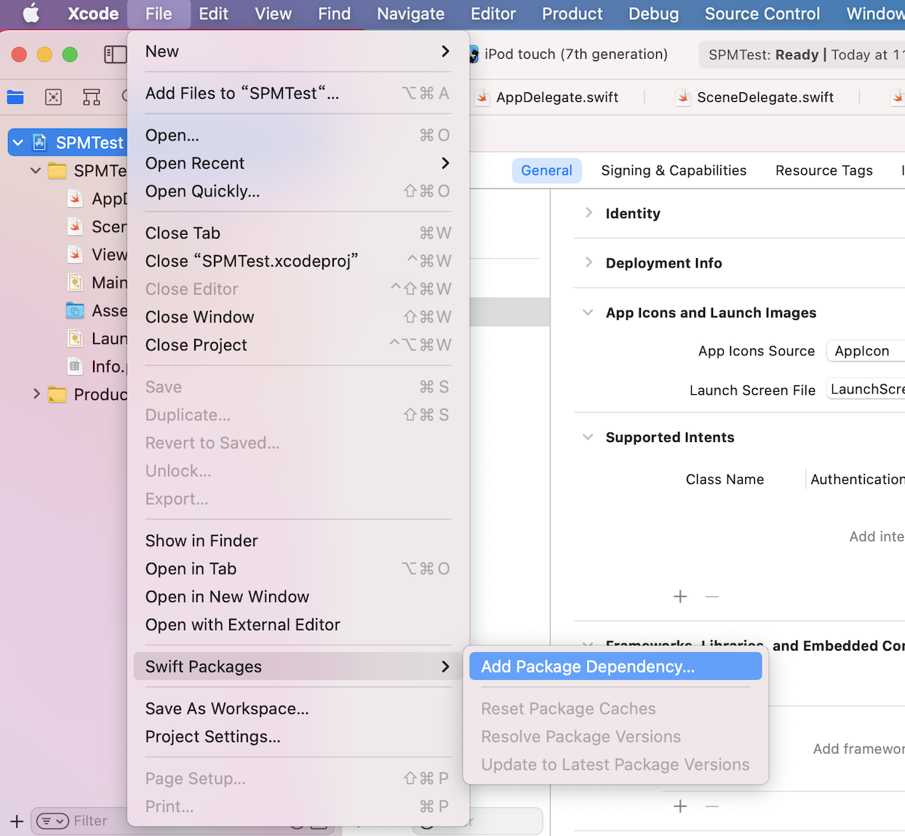

或者点击到 `PROJECT` -> `Swift Packages` 点击加号添加依赖

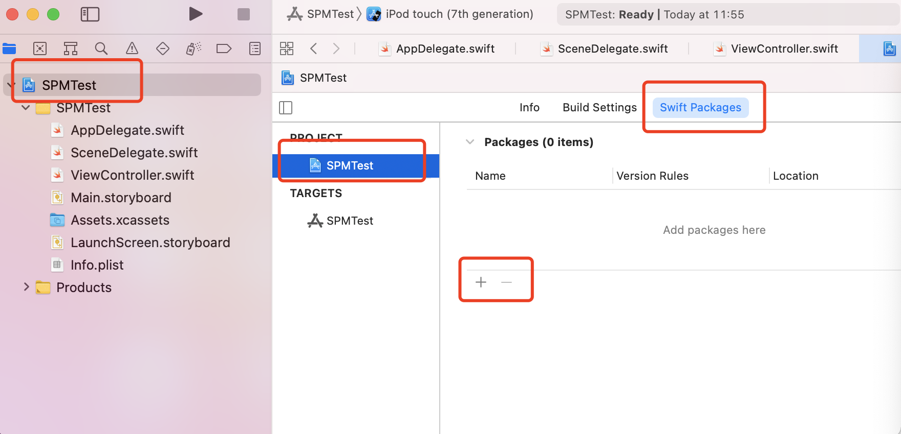


输入需要添加的第三方库的链接：


点击next等待验证成功后直，根据自己的实际需要选择版本，如下图：

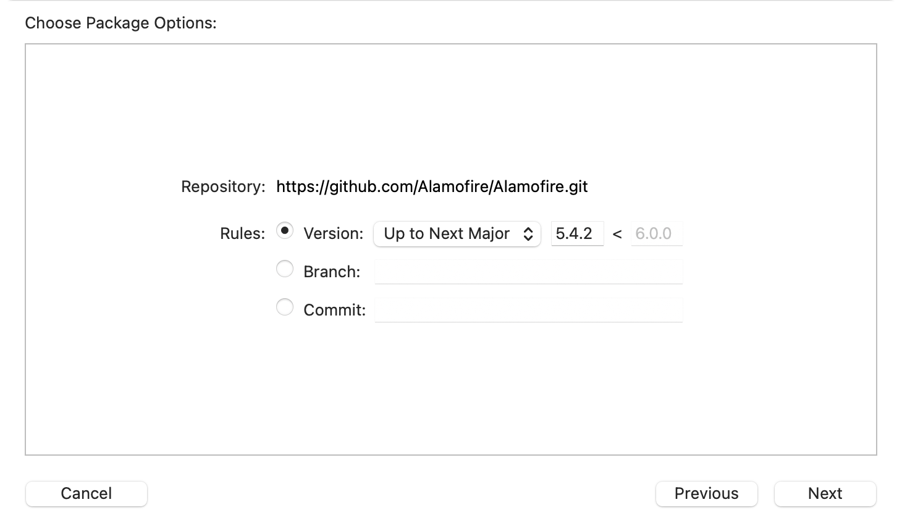

有三个选项：

* Version: 对应库的Release版本, 这里可选择版本规则，它会自动下载这个规则内最新的版本
		
	* Up to Next Major: 指定一个主要版本的范围，例如：5.4.2~6.0.0
	* Up to Next Minor: 指定一个小版本范围,例如：5.4.2~5.5.0
	* Range: 指定一个版本范围, 例如：5.4.1～5.5.1
	* Exact: 指定一个确切的版本，例如：5.4.1
		
* Branch: 直接下载某个分支的代码
* Commit: 根据某一次提交记录的 Id下载

添加完成之后，项目中会出现`Swift Package Dependencies`这样一个目录：

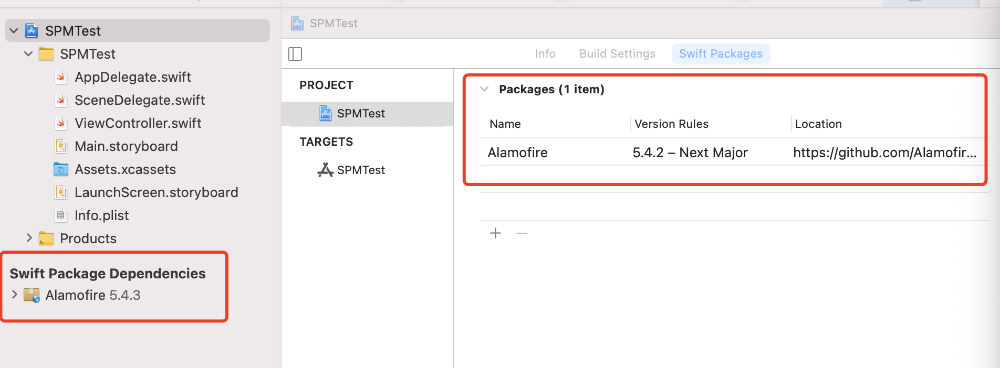

这样就可以在项目中直接使用这个第三方依赖库了。

如果你要更新SPM中的依赖，选择 `File -> Swift Packages -> Update to Latest Package Versions` 即可。

如果想要修改某个第三方库的版本策略，可以双击第三方库即可出现修改面板进行相应的修改。
  
## 创建本地Swift Package库

使用终端新建Package：
```
mkdir SPMDemo
cd SPMDemo
swift package init

```

或者使用Xcode新建一个`Swift Package`,打开我们上面用到的项目`SPMTest`后选择`File`->`New`->`Swift package...`,把这个包命名为ZZPackage,并添加到现有的项目中。 

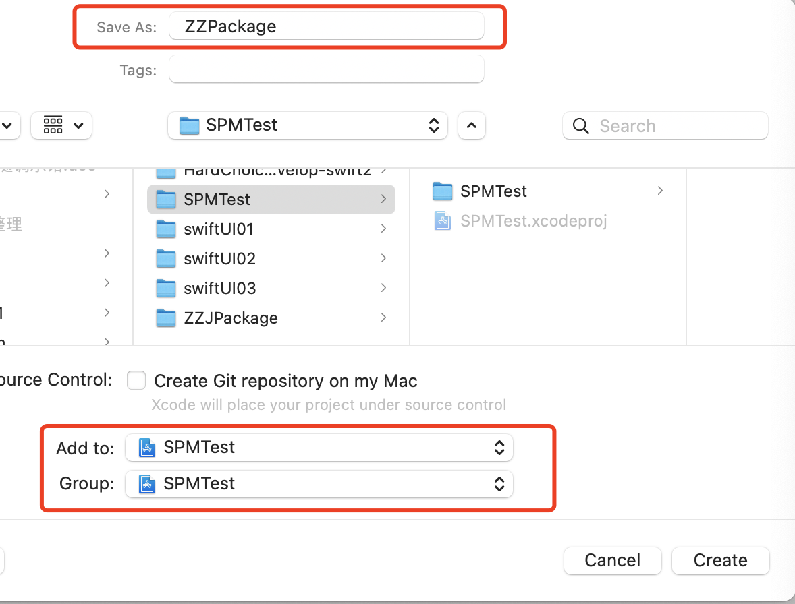

新建完成后可以看到在项目工程中包含了`ZZPackage`这个Package,

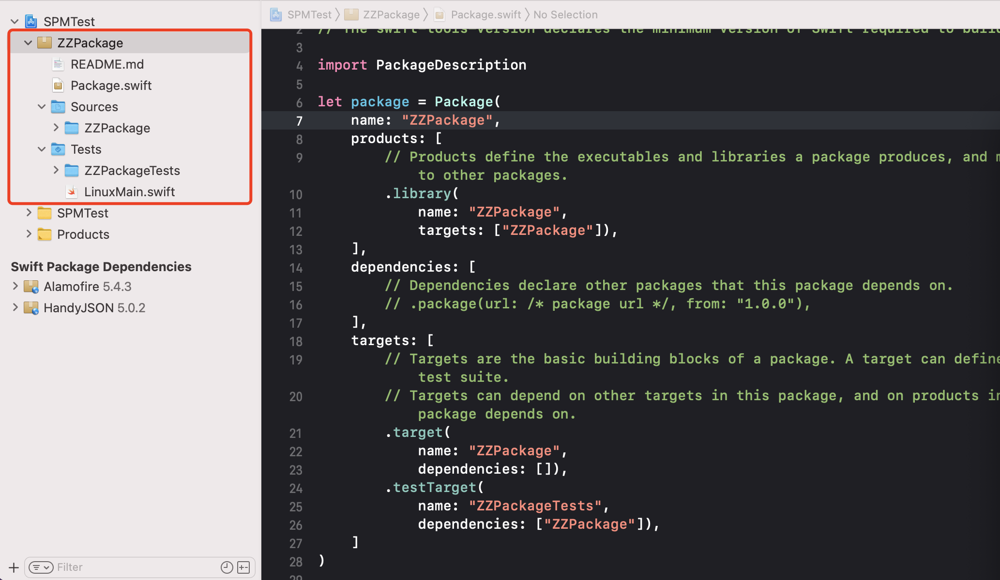

### 如何引入`ZZPackage`到工程中并使用其中的功能模块呢？

`Targets` ->`General` -> `Frameworks..`部分，点击`+`号,添加`ZZPackage`

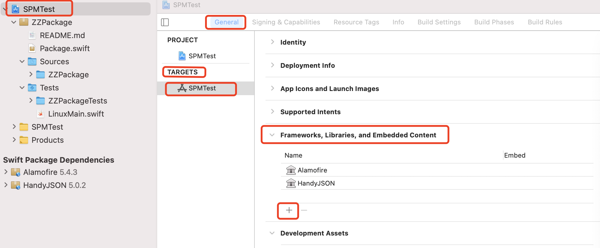

到这里我们就把`ZZPackage`引入到我们的项目中了。在`ZZPackage`下的 `Sources/ZZPackage` 目录下新建`ExView.swift`,然后在工程中使用到这个文件中的方法:
```
import SwiftUI

extension View {
  //module对外的访问权限设为public
   public func printLog(_ value:Any) -> some View {
        #if DEBUG
        print(value)
        #endif
        return self
    }
    
}
```

直接编译报错了:

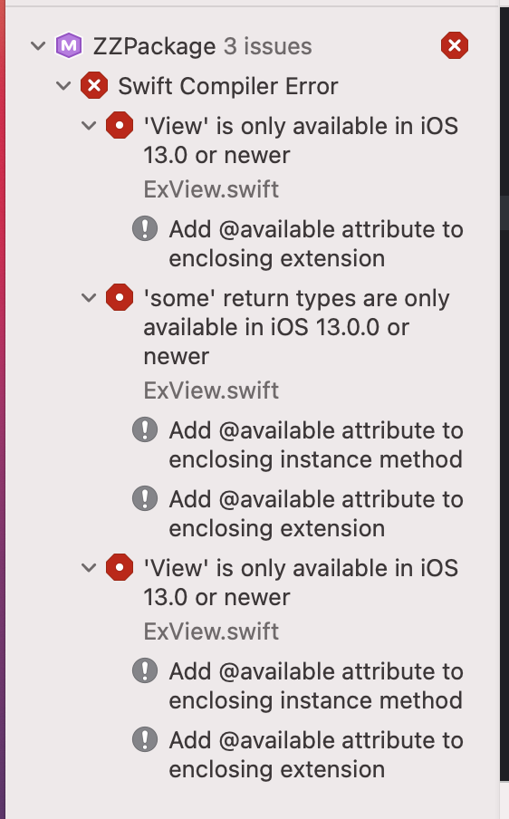

可以看到要求iOS13及以上，因为我们加入的是swiftUI代码，所以需要在`Package.swift`中添加`platforms: [.iOS(.v13)],`或在扩展代码上面添加`@available(iOS 13.0, *)`。

这两种方式编译都可以成功！

运行看下结果吧：

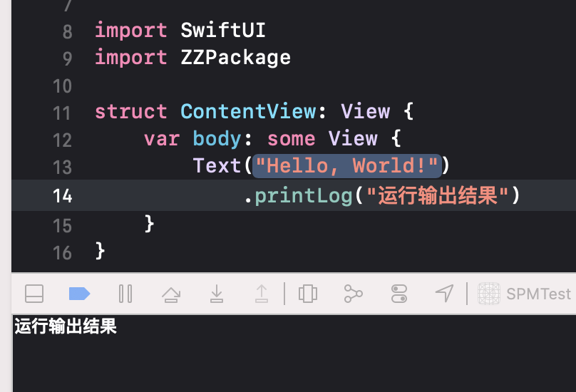


### 发布你的 Swift Package

找到SPMTest文件夹下的`ZZPackage`文件夹，上传库到云端(github, gitee 或者其他托管服务器)。
然后设置`Tag`版本号就可以了。删除本地Package，就可以通过仓库地址加载远程Package了。


## SPM文件及配置

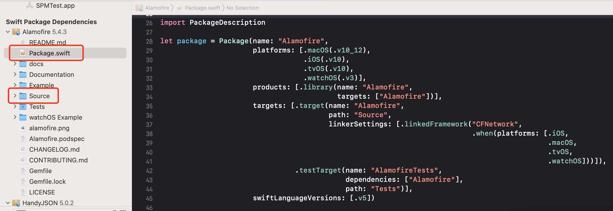

* `Source`文件夹: 第三方库源码位置路径文件
* `Package.swift`: SPM配置文件
我们来看下`Package.swift`这个文件:

```
// swift-tools-version:5.3

import PackageDescription

let package = Package(
    name: "ZZPackage",
    platforms: [.iOS(.v13)],
    products: [
        // Products define the executables and libraries a package produces, and make them visible to other packages.
        .library(
            name: "ZZPackage",
            targets: ["ZZPackage"]),
    ],
    dependencies: [
        // Dependencies declare other packages that this package depends on.
        // .package(url: /* package url */, from: "1.0.0"),
    ],
    targets: [
        // Targets are the basic building blocks of a package. A target can define a module or a test suite.
        // Targets can depend on other targets in this package, and on products in packages this package depends on.
        .target(
            name: "ZZPackage",
            dependencies: []),
        .testTarget(
            name: "ZZPackageTests",
            dependencies: ["ZZPackage"]),
    ]
)

```
第一行始终是Swift Tools的版本,这里是swift5.3版本。这行注释说明了构建swift package所需最低的swift版本号。然后我们导入了PackageDescription,这个库提供了我们需要配置swift package所需的API。

* name: 包的项目名称
* platforms: 支持的平台及对应平台的最低版本
* targets: 包含多个target的集合，我们指定target的名字为`ZZPackage`，xcode会自动把`Sources/ZZPackage`目录下的所有文件添加到package中。如果你想再新建一个target, 需要在`Sources/`目录下新建一个文件夹，然后再targets数组中添加新的target。
	.target是`PackageDescription.Target`实例类，参数说明：
	* name: target名字
	* dependencies: target的依赖，主要指定Package添加的依赖module的名字
	* path: target的路径，如果自定义文件夹需要设置此参数
	* exclude: target path中不希望被包含的path
	* sources: 资源文件路径
	* publicHeadersPath: 公共header文件路径
	
            
* products: 对外公开导出`target`产物，使得其他`target`能够使用它们。如果不写会编译报错
	* .library(
            name: "ZZPackage",
            type: .static,
            targets: ["ZZPackage"]) : 可指定静态库或动态库，默认静态库
            
* dependencies: 添加包所依赖的其他第三方package包的集合

	* .package(url: "https://github.com/Alamofire/Alamofire.git", from: "5.0.0"),
	* .package(url: "https://github.com/SnapKit/SnapKit.git", from: .init(5, 0, 1)),
	* .package(url: "https://github.com/SnapKit/SnapKit.git", from: .init(stringLiteral: "5.0.1")),
	* .package(url: "https://github.com/SnapKit/SnapKit.git", Package.Dependency.Requirement.branch("master")), : 指定分支，如果第三方不支持spm的话可以使用这种方式
	* .package(path: "../ZZPackage") : 关联本地的SPM库
	
* swiftLanguageVersions: 支持的swift版本

### resources 添加资源文件
在`.target`下，我们可以添加资源文件字段`resources`,例如添加图片资源自定义文件夹`imgs`：

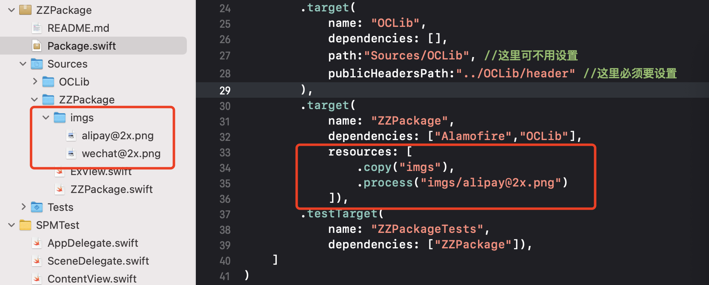

如果资源或路径添加不对，编译报错！

对于`resources`属性，有两个静态方法： `process()` 和 `copy()` 。

* copy会直接拷贝，保存目录结构,可直接copy文件夹
* process是推荐的方式，它所配置的文件会根据具体使用的平台和内置规则进行适当的优化,但好像只能针对单个文件，而不能处理整个文件夹下的资源

```
	//调用举例
    public func bgImg() -> some View {

        let path = Bundle.module.path(forResource: "imgs/wechat@2x.png", ofType: nil)
        
        guard let uiimage = UIImage.init(contentsOfFile:path!) else {
            fatalError("image load path error: \(path as Any)")
        }
        let img = Image(uiImage: uiimage)
        return self
            .background(img)
        
    }
```

在`.target`下，我们可以添加资源文件字段`resources`,使用默认文件夹`Resources`,**推荐使用**这种:

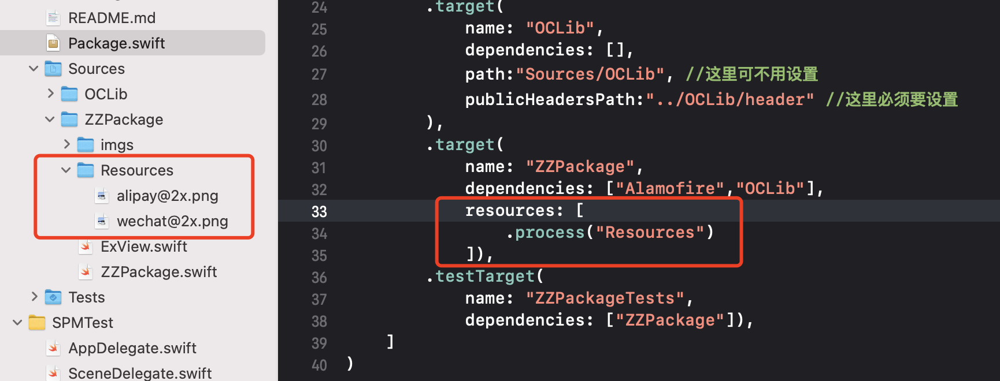

这种方式可以直接在`process`中指定文件夹`Resources`，使用的时候也无需引用该路径。swift在编译的时候不会添加Resources路径。

```
    public func bgImgUrl() -> some View {
        
        let path = Bundle.module.url(forResource: "wechat@2x", withExtension: "png")
        guard let data = try? Data(contentsOf: path!),
              let uiimage = UIImage.init(data: data)
        else {
            fatalError("image load path error: \(path as Any)")
        }
        let img = Image(uiImage: uiimage)
        return self
            .background(img)
        
    }
```

这里也有一个第三方使用`resources`的案例：

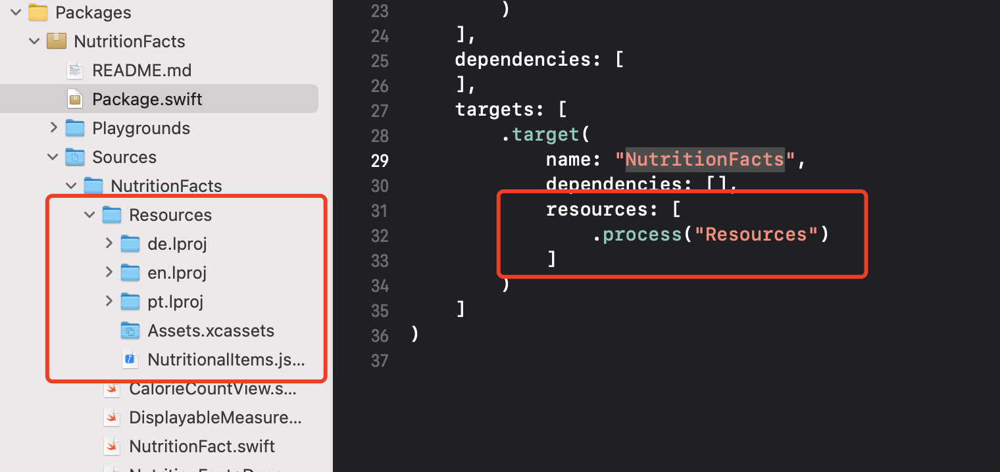

在`Assets.xcassets`中添加的图片资源不需要使用路径方式,使用方式如下:
```
Image("imageName", bundle: .module)
```


SPM**不支持混合**语言开发，在同一个target中无法使用多语言，否则编译报错。

## 如何实现混合

可参考这个[文章](http://ankit.im/swift/2016/05/21/creating-objc-cpp-packages-with-swift-package-manager/)。

这里是个Swift和OC混编的示例，每种语言一个target，单个target内不可使用多语言:

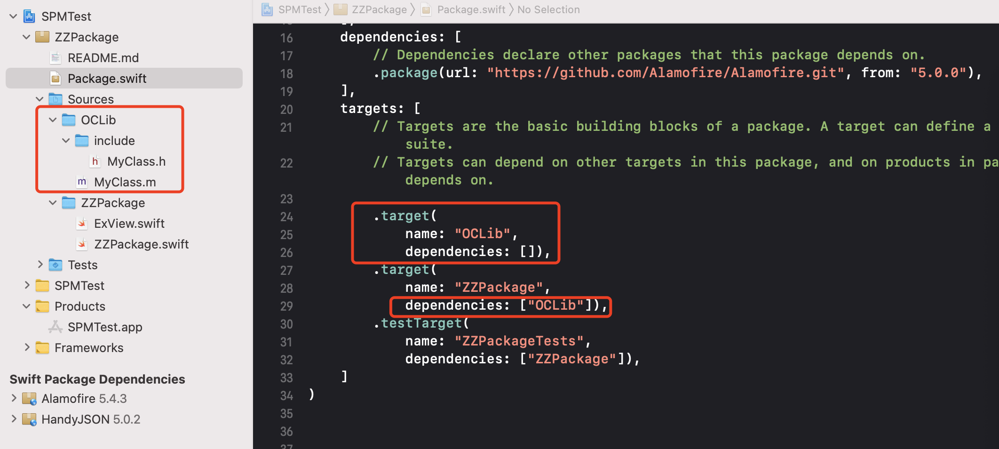

对外导出的`.h`头文件，默认放在`include`文件中。如果要自定义导出文件需要设置`publicHeadersPath`导出的公共头文件夹路径。这里我们把原来的`include`文件名改为`header`，如下所示：

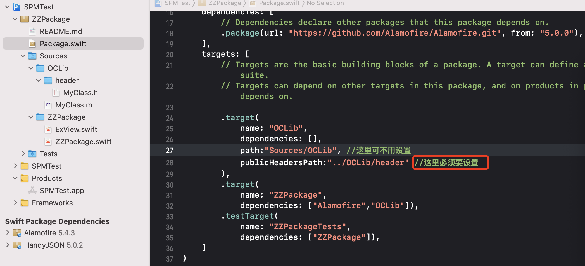

然后把这个OC的包添加依赖到需要使用的Swift的包里，就可以正常使用了！！

