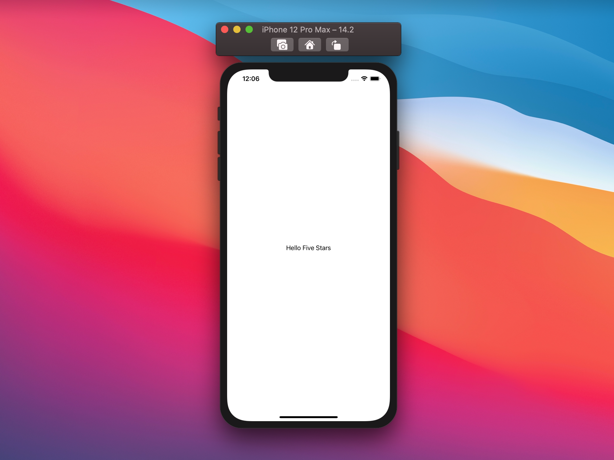

# SwiftUI:@State原理解析
`@State`是SwiftUI的众多支柱之一，一旦理解了它，我们就会理所当然地认为它无处不在，毫不犹豫地使用。但是`@State`是什么呢?幕后发生了什么?
在本文中，让我们尝试通过重建`@State`等来回答这些问题。
> 因为我无法访问实际的swift代码/实现，我们将分析模仿原始@State行为

## Property wrapper属性包装
首先，`@State`是一个属性包装器，简而言之，它是一个具有额外逻辑和存储的高级getter和setter。
让我们先定义我们的状态如下:
```
@propertyWrapper
struct FSState {

}
```
属性包装器需要一个`wrappedValue`，让我们可以读/写相关的值。
因为我们想要模拟`@State`，所以我们将属性包装器泛型到类型`V`上，并将原始值存储在内部`value`属性中:
```
@propertyWrapper
struct FSState<V> {
  // This is where our value is actually stored.
  var value: V
  
  // And here are our getter/setters.
  var wrappedValue: V {
    get {
      value
    }
    set {
      value = newValue
    }
  }
}
```
最后，如果我们想提供与`@State`和所有其他属性包装器相同的语法(例如,`@State var x = "hello"@State var x = "hello"`),我们需要声明一个特殊的初始化方法：
```
@propertyWrapper
struct FSState<V> {
  var value: V
  
  var wrappedValue: V {
    ...
  }

  init(wrappedValue value: V) {
    self.value = value
  }
}
```

有了这个定义，我们现在可以开始在视图中使用`@FSState`，例如:

```
struct ContentView: View {
  @FSState var text = "Hello Five Stars"

  var body: some View {
    Text(text)
  }
}
```



## nonmutating
到目前为止，我们的定义与在视图本身中直接定义属性没有太大区别。
如果我们从`ContentView`声明中删除`@FSState`，一切仍然运行良好:
```
struct ContentView: View {
  var text = "Hello Five Stars"

  var body: some View {
    Text(text)
  }
}
```


让我们现在尝试用一个按钮来改变text文本，例如:
```
struct ContentView: View {
  @FSState var text = "Hello Five Stars"

  var body: some View {
    VStack {
      Text(text)

      Button("Change text") {
        text = ["hello", "five", "stars"].randomElement()!
      }
    }
  }
}
```
不幸的是，这不会build成功:我们会得到一个按钮操作错误提示`Cannot assign to property: 'self' is immutable`。问题是，分配的文本会改变`ContentView`。

使用结构体，我们可以声明`mutating`的方法，但不能声明`mutating`的计算属性(如body)，也不能在其中调用`mutating`的方法。
为了克服这个问题，我们不能改变`ContentView`，这意味着我们也不能改变`FSState`，因为我们的属性包装器只是嵌套在视图中的另一个值类型。

首先，让我们声明我们的属性包装器设置为`nonmutating`，它告诉Swift设置这个值不会改变我们的`FSState`实例:
```
@propertyWrapper
struct FSState<V> {
  var value: V
  
  var wrappedValue: V {
    get { ... }
    nonmutating set { // our setter is now nonmutating
      value = newValue
    }
  }

  ...
}
```
现在我们已经将构建错误`Cannot assign to property: 'self' is immutable`从`text`转移到`FSState`的`wrappedValue`的setter方法中了。
这是有意义的，因为我们承诺不改变struct实例，但我们设置`value = newValue`，这是可变的。

这就是Swift引用类型的由来:如果我们用class类型替换`FSState`的`value`属性，然后在我们的setter方法中更新这个类实例，我们实际上并没有更改`FSState`(因为`FSState`只包含对该类的引用，它总是保持不变)。
让我们把"container"定义成class类型:
```
final class Box<V> {
  var value: V

  init(_ value: V) {
    self.value = value
  }
}
```
`Box`是一个泛型类，只有一个函数:拥有和更新我们的值。
让我们利用这个类给`@FSState`声明一个属性：

```
@propertyWrapper
struct FSState<V> {
  var box: Box<V>

  var wrappedValue: V {
    get {
      box.value
    }
    nonmutating set {
      box.value = newValue
    }
  }

  init(wrappedValue value: V) {
    self.box = Box(value)
  }
}
```
更新后`build`and`run`我们的应用！

 

我们点击按钮，但没有看到任何变化，如果我们设置断点，我们将看到一切工作:点击按钮可以设置和更新我们的状态，但是SwiftUI并不知道。
没错，我们更新数据，但SwiftUI并不知道它应该监听这些变化，并重新绘制body，让我们接下来解决这个问题。

## DynamicProperty
与SwiftUI中已知的基础视图类似，SwiftUI中每个视图都可以根据视图中定义的属性监听这些publisher。
SwiftUI团队在隐藏SwiftUI大量使用Combine方面做了很多的工作：当我们将一个视图属性与`@State`、`@ObservedObject`等关联起来时，SwiftUI会监听连接到每个属性包装器的所有发布者，然后这些发布者会告诉SwiftUI什么时候重新绘制。

在我们的例子中，我们使用`@StateObject`来匹配`Box`的`ObservableObject`。组合关联一个`objectWillChange`publisher到所有`ObservableObject`实例，然后我们可以通过调用`send()`将事件发送到SwiftUI:
```
final class Box<V>: ObservableObject {
  var value: V {
    willSet {
      // This is where we send out our "hey, something has changed!" event
      objectWillChange.send()
    }
  }

  init(_ value: V) {
    self.value = value
  }
}
```
> 有更简单的方法来声明它，但在本文中，我们试图通过尽可能多地删除“魔法”来了解事情是如何工作的。有更简单的方法来声明它，但在本文中，我们试图通过尽可能多地删除“魔法”来了解事情是如何工作的。

随着`Box`定义的更新，我们现在可以回到`@FSState`，并将`@StateObject`关联到`Box`属性:
```
@propertyWrapper
struct FSState<V> {
  @StateObject var box: Box<V>

  var wrappedValue: V {
    ...
  }

  init(wrappedValue value: V) {
    self._box = StateObject(wrappedValue: Box(value))
  }
}
```
由于每次更新box的值变化:

* `objectWillChange`事件被触发
* `box`的publisher将会监听到

让我们再次运行我们的应用程序:


不幸的是，我们还没到那一步。当我们的值发生变化时，新的发布者确实会发送事件，但是我们仍然需要告诉SwiftUI:从SwiftUI的角度来看，`ContentView`有一个类型为`FSState<String>`的`text`属性，这不是SwiftUI需要关注的。

要改变这一点，我们需要`FSState`遵守`DynamicProperty`协议，在文档中描述为`An interface for a stored variable that updates an external property of a view.`。
这正是SwiftUI关注的!通过使`FSState`遵守`DynamicProperty`协议, SwiftUI将监听它的事件并在需要时触发重绘。
`DynamicProperty`只需要一个`update()`函数的实现，然而SwiftUI已经提供了它的默认实现，我们需要做的就是添加`DynamicProperty`的一致性，然后就可以了:
```
@propertyWrapper
struct FSState<V>: DynamicProperty {
  ...
}
```
通过最后的修改，让我们尝试再次运行我们的应用程序:


终于可以了！尽管添加了与`DynamicProperty`一致的属性，我们仍然没有明确声明SwiftUI应该监听哪些属性:与[view Equatable](https://www.jianshu.com/p/c35174ed824f)的工作方式类似，我怀疑SwiftUI使用Swift的反射来迭代所有存储的属性，并寻找要订阅的已知属性包装类型。

## Binding
属性包装器的一个可选特性是公开一个投影值:投影值是存储在属性包装器中的值的另一种查看方式，以不同的方式公开。
许多SwiftUI视图使用绑定来引用和潜在地改变其他地方拥有和存储的值。一个例子是`TextField`，它使用了一个`Binding<String>`:
```
struct ContentView: View {
  @FSState var text = ""

  var body: some View {
    VStack {
      TextField("Write something", text: $text) // TextField's text is a binding
    }
  }
}
```
如上所述，我们可以通过在属性名前加上`$`来调用关联属性，从而从`@State`获得绑定，这个符号真正做的是获取投影值而不是包装的值。
因此`@State`的投影值是`@Binding`的一个`V`类型的泛型值，让我们在`@FSState`中添加相同的投影值:
```
@propertyWrapper
struct FSState<V>: DynamicProperty {
  @ObservedObject private var box: Box<V>

  var wrappedValue: V {
    ...
  }

  var projectedValue: Binding<V> {
    Binding(
      get: {
        wrappedValue
      },
      set: {
        wrappedValue = $0
      }
    )
  }

  ...
}
```
瞧，我们现在可以使用`@FSState`和绑定了!


下面是最终的`@FSState`定义:
```
@propertyWrapper
struct FSState<V>: DynamicProperty {
  @StateObject private var box: Box<V>

  var wrappedValue: V {
    get {
      box.value
    }
    nonmutating set {
      box.value = newValue
    }
  }

  var projectedValue: Binding<V> {
    Binding(
      get: {
        wrappedValue
      },
      set: {
        wrappedValue = $0
      }
    )
  }

  init(wrappedValue value: V) {
    self._box = StateObject(wrappedValue: Box(value))
  }
}
final class Box<T>: ObservableObject {
  var value: T {
    willSet {
      objectWillChange.send()
    }
  }

  init(_ value: T) {
    self.value = value
  }
}
```
## 总结
我们对SwiftUI研究得越多，它就越能说明在一个简单、优雅的API中隐藏着多少复杂性。`@FSState`不像真正的`@State`那样完整和强大！也许我们还有很多没考虑到的地方。

