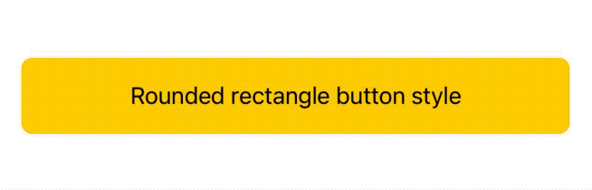
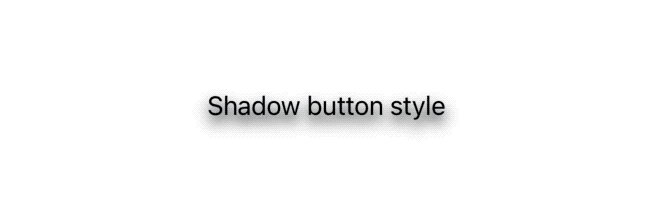
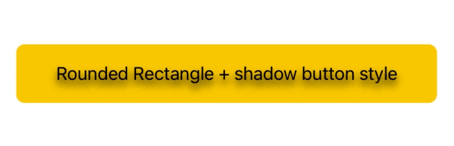
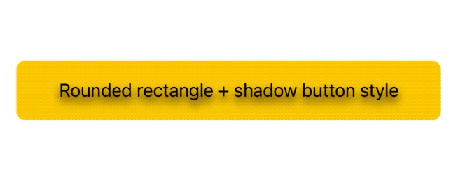
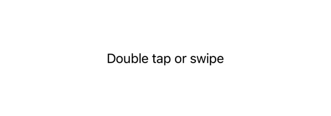
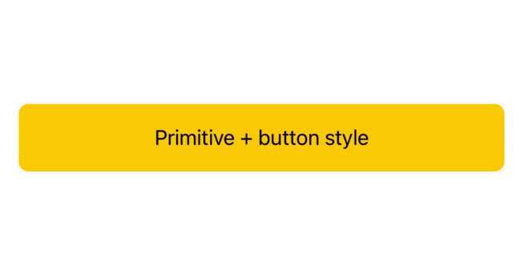

# SwiftUI:Button styles

`Button`无疑是swifttui中最受欢迎的元素之一，它也非常特别，因为它是唯一具有两种不同风格协议的组件:`ButtonStyle`和`PrimitiveButtonStyle`。
在本文中，让我们探索关于按钮样式的所有知识，以及更多内容。

<!--- https://fivestars.blog/ --->

## 开始
SwiftUI有三种内置样式:`DefaultButtonStyle`、`BorderlessButtonStyle`和`PlainButtonStyle`。
当声明一个简单的按钮时，应用`DefaultButtonStyle`:
```
Button("Simple button") { 
  // button tapped
  ...
}
```


`DefaultButtonStyle`本身并不是一种风格:它是我们让swiftUI为我们选择风格的方式(基于上下文、平台、父视图等等)。
实际的默认样式是`BorderlessButtonStyle`，它会在按钮顶部应用蓝色调，如果我们是在iOS14上应用会有一些点击、聚焦等视觉效果。
以下三个声明是等价的:
```
Button("Simple button") { 
  ...
}

Button("Simple button") { 
  ...
}
.buttonStyle(DefaultButtonStyle())

Button("Simple button") { 
  ...
}
.buttonStyle(BorderlessButtonStyle())
```
> 在iOS13中，(蓝色)色调应用于按钮`label`中声明的图像，因此我们需要添加渲染修饰符(例如:`Image("Image").renderingmode (.original))`或在图像资产目录中声明正确的渲染。

> 从ios14只有模板图像将被默认着色。

最后，SwiftUI提供了`PlainButtonStyle`，它不带颜色地显示按钮标签，但仍然在不同的状态下应用视觉效果:


这些都是swiftUI在iOS中提供给我们的样式:我们可以用`ButtonStyle`和`PrimitiveButtonStyle`创建新的样式，让我们从`ButtonStyle`开始。

## ButtonStyle
文档建议我们在自己声明按钮外观时使用`ButtonStyle`，但按钮交互的行为与任何其他标准按钮一样(也就是说，它的动作在点击时被触发)。
```
public protocol ButtonStyle {
  associatedtype Body: View

  func makeBody(configuration: Self.Configuration) -> Self.Body

  typealias Configuration = ButtonStyleConfiguration
}
```
`ButtonStyle`的唯一要求是从`makeBody(configuration:)`返回一个视图，该函数接受一个`ButtonStyleConfiguration`实例:
```
public struct ButtonStyleConfiguration {
  public let label: ButtonStyleConfiguration.Label
  public let isPressed: Bool
}
```
这个配置有两个属性:

* `label`是按钮`label`,例如，如果我们的按钮是`Button(action: {}, label: { Text("Hello world") })`，那么`Text("Hello world")`就是我们的`label`。
* `isPressed`是按钮的当前状态，可以在`ButtonStyle`的`makeBody(configuration:)`中用于视觉效果

让我们来定义几个例子:
带有圆角的`ButtonStyle`:
```
struct RoundedRectangleButtonStyle: ButtonStyle {
  func makeBody(configuration: Configuration) -> some View {
    HStack {
      Spacer()
      configuration.label.foregroundColor(.black)
      Spacer()
    }
    .padding()
    .background(Color.yellow.cornerRadius(8))
    .scaleEffect(configuration.isPressed ? 0.95 : 1)
  }
}
```



带有文字阴影的`ButtonStyle`:
```
struct ShadowButtonStyle: ButtonStyle {
  func makeBody(configuration: Configuration) -> some View {
    configuration.label
      .shadow(
        color: configuration.isPressed ? Color.blue : Color.black,
        radius: 4, x: 0, y: 5
      )
  }
}
```



注意，当点击时，这些新按钮没有默认效果:现在是时候在输出按钮中添加这些效果了。
这就是`ButtonStyle`的全部内容,它可以让我们自定义任何按钮的外观，主要优点是:

* 可以将相同的样式应用到多个按钮而不需要重复代码
* 接受`isPressed`事件
* 保持标准的交互/行为

## 应用和组合多种样式
`Button`没有接受`ButtonStyleConfiguration`实例的初始化方法，当组合多个样式时，事情就变得复杂了。
根据我们当前的声明，应用多个`ButtonStyles`没有效果，只有最接近的样式将被使用(其他样式的`makeBody(configuration:)`甚至不会被调用):
```
// 只有RoundedRectangleButtonStyle声效了
Button("Rounded rectangle button style") {
  // button tapped
  ...
}
.buttonStyle(RoundedRectangleButtonStyle())
.buttonStyle(ShadowButtonStyle())
.buttonStyle(BorderlessButtonStyle())
.buttonStyle(DefaultButtonStyle())
```


一个“解决办法”是在`ButtonStyle` `makeBody(configuration:)`函数中返回一个新的`Button`，例如，我们可以如下所示更新`RoundedRectangleButtonStyle`:
```
struct RoundedRectangleButtonStyle: ButtonStyle {
  func makeBody(configuration: Configuration) -> some View {
    Button(action: {}, label: {
      HStack {
        Spacer()
        configuration.label.foregroundColor(.black)
        Spacer()
      }
    })
    // 👇🏻 makes all taps go to the the original button
    .allowsHitTesting(false)
    .padding()
    .background(Color.yellow.cornerRadius(8))
    .scaleEffect(configuration.isPressed ? 0.95 : 1)
  }
}
```
有了这个新的定义，前面的例子就可以工作了:
```
Button("Rounded rectangle + shadow button style") {
  // button tapped
  ...
}
.buttonStyle(RoundedRectangleButtonStyle())
.buttonStyle(ShadowButtonStyle())
```



这里有个缺点是，样式仅可应用于虚构的、不可点击的按钮，因此不接收任何`isPressed`事件。

至少就目前而言，解决这些限制的一个简单方法是创建并使用一种新的风格，它可以结合所需的效果，例如:
```
struct RoundedRectangleWithShadowedLabelButtonStyle: ButtonStyle {
  func makeBody(configuration: Configuration) -> some View {
    HStack {
      Spacer()
      configuration.label.foregroundColor(.black)
        .shadow(
          color: configuration.isPressed ? Color.red : Color.black,
          radius: 4, x: 0, y: 5
        )
      Spacer()
    }
    .padding()
    .background(Color.yellow.cornerRadius(8))
    .scaleEffect(configuration.isPressed ? 0.95 : 1)
  }
}
```
我们可以这样使用:
```
Button("Rounded rectangle + shadow button style") {
  // button tapped
  ...  
}
.buttonStyle(RoundedRectangleWithShadowedLabelButtonStyle())
```



## PrimitiveButtonStyle
`ButtonStyle`是关于自定义外观和保持标准交互行为的，而`PrimitiveButtonStyle`则允许我们自定义两者，这意味着由我们来定义按钮外观，并决定何时以及如何触发按钮动作。
`PrimitiveButtonStyle`的定义几乎与`ButtonStyle`相同:
```
public protocol PrimitiveButtonStyle {
    associatedtype Body : View

    func makeBody(configuration: Self.Configuration) -> Self.Body

    typealias Configuration = PrimitiveButtonStyleConfiguration
}
```
唯一的区别在于`makeBody(configuration:)`参数，它现在是`PrimitiveButtonStyleConfiguration`类型:
```
public struct PrimitiveButtonStyleConfiguration {
  public let label: PrimitiveButtonStyleConfiguration.Label
  public func trigger()
}
```
这个配置同样带有button`label`属性，但是`isPressed`现在被`trigger()`函数所取代:

调用`trigger()`是我们调用按钮操作的方式，现在由我们来定义正确的时间。
例如，如果我们希望一个按钮只在双击时触发，我们可以定义以下样式:
```
struct DoubleTapOnlyStyle: PrimitiveButtonStyle {
  func makeBody(configuration: Configuration) -> some View {
    configuration.label
      .onTapGesture(count: 2, perform: configuration.trigger)
  }
}
```
我们可以像使用其他样式一样使用:
```
Button("Double tap me") {
  // button double tapped
  ...  
}
.buttonStyle(DoubleTapOnlyStyle())
```

## 应用和组合多种基本样式
与`ButtonStyleConfiguration`不同，`Button`有一个接受`PrimitiveButtonStyleConfiguration`实例的初始化器，允许我们在同一个按钮上组合/应用多个基本样式。
例如，考虑以下样式:
```
// 双击按钮动作就会触发 
struct DoubleTapStyle: PrimitiveButtonStyle {
  func makeBody(configuration: Configuration) -> some View {
    Button(configuration) // <- Button instead of configuration.label
      .onTapGesture(count: 2, perform: configuration.trigger)
  }
}

// 点击时触发(即使在按钮外终止)
struct SwipeButtonStyle: PrimitiveButtonStyle {
  func makeBody(configuration: Configuration) -> some View {
    Button(configuration)
      .gesture(
        DragGesture()
          .onEnded { _ in
            configuration.trigger()
          }
      )
  }
}
```
当每种样式返回一个按钮时，它们可以组合并一起工作，没有问题:
```
Button(
  "Double tap or swipe", 
  action: { 
    // handle action here
    ...
  }
)
.buttonStyle(DoubleTapStyle())
.buttonStyle(SwipeButtonStyle())
```
这种方法有一个小小的副作用:`Button(configuration)`带有默认的按钮交互和样式，幸运的是我们可以通过定义另一种“plain”样式来删除这两者。
```
struct PlainNoTapStyle: PrimitiveButtonStyle {
  func makeBody(configuration: Configuration) -> some View {
    Button(configuration)
      .buttonStyle(PlainButtonStyle()) // 移除默认样式
      .allowsHitTesting(false)         // 取消事件触发
      .contentShape(Rectangle())       // 替换样式及交互
  }
}
```
如果我们现在把这个样式添加到我们的按钮定义中，我们只需要双击和滑动就可以真正地使它工作:
```
Button(
  "Double tap or swipe", 
  action: {
    // handle action here
    ...
  }
)
.buttonStyle(DoubleTapStyle())
.buttonStyle(SwipeButtonStyle())
.buttonStyle(PlainNoTapStyle())
```



然而，我们可能希望大多数按钮都能保持单点默认交互。

## 使用PrimitiveButtonStyle和ButtonStyle
我们已经介绍了如何将每个`ButtonStyle`对以前样式的覆盖，而`PrimitiveButtonStyle`允许我们组合多个样式(在正确定义的情况下)，那么将这两种样式结合起来呢?

我们可以同时应用`ButtonStyle`和一个或多个`PrimitiveButtonStyle`，例如:
```
Button(
  "Primitive + button style", 
  action: { 
    // handle action here
    ...
  }
)
// 即使把手指从按钮上拖出来也能触发按钮事件
.buttonStyle(SwipeButtonStyle()) 
.buttonStyle(RoundedRectangleButtonStyle())
```



在这些情况下，最后声明`ButtonStyle`(上面提到的`RoundedRectangleButtonStyle`)是很重要的，否则它也会删除原始`ButtonStyle`。


我们的`ButtonStyle`将只接收标准点击手势上的`isPressed`事件,由于`PrimitiveButtonStyle`它不知道按钮动作何时被触发。我们有责任在需要的时候为这些样式定义任何视觉效果。

## 总结
`Button`是SwiftUI组件，具有最简单的交互:点击按钮触发它们。
在这篇文章中，我们已经看到了如何将任何按钮变成具有完全不同外观和手势的更高级元素:大多数时候我们不需要超越自定义`ButtonStyle`，但是在需要的时候知道有更强大的工具总是好的。

