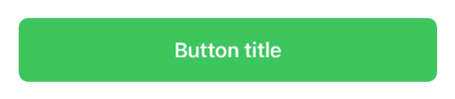
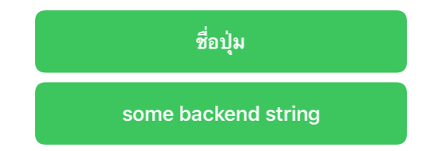

# SwiftUI:Custom Button

在[SwiftUI:可组合的视图]()中，我们已经介绍了如何做一个良好的UI设计。
在本文中，我们看下新组件`Button`该如何设计：



## 开始

为了方便，我们创建一个新的`ButtonStyle`:
```
struct FSButton: View {
  let titleKey: LocalizedStringKey
  let action: () -> Void

  init(_ titleKey: LocalizedStringKey, action: @escaping () -> Void) {
    self.titleKey = titleKey
    self.action = action
  }

  var body: some View {
    Button(action: action, label: { Text(titleKey).bold() })
      .buttonStyle(FSButtonStyle())
  }
}

private struct FSButtonStyle: ButtonStyle {
  func makeBody(configuration: Configuration) -> some View {
    HStack {
      Spacer()
      configuration.label
        .foregroundColor(.white)
      Spacer()
    }
    .padding()
    .background(
      RoundedRectangle(cornerRadius: 8, style: .continuous).fill(Color.green)
    )
    .opacity(configuration.isPressed ? 0.5 : 1)
  }
}
```

我们可以这么使用：
```
FSButton("Button title") {
  // button tap action
}
```


这是我们的预览效果，我们可以把它移植到项目中去了。

## 一周后

一周过去了，产品告诉我们，有些按钮文本将由我们的后端提供，而不是由应用程序处理。
为了使用我们当前的API，我们需要显式地将后端字符串转换为`LocalizedStringKey`:

```
var backendString: String

...

FSButton(LocalizedStringKey(backendString), action: buttonDidTap)
```
然而这并不理想：

* 我们滥用`LocalizedStringKey`
* 我们会触发一个运行时查找一个我们已经知道不会在我们的`Localizable.string`表中

处理这个问题的一种更好的方法是使用`Text`的初始化方法`init<S: StringProtocol>(_ content: S)`，其目的是显示字符串的原样，而不首先尝试对它们进行本地化。

我们需要一种方法来同时兼容这个新的初始化方法和之前的初始化方法。一种解决方法就是用一个`title` `Text`替换`FSButton`的`titleKey` `LocalizedStringKey`属性:

```
struct FSButton: View {
  let title: Text
  let action: () -> Void

  init(titleKey: LocalizedStringKey, action: @escaping () -> Void) {
    self.title = Text(titleKey)
    self.action = action
  }

  init<S: StringProtocol>(_ content: S, action: @escaping () -> Void) {
    self.title = Text(content)
    self.action = action
  }

  var body: some View {
    Button(action: action, label: { title.bold() })
      .buttonStyle(FSButtonStyle())
  }
}
```

使用这种方式，`FSButton`将动态地使用适当的初始化方法创建文本实例：
```
FSButton(titleKey: "my_localized_title", action: { ... })

var backendString: String = ...
FSButton(backendString, action: { ... })
```



> 你现在知道怎么用泰语写“Button title”了!

## 不久之后

营销团队已经听说了按钮的文本后端驱动方法，现在他们希望我们能够让他们也能驱动这样的设计:


这在我们的两个初始化方法中是不可能实现的。然而，`Text`是最灵活和动态的SwiftUI视图之一,它有一整套专门的修饰符来返回其他`Text`文本视图,甚至可以向其他`Text`文本视图添加`Text`文本视图，结果仍然是另一个`Text`文本:

```
let text: Text =
  Text("Default ") +
  Text("italic ").italic() +
  Text("Big ").font(.title) +
  Text("Red ").foregroundColor(.red) +
  Text("underline").underline()
```
因此，为了支持这个新需求，从`FSButton`的角度来看，我们需要做的就是公开一个新的初始化方法接受一个`Text`:
```
extension FSButton {
  init(_ title: Text, action: @escaping () -> Void) {
    self.title = title
    self.action = action
  }
}
```
这使得创建视图成为可能，例如


有了这个初始化器，我们可以完全覆盖按钮文本的默认样式，使用不同的字体、粗细、文本颜色等，从而展示各种新的按钮样式。

## 结束

最终代码如下：
```
import SwiftUI

struct ContentView: View {
  var backendString: String = "some backend string"

  var body: some View {
    let marketingText: Text =
      Text("Please please ").italic() +
      Text("tap me ") +
      Text("NOW!").underline().bold().font(.title)

    let exampleText: Text =
      Text("Default ") +
      Text("italic ").italic() +
      Text("Big ").font(.title) +
      Text("Red ").foregroundColor(.red) +
      Text("underline").underline()

    VStack {
      FSButton(titleKey: "my_localized_title") {}
      FSButton(backendString) {}
      FSButton(marketingText) {}
      FSButton(exampleText) {}
    }
    .padding()
  }
}

struct ContentView_Previews: PreviewProvider {
  static var previews: some View {
    ContentView()
      .padding()
      .previewLayout(.sizeThatFits)
      .environment(\.locale, .init(identifier: "th"))
  }
}
```

自定义FSButton：
```
struct FSButton: View {
  let title: Text
  let action: () -> Void

  init(_ title: Text, action: @escaping () -> Void) {
    self.title = title
    self.action = action
  }

  init<S: StringProtocol>(_ content: S, action: @escaping () -> Void) {
    self.title = Text(content)
    self.action = action
  }

  init(titleKey: LocalizedStringKey, tableName: String? = nil, bundle: Bundle? = nil, comment: StaticString? = nil, action: @escaping () -> Void) {
    self.title = Text(titleKey, tableName: tableName, bundle: bundle, comment: comment)
    self.action = action
  }

  var body: some View {
    Button(action: action, label: { title.bold() })
      .buttonStyle(FSButtonStyle())
  }
}

private struct FSButtonStyle: ButtonStyle {
  func makeBody(configuration: Configuration) -> some View {
    HStack {
      Spacer()
      configuration.label
        .foregroundColor(.white)
      Spacer()
    }
    .padding()
    .background(
      RoundedRectangle(cornerRadius: 8, style: .continuous).fill(Color.green)
    )
    .opacity(configuration.isPressed ? 0.5 : 1)
  }
}
```

## 总结

构建显示文本的SwiftUI组件可能比预期的要复杂，然而，我们这边只需很少的工作就可以覆盖大多数用例。
我们在这里看到的同样的方法和思考过程也被应用到许多swiftUI视图定义中，不同的视图会暴露不同的初始化方法。

如果你正在寻找类似方案，以下是SwiftUI使用这种方法的一些思路：`Button`, `ColorPicker`, `CommandMenu`, `DatePicker`, `DisclosureGroup`, `Label`, `Link`, `Menu`, `NavigationLink`, `Picker`, `ProgressView`, `SecureField`, `Stepper`, `TextField`, `Toggle`, `WindowGroup`。还有一些modifiers修饰词，如`navigationTitle`。


