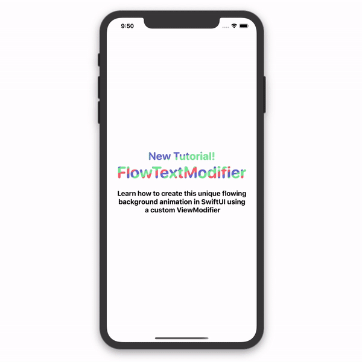
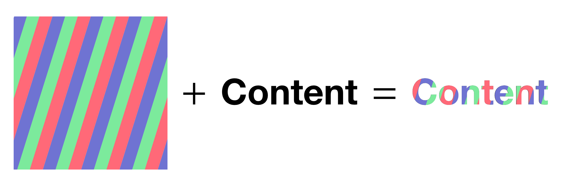
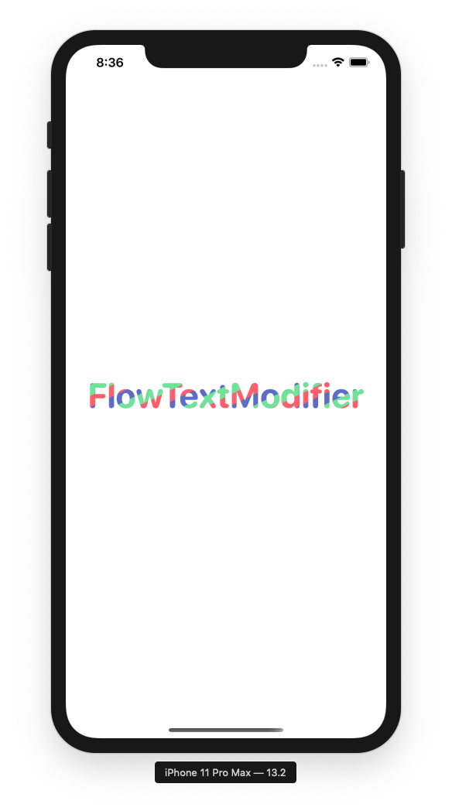
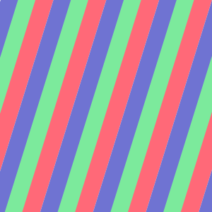
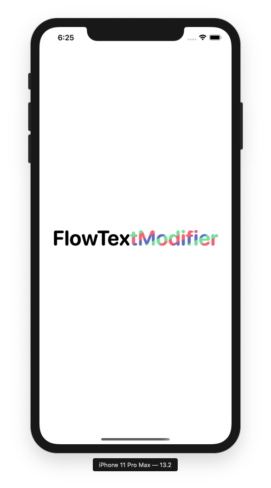

# SwiftUI：FlowTextModifier自定义的ViewModifier

快速浏览一下我们今天要创建的内容。在本教程结束时，您将能够使用自定义的`ViewModifier`将这种“流”效果添加到SwiftUI应用程序的任何文本中。请看下面的例子。
<!--- https://trailingclosure.com/  --->

```
Text("FlowTextModifier")
    .modifier(FlowTextModifier(background: Image("TestImage")))
```
就这么简单!



## 开始
在本教程中，我们将只创建一个文件，所以可以在当前项目或本教程的新项目中进行测试。首先，创建一个名为`FlowTextModifier`的新类，并确保它继承自`ViewModifier`类。还要确保实现`body`函数并按目前的情况返回`content`。
以下是我们目前应该拥有的:
```
public struct FlowTextModifier: ViewModifier {

    public func body(content: Content) -> some View {
        content
    }

}
```
我们的`ViewModifier`的工作方式是，我们将为它提供一个背景图像，它将在`content`的上面从左到右移动。这会给它一个流畅的动画。然后，为了确保传入`content`的可见性，我们将遮罩此图像。



在我们遮罩一个`Image`之前，我们需要再创建一个。因此，为`FlowTextModifier`创建一个`init`函数，并让它接收一个`Image`作为参数。
```
var image:Image

init(background: Image) {
    self.image = background
}
```

## 修改content
我们现在要添加这个蒙版图像作为覆盖。让我们开始吧。
```
public func body(content: Content) -> some View {
    content
        .overlay(
            // Masked Content Here
        )
}
```
然后，我们将添加一个`GeometryReader`作为`overlay`的根`View`。这将帮助我们稍后计算覆盖层的移动。
```
public func body(content: Content) -> some View {
    content
        .overlay(
            GeometryReader { geo in
                // Masked Content Here
            }
        )
}

```
这包含我们之前定义的`image`图像。我们将其调整为`resizable()`，以便随传入的`content`内容而增长。此外，我们已经用传入的`content`遮罩在图像上。

```
public func body(content: Content) -> some View {
    content
        .overlay(
            GeometryReader { geo in
                // Masked Content Here
                self.image()
                    .resizable()
                    .mask(content)
            }
        )
}
```



使用此代码和图像，如果您想在您的模拟器上尝试它!
```
import SwiftUI

struct FlowTextTest: View {
    var body: some View {
        Text("FlowTextModifier")
        .font(Font.system(size: 45, weight: .bold, design: .rounded))
        .modifier(FlowTextModifier(background: Image("FlowTextTestBackground")))
    }
}
```



## 为Text添加动画
接下来我们要开始制作背景动画。我们要做的是创建一个计时器，它每秒钟触发一次，改变图像的`offset`偏移量。

### 修改Image Offset
为了跟踪偏移量，我们需要创建一个`@State`变量来跟踪它。在定义`image`变量的旁边，继续添加一个`offset`变量。
```
public struct FlowTextModifier: ViewModifier {
    
    var image:Image
    @State var offset:CGPoint = .zero
    
    //...
    
}
```

然后使用这个新的偏移更新我们的图像.
```
public func body(content: Content) -> some View {
    content
        .overlay(
            GeometryReader { geo in
                // Masked Content Here
                self.image()
                    .resizable()
                    .offset(x: self.offset.x, y: self.offset.y)
                    .mask(content)
            }
        )
}
```

### 创建定时器
现在将计时器添加到类的顶部。这将每秒钟发布一次更新，然后我们将使用它来改变我们的`image`的偏移量。
```
public struct FlowTextModifier: ViewModifier {
    
    var image:Image
    @State var offset:CGPoint = .zero
    let timer = Timer.publish(every: 1, on: .main, in: .common).autoconnect()

    // ...
    
}
```
现在通过编辑代码来接收`body`内的更新。

```
public func body(content: Content) -> some View {
    content
        .overlay(
            GeometryReader { geo in
                // Masked Content Here
                self.image()
                    .resizable()
                    .offset(x: self.offset.x, y: self.offset.y)
                    .mask(content)
                    .onReceive(self.timer) { _ in
                        // 在这里更新偏移量
                    }
            }
        )
}
```

### 计算偏移量
为了让计算偏移量变得更容易，我们将创建一个函数，每次`Timer`被触发时都会调用它。

```
func getNextOffset(size: CGSize, offset: CGPoint) -> CGPoint {
    var nextOffset = offset

    if nextOffset.x + (size.width / 10.0) > size.width {
        nextOffset.x = 0
    } else {
        nextOffset.x += size.width / 10.0
    }
    return nextOffset
}
```
它所做的是通过`GeometryReader`接收内容的大小以及当前偏移量。然后，它向前移动下一个偏移量，即视图宽度的十分之一。你可以根据自己的喜好修改这里。

### 使用getNextOffset函数
```
public func body(content: Content) -> some View {
    content
        .overlay(
            GeometryReader { geo in
                // Masked Content Here
                self.image()
                    .resizable()
                    .offset(x: self.offset.x, y: self.offset.y)
                    .mask(content)
                    .onReceive(self.timer) { _ in
                        // 在这里更新偏移量
                        let newOffset = self.getNextOffset(size: geo.size, offset: self.offset)
                            
                        if newOffset == .zero {
                            self.offset = newOffset
                            withAnimation(.linear(duration: 1)) {
                                self.offset = self.getNextOffset(size: geo.size, offset: newOffset)
                            }
                        } else {
                            withAnimation(.linear(duration: 1)) {
                                self.offset = newOffset
                            }
                        }
                    }
            }
        )
}
```

让我们快速地过一遍。在第一部分中，我使用`getNextOffset`函数获取新的偏移量。然后决定下一个偏移量是否在0处。我们这样做是为了选择是否将变化动画化。如果你能想象，当图像移动到内容的末尾时，它需要快速回到开始重播。我们不想让这个变化变成动画，因为那样看起来动画是反向播放的。因此，我们在第一个`if`中设置偏移量为`.zero`，然后获取下一个偏移量来继续动画。`else`的情况是图片正常移动和动画的所有其他时间。

继续并运行您的项目来查看我们的流动文本的展示情况



看起来有些地方不太对劲。我们的图像是动画了，然而，当它移出视图，它显示下面的文本。这里需要简单的修改一下。

### 添加copy的Image
将您的图像包装在一个`ZStack`中，并将图像的副本放在我们原来的上面。然后我们将添加一个蒙版，使它的大小像第一个一样，除了我们不会使用完全相同的偏移量。我们将使它跟踪原始图像正好是我们的内容的宽度。参见下面的代码。
```

public func body(content: Content) -> some View {
    content
        .overlay(
            GeometryReader { geo in
                ZStack(alignment: .center) {
                    self.image
                        .resizable()
                        .offset(x: self.offset.x - geo.size.width, y: self.offset.y)
                        .mask(content)
                    self.image
                        .resizable()
                        .offset(x: self.offset.x, y: self.offset.y)
                        .mask(content)
                        .onReceive(self.timer) { _ in
                            // 在这里更新偏移量
                            let newOffset = self.getNextOffset(size: geo.size, offset: self.offset)

                            if newOffset == .zero {
                                self.offset = newOffset
                                withAnimation(.linear(duration: 1)) {
                                    self.offset = self.getNextOffset(size: geo.size, offset: newOffset)
                                }
                            } else {
                                withAnimation(.linear(duration: 1)) {
                                    self.offset = newOffset
                                }
                            }
                        }
                }
            }
        )
}
```
现在它正常了，你可以随意使用它，尝试不同的背景、文本或视图!

