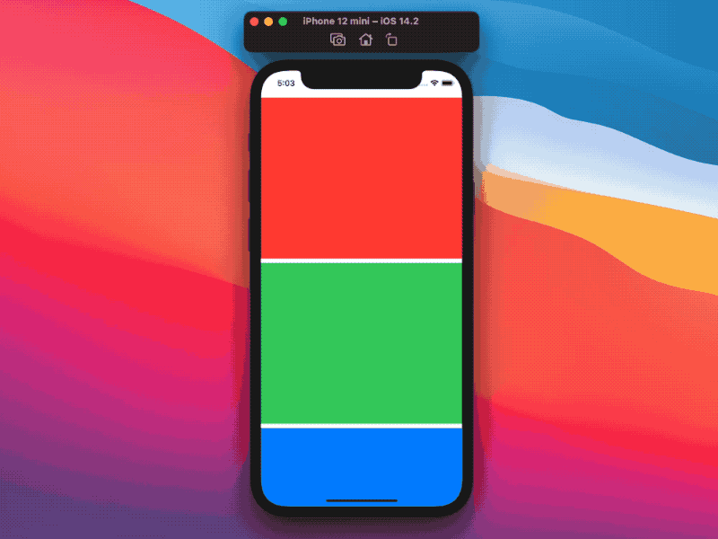
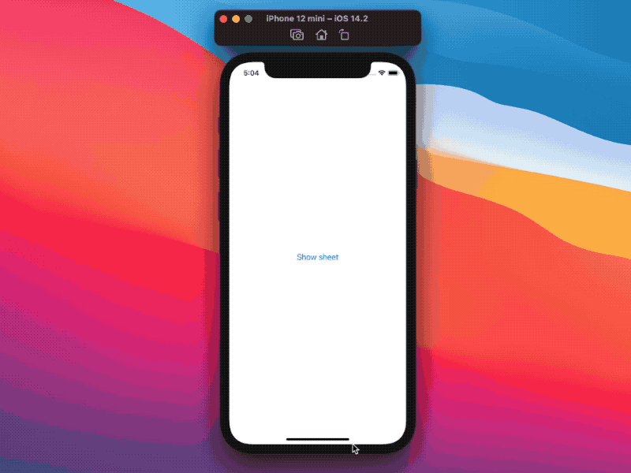

# SwiftUI：Introspect

在开发应用时，SwiftUI提高了开发效率。
SwiftUI大概可以满足任何现代应用程序需求的95%，而剩下的5%则是通过退回到以前的UI框架。
我们有两种主要的回退方法:

* SwiftUI的 `UIViewRepresentable`/`NSViewRepresentable`
* SwiftUI Introspect

## 什么是SwiftUI Introspect
SwiftUI Introspect是一个开源库。它的主要目的是获取和修改任何SwiftUI视图的底层UIKit或AppKit元素。

这是可能的，因为许多SwiftUI视图(仍然)依赖于它们的UIKit，例如:

* 在macOS中，`Button`在幕后使用`NSButton`
* 在iOS中，`TabView`在幕后使用`UITabBarController`

我们很少需要知道这样的实现细节。然而，知道这一点给了我们另一个强大的工具，我们可以在需要的时候使用。这正是SwiftUI `Introspect`发挥作用的地方。


## SwiftUI Introspect的使用
SwiftUI Introspect在`func introspectX(customize: @escaping (Y) -> ()) -> some View`模式之后提供了一系列视图修饰符，其中:

* `X`是我们的目标视图
* `Y`是底层的UIKit/AppKit视图/视图控制器类型

假设我们想要从`ScrollView`中移除弹性效果。目前，SwiftUI没有相应的API或修饰符允许我们这样做。
`ScrollView`在底层使用UIKit的`UIScrollView`。我们能使用Introspect的`func introspectScrollView(customize: @escaping (UIScrollView) -> ()) -> some View`方法获取底层的`UIScrollView`，并禁用弹性效果:
```
import Introspect
import SwiftUI

struct ContentView: View {
  var body: some View {
    ScrollView {
      VStack {
        Color.red.frame(height: 300)
        Color.green.frame(height: 300)
        Color.blue.frame(height: 300)
      }
      .introspectScrollView { $0.bounces = false }
    }
  }
}
import Introspect
import SwiftUI

struct ContentView: View {
  var body: some View {
    ScrollView {
      VStack {
        Color.red.frame(height: 300)
        Color.green.frame(height: 300)
        Color.blue.frame(height: 300)
      }
      .introspectScrollView { $0.bounces = false }
    }
  }
}
```



在iOS系统中，用户可以通过向下滑动表单来关闭表单。在UIKit中，我们可以通过`isModalInPresentation` `UIViewController`属性阻止这种行为，让我们的应用程序逻辑控制表单的显示。在SwiftUI中，我们还没有类似的方法。

同样，我们可以使用Introspect来抓取呈现表`UIViewController`，并设置`isModalInPresentation`属性:
```
import Introspect
import SwiftUI

struct ContentView: View {
  @State var showingSheet = false

  var body: some View {
    Button("Show sheet") { showingSheet.toggle() }
      .sheet(isPresented: $showingSheet) {
        Button("Dismiss sheet") { showingSheet.toggle() }
          .introspectViewController { $0.isModalInPresentation = true }
      }
  }
}
```



其他的例子:

* 列表`List`添加[下拉刷新]()
* `TextField`添加[toolbars]()

想象一下，由于SwiftUI的一个小功能缺失，我们不得不在UIKit/AppKit中重新实现一个完整的复杂功能:Introspect是一个不可思议的时间节省器。

我们已经看到了它的明显好处:接下来，让我们揭开SwiftUI Introspect是如何工作的。

## SwiftUI Introspect如何工作的
我们将采用UIKit路径:除了UI/NS前缀，AppKit的代码是相同的。

为了清晰起见，本文中所示的代码进行了轻微的调整。最初的实现可以在SwiftUI Introspect的[存储库](https://github.com/siteline/SwiftUI-Introspect)中找到。

### injection注入
正如上面的例子所示，Introspect为我们提供了各种视图修饰符。如果我们看看它们的实现，它们都遵循类似的模式。这里有一个例子:
```
extension View {
  /// Finds a `UITextView` from a `TextEditor`
  public func introspectTextView(
    customize: @escaping (UITextView) -> ()
  ) -> some View {
    introspect(
      selector: TargetViewSelector.siblingContaining, 
      customize: customize
    )
  }
}
```
所有这些公共`introspectX(customize:)`视图修饰符都是一个更通用的`introspect(selector:customize:)`的方便实现:
```
extension View {   
  /// Finds a `TargetView` from a `SwiftUI.View`
  public func introspect<TargetView: UIView>(
    selector: @escaping (IntrospectionUIView) -> TargetView?,
    customize: @escaping (TargetView) -> ()
  ) -> some View {
    inject(
      UIKitIntrospectionView(
        selector: selector,
        customize: customize
      )
    )
  }
}
```

这里我们看到另一个介绍`inject(_:)``View`试图修饰符，和第一个`Introspect`试图，`UIKitIntrospectionView`:
```
extension View {
  public func inject<SomeView: View>(_ view: SomeView) -> some View {
    overlay(view.frame(width: 0, height: 0))
  }
}
```
`inject(_:)`采用我们的原始视图，并在顶部添加一个给定视图的覆盖层，其框架最小化。

例如，如果我们有以下视图:
```
TextView(...)
  .introspectTextView { ... }
```

最后的视图将是:
```
TextView(...)
  .overlay(UIKitIntrospectionView(...).frame(width: 0, height: 0))
```

接下来让我们看看`UIKitIntrospectionView`:

```
public struct UIKitIntrospectionView<TargetViewType: UIView>: UIViewRepresentable {
  let selector: (IntrospectionUIView) -> TargetViewType?
  let customize: (TargetViewType) -> Void

  public func makeUIView(
    context: UIViewRepresentableContext<UIKitIntrospectionView>
  ) -> IntrospectionUIView {
    let view = IntrospectionUIView()
    view.accessibilityLabel = "IntrospectionUIView<\(TargetViewType.self)>"
    return view
  }

  public func updateUIView(
    _ uiView: IntrospectionUIView,
    context: UIViewRepresentableContext<UIKitIntrospectionView>
  ) {
    DispatchQueue.main.async {
      guard let targetView = self.selector(uiView) else { return }
      self.customize(targetView)
    }
  }
}
```

`UIKitIntrospectionView`是`Introspect`到UIKit的桥梁，它做两件事:

* 在`UIView`层次结构中注入一个`IntrospectionUIView`
* 对`UIViewRepresentable`具象的`updateUIView`生命周期事件做出反应

这是`IntrospectionUIView`的定义:
```
public class IntrospectionUIView: UIView {
  required init() {
    super.init(frame: .zero)
    isHidden = true
    isUserInteractionEnabled = false
  }
}
```
`IntrospectionUIView`是一个最小的、隐藏的、非交互的`UIView`:它的全部目的是给SwiftUI Introspect一个进入UIKit层次结构的入口点。

总之，所有的`.introspectX(customize:)`视图修改器覆盖了一个微小的，不可见的，非交互的视图在我们的原始视图之上，确保它不会影响我们最终的UI。


### 实现原理
我们已经看到了SwiftUI Introspect是如何获取UIKit层次结构的。库剩下要做的就是找到我们要找的UIKit视图或视图控制器。

回到`UIKitIntrospectionView`的实现中，神奇的事情发生在`updateUIView(_:context)`中，这是`UIViewRepresentable`生命周期方法:
```
public struct UIKitIntrospectionView<TargetViewType: UIView>: UIViewRepresentable {
  let selector: (IntrospectionUIView) -> TargetViewType?
  let customize: (TargetViewType) -> Void

  ...

  public func updateUIView(
    _ uiView: IntrospectionUIView,
    context: UIViewRepresentableContext<UIKitIntrospectionView>
  ) {
    DispatchQueue.main.async {
      guard let targetView = self.selector(uiView) else { return }
      self.customize(targetView)
    }
  }
}
```

在`UIKitIntrospectionView`的例子中，这个方法主要在两个场景中被SwiftUI调用:

* 当`IntrospectionUIView`即将被添加到视图层次结构时
* 当`IntrospectionUIView`要从视图层次结构中移除时

`async`dispatch有两个函数:

1. 如果方法被调用时,视图将被添加到视图层次结构,我们需要等待当前runloop周期完成之前,我们的观点是说(到视图层次),那时,也只有到那时,我们就可以开始寻找我们的目标视图
2. 如果在视图即将从视图层次结构中删除时调用该方法，则等待runloop循环完成可确保视图已被删除(从而使搜索失败)

当SwiftUI触发`updateUIView(_:context)`这个方法时，`UIKitIntrospectionView`调用`selector`方法我们从最初的便利修饰符实现中继承过来的方法:
`selector`有一个`(IntrospectionUIView) -> TargetViewType?`方法签名。它接受`Introspect`的`IntrospectionUIView`的视图作为输入，并返回一个可选的`TargetViewType`，这是我们想要达到的原始视图或视图控制器类型的通用表示。

如果搜索成功，我们就调用`customize`，这是我们在视图上应用Introspect的视图修改器时传递或定义的方法，从而对底层的UIKit/AppKit视图或视图控制器进行更改。

回到我们的`introspectTextView(customize:)`示例，我们通过`TargetViewSelector.siblingContaining`来传递`selector`选择器：
```
extension View {
  /// Finds a `UITextView` from a `TextEditor`
  public func introspectTextView(
    customize: @escaping (UITextView) -> ()
  ) -> some View {
    introspect(
      selector: TargetViewSelector.siblingContaining, 
      customize: customize
    )
  }
}
```
`TargetViewSelector`是一个Swift的`enum`类型，使它成为一个静态方法的容器，意味着可以直接调用，所有的`TargetViewSelector`方法都或多或少的遵循相同的模式，像我们的`siblingContaing(from:)`:
```
public enum TargetViewSelector {
  public static func siblingContaining<TargetView: UIView>(from entry: UIView) -> TargetView? {
    guard let viewHost = Introspect.findViewHost(from: entry) else {
      return nil
    }
    return Introspect.previousSibling(containing: TargetView.self, from: viewHost)
  }

  ...
}
```

第一步是找到一个视图的持有者(宿主):
SwiftUI将每个`UIViewRepresentable`视图包装在一个宿主视图中,与`PlatformViewHost<PlatformViewRepresentableAdaptor<IntrospectionUIView>>`有关的,然后封装到一个类型为`_UIHostingView`的“托管视图”中，表示一个能够托管SwiftUI视图的`UIView`。


为了获得视图持有者，Introspect从另一个无`Introspect` `enum`中使用`findViewHost(from:)`静态方法:
```
enum Introspect {
  public static func findViewHost(from entry: UIView) -> UIView? {
    var superview = entry.superview
    while let s = superview {
      if NSStringFromClass(type(of: s)).contains("ViewHost") {
        return s
      }
      superview = s.superview
    }
    return nil
  }

  ...
}
```
这个方法从我们的`IntrospectionUIView`开始，递归地查询每个`superview`父视图，直到找到一个视图持有者：如果我们找不到视图宿主，我们的`IntrospectionUIView`还不是屏幕层次结构的一部分，我们的查找会立即停止。


一旦我们有了视图的宿主，我们有了寻找目标视图的起点，这就是`TargetViewSelector.siblingContaing`做的通过下面的`Introspect.previousSibling(containing: TargetView.self, from: viewHost)`命令：

```
enum Introspect {
  public static func previousSibling<AnyViewType: UIView>(
    containing type: AnyViewType.Type,
    from entry: UIView
  ) -> AnyViewType? {

    guard let superview = entry.superview,
          let entryIndex = superview.subviews.firstIndex(of: entry),
          entryIndex > 0
    else {
      return nil
    }

    for subview in superview.subviews[0..<entryIndex].reversed() {
      if let typed = findChild(ofType: type, in: subview) {
        return typed
      }
    }

    return nil
  }

  ...
}
```

这个新的静态方法接受所有`viewHost`的父视图的子视图(也就是`viewHost`的兄弟视图)，过滤在`viewHost`之前的子视图，然后递归地搜索我们的目标视图(作为`type`参数传递)，从最近的到最远的兄弟视图，通过最终的`findChild(ofType:in:)`方法:

```
enum Introspect {
  public static func findChild<AnyViewType: UIView>(
    ofType type: AnyViewType.Type,
    in root: UIView
  ) -> AnyViewType? {
    for subview in root.subviews {
      if let typed = subview as? AnyViewType {
        return typed
      } else if let typed = findChild(ofType: type, in: subview) {
        return typed
      }
    }
    return nil
  }

  ...
}
```
这个方法，通过传递我们的目标视图和一个我们的`viewHost`兄弟调用，将遍历每个兄弟完整子树视图层次结构，寻找我们的目标视图，并返回第一个匹配的对象，如果有的话。

## 分析

既然我们已经揭示了SwiftUI Introspect的所有内部工作原理，那么回答常见的问题就容易多了:

#### 它使用安全吗？
只要我们不做太大胆的事，是安全的。重要的是要明白我们并不拥有底层的AppKit/UIKit视图，而SwiftUI拥有。通过Introspect应用的更改应该可以工作，但是SwiftUI可能会在不通知的情况下随意覆盖它们。

#### 这是未来的趋势吗?
不。随着SwiftUI的发展，当新的操作系统版本出现时，情况可能会发生变化。当这种情况发生时，库会更新新的补丁，但是我们的用户需要在看到修复之前更新应用程序。

#### 我们应该使用它吗?
答案可能是肯定的。任何读过这篇文章的人都完全了解库是如何工作的:如果有什么东西坏了，我们应该知道去哪里找并找到解决办法。

#### SwiftUI Introspect的亮点在哪里?
向后兼容性。例如，让我们想象一下，iOS15 List引入了下拉刷新的功能：我们知道SwiftUI Introspect允许我们在iOS13和14中添加列表[下拉刷新(Introspect方法设置下拉刷新)](https://github.com/zhuzhuxingtianxia/GitBlog/blob/master/2021/SwiftUI-RefreshUI/SwiftUI-RefreshUI.md)。到那时，我们可以使用Introspect针对旧的操作系统版本，并使用新的SwiftUI方式针对iOS15或更高版本。

这样做可以保证不会出现问题，因为新的操作系统版本将使用SwiftUI的“原生”方法，只有过去的iOS版本才会使用Introspect。

#### 什么时候不用SwiftUI Introspect?
当我们想要完全控制一个视图，并且无法承受与新OS版本的冲突时:如果这是我们的情况，使用`UIViewRepresentable/NSViewRepresentable`会更安全、更有前瞻性。当然，我们应该总是尽可能地先找到一个“纯粹的”SwiftUI方法，只有当我们确信这是不可能的时候，才去寻找替代方法。


## 结论

SwiftUI Introspect是为数不多的可能是任何SwiftUI应用程序必须拥有的库之一。它的执行优雅、安全，它的优点远远大于将其作为依赖项添加的缺点。


当向我们的项目添加一个依赖项时，我们应该尽可能地理解这个依赖项是做什么的，我希望这篇文章能帮助你做到这一点。

