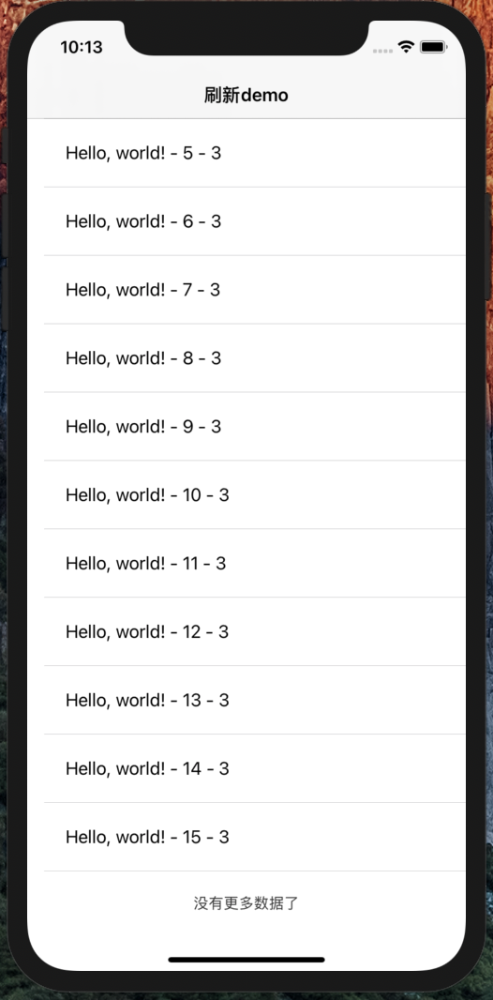

# SwiftUI:刷新组件RefreshUI之桥接UIKit
在这篇文章中我们将把下拉刷新和上拉加载功能合并到一个自定义组件`RefreshUI`。在UIKit中`UIScrollView`自带`refreshControl`下拉刷新功能。我们只需要在合适的时机做一下状态处理即可，具体可参看[SwiftUI:List下拉刷新之桥接UIKit](https://www.jianshu.com/p/0190bfaa0949https://www.jianshu.com/p/0190bfaa0949)。
但是上拉加载就需要我们自己去处理了，在一些第三方的刷新组件中，下拉刷新和上拉加载功能都是采用自定义的方式。我们在这里参考三方组件中上拉加载功能的一些思路，做一个简单的上拉加载功能。

最终效果如下：



## 设计理想的调用方式
在使用第三方组件的时候，用起来是很方便的。为了让我们的SwiftUI也可以使用简单方便的api，我们想要最终的调用方式如下：
```
 List(array, id: \.self) { text in
      Text(text).padding()
}
.addRefreshHeader(isRefreshing: $isRefreshing)
.addRefreshFooter(isLoadingMore: $isLoadingMore,
                  noMoreText:page >= totalPage ? "没有更多数据了":nil)
```


## 使用场景
刷新一般都是配合网络请求一起使用的。当`List`数据量比较多的时候我们一般会采用分页的方式批量获取数据，然后再进行渲染操作。在这里我们就模拟一下网络请求的方式，记录当前的分页`page`,和获取的总页数`totalPage`。模型`Model`代码如下：
```
class ModelObject: ObservableObject {
    @Published var isRefreshing: Bool = false {
        didSet {
            if isRefreshing {
                self.page = 1
                //刷新发起网络请求
                requestData(self.page)
            }
        }
    }
    @Published var isLoadingMore: Bool = false {
        didSet {
            if isLoadingMore {
                if self.page < totalPage {
                    self.page += 1
                }else{
                    self.isLoadingMore = false
                    return
                }
                //刷新发起网络请求
                requestData(self.page)
            }
        }
    }
    
    @Published var array:[String] = []
    
    var page:Int = 1
    let totalPage: Int = 3
    
    func requestData(_ page:Int = 1) {
        DispatchQueue.main.asyncAfter(deadline: .now() + 2.0) {
            if page == 1 {
                self.array = Array(0...15).map { "Hello, world! - \($0) - \(page)" }
            }else {
                let items = Array(0...15).map { "Hello, world! - \($0) - \(page)" }
                self.array.append(contentsOf: items)
            }
            self.isRefreshing = false
            self.isLoadingMore = false
        }
    }
}
```

在这里我们同时订阅了`isRefreshing` `isLoadingMore`和`array`,当它们发生变化时，将会触发网络请求和界面渲染。

SwiftUI界面调用就变得简单了：
```
struct ListView: View {
    @ObservedObject var modelObject = ModelObject()
    
    init() {
        modelObject.requestData()
    }
    
    var body: some View {
        NavigationView {
            List(modelObject.array, id: \.self) { text in
                Text(text).padding()
          }
          .addRefreshHeader(isRefreshing: $modelObject.isRefreshing)
          .addRefreshFooter(isLoadingMore: $modelObject.isLoadingMore,
                            noMoreText:modelObject.page >= modelObject.totalPage ? "没有更多数据了":nil)
          .navigationBarTitle("刷新demo")
        }
    }
}
```

## 自定义修饰符
下面我们看下`addRefreshHeader`和`addRefreshFooter`修饰符，这其实就是对View视图的一个扩展：
```
extension View {
    func addRefreshHeader(isRefreshing: Binding<Bool>,
                          action: (() -> Void)? = nil) -> some View {
        
        self.background(RefreshUI(style: .header, isRefreshing: isRefreshing, action: action))
        
      }
    
    func addRefreshFooter(isLoadingMore: Binding<Bool>,
                          noMoreText:String?,
                          action: (() -> Void)? = nil) -> some View {
        
        self.background(RefreshUI(style: .footer,
                                  isRefreshing: isLoadingMore,
                                  noMoreText: noMoreText,
                                  action: action))
        
      }
}
```
从上面的扩展方法我们可以看到，其实最核心的部分是我们的自定义组件`RefreshUI`。

## RefreshUI

* 我们给它设置了`style`类型，定义是下拉刷新还是上拉加载：
```
extension RefreshUI {
    public enum Style {
        case header, footer
    }
}
```
在这里我们给`RefreshUI`扩展了一个枚举类型。

* 参数`isRefreshing`用来控制状态的改变，我们使用`Binding<Bool>`来修饰。
* `action`当状态发生改变时的回调方法
* `noMoreText`当`style`类型为`footer`时，数据全部加载完的提示消息

完整的代码如下：
```
//刷新组件
struct RefreshUI: UIViewRepresentable {
    @Binding var isRefreshing: Bool
    let action: (() -> Void)?
    let noMoreText:String?
    private let style: Style
    
    init(style: Style, isRefreshing: Binding<Bool>,
         noMoreText:String? = nil,
         action: (() -> Void)? = nil) {
        self.style = style
        _isRefreshing = isRefreshing
        self.noMoreText = noMoreText
        self.action = action
    }
    
    func makeUIView(context: Context) -> some UIView {
        let uiView = UIView(frame: .zero)
        return uiView
    }
    
    func updateUIView(_ uiView: UIViewType, context: Context) {
        DispatchQueue.main.asyncAfter(deadline: .now()) {
            guard let viewHost = uiView.superview?.superview else {
                return
            }
            guard let scrollView = self.scrollView(root: viewHost) else {
                return
            }
            if style == .header {
                if let refreshControl = scrollView.refreshControl {
                    context.coordinator.resetFooter(scrollView)
                    if self.isRefreshing {
                        refreshControl.beginRefreshing()
                    } else {
                        refreshControl.endRefreshing()
                    }
                    
                }else {
                    let refreshControl = UIRefreshControl()
                    scrollView.refreshControl = refreshControl
                    context.coordinator.setupObserver(scrollView)
                }
            }else if style == .footer {
                context.coordinator.noMoreText = noMoreText
                context.coordinator.setupObserver(scrollView)
            }
            
            
        }
    }
    
    static func dismantleUIView(_ uiView: UIView, coordinator: Coordinator) {
        coordinator.clearObserver()
    }
    
}
```

`Coordinator`创建和处理部分则把他们放在了`RefreshUI`的扩展部分：
```
extension RefreshUI {
    func makeCoordinator() -> Coordinator {
        return Coordinator(style, isRefreshing: $isRefreshing,
                           noMoreText:noMoreText,
                           action:action)
    }
    
    class Coordinator {
        let style: Style
        var isRefreshing: Binding<Bool>
        var noMoreText:String?
        let action: (() -> Void)?
        private var offsetToken: NSKeyValueObservation?
        private var stateToken: NSKeyValueObservation?
        private var sizeToken: NSKeyValueObservation?
        private var initOffset:CGFloat = 0
        private var initInsetBottom:CGFloat = 0
        private let height:CGFloat = 60
        private var progress: CGFloat = 0
        private var footerView:FooterView?
        
        init(_ style:Style, isRefreshing: Binding<Bool>,
             noMoreText:String?,
             action: (() -> Void)?) {
            self.style = style
            self.isRefreshing = isRefreshing
            self.noMoreText = noMoreText
            self.action = action
        }
        
    }
    
    private func scrollView(root: UIView) -> UIScrollView? {
        for subview in root.subviews {
            if subview.isKind(of: UIScrollView.self) {
                return subview as? UIScrollView
            } else if let scrollView = scrollView(root: subview) {
                return scrollView
            }
        }
        return nil
    }
    
}

```
交互处理逻辑部分也单独做了扩展：
```
private extension RefreshUI.Coordinator {
    func resetFooter(_ scrollView: UIScrollView) {
        if style == .header {
            if initInsetBottom != scrollView.contentInset.bottom, scrollView.contentOffset.y <= initOffset - height {
                scrollView.contentInset.bottom = initInsetBottom
            }
        }
        
    }
    
    func setupFooterView(_ scrollView: UIScrollView) {
        if style == .footer{
            if footerView == nil  {
                footerView = FooterView(frame:.zero)
            }
            footerView?.loadingText = noMoreText
            if noMoreText != nil && !isRefreshing.wrappedValue {
                scrollView.contentInset.bottom = initInsetBottom + self.height
            }
            
            if footerView?.isRefreshing != isRefreshing.wrappedValue && !isRefreshing.wrappedValue {
                DispatchQueue.main.async {
                    UIView.animate(withDuration: 0.3, animations: {
                        if self.noMoreText == nil {
                            scrollView.contentInset.bottom -= self.height
                        }
                        
                    }, completion: { _ in
                        
                        self.progress = 0
                        
                    })
                }
                
            }
            //isRefreshing 状态发生变化则重新赋值
            footerView?.isRefreshing = isRefreshing.wrappedValue
            
        }
        
    }

    func setupObserver(_ scrollView: UIScrollView) {
        
        setupFooterView(scrollView)
        
        if (offsetToken != nil) {
            return;
        }
        offsetToken = scrollView.observe(\.contentOffset) { [weak self] scrollView, _ in
            self?.scrollViewDidScroll(scrollView)
        }
        
        stateToken = scrollView.observe(\.panGestureRecognizer.state) {
            [weak self] scrollView,_  in
            
            guard scrollView.panGestureRecognizer.state == .ended else { return }
            
            self?.scrollViewDidEndDragging(scrollView)
        }
        
        initInsetBottom = scrollView.contentInset.bottom
        
        if style == .header {
            initOffset = scrollView.contentOffset.y
            
        }else {
            guard let footerView = footerView  else {
                return
            }
            scrollView.insertSubview(footerView, at: 0)
            sizeToken = scrollView.observe(\.contentSize) { [weak self] scrollView, _ in
                footerView.frame = CGRect(x: 0, y: scrollView.contentSize.height, width: UIScreen.main.bounds.width, height: self?.height ?? 0)
                footerView.isHidden = scrollView.contentSize.height <= scrollView.bounds.height && self?.noMoreText == nil
                
            }
        }
        
    }
    func clearObserver() {
        offsetToken?.invalidate()
        stateToken?.invalidate()
        sizeToken?.invalidate()
    }
    
    func scrollViewDidScroll(_ scrollView: UIScrollView) {
        if isRefreshing.wrappedValue { return }
        if style == .footer {
            if scrollView.contentSize.height > scrollView.bounds.height {
                progress = min(1, max(0, (scrollView.contentOffset.y + scrollView.bounds.height - scrollView.contentSize.height - scrollView.contentInsetBottom) / height))
            }
           
        }
        
    }
    
    func scrollViewDidEndDragging(_ scrollView: UIScrollView) {
        if isRefreshing.wrappedValue { return }
        
        switch style {
        case .header:
            if initOffset - scrollView.contentOffset.y < 40 {
                return
            }
        case .footer:
            if progress < 1 { return }
            if noMoreText != nil { return }
            progress = 1
            scrollView.contentInset.bottom += self.height
        }
        
        isRefreshing.wrappedValue = true
        if let actionMethod = action {
            actionMethod()
        }
        
    }
    
}

private extension UIScrollView {
    var contentInsetTop: CGFloat {
        if #available(iOS 11.0, *) {
            return contentInset.top + adjustedContentInset.top
        } else {
            return contentInset.top
        }
    }

    var contentInsetBottom: CGFloat {
        if #available(iOS 11.0, *) {
            return contentInset.bottom + adjustedContentInset.bottom
        } else {
            return contentInset.bottom
        }
    }
}

```
使用UIKit自定义的`FooterView`:
```
private class FooterView: UIView {
    var isRefreshing = false {
        didSet {
            if isRefreshing {
                indicator.startAnimating()
                label.isHidden = isRefreshing
            }else {
                indicator.stopAnimating()
                label.isHidden = loadingText == nil
            }
        }
    }
    
    let indicator = UIActivityIndicatorView(style: .medium)
    var loadingText: String? = nil {
        didSet {
            
            label.text = loadingText
            label.sizeToFit()
        }
    }

    private lazy var label: UILabel = {
        let label = UILabel()
        label.font = UIFont.systemFont(ofSize: 14)
        label.textColor = UIColor.black.withAlphaComponent(0.8)

        return label
    }()

    override init(frame: CGRect) {
        super.init(frame: frame)
        addSubview(indicator)
        addSubview(label)
    }
    
    required init?(coder: NSCoder) {
        fatalError("init(coder:) has not been implemented")
    }
    
    override func layoutSubviews() {
        super.layoutSubviews()
        label.center = CGPoint(x: bounds.midX, y: bounds.midY)
        indicator.center = CGPoint(x: bounds.midX, y: bounds.midY)
    }

}
```

最终运行效果如下：


## 总结

`refreshUI`只实现了最为基础的功能，相对于比较成熟的第三方框架来说还是不够完善的。比如如何设置自定义效果，如何设置下拉或加载的自定义视图GIF效果等。所以如果要获得更加强大的功能，可以对第三方框架二次封装转换API给SwiftUI使用。
这里仍然有个小缺陷，就是在引入自定义的UIKit中的`class`类类型视图时，使用`Preview`无法实时预览效果，但功能还是正常的。


