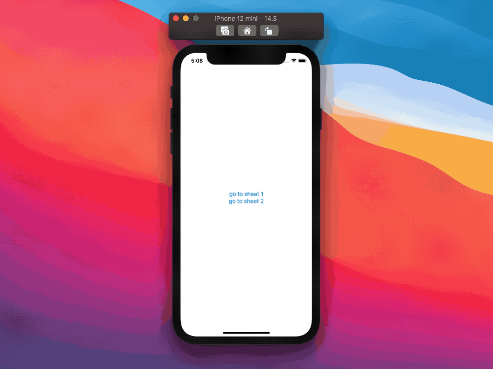
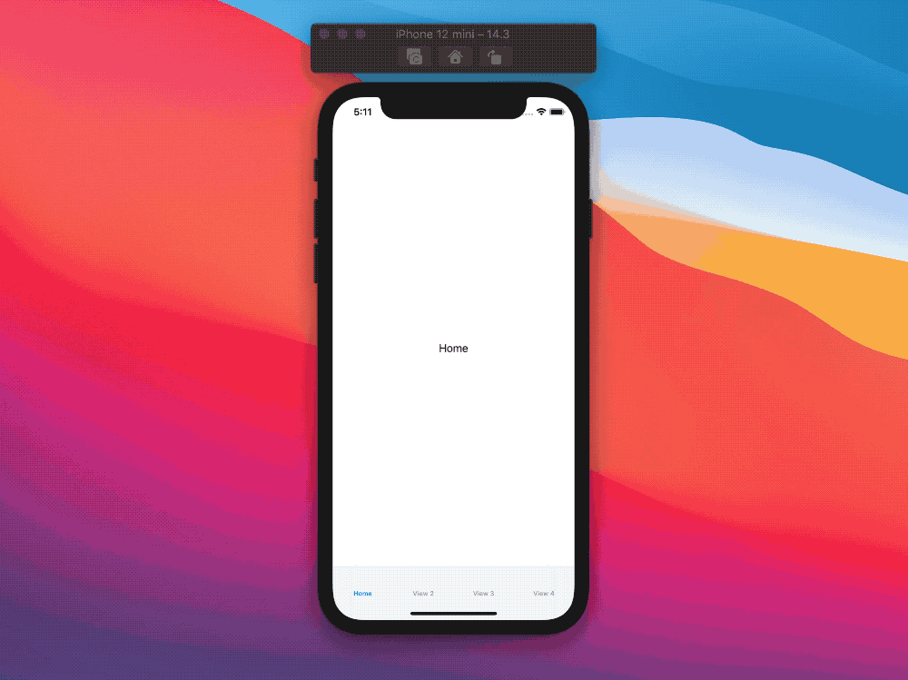
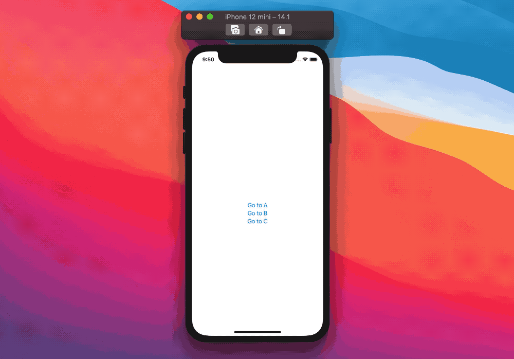

# SwiftUI:Swift协议

就像其他Swift框架一样，SwiftUI严重依赖协议作为其定义的核心部分。
在这篇新文章中，我们来看看Swift标准库协议在SwiftUI中的使用:`Hashable`, `Identifiable`, 和 `Equatable`。

## Equatable

Equatable是SwiftUI中重要的协议之一。计算布局、绘制组件等都很消耗性能的，SwiftUI通过减少绘制操作来提高性能。

SwiftUI使用`Equatable`来做出这样的决定:即使对于没有声明`Equatable`一致性的视图，SwiftUI也会通过快速反射来遍历视图定义，检查每个属性的公平性，并据此决定是否需要重新绘制。

更深入的可以查看[Equatable背后的奥秘]()

## Identifiable

当`Equatable`用于检测视图状态变化(因此触发重绘)时，`Identifiable`将视图标识与其状态分离。
例如在SwiftUI中，它用于跟踪`List`和`OutlineGroup`中元素的顺序:

* 想象一个元素列表，其中可能会发生一些重新排序。如果重新排序不涉及任何其他更改，则只需要列表更新单元格顺序，而不需要重新绘制单元格。
* 另一方面，如果只有一个单元格的状态发生了变化，但是顺序没有变化，那么只需要重新绘制特定的单元格，而列表本身不需要做任何改变。

另外一个是`Identifiable`在`Picker`中使用的例子：在这种情况下，`Identifiable`用于确定可能候选元素中的哪个元素是被选中的(如果有的话)，而不考虑元素类型定义中的其他可能状态。

最后，`Identifiable`被系统的alerts/sheets使用如下：

*	`sheet(item:onDismiss:content:)`
*	`fullScreenCover(item:onDismiss:content:)`
*	`popover(item:attachmentAnchor:arrowEdge:content:)`
*	`alert(item:content:)`
*	`actionSheet(item:content:)`

> 所有这些都提供了一个更简单的`isPresented` boolean替代方案。

使用`Identifiable`让我们不仅有机会清晰地定义可能的不同的alerts/sheets,，而且还可以在需要时传递更多数据。

想象一下有两个不同的sheets：
```
enum ContentViewSheet: Identifiable {
  case one
  case two

  var id: Int {
    switch self {
    case .one:
      return 1
    case .two:
      return 2
    }
  }
}
```

`ContentViewSheet`为每个sheet都有一个case，我们可以这样定义`sheet(item:onDismiss:content:)`:

```
struct ContentView: View {
  @State private var showingSheet: ContentViewSheet?

  var body: some View {
    VStack {
      Button("go to sheet 1") {
        showingSheet = .one
      }

      Button("go to sheet 2") {
        showingSheet = .two
      }
    }
    .sheet(item: $showingSheet, content: presentSheet)
  }

  @ViewBuilder
  private func presentSheet(for sheet: ContentViewSheet) -> some View {
    switch sheet {
    case .one:
      Text("One")
    case .two:
      Text("Two")
    }
  }
}
```

该视图显示了几个按钮，当点击这些按钮时，将触发相关工作表sheet的显示:



假设我们想要传递一个值给第二个sheet表单，这样做的方法(可能是不推荐的)是通过扩展第二个`ContentViewSheet`的case的关联值:
```
enum ContentViewSheet: Identifiable {
  case one
  case two(someData: Int) // new associated value

  /// The identity ignores the `someData` value.
  var id: Int {
    switch self {
    case .one:
      return 1
    case .two:
      return 2
    }
  }
}
```

有了`someData`，我们现在可以在创建新sheet表时传递一个`Int`值(或者任何其他值):
```
struct ContentView: View {
  ...

  var body: some View {
    VStack {
      ...

      Button("go to sheet 2") {
        showingSheet = .two(someData: Int.random(in: 1...5)) // Pass data here
      }
    }
    .sheet(item: $showingSheet, content: presentSheet)
  }

  @ViewBuilder
  private func presentSheet(for sheet: ContentViewSheet) -> some View {
    switch sheet {
      ...
    case .two(let value): // read and use the data here
      Text("Sheet two with value \(value)")
    }
  }
}
```


## Hashable

`Hashable`主要用于两个视图:`TabView`和`NavigationLink`。

让视图使用tag标签，是我们将视图声明连接到swiftUI需要监听的相关离散类型值的方式。

在`TabView`的case中，我们可以如下声明每个可能的选项卡：
```
enum Tab: Hashable {
  case home
  case view2
  case view3
  case view4
}
```
除了类型声明之外，我们现在还需要一种方法来将每个视图与每个选项卡关联起来，这是通过`tag(_:)`方法实现的:
```
struct ContentView: View {
  @State private var tabBarState: Tab = .home

  var body: some View {
    TabView(selection: $tabBarState) {
      Text("Home")
        .tabItem { Text("Home") }
        .tag(Tab.home)

      Text("View 2")
        .tabItem { Text("View 2") }
        .tag(Tab.view2)

      Text("View 3")
        .tabItem { Text("View 3") }
        .tag(Tab.view3)

      Text("View 4")
        .tabItem { Text("View 4") }
        .tag(Tab.view4)
    }
  }
}
```



以类似的方式，我们为每个可能的目标声明一个新的`NavigationLink`:
```
enum ContentViewNavigation: Hashable {
  case a // destination a
  case b // destination b
  case c // destination a
}

struct ContentView: View {
  @State var showingContent: ContentViewNavigation?

  var body: some View {
    NavigationView {
      VStack {
        NavigationLink("Go to A", destination: Text("A"), tag: .a, selection: $showingContent)
        NavigationLink("Go to B", destination: Text("B"), tag: .b, selection: $showingContent)
        NavigationLink("Go to C", destination: Text("C"), tag: .c, selection: $showingContent)
      }
    }
  }
}
```



虽然这种标签方法对`TabView`来说是完全有意义的，但由于`NavigationLink`的存在，这也是目前在应用程序中控制导航的最先进的方法。当我们想要将数据传递到目标视图时，这就变得很麻烦了，尤其是通过编程的方式(深度链接，有人知道吗?)

这可能是从UIKit到SwiftUI最尴尬的地方，我相信SwiftUI团队选择这条路线只是为了导航，而不是其他所有视图演示中使用的`Identifiable`方法(如上所示)，但我也希望我们在未来能看到一些改进。

## 总结

就像我们需要掌握和理解Objective-C，如何真正理解UIKit一样，学习和理解SwiftUI也需要我们去学习和理解Swift:我们对其中一个了解的越多，对另一个的了解也就越多。

