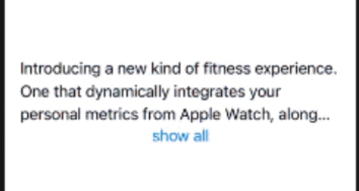
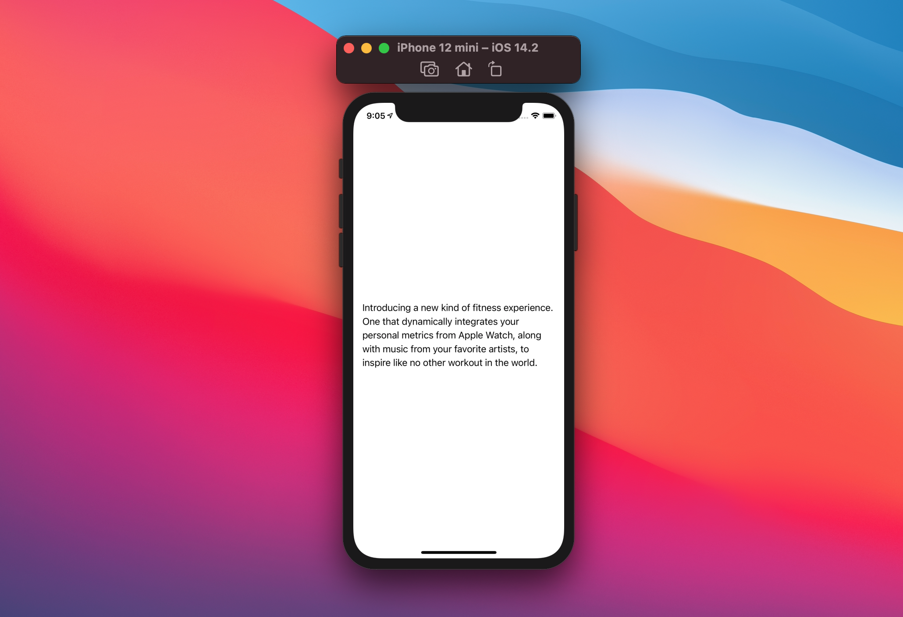
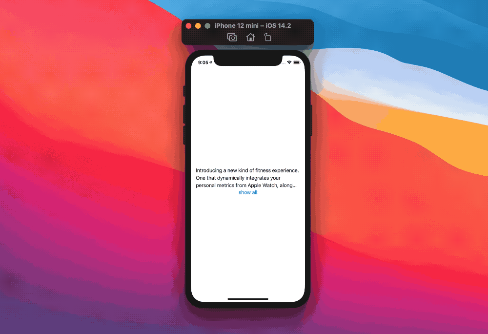

# SwiftUI:Text约束
当显示不同长度的文本时，我们的设计需要明确是否应该有一个最大的可显示行数，或者是否应该始终显示全文。



`Text`的行为并不总是可以预测的:有时候，文本会在没有明显原因的情况下被截断，尽管我们有足够的处理空间(例如在`Form`表单和`List`列表中)。
在本文中，让我们看看如何处理这些场景，以及更多内容。

## lineLimit
`Text`提供了实例方法`lineLimit(_:)`:
```
// This text instance won't exceed 3 rows.
Text(myString).lineLimit(3)
```
这个方法保证我们的文本实例不会超过给定的行数。我们也可以传递`nil`作为`lineLimit`参数，让`Text`按照需要取任意多行:
```
Text(myString).lineLimit(nil)
```
传递`nil`意味着`Text`将遵循它的默认行为，仅此而已:如果SwiftUI认为这样做是正确的，那么我们的`Text`仍然会被截断。
> 如果文本长是“5行”，并且我们设置了`.linelimit(3)`，这并不保证`Text`将接受3行，它只是保证`Text`不会超过3行。

## fixedSize(horizontal:vertical:)
fixedSize让任何视图占用所需的空间，完全忽略了建议的大小。
`fixedSize`接受两个布尔值，`horizontal`水平方向的和`vertical`垂直方向的，让我们决定视图是否应该忽略两个轴建议的大小，只是忽略一个轴，或都不忽略。
`fixedSize`还提供了一个方便的`fixedSize()`方法，它等价于`fixedSize(horizontal: true, vertical: true)`。
据我所知，让`Text`使用`.fixedSize`是保证文本总是完全显示的唯一方法。
```
// 这个Text将遵守建议的水平空间大小，并根据需要占据尽可能多的垂直空间
Text(myLongString).fixedSize(horizontal: false, vertical: true)
```



这里有一个问题:虽然使用`.fixedSize`可以保证完整的显示全文，但如果没有足够的空间，UI:布局将被破坏：
```
Rectangle()
  .stroke()
  .frame(width: 200, height: 100)
  .overlay(Text(myLongString).fixedSize(horizontal: false, vertical: true))
```


## 兼容设置
现在我们已经介绍了主要的两种方法，让我们看看如何回答“如何检查`Text`是否被截断?”的问题。
与UIKit类似，我们需要知道的是我们文本的内在大小是否与布局中文本的实际大小相同。

为了得到`Text`的内在大小和实际大小，我们需要在我们的视图层次结构中添加这两种情况，然而我们只想显示这两种情况之一，用隐藏视图的技巧，同时仍然计算它们的布局:

* 添加它们作为另一个视图的`background`，背景视图不参与父视图的大小
* 应用`hidden()`修饰符，隐藏的视图不是由SwiftUI绘制的
我们最终的布局:
```
Text(myString)
  .lineLimit(myLineLimit)
  .background(
    Text(myString)
      .fixedSize(horizontal: false, vertical: true)
      .hidden()
  )
```
现在我们需要得到两个`Text`的大小，为此我们将使用[readSize](https://www.jianshu.com/p/bb7005502299):
```
Text(myString)
  .lineLimit(myLineLimit)
  .readSize { size in
    print("truncated size: \(size)")
  }
  .background(
    Text(myString)
      .fixedSize(horizontal: false, vertical: true)
      .hidden()
      .readSize { size in
      	print("intrinsic size: \(size)")
      }
  )
```

最后，我们可以将这两个值保存在我们的视图中，并随意使用它们:
```
struct TruncableText: View {
  let text: Text
  let lineLimit: Int?
  @State private var intrinsicSize: CGSize = .zero
  @State private var truncatedSize: CGSize = .zero
  let isTruncatedUpdate: (_ isTruncated: Bool) -> Void

  var body: some View {
    text
      .lineLimit(lineLimit)
      .readSize { size in
        truncatedSize = size
        isTruncatedUpdate(truncatedSize != intrinsicSize)
      }
      .background(
        text
          .fixedSize(horizontal: false, vertical: true)
          .hidden()
          .readSize { size in
            intrinsicSize = size
            isTruncatedUpdate(truncatedSize != intrinsicSize)
          }
      )
  }
}
```
在每次大小变化时，`TruncableText`都会调用一个带有最新截断状态的`isTruncatedUpdate`回调方法，然后可以使用该信息来适应各种情况下的UI。
例如，这里有一个视图，当`Text`内容被截断时显示“Show All”按钮，当点击时显示全文:
```
import SwiftUI
struct ContentView: View {
  @State var isTruncated: Bool = false
  @State var forceFullText: Bool = false

  var body: some View {
    VStack {
      if forceFullText {
        text
          .fixedSize(horizontal: false, vertical: true)
      } else {
        TruncableText(
          text: text,
          lineLimit: 3
        ) {
          isTruncated = $0
        }
      }
      if isTruncated && !forceFullText {
        Button("show all") {
          forceFullText = true
        }
      }
    }
    .padding()
  }

  var text: Text {
    Text("Introducing a new kind of fitness experience. One that dynamically integrates your personal metrics from Apple Watch, along with music from your favorite artists, to inspire like no other workout in the world.")
  }
}

struct TruncableText: View {
  let text: Text
  let lineLimit: Int?
  @State private var intrinsicSize: CGSize = .zero
  @State private var truncatedSize: CGSize = .zero
  let isTruncatedUpdate: (_ isTruncated: Bool) -> Void

  var body: some View {
    text
      .lineLimit(lineLimit)
      .readSize { size in
        truncatedSize = size
        isTruncatedUpdate(truncatedSize != intrinsicSize)
      }
      .background(
        text
          .fixedSize(horizontal: false, vertical: true)
          .hidden()
          .readSize { size in
            intrinsicSize = size
            isTruncatedUpdate(truncatedSize != intrinsicSize)
          }
      )
  }
}

public extension View {
    func readSize(onChange: @escaping (CGSize) -> Void) -> some View {
        background(
            GeometryReader { geometryProxy in
                Color.clear
                    .preference(key: SizePreferenceKey.self, value: geometryProxy.size)
            }
        )
        .onPreferenceChange(SizePreferenceKey.self, perform: onChange)
    }
}

private struct SizePreferenceKey: PreferenceKey {
    static var defaultValue: CGSize = .zero
    static func reduce(value: inout CGSize, nextValue: () -> CGSize) {}
}

struct ContentView_Previews: PreviewProvider {
  static var previews: some View {
    ContentView()
  }
}
```



## 总结
在UIKit中发现显示的文本是否被截断并不容易，目前在SwiftUI中也不容易。

