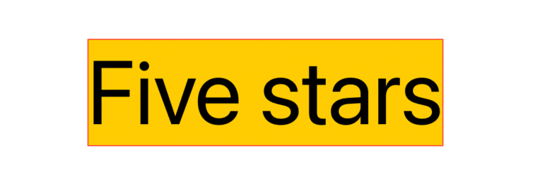
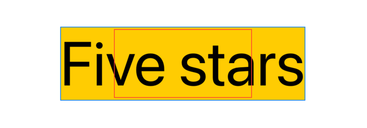
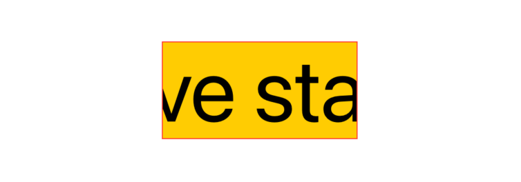
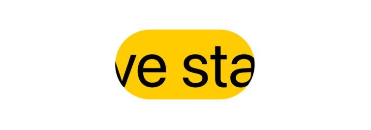
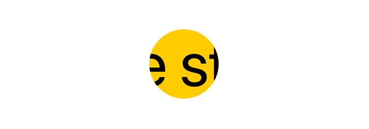
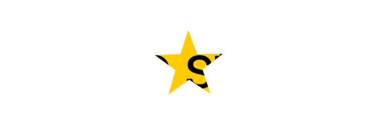

# SwiftUI:View clipped

masking遮罩是一种强大的技术，我们可以使用它将应用程序的设计推向下一个层次。SwiftUI提供了多种方式来做这件事：让我们从SwiftUI的剪辑开始。

## Clipping遮罩
每个视图都有一个受到绑定的frame。这个frame用于组成整个视图层次结构布局。当进入绘图阶段时，视图内容可能会超出它的frame。
例如，以下视图：



```
Text("Five stars")
  .background(Color.yellow)
  .font(.system(size: 90))
  .border(Color.red)
```
红色边框显示内容frame，在本例中，内容frame也与绑定的frame一致。

让我们来看另一个例子:



```
Text("Five stars")
  .background(Color.yellow)
  .font(.system(size: 90))
  .fixedSize()
  .border(Color.blue)
  .frame(width: 200, height: 100)
  .border(Color.red)
```

由于`fixedSize()`视图修饰符，`Text`需要多少空间就占用多少空间。
然而，我们也应用另一个`.frame(width: 200, height: 50)`视图修改器在上面。

对于视图层次结构的其余部分，这个视图限制由红色边框表示，而蓝色边框表示视图内容占用的空间。

在布局阶段:

* 只有绑定的框架/红色边框将被考虑
* 内容frame/蓝色边框完全被忽略

由于SwiftUI默认允许内容溢出，即使内容超出了视图的边缘也会被绘制。为了避免这种情况，我们可以使用剪辑:



```
Text("Five stars")
  .background(Color.yellow)
  .font(.system(size: 90))
  .fixedSize()
  .border(Color.blue)
  .frame(width: 200, height: 100)
  .border(Color.red)
  .clipped() // 👈🏻
```

`clipped()`视图修改器将视图的绘制限制在其绑定frame内，其他所有内容将被隐藏。

换句话说，`clipped()`应用一个等效于绑定帧“矩形”的遮罩，从而隐藏超出该矩形的任何内容。

SwiftUI提供了两个`clipped()`替代方法:`cornerRadius(_:)`和`clipShape(_:style)`。


## Corner Radius
`cornerRadius(_:)`的行为与`clipped()`完全相同，但它并没有与绑定frame 1:1匹配，而是让我们指定一个用于最终蒙版的角半径:



```
Text("Five stars")
  .background(Color.yellow)
  .font(.system(size: 90))
  .fixedSize()
  .frame(width: 200, height: 100)
  .cornerRadius(50) // 👈🏻
```

使用与之前相同的思维过程，`cornerRadius(_:)`应用一个等效于视图绑定框架矩形的蒙版，这次是圆角。

`.clipped()`比`.cornerradius(0)`有更好的性能。

## Clip Shape
到目前为止，我们一直在使用矩形，`clipShape(_:style:)`消除了这个限制，让我们使用任何形状作为剪辑蒙版:



```
Text("Five stars")
  ...
  .clipShape(Circle())
```
形状尽可能适合包含它们的视图(即视图绑定frame)的自然大小。

我们并不局限于SwiftUI提供的形状。我们也可以声明:



```
Text("Five stars")
  ...
  .clipShape(Star())
```

```
struct Star: Shape {
  @Clamping(0...Int.max) var points: Int = 5
  var innerRatio = 0.4

  func path(in rect : CGRect) -> Path {
    let center = CGPoint(x: rect.midX, y: rect.midY)
    let angle: Double = .pi / Double(points)
    var path = Path()
    var startPoint: CGPoint = rect.origin

    let outerRadius = min(rect.width / 2, rect.height / 2)
    let innerRadius = outerRadius * innerRatio

    let maxCorners = 2 * points
    for corner in 0 ..< maxCorners {
      let radius = (corner % 2) == 0 ? outerRadius : innerRadius

      let x = center.x + cos(Double(corner) * angle) * radius
      let y = center.y + sin(Double(corner) * angle) * radius
      let point = CGPoint(x: x, y: y)

      if corner == 0 {
        startPoint = point
        path.move(to: point)
      } else {
        path.addLine(to: point)
      }
      if corner == (maxCorners - 1) {
        path.addLine(to: startPoint)
      }
    }
    return path
  }
}

```

类似于`.clipped()`可以被看作是`.cornerRadius(0)`上的便利，`.cornerRadius(x)`可以被看作是`.clipshape(RoundedRectangle(cornerRadius: x))`上的便利。

`@Clamping`为自定义修饰器：

```propertyWrapper+Clamping.swift
@propertyWrapper
public struct Clamping<Value: Comparable> {
  var value: Value
  let range: ClosedRange<Value>

  public init(wrappedValue: Value, _ range: ClosedRange<Value>) {
    precondition(range.contains(wrappedValue))
    self.range = range
    self.value = wrappedValue
  }

  public var wrappedValue: Value {
    get { value }
    set { value = min(max(range.lowerBound, newValue), range.upperBound) }
  }
}
```

## 奇偶规则
当定义一个`Shape`形状时，它的一些部分可以多次绘制。我们可以将这些部分视为“重叠区域”。例如，以这个`DoubleEllipse` `Shape`定义为例，它由两个任意数量重叠的椭圆组成:


```
struct FSView: View {
  @State var overlapping: Double = 0.1

  var body: some View {
    VStack {
      DoubleEllipse(overlapping: overlapping)
        .frame(width: 300, height: 100)
      HStack {
        Text("Overlapping")
        Slider(value: $overlapping, in: 0.0...1.0)
      }
    }
  }
}

struct DoubleEllipse: Shape {
  /// 1 = complete overlap
  /// 0 = no overlap
  @Clamping(0.0...1.0) var overlapping: Double = 0

  func path(in rect: CGRect) -> Path {
    let rectSize = CGSize(width: (rect.width / 2) * (1 + overlapping), height: rect.height)

    var path = Path()
    path.addEllipse(in: CGRect(origin: .zero, size: rectSize))
    let secondEllipseOrigin = CGPoint(x: (rect.width / 2) * (1 - overlapping), y: rect.origin.y)
    path.addEllipse(in: CGRect(origin: secondEllipseOrigin, size: rectSize))

    return path
  }
}
```
默认情况下，SwiftUI按照定义绘制所有内容。然而，我们也可以应用一个`fill(style:)` `Shape`修饰符，以不同的方式填充那些重叠的区域:


```
struct FSView: View {
  @State var overlapping: Double = 0.1

  var body: some View {
    VStack {
      DoubleEllipse(overlapping: overlapping)
        .fill(style: FillStyle(eoFill: true, antialiased: true)) // 👈🏻
        .frame(width: 300, height: 100)
      HStack {
        Text("Overlapping")
        Slider(value: $overlapping, in: 0.0...1.0)
      }
    }
  }
}
```
神奇之处在于`oeFill`参数，其中`eo`代表奇偶(规则)，描述如下:《形状中的一个“内部”点是通过在任意方向绘制一条从该点到无穷远的射线，并计算射线穿过给定形状的路径段的数量来确定的。如果这个数是奇数，点在里面;否则的话，那就是在外面》

定义不仅仅是重叠，但这很可能是它在SwiftUI掩蔽时的用法。

`fill(style:)` `Shape`修饰符返回`some View`，这意味着我们不能在`clipShape(_:style:)`中使用它，因为后者需要一个`Shape`实例。也就是说，`.clipShape(_:style:)`第二个参数解决了这个问题，让我们传递一个`FillStyle`:


```
VStack {
  Text("Five stars")
    .background(Color.yellow)
    .font(.system(size: 90))
    .clipShape(
      OverlappingEllipses(ellipsesNumber: ellipsesNumber, overlapping: overlapping),
      style: FillStyle(eoFill: true, antialiased: false) // 👈🏻
    )
  Stepper("Ellipses number:", value: $ellipsesNumber, in: 2...16)
  HStack {
    Text("Overlapping")
    Slider(value: $overlapping, in: 0.0...1.0)
  }
}
```

## 动画剪辑遮罩
`Shapes`形状既符合`View`视图又符合`Animatable`动画，我们可以在形状中声明`var animatableData: CGFloat`，以利用这一点:

```
struct OverlappingEllipses: Shape {
  @Clamping(1...Int.max) var ellipsesNumber: Int = 2
  @Clamping(0.0...1.0) var overlapping: Double = 0

  var animatableData: CGFloat { // 👈🏻
    get { overlapping }
    set { overlapping = newValue }
  }

  func path(in rect: CGRect) -> Path {
    let rectWidth = (rect.width / Double(ellipsesNumber)) * (1 + Double(ellipsesNumber - 1) * overlapping)
    let rectSize = CGSize(width: rectWidth, height: rect.height)

    var path = Path()
    for index in 0..<ellipsesNumber {
      let ellipseOrigin = CGPoint(x: (rect.width - rectWidth) * Double(index) / Double(ellipsesNumber - 1), y: rect.origin.y)
      path.addEllipse(in: CGRect(origin: ellipseOrigin, size: rectSize))
    }

    return path
  }
}
```
有了这个，我们就可以把我们目前所介绍的所有内容都放到一起，轻松地获得一些迷幻效果:


```
struct FSView: View {
  @State var overlapping: Double = 0

  var body: some View {
    VStack(spacing: 16) {
        Text("Five stars")
          ...
          .clipShape(
            OverlappingEllipses(ellipsesNumber: 8, overlapping: overlapping),
            style: FillStyle(eoFill: true, antialiased: false)
          )

      Text("Five stars")
        ...
        .clipShape(
          OverlappingRectangles(rectanglesNumber: 8, overlapping: overlapping),
          style: FillStyle(eoFill: true, antialiased: false)
        )

      Button("Show/Hide") {
        withAnimation(.easeInOut(duration: 2)) {
          overlapping = overlapping == 1 ? 0 : 1
        }
      }
    }
  }
}
```
OverlappingRectangles定义如下：
```
struct OverlappingRectangles: Shape {
  @Clamping(1...Int.max) var rectanglesNumber: Int = 2
  @Clamping(0.0...1.0) var overlapping: Double = 0

  var animatableData: CGFloat {
    get { overlapping }
    set { overlapping = newValue }
  }

  func path(in rect: CGRect) -> Path {
    let rectWidth = (rect.width / Double(rectanglesNumber)) * (1 + Double(rectanglesNumber - 1) * overlapping)
    let rectSize = CGSize(width: rectWidth, height: rect.height)

    var path = Path()
    for index in 0..<rectanglesNumber {
      let ellipseOrigin = CGPoint(x: (rect.width - rectWidth) * Double(index) / Double(rectanglesNumber - 1), y: rect.origin.y)
      path.addRect(CGRect(origin: ellipseOrigin, size: rectSize))
    }

    return path
  }
}struct OverlappingRectangles: Shape {
  @Clamping(1...Int.max) var rectanglesNumber: Int = 2
  @Clamping(0.0...1.0) var overlapping: Double = 0

  var animatableData: CGFloat {
    get { overlapping }
    set { overlapping = newValue }
  }

  func path(in rect: CGRect) -> Path {
    let rectWidth = (rect.width / Double(rectanglesNumber)) * (1 + Double(rectanglesNumber - 1) * overlapping)
    let rectSize = CGSize(width: rectWidth, height: rect.height)

    var path = Path()
    for index in 0..<rectanglesNumber {
      let ellipseOrigin = CGPoint(x: (rect.width - rectWidth) * Double(index) / Double(rectanglesNumber - 1), y: rect.origin.y)
      path.addRect(CGRect(origin: ellipseOrigin, size: rectSize))
    }

    return path
  }
}
```


