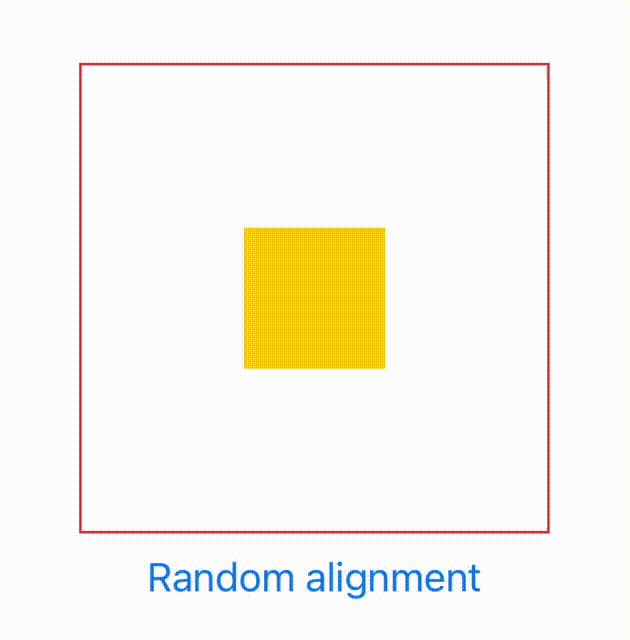
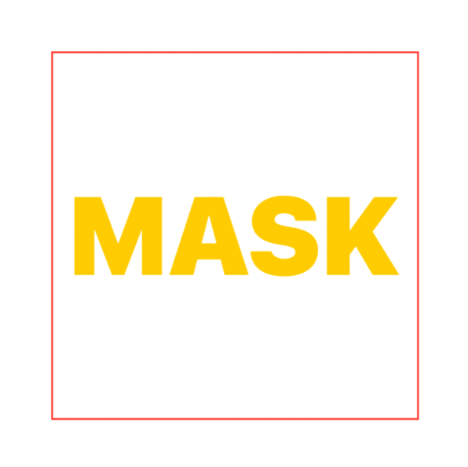
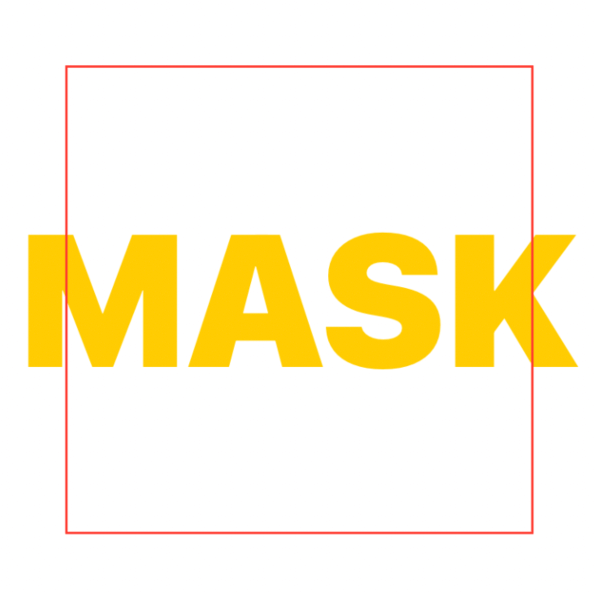
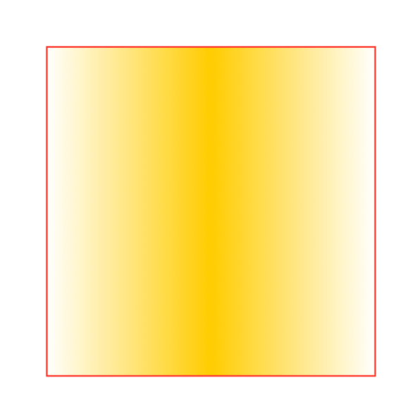

# SwiftUI:View mask

在[SwiftUI:View clipped](../SwiftUI-View%20clipped/SwiftUI-View%20clipped.md)
中，我们已经探索了所有可以将剪辑蒙版应用到视图的方法。虽然剪辑功能强大，但它有两个显著的限制:

* 它要求`shape`作为`mask`
* 内容要么被遮罩，要么被修剪掉;没有灰色地带

让我们探索一下超越剪辑的SwiftUI遮罩`mask`。

## Mask
SwiftUI提供的最后一个蒙版视图修饰符是`mask(alignment:_:)`:

```
extension View {
  @inlinable public func mask<Mask: View>(
    alignment: Alignment = .center, 
    @ViewBuilder _ mask: () -> Mask
  ) -> some View
}
```
除了命名之外，这个修饰符声明和其他一些我们可能非常熟悉的视图修饰符是一样的，`overlay(alignment:_:)`和`background(alignment:_:)`:

```
extension View {
  @inlinable public func overlay<V: View>(
    alignment: Alignment = .center, 
    @ViewBuilder content: () -> V
  ) -> some View

  @inlinable public func background<V: View>(
    alignment: Alignment = .center, 
    @ViewBuilder content: () -> V
  ) -> some View
}
```
这不是巧合`.mask(alignment:_:)`定位它的蒙版就像一个`overlay`覆盖或`background`背景修改器一样:

* 修饰符将它应用到的视图的自然大小建议给它的mask
* 一旦mask大小已知，它将根据指定的`alignment`对齐方式放置在视图上

## Mask alignment

当蒙版和原始视图有不同的尺寸时，对齐参数特别有用。在下面的例子中，蒙版是它应用到的视图的30%大小:



```
struct FSView: View {
  private let alignments: [Alignment] = [
    .center, .leading, .trailing, .top, .bottom, .topLeading, .topTrailing, .bottomLeading, .bottomTrailing
  ]
  @State var alignment: Alignment = .center

  var body: some View {
    VStack {
      Color.yellow
        .frame(width: 200, height: 200)
        .mask(alignment: alignment) {
          Rectangle()
            .frame(width: 60, height: 60) // 👈🏻 60 x 60 is smaller than 200x200
        }
        .border(.red)

      Button("Random alignment") {
        withAnimation {
          alignment = alignments.filter { $0 != alignment } .randomElement()!
        }
      }
    }
  }
}
```
红色边框显示了原始视图的边界，以提供视觉帮助:否则，我们只能看到一个小矩形。

## 视图作为蒙版

clipping剪辑修饰符的真正力量在于有机会使用任何`View`视图作为遮罩。比如说`Text`呢?



```
Color.yellow
  .frame(width: 200, height: 200)
  .mask {
    Text("MASK")
      .fontWeight(.black)
      .font(.system(size: 60))
  }
  .border(Color.red)
```
不像`shape`形状，视图不会停留在它们所应用的视图的自然大小内。因此，遮罩会导致内容溢出。

在下面的例子中:

* 视图内容扩展到300x300的矩形
* 视图大小设置200x200
* 应用的遮罩超出了视图边界，允许内容溢出



```
Color.yellow
  .frame(width: 300, height: 300)
  .frame(width: 200, height: 200)
  .mask {
    Text("MASK")
      .fontWeight(.black)
      .font(.system(size: 80))
      .fixedSize() // 👈🏻 忽略建议的200x200的大小
  }
  .border(Color.red)
```

## Opacity

`mask(alignment:_:)`使用蒙版不透明度来确定从原始视图中显示的内容，例如:



```
Color.yellow
  .frame(width: 200, height: 200)
  .mask {
    LinearGradient(colors: [.clear, .black, .clear], startPoint: .leading, endPoint: .trailing)
  }
  .border(Color.red)
```

在这里，我们使用带有三个颜色的线性梯度。中间的渐变颜色并不重要。它的颜色不透明度:我们可以用`.white`，`.red`等等来替换。结果是一样的。

