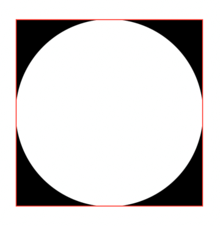
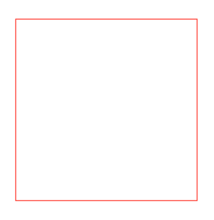
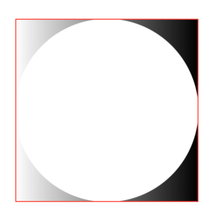
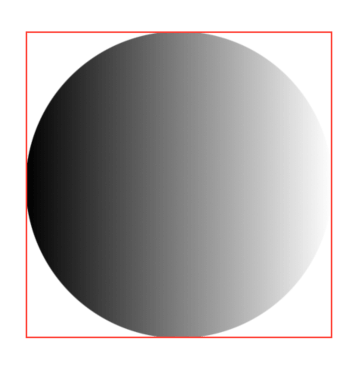
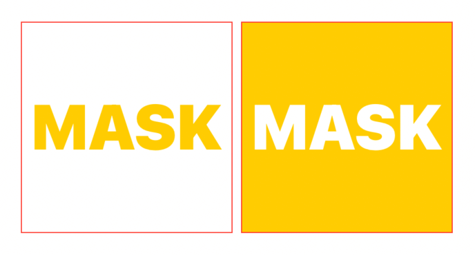
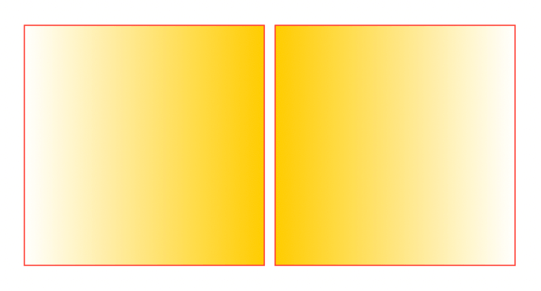

# SwiftUI:View mask

在[SwiftUI:View clipped](../SwiftUI-View%20clipped/SwiftUI-View%20clipped.md)
中，我们已经探索了所有可以将剪辑蒙版应用到视图的方法。虽然剪辑功能强大，但它有两个显著的限制:

* 它要求`shape`作为`mask`
* 内容要么被遮罩，要么被修剪掉;没有灰色地带

让我们探索一下超越剪辑的SwiftUI遮罩`mask`。

## Mask
SwiftUI提供的最后一个蒙版视图修饰符是`mask(alignment:_:)`:

```
extension View {
  @inlinable public func mask<Mask: View>(
    alignment: Alignment = .center, 
    @ViewBuilder _ mask: () -> Mask
  ) -> some View
}
```
除了命名之外，这个修饰符声明和其他一些我们可能非常熟悉的视图修饰符是一样的，`overlay(alignment:_:)`和`background(alignment:_:)`:

```
extension View {
  @inlinable public func overlay<V: View>(
    alignment: Alignment = .center, 
    @ViewBuilder content: () -> V
  ) -> some View

  @inlinable public func background<V: View>(
    alignment: Alignment = .center, 
    @ViewBuilder content: () -> V
  ) -> some View
}
```
这不是巧合`.mask(alignment:_:)`定位它的蒙版就像一个`overlay`覆盖或`background`背景修改器一样:

* 修饰符将它应用到的视图的自然大小建议给它的mask
* 一旦mask大小已知，它将根据指定的`alignment`对齐方式放置在视图上

## Mask alignment

当蒙版和原始视图有不同的尺寸时，对齐参数特别有用。在下面的例子中，蒙版是它应用到的视图的30%大小:


```
struct FSView: View {
  private let alignments: [Alignment] = [
    .center, .leading, .trailing, .top, .bottom, .topLeading, .topTrailing, .bottomLeading, .bottomTrailing
  ]
  @State var alignment: Alignment = .center

  var body: some View {
    VStack {
      Color.yellow
        .frame(width: 200, height: 200)
        .mask(alignment: alignment) {
          Rectangle()
            .frame(width: 60, height: 60) // 👈🏻 60 x 60 is smaller than 200x200
        }
        .border(.red)

      Button("Random alignment") {
        withAnimation {
          alignment = alignments.filter { $0 != alignment } .randomElement()!
        }
      }
    }
  }
}
```
红色边框显示了原始视图的边界，以提供视觉帮助:否则，我们只能看到一个小矩形。

## 视图作为蒙版

clipping剪辑修饰符的真正力量在于有机会使用任何`View`视图作为遮罩。比如说`Text`呢?


```
Color.yellow
  .frame(width: 200, height: 200)
  .mask {
    Text("MASK")
      .fontWeight(.black)
      .font(.system(size: 60))
  }
  .border(Color.red)
```
不像`shape`形状，视图不会停留在它们所应用的视图的自然大小内。因此，遮罩会导致内容溢出。

在下面的例子中:

* 视图内容扩展到300x300的矩形
* 视图大小设置200x200
* 应用的遮罩超出了视图边界，允许内容溢出


```
Color.yellow
  .frame(width: 300, height: 300)
  .frame(width: 200, height: 200)
  .mask {
    Text("MASK")
      .fontWeight(.black)
      .font(.system(size: 80))
      .fixedSize() // 👈🏻 忽略建议的200x200的大小
  }
  .border(Color.red)
```

## Opacity

`mask(alignment:_:)`使用蒙版不透明度来确定从原始视图中显示的内容，例如:


```
Color.yellow
  .frame(width: 200, height: 200)
  .mask {
    LinearGradient(colors: [.clear, .black, .clear], startPoint: .leading, endPoint: .trailing)
  }
  .border(Color.red)
```

在这里，我们使用带有三个颜色的线性梯度。中间的渐变颜色并不重要。它的颜色不透明度:我们可以用`.white`，`.red`等等来替换。结果是一样的。

## Blending混合

当我们将视图堆叠在其他视图之上时，底下的视图被上面的视图所隐藏。我们可以通过不透明度或使用不同大小的视图来影响这一点，但这个想法仍然有缺陷:底部的视图总是会有一些部分被上面的视图隐藏(或半隐藏)。

一种打破这种标准行为的强大技术是混合`blending`，它允许我们使用不同的视图属性(色值、不透明度、亮度等等)来组成最终的堆栈外观。

混合模式有很多种，目前，让我们更多地关注目标输出混合模式，即`BlendMode.destinationOut`。

在混合模式下，**source**是顶部视图，而**destination**是底部视图。

输出后，最终视图是底部视图(destination)的位，它不与顶部视图(source)重叠。

这里有一个例子，目标destination是一个`Rectangle`，源source是一个`Circle`，两者的大小相同:



```
ZStack {
  Rectangle() // destination
  Circle()    // source
    .blendMode(.destinationOut)
}
.compositingGroup()
.border(.red)
```

如果我们现在反转两个视图，`ZStack`将是空白不会绘制任何东西，因为`Rectangle`(source)完全重叠在`Circle`(目标destination)上



```
ZStack {
  Circle()    // destination
  Rectangle() // source
    .blendMode(.destinationOut)
}
.compositingGroup()
.border(.red)
```

与`mask(alignment:_:)`视图修改器类似，`blendMode(.destinationout)`使用每个视图不透明度来决定最终输出。下面是和之前一样的例子，我们用渐淡渐变替换`Rectangle`矩形:



```
ZStack {
  LinearGradient(
    colors: [.clear, .black], 
    startPoint: .leading, endPoint: .trailing
  )           // destination
  Circle()    // source
    .blendMode(.destinationOut)
}
.compositingGroup()
.border(.red)
```



```
ZStack {
  Circle()    // destination
  LinearGradient(
    colors: [.clear, .black], 
    startPoint: .leading, endPoint: .trailing
  )           // source
  .blendMode(.destinationOut)
}
.compositingGroup()
.border(.red)
```

我们可以使用目标输出混合技术来创建反向蒙版。

## 构建反向蒙版修饰器

首先，我们想保持与`mask(alignment:_:)`修饰符相同的API，这是它看起来的样子:
```
extension View {
  @inlinable
  public func reverseMask<Mask: View>(
    alignment: Alignment = .center, 
    @ViewBuilder _ mask: () -> Mask
  ) -> some View
}
```

接下来，我们知道`mask(alignment:_:)`的工作原理是只显示蒙版不透明度的原始视图，现在我们想做相反的事。让我们先用一个普通的蒙版:

```
extension View {
  @inlinable
  public func reverseMask<Mask: View>(
    alignment: Alignment = .center,
    @ViewBuilder _ mask: () -> Mask
  ) -> some View {
    self.mask {
      Rectangle()
    }
  }
}
```
通过在蒙版修改器中传入`Rectangle()`，我们获得了与`.clipped()`相同的效果:我们不再允许内容溢出，但原始内容仍然在视图范围内可见。

接下来，我们想要应用`.destinationOut`混合模式，我们的蒙版作为源，clipping rectangle剪切矩形作为目标:

```
// ⚠️ this is not the final code.
extension View {
  @inlinable
  public func reverseMask<Mask: View>(
    alignment: Alignment = .center,
    @ViewBuilder _ mask: () -> Mask
  ) -> some View {
    self.mask {
      ZStack {
        Rectangle() // destination
        mask()      // source
          .blendMode(.destinationOut)
      }
    }
  }
}
```
多亏了`ZStack`，我们应用了相同的效果在上面的混合章节中覆盖，然后使用结果作为常规蒙版的输入，获得一个反向蒙版。

最后，我们想要遵守`alignment`参数，最好的方法，就是用一个比他们应用到视图的尺寸更大的视图处理蒙版，可以运用`overlay`叠加到我们的`Rectangle`:

```
extension View {
  @inlinable
  public func reverseMask<Mask: View>(
    alignment: Alignment = .center,
    @ViewBuilder _ mask: () -> Mask
  ) -> some View {
    self.mask {
      Rectangle()
        .overlay(alignment: alignment) {
          mask()
            .blendMode(.destinationOut)
        }
    }
  }
}
```

把它应用到我们之前的代码中：


```
HStack {
  Color.yellow
    .frame(width: 200, height: 200)
    .mask {
      Star()
    }
    .border(.red)

  Color.yellow
    .frame(width: 200, height: 200)
    .reverseMask {
      Star()
    }
    .border(.red)
}
```



```
HStack {
  Color.yellow
    .frame(width: 200, height: 200)
    .mask {
      Text("MASK")
        .font(.system(size: 60).weight(.black))
    }
    .border(.red)

  Color.yellow
    .frame(width: 200, height: 200)
    .reverseMask {
      Text("MASK")
        .font(.system(size: 60).weight(.black))
    }
    .border(.red)
}
```



```
HStack {
  Color.yellow
    .frame(width: 200, height: 200)
    .mask {
      LinearGradient(
        colors: [.clear, .black],
        startPoint: .leading, endPoint: .trailing
      )
    }
    .border(.red)
  
  Color.yellow
    .frame(width: 200, height: 200)
    .reverseMask {
      LinearGradient(
        colors: [.clear, .black],
        startPoint: .leading, endPoint: .trailing
      )
    }
    .border(.red)
}
```


