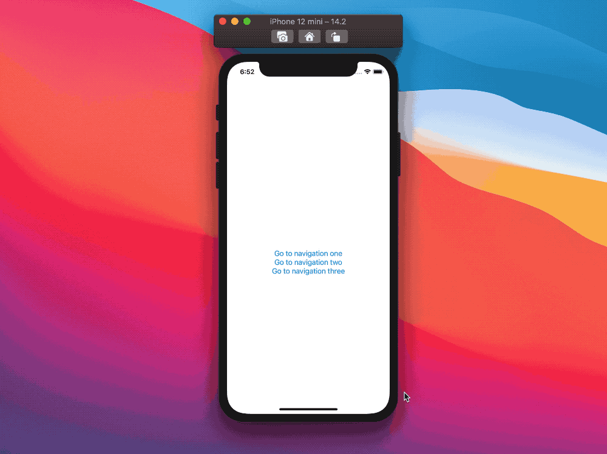

# SwiftUI:navigation进阶

就目前而言，SwiftUI在处理`NavigationLink`时存在一些限制。
在[SwiftUI:Swift协议]()中，我们已经介绍了SwiftUI是如何使用`Identifiable`的方式来管理sheet、alert和其他视图显示，而`Hashable`是如何用于导航的:这是第一个限制因素，它使得很难在将动态数据传递给目标视图的同时以编程方式触发导航。
第二个限制因素是`NavigationLink`实际上是伪装的按钮:它们的声明需要某种类型的视图，然后将成为视图层次结构的一部分。

在本文中，让我们尝试克服这两个限制。

## 绑定isActive
`NavigationLink`表现为push和pop视图的触发器:在内部，它们观察一个布尔绑定(如果需要，可以在外部公开)，以决定何时这样做。

如果我们想以编程方式从push的视图中pop弹出，最常见的方法是将`NavigationLink`的绑定设置为合适的状态:
```
struct ContentView: View {
  @State var showingNavigation: Bool = false

  var body: some View {
    NavigationView {
      NavigationLink(
        "Push view",
        destination: Button("Pop back", action: { showingNavigation = false }),
        isActive: $showingNavigation
      )
    }
  }
}
```


虽然这个效果很好，但我们也可以使用另一个隐藏的技巧来获得同样的效果:从视图层次结构中完全移除`NavigationLink`。
```
struct ContentView: View {
  @State var showingNavigation: Bool = true

  var body: some View {
    NavigationView {
      VStack {
        if showingNavigation {
          NavigationLink(
            "Go to destination",
            destination: Button("Hide navigation", action: { showingNavigation.toggle() })
          )
        }

        if !showingNavigation {
          Button("Show navigation", action: { showingNavigation.toggle() })
        }
      }
    }
  }
}
```


在第二种情况下，我们使用`showingNavigation`不是作为一个`NavigationLink`绑定，而是决定`NavigationLink`是否是视图层次结构的一部分。
如果我们在`NavigationLink`显示时删除它，它也会pop回来。

## EmptyView
`NavigationLink`需要一个视图作为它们的`Label`，然而任何视图都会这样做，因此我们可以通过传递一个`EmptyView`实例来“隐藏”一个`NavigationLink`:
```
	NavigationLink(
	  destination: ...,
	  isActive: ...,
	  label: { EmptyView() }
	)
```

通过这样做，我们在视图层次结构中有效地隐藏了链接，同时仍然保留它的push/pop触发器效果。
```
struct ContentView: View {
  @State var showingNavigation: Bool = false

  var body: some View {
    NavigationView {
      VStack {
        NavigationLink(
          destination: Button("Pop back", action: { showingNavigation = false }),
          isActive: $showingNavigation,
          label: { EmptyView() }
        )

        Button("Push view", action: { showingNavigation = true })
      }
    }
  }
}
```


在本例中，我们使用了几个按钮来触发导航push和pop操作，但实际上，同样的事情也可以通过任何其他逻辑来完成(例如在从web获取一些东西之后)。
虽然`NavigationLink`仍然是视图层次结构定义的一部分，但它现在被隐藏起来，并与UI的其余部分断开连接。

## Identifiable x NavigationLink
让我们回顾一下目前为止我们已经讲过的内容:

* 如果一个正在显示的`NavigationLink`从视图层次结构中移除，它的目标将pop返回
* 使用`EmptyView`作为`NavigationLink`的`Label`将在UI中隐藏视图，同时保留其push/pop触发操作

现在我们想要的是一个带有`Identifiable`绑定的`NavigationLink`，而不是`Bool`或`Hashable`绑定。

这是为了使导航push/pop与其他SwiftUI视图演示对齐，这也使我们能够轻松地在不同视图之间传递数据。
我们从以下几点开始:
```
extension NavigationLink {
  public init<V: Identifiable>(
    item: Binding<V?>,
    destination: ...
  ) {
    ...
  }
}
```

假设有一个`Identifiable`的类型，定义如下:
```
enum ContentViewNavigation: Identifiable {
  case one
  case two(number: Int)
  case three(text: String)

  // MARK: Identifiable

  var id: Int {
    switch self {
    case .one:
      return 1
    case .two:
      return 2
    case .three:
      return 3
    }
  }
}
```
这种“导航”类型有三个可能的目的地，其中一些目的地(case `.two`和`.tree`)也将动态数据传递到目标视图。

我们的`NavigationLink`扩展需要为每个可能的`Identifiable`实例生成一个不同的目的地，因此让我们请求一个视图生成器函数作为目的地参数:
```
extension NavigationLink {
  public init<V: Identifiable>(
    item: Binding<V?>,
    destination: @escaping (V) -> Destination
  ) {
    ...
  }
}
```
有了这个API，我们就不再需要为每个目的地声明单独的`NavigationLink`了。因此，让我们通过将它的`Label`声明为`EmptyView`来在UI中隐藏这个`NavigationLink`:
```
extension NavigationLink where Label == EmptyView {
  public init<V: Identifiable>(
    item: Binding<V?>,
    destination: @escaping (V) -> Destination
  ) {
    ...
  }
}
```

只有当给定的绑定不是`nil`时，这个`NavigationLink`才会生成一个具有正确目标的视图:当绑定为`nil`时，初始化将失败。
为了实现这一点，我们的扩展将实现一个可失败的初始化器(注意`?`在`init`):
```
extension NavigationLink where Label == EmptyView {
  public init?<V: Identifiable>(
    item: Binding<V?>,
    destination: @escaping (V) -> Destination
  ) {
     ...
  }
}
```
现在，我们的`NavigationLink`只在绑定有值时才会生成(并且push到视图)：一旦绑定被设置为`nil`, `NavigationLink`就会从视图层次结构中移除，从而触发一个pop导航操作。
```
extension NavigationLink where Label == EmptyView {
  public init?<V: Identifiable>(
    item: Binding<V?>,
    destination: @escaping (V) -> Destination
  ) {
    if let value = item.wrappedValue {
      self.init(...)
    } else {
      return nil
    }
  }
}
```

最后，我们需要在扩展中传递一个绑定给初始化方法，让我们制作一个官方`NavigationLink` API接受的绑定:
```
extension NavigationLink where Label == EmptyView {
  public init?<V: Identifiable>(
    item: Binding<V?>,
    destination: @escaping (V) -> Destination
  ) {
    if let value = item.wrappedValue {
      let isActive: Binding<Bool> = Binding(
        get: { item.wrappedValue != nil },
        set: { value in
          // There's shouldn't be a way for SwiftUI to set `true` here.
          if !value {
            item.wrappedValue = nil
          }
        }
      )

      self.init(
        destination: destination(value),
        isActive: isActive,
        label: { EmptyView() }
      )
    } else {
      return nil
    }
  }
}
```

有了这个，我们的扩展完成了!下面是我们如何使用它:
```
struct ContentView: View {
  @State private var showingNavigation: ContentViewNavigation?

  var body: some View {
    NavigationView {
      VStack {
        NavigationLink(item: $showingNavigation, destination: presentNavigation)

        Button("Go to navigation one") {
          showingNavigation = .one
        }
        Button("Go to navigation two") {
          showingNavigation = .two(number: Int.random(in: 1...5))
        }
        Button("Go to navigation three") {
          showingNavigation = .three(text: ["five", "stars"].randomElement()!)
        }
      }
    }
  }

  @ViewBuilder
  func presentNavigation(_ navigation: ContentViewNavigation) -> some View {
    switch navigation {
    case .one:
      Text(verbatim: "one")
    case .two(let number):
      Text("two \(number)")
    case .three(let text):
      Text("three \(text)")
    }
  }
}
```



## NavigationLink优化

多亏了我们的扩展，现在将数据传递到任何目标视图都变得更简单了，同时还保持了视图定义的清晰性。
与其他SwiftUI演示文稿相比，我们的解决方案仍然缺少的一个方面是完全从视图层次结构中删除它的定义，虽然目前这是不可能的，但我们当然可以以一种非常优雅的方式隐藏它。

看看我们前面的例子，`NavigationLink`仍然在我们的`VStack`中:
```
struct ContentView: View {
  ...

  var body: some View {
    NavigationView {
      VStack {
        NavigationLink(item: $showingNavigation, destination: presentNavigation)

        Button(...) { ... }
        Button(...) { ... }
        Button(...) { ... }
      }
    }
  }
  ...
}
```

然而，`NavigationLink`可以放置在任何地方，例如，我们可以将它移动到background，一切仍然会工作良好:
```
struct ContentView: View {
  ...

  var body: some View {
    NavigationView {
      VStack {
        Button(...) { ... }
        Button(...) { ... }
        Button(...) { ... }
      }
      .background(
        NavigationLink(item: $showingNavigation, destination: presentNavigation)
      )
    }
  }

  ...
}
```


因为这可能是使用我们的`NavigationLink`扩展的理想方式，我们可以定义一个助手视图函数，我们能够这样做:
```
extension View {
  func navigation<V: Identifiable, Destination: View>(
    item: Binding<V?>,
    destination: @escaping (V) -> Destination
  ) -> some View {
    background(NavigationLink(item: item, destination: destination))
  }
}
```

使我们最终的API看起来非常类似于其他SwiftUI演示文稿(sheet, alert等):
```
struct ContentView: View {
  ...

  var body: some View {
    NavigationView {
      VStack {
        Button(...) { ... }
        Button(...) { ... }
        Button(...) { ... }
      }
      .navigation(item: $showingNavigation, destination: presentNavigation)
    }
  }

  ...
}
```


## 总结

这里介绍的扩展可能不会覆盖所有的用例，但是我认为类似的官方API会非常受欢迎，并且会解决我们今天面临的大多数实现问题。
在今年的全球开发者大会上，我们没有看到SwiftUI的导航api有什么变化，但是如果在新的Xcode11.4版本中，或者在下一次的全球开发者大会上，会出现一些新的东西，我也不会感到惊讶。同时，我们也可以自己尝试解决这些挑战!


