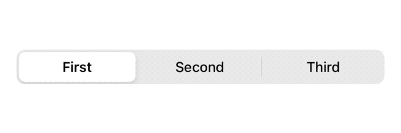

# SwiftUI：views检查Mirror
到目前为止，我们一直接受给定的输入，通常以`@ViewBuilder content: () -> Content`参数的形式，作为一个黑盒:它是一个视图，这就是我们需要知道的。
但如果我们想更多地了解这个视图呢?在本文中，让我们探索如何做到这一点。

## 一个新的选择器组件
假设我们的任务是创建一个新的`picker/segmented `控件:


SwiftUI的`Picker`开始是很好用的：
```
public struct Picker<Label: View, SelectionValue: Hashable, Content: View>: View {
  public init(
    selection: Binding<SelectionValue>,
    label: Label,
    @ViewBuilder content: () -> Content
  )
}
```
我们可以这样使用:
```
struct ContentView: View {
  @State private var selection = 0

  var body: some View {
    Picker(selection: $selection, label: Text("")) {
      Text("First").tag(0)
      Text("Second").tag(1)
      Text("Third").tag(2)
    }
    .pickerStyle(SegmentedPickerStyle())
  }
}
```
> 为了简单起见，我们将忽略`label`参数。



`Picker`使用`tag(_:)`来标识哪个元素对应于哪个`selection`选择值。

这一点非常重要，因为`picker`需要的:

* 在任何时候突出显示所选的元素
* 为每个元素添加一个点击手势
* 根据用户交互更新当前选择。

## FSPickerStyle
首先，我们可以尝试创建一个新的`PickerStyle`，就像我们对`Label`和`Button`所做的那样，下面是`PickerStyle`的定义:
```
public protocol PickerStyle {
}
```
酷,没有要求!让我们创建我们的选择器样式:
```
struct FSPickerStyle: PickerStyle {
}
```
这不会构建。虽然没有公共需求，但`PickerStyle`实际上有一些私有/内部需求，如下所示:

```
protocol PickerStyle {
  static func _makeView<SelectionValue>(
    value: _GraphValue<_PickerValue<FSPickerStyle, SelectionValue>>, 
    inputs: _ViewInputs
  ) -> _ViewOutputs where SelectionValue: Hashable

  static func _makeViewList<SelectionValue>(
    value: _GraphValue<_PickerValue<FSPickerStyle, SelectionValue>>,
    inputs: _ViewListInputs
  ) -> _ViewListOutputs where SelectionValue: Hashable
}
```
有`_`下划线的变量属于“私人的东西”，应该告诉我们那不是我们想要走的路:
探索这样的api是留给好奇/冒险的人的。

由于`PickerStyle`不是一个可行的选择，让我们开始从头构建我们自己的SwiftUI选择器。

## FSPicker
尽管我们创建了自己的组件，我们仍然希望尽可能模仿SwiftUI的`Picker`选择器的API:
```
public struct FSPicker<SelectionValue: Hashable, Content: View>: View {
  @Binding var selection: SelectionValue
  let content: Content

  public init(
    selection: Binding<SelectionValue>, 
    @ViewBuilder content: () -> Content
  ) {
    self._selection = selection
    self.content = content()
  }

  public var body: some View {
    ...
  }
}
```
到目前为止，一切都很好，多亏了这个声明，我们可以回到最初的例子，在`Picker`选择器中添加一个`FS`前缀，一切都会很好地构建:
```
struct ContentView: View {
  @State private var selection = 0

  var body: some View {
    // 👇🏻 our picker!
    FSPicker(selection: $selection) {
      Text("First").tag(0)
      Text("Second").tag(1)
      Text("Third").tag(2)
    }
  }
}
```

现在让我们来实现`FSPicker`的`body`部分。

## FSPicker的body
当我们看到像`@ViewBuilder content: () -> content`这样的参数时，我们通常把它当作我们放在自己的视图`body`中的某个地方的东西，但是我们不能这样做我们选择器。

这是因为我们的选择器`body`需要获取该`content`，突出显示所选元素，并添加手势来响应用户的选择。
解决这个问题的一个变通方法是用我们可以直接使用的东西来替换我们的通用`Content`参数。例如，我们可以用一个元组数组替换`Content`，其中每个元组包含一个`String`和一个相关联的`SelectionValue`:
```
public struct FSPicker<SelectionValue: Hashable>: View {
  @Binding var selection: SelectionValue
  let content: [(String, SelectionValue)]

  public init(
    selection: Binding<SelectionValue>,
    content: [(String, SelectionValue)]
  ) {
    self._selection = selection
    self.content = content
  }

  public var body: some View {
    HStack {
      ForEach(content, id: \.1) { (title, value) in
        Button(title) { selection = value }
      }
    }
  }
}
```
然而，我们不会再遵循SwiftUI的选择器api了。
相反，让我们让事情变得更有趣:让我们拥抱我们的“黑盒”内容，并使用Swift的反射!

## Mirror镜像反射
虽然我们的拾取器不可能总是在构建时知道实际的`content`，Swift允许我们在运行时通过`Mirror`
镜像检查这个值。
让我们用以下方式更新我们的`FSPicker`声明:
```
public struct FSPicker<SelectionValue: Hashable, Content: View>: View {
  ...
  public init(...) { ... }

  public var body: some View {
    let contentMirror = Mirror(reflecting: content)
    let _ = print(contentMirror)
    EmptyView()
  }
}
```
如果我们现在用我们最初的例子运行它，我们会在Xcode的调试区控制台中看到以下日志:
```
Mirror for TupleView<
  (
    ModifiedContent<Text, _TraitWritingModifier<TagValueTraitKey<Int>>>, 
    ModifiedContent<Text, _TraitWritingModifier<TagValueTraitKey<Int>>>, 
    ModifiedContent<Text, _TraitWritingModifier<TagValueTraitKey<Int>>>
  )
>
```
这应该不会让我们太惊讶，除了一些不熟悉的术语。
以下是我们最初的内容:
```
Text("First").tag(0)
Text("Second").tag(1)
Text("Third").tag(2)
```
我们可以看到:

* `@ViewBuilder`把我们的三个`Text`文本，放在一个`TupleView`与三个`block`块。
* 每个“`block`块”由一个`ModifiedContent`实例组成，这是对每个`Text`文本应用`tag(_:)`视图修饰符的结果。

让我们接下来打印`content`实例:
```
public struct FSPicker<SelectionValue: Hashable, Content: View>: View {
  ...
  public init(...) { ... }

  public var body: some View {
    let contentMirrorValue = Mirror(reflecting: content).descendant("value")!
    let _ = print(contentMirrorValue)
    EmptyView()
  }
}
```
> 为了简洁起见，我们强制展开

这一次控制台显示:
```
(
  ModifiedContent(
    content: Text(
      storage: Text.Storage.anyTextStorage(
        LocalizedTextStorage
      ), 
      modifiers: []
    ), 
    modifier: _TraitWritingModifier(
      value: TagValueTraitKey.Value.tagged(0)
    )
  ), 
  ModifiedContent(
    content: Text(
      storage: Text.Storage.anyTextStorage(
        LocalizedTextStorage
      ), 
      modifiers: []
    ), 
    modifier: _TraitWritingModifier(
      value: TagValueTraitKey.Value.tagged(1)
    )
  ), 
  ModifiedContent(
    content: Text(
      storage: Text.Storage.anyTextStorage(
        LocalizedTextStorage
      ), 
      modifiers: []
    ), 
    modifier: _TraitWritingModifier(
      value: TagValueTraitKey.Value.tagged(2)
    )
  )
)
```
> 为了清晰起见，对输出进行了格式化和稍微简化。

这也不应该让我们太惊讶:这和以前的输出是一样的，我们现在看到的不是`TupleView`的类型，而是实际的值。
请注意，我们所需要的一切都在这里:所有`Text`文本及其相关的`.tag`值。
接下来，我们可以使用`Mirror`来导航并分别选择单个`Text`文本和`tag`标签值:

```
public struct FSPicker<SelectionValue: Hashable, Content: View>: View {
  ...
  public init(...) { ... }

  public var body: some View {
    let contentMirror = Mirror(reflecting: content)
    // 👇🏻 The number of `TupleView` blocks.
    let blocksCount = Mirror(reflecting: contentMirror.descendant("value")!).children.count

    HStack {
      ForEach(0..<blocksCount) { index in
        // 👇🏻 A single `TupleView` block.
        let tupleBlock = contentMirror.descendant("value", ".\(index)")
        let text: Text = Mirror(reflecting: tupleBlock!).descendant("content") as! Text
        let tag: SelectionValue = Mirror(reflecting: tupleBlock!).descendant("modifier", "value", "tagged") as! SelectionValue

        ...
      }
    }
  }
}
```
此时，我们已经获得了对每个原始`Text`文本和`tag`标签值的访问权，我们可以使用它们来构建我们的视图:
```
struct FSPicker<SelectionValue: Hashable, Content: View>: View {
  @Namespace var ns
  @Binding var selection: SelectionValue
  @ViewBuilder let content: Content

  public var body: some View {
    let contentMirror = Mirror(reflecting: content)
    let blocksCount = Mirror(reflecting: contentMirror.descendant("value")!).children.count // How many children?
    HStack {
      ForEach(0..<blocksCount) { index in
        let tupleBlock = contentMirror.descendant("value", ".\(index)")
        let text = Mirror(reflecting: tupleBlock!).descendant("content") as! Text
        let tag = Mirror(reflecting: tupleBlock!).descendant("modifier", "value", "tagged") as! SelectionValue

        Button {
          selection = tag
        } label: {
          text
            .padding(.vertical, 16)
        }
        .background(
          Group {
            if tag == selection {
              Color.purple.frame(height: 2)
                .matchedGeometryEffect(id: "selector", in: ns)
            }
          },
          alignment: .bottom
        )
        .accentColor(tag == selection ? .purple : .black)
        .animation(.easeInOut)
      }
    }
  }
}
```


由于这个定义，`FSPicker`可以处理任何`SelectionValue`，并匹配`Picker`选择器的APIs。

## 进一步的改善
就目前的情况而言，只要给定的内容遵循与我们的示例相同的格式，`FSPicker`就非常好用。
这实际上可能是我们想要的:与其试图支持每一个可能的SwiftUI组件，我们可以将其他组件视为错误的输入，并忽略它们。

如果我们想要支持更多的组件(例如`Images`)，我们可以通过扩展我们的检查来处理这样的元素，或者甚至创建我们自己的视图生成器。

当然，这只是冰山一角:
处理任何`content`内容都意味着要处理更多的组件、边界情况、多层`ModifiedContent`修改内容等等。

