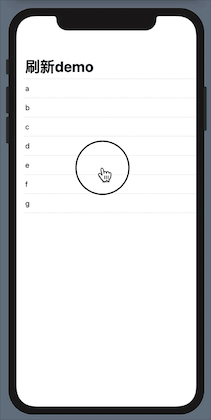

# SwiftUI:List下拉刷新之桥接UIKit 2

在[SwiftUI:List下拉刷新之桥接UIKit](https://www.jianshu.com/p/75010f9ddce2)一文中我们让`List`拥有了下拉刷新的能力，我们也想让`ScrollView`也拥有这个功能。我们可以把`PullToRefresh`中桥接的查询从`UITableView`换成`UIScrollView`,因为`UITableView`继承自`UIScrollView`，所以功能上是不受影响的。
只需要修改为`scrollView(root: UIView) -> UIScrollView?`即可，如下：
```
private func scrollView(root: UIView) -> UIScrollView? {
   for subview in root.subviews {
       if subview.isKind(of: UIScrollView.self) {
           return subview as? UIScrollView
       } else if let scrollView = scrollView(root: subview) {
           return scrollView
       }
   }
   return nil
}
```
运行依然是没有问题的。

## 优化手势操作
我们在`Coordinator`中添加观察者来监听滑动视图的手势变化，最后在卸载的时候我们需要在`dismantleUIView`方法清除观察者。
```
func setupObserver(_ scrollView: UIScrollView) {
  stateToken = scrollView.observe(\.panGestureRecognizer.state) {
      [weak self] scrollView,_  in
      guard scrollView.panGestureRecognizer.state == .ended else { return }
      
      self?.scrollViewDidEndDragging(scrollView)
  }
}
func clearObserver() {
  stateToken?.invalidate()
}
   
func scrollViewDidEndDragging(_ scrollView: UIScrollView) {
  if isRefreshing.wrappedValue {
      return
  }
  isRefreshing.wrappedValue = true
  if let actionMethod = action {
      actionMethod()
  }
}
```
在初始化赋值完`refreshControl`后，我们让`coordinator`来添加监听。
我们开始下拉不送手，回调事件确实没有触发，慢慢将视图放回，当放手时`panGestureRecognizer`的状态发生变化了，事件被触发了，这并不是我们想要的。
所以我们需要记录`scrollView`原始的偏移量`initOffset`，用来判断是否需要触发事件,修改完成后`PullRefresh`代码如下：
```
struct PullRefresh: UIViewRepresentable {
    @Binding var isRefreshing: Bool
    let action: (() -> Void)?
    
    init(isRefreshing: Binding<Bool>,action: (() -> Void)? = nil) {
        _isRefreshing = isRefreshing
        self.action = action
    }
    
    func makeUIView(context: Context) -> some UIView {
        let view = UIView(frame: .zero)
        return view
    }
    
    func updateUIView(_ uiView: UIViewType, context: Context) {
        DispatchQueue.main.asyncAfter(deadline: .now()) {
            guard let viewHost = uiView.superview?.superview else {
                return
            }
            guard let scrollView = self.scrollView(root: viewHost) else {
                return
            }
            if let refreshControl = scrollView.refreshControl {
                if self.isRefreshing {
                    refreshControl.beginRefreshing()
                } else {
                    refreshControl.endRefreshing()
                }
                
            }else {
                let refreshControl = UIRefreshControl()
                scrollView.refreshControl = refreshControl
                context.coordinator.setupObserver(scrollView)
            }
            
        }
    }
    
    static func dismantleUIView(_ uiView: UIView, coordinator: Coordinator) {
        coordinator.clearObserver()
    }
    
    func makeCoordinator() -> Coordinator {
        return Coordinator($isRefreshing, action: action)
    }
    
    class Coordinator {
        let isRefreshing: Binding<Bool>
        let action: (() -> Void)?
        private var stateToken: NSKeyValueObservation?
        private var initOffset:CGFloat = 0
        
        init(_ isRefreshing: Binding<Bool>,action: (() -> Void)?) {
            self.isRefreshing = isRefreshing
            self.action = action
        }

        func setupObserver(_ scrollView: UIScrollView) {
            initOffset = scrollView.contentOffset.y
            stateToken = scrollView.observe(\.panGestureRecognizer.state) {
                [weak self] scrollView,_  in
                print(scrollView.contentOffset.y)
                guard scrollView.panGestureRecognizer.state == .ended else { return }
                
                self?.scrollViewDidEndDragging(scrollView)
            }
        }
        func clearObserver() {
            stateToken?.invalidate()
        }
        
        func scrollViewDidEndDragging(_ scrollView: UIScrollView) {
            if isRefreshing.wrappedValue {
                return
            }
            if initOffset - scrollView.contentOffset.y < 40 {
                return
            }
            isRefreshing.wrappedValue = true
            if let actionMethod = action {
                actionMethod()
            }
        }
        
    }
    
    private func scrollView(root: UIView) -> UIScrollView? {
        for subview in root.subviews {
            if subview.isKind(of: UIScrollView.self) {
                return subview as? UIScrollView
            } else if let scrollView = scrollView(root: subview) {
                return scrollView
            }
        }
        return nil
    }
    
}
```
到目前为止，我们想要的效果终于得以完成。
为了让调用更swiftUI化，我们可以view扩展一个新的视图修饰符，可以方便的调用：
```
extension View {
    func addRefreshHeader(isRefreshing: Binding<Bool>,
                          action: (() -> Void)? = nil) -> some View {
        
        self.background(PullRefresh(isRefreshing:isRefreshing,action: action))
        
      }
}
```

调用修改一下：
```
var body: some View {
   NavigationView {
     List(array, id: \.self) { text in
       Text(text)
     }
     .addRefreshHeader(isRefreshing: $modelObject.isRefreshing)
     .navigationBarTitle("刷新demo")
   }
}
```



## 总结
如果你想使用第三方的刷新或加载更多组件，在`UIViewRepresentable`中接入也是一个不错的选择。


