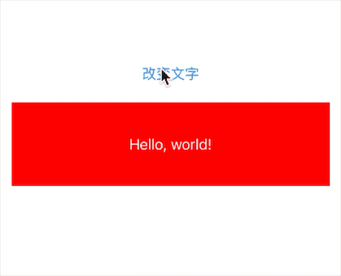

# SwiftUI:下拉刷新之桥接UIKit

下拉刷新是我们在应用中经常用到的一个功能，但是SwiftUI并没有提供类似的api或视图修饰符。
在这篇文章中我们将利用UIKit已有的功能桥接封装提供给SwiftUI的`List`组件使用。

## UIViewRepresentable
`UIViewRepresentable`就是SwiftUI和UIKit中的一个桥梁，系统会把SwiftUI中的View翻译成UIKit中的View，从而获取更加强大的功能。

`UIViewRepresentable`定义如下：
```
public protocol UIViewRepresentable : View where Self.Body == Never {
	associatedtype UIViewType : UIView
	
	//初始化配置UIView类型视图状态并将其返回，context为当前环境上下文。
	//该方法只会在创建的时候执行一次
  func makeUIView(context: Self.Context) -> Self.UIViewType
  
  //使用SwiftUI传递的新信息更新指定视图的属性状态。
  func updateUIView(_ uiView: Self.UIViewType, context: Self.Context)
  
  //在UIKit视图被移除之前清调用，用于视图额外的清理工作。例如删除观察者
  static func dismantleUIView(_ uiView: Self.UIViewType, coordinator: Self.Coordinator)

	associatedtype Coordinator = Void
	
	//创建自定义实例，用于将视图的变量绑定到SwiftUI属性，使两者保持同步。如果没有交互则不必实现该方法
	func makeCoordinator() -> Self.Coordinator

   typealias Context = UIViewRepresentableContext<Self>
}
```
我们自定义一个桥接组件`BridgeView`,实现`UIViewRepresentable`相关协议方法，并在`makeUIView`方法中使用UIKit框架中的组件初始化一个`UILabel`,然后在swiftUI中使用：
```
struct ContentView: View {
    var body: some View {
        BridgeView()
            .frame(height: 100)
            .padding()
    }
}

struct BridgeView: UIViewRepresentable {
    
    func makeUIView(context: Context) -> some UIView {
        let bridgeView = UILabel(frame: .zero)
        bridgeView.backgroundColor = UIColor.red
        return bridgeView
    }
    
    func updateUIView(_ uiView: UIViewType, context: Context) {
        
    }
}
```


接下来我们给`BridgeView`设置一个初始化方法并传入一个字符串,通过点击按钮改变文本的显示:
```
struct ContentView: View {
    @State var text = "Hello, world!"
    
    var body: some View {
        VStack{
            Button("改变文字") {
                text = ["Hello","Hello, world!","你好","你好，世界!"].randomElement()!
            }
            BridgeView(text)
                .frame(height: 100)
                .padding()
        }
        
    }
}

struct BridgeView: UIViewRepresentable {
    let string:String
    init(_ string:String = "") {
        self.string = string
    }
    
    func makeUIView(context: Context) -> some UIView {
        let bridgeView = UILabel(frame: .zero)
        bridgeView.backgroundColor = UIColor.red
        return bridgeView
    }
    
    func updateUIView(_ uiView: UIViewType, context: Context) {
        let bridgeView:UILabel? = uiView as? UILabel
        bridgeView!.text = self.string
    }
}
```
运行项目你会发现，`makeUIView`只执行一次，string发生改变时`init`和`updateUIView`都会重新执行一次。用于更新界面的变化。这里有个问题，为什么`init`方法会重新执行？因为`BridgeView`为`struct`类型。

创建自定义实例，绑定变量到SwiftUI属性：
```
struct BridgeView: UIViewRepresentable {
    @Binding var string:String
    init(_ string:Binding<String>) {
        _string = string
    }
    init(_ string:String) {
        _string = .constant(string)
    }
    
    func makeUIView(context: Context) -> some UIView {
        let bridgeView = UILabel(frame: .zero)
        bridgeView.backgroundColor = UIColor.red
        return bridgeView
    }
    
    func updateUIView(_ uiView: UIViewType, context: Context) {
        let bridgeView:UILabel? = uiView as? UILabel
        bridgeView!.text = string
    }
    
    func makeCoordinator() -> Coordinator {
        return Coordinator($string)
    }
    
    class Coordinator {
        let string:Binding<String>
        init(_ string: Binding<String>) {
            self.string = string
        }
    }
}
```
然后使用`BridgeView($text)`,点击按钮发现`init(_ string:Binding<String>)`只会执行一次了。

有了`Binding`我们可以双向修改数据了，把`UILabel`改为`UIButton`并添加点击事件，改变string值：
```
struct BridgeView: UIViewRepresentable {
    @Binding var string:String
    init(_ string:Binding<String>) {
        _string = string
    }
    init(_ string:String) {
        _string = .constant(string)
    }
    
    func makeUIView(context: Context) -> some UIView {
        let bridgeView = UIButton(frame: .zero)
        bridgeView.backgroundColor = UIColor.red
        bridgeView.addTarget(context.coordinator, action: #selector(Coordinator.onChangedText), for: .touchUpInside)
        return bridgeView
    }
    
    func updateUIView(_ uiView: UIViewType, context: Context) {
        let bridgeView:UIButton? = uiView as? UIButton
        bridgeView!.setTitle(string, for: UIControl.State.normal)
    }
    
    func makeCoordinator() -> Coordinator {
        return Coordinator($string)
    }
    
    class Coordinator {
        let string:Binding<String>
        init(_ string: Binding<String>) {
            self.string = string
        }
        @objc
        func onChangedText() {
            string.wrappedValue = "onChangedText"
        }
        
    }
}
```



## List桥接
有了上面的基础，我们可以在swiftUI中使用`List`组件，要使用下拉刷新功能：

* 从视图层次中找到`List`对应到UIKit中的组件`UITableView`
* 对`UITableView`做一些操作，添加下拉刷新组件
* `Binging`属性回传给swiftUI并作出响应

```
struct ListView: View {
    
    var array = ["a","b","c","d","e","f","g"]
    
    var body: some View {
        NavigationView {
          List(array, id: \.self) { text in
            Text(text)
          }
          .navigationBarTitle("刷新demo")
        }
        .background(PullRefresh())
    }
}

struct PullRefresh: UIViewRepresentable {
    
    func makeUIView(context: Context) -> some UIView {
        let view = UIView(frame: .zero)
        return view
    }
    
    func updateUIView(_ uiView: UIViewType, context: Context) {
        DispatchQueue.main.asyncAfter(deadline: .now()) {
            guard let viewHost = uiView.superview?.superview else {
                return
            }
            guard let tableView = self.tableView(root: viewHost) else {
                return
            }
            print("find:\(tableView)")
        }
    }
    
    private func tableView(root: UIView) -> UITableView? {
        for subview in root.subviews {
            if subview.isKind(of: UITableView.self) {
                return subview as? UITableView
            } else if let tableView = tableView(root: subview) {
                return tableView
            }
        }
        return nil
    }
    
}
```
**注意：**在`updateUIView`方法中，获取`uiView`父视图和祖父视图，都发现获取不到。而在`DispatchQueue.main.asyncAfter`方法返回主线程才能获取到。
我们从祖父视图结构中使用`tableView(root: UIView)`方法递归查找`UITableView`,然后将其返回。

让我们添加下拉组件，更新`updateUIView`方法中的代码：
```
func updateUIView(_ uiView: UIViewType, context: Context) {
   DispatchQueue.main.asyncAfter(deadline: .now()) {
       guard let viewHost = uiView.superview?.superview else {
           return
       }
       guard let tableView = self.tableView(root: viewHost) else {
           return
       }
       
       let refreshControl = UIRefreshControl()
       tableView.refreshControl = refreshControl
   }
}
```


我们看到刷新组件是显示处理了，但是有个问题是它将在什么时机隐藏呢？比如我下拉放手，开始做网络请求，请求完成后隐藏刷新组件。

## 属性绑定交互
为`PullRefresh`组件声明一个可绑定的属性`@Binding var isRefreshing: Bool`,声明一个class引用类型`Coordinator`用于绑定数据的同步。
```
struct ListView: View {
    @State var isRefreshing: Bool = false
    
    var array = ["a","b","c","d","e","f","g"]
    
    var body: some View {
        NavigationView {
          List(array, id: \.self) { text in
            Text(text)
          }
          .navigationBarTitle("刷新demo")
        }
        .background(PullRefresh(isRefreshing: $isRefreshing, action: {
            DispatchQueue.main.asyncAfter(deadline: .now() + 2.0) {
                self.isRefreshing = false
            }
        }))
    }
}

struct PullRefresh: UIViewRepresentable {
    @Binding var isRefreshing: Bool
    let action: (() -> Void)?
    
    init(isRefreshing: Binding<Bool>,action: (() -> Void)? = nil) {
        _isRefreshing = isRefreshing
        self.action = action
    }
    
    func makeUIView(context: Context) -> some UIView {
        let view = UIView(frame: .zero)
        return view
    }
    
    func updateUIView(_ uiView: UIViewType, context: Context) {
        DispatchQueue.main.asyncAfter(deadline: .now()) {
            guard let viewHost = uiView.superview?.superview else {
                return
            }
            guard let tableView = self.tableView(root: viewHost) else {
                return
            }
            if let refreshControl = tableView.refreshControl {
                if self.isRefreshing {
                    refreshControl.beginRefreshing()
                } else {
                    refreshControl.endRefreshing()
                }
                
            }else {
                let refreshControl = UIRefreshControl()
                refreshControl.addTarget(context.coordinator, action: #selector(Coordinator.onValueChanged), for: .valueChanged)
                tableView.refreshControl = refreshControl
            }
            
            
        }
    }
    
    func makeCoordinator() -> Coordinator {
        return Coordinator($isRefreshing, action: action)
    }
    
    class Coordinator {
        let isRefreshing: Binding<Bool>
        let action: (() -> Void)?
        
        init(_ isRefreshing: Binding<Bool>,action: (() -> Void)?) {
            self.isRefreshing = isRefreshing
            self.action = action
        }

        @objc
        func onValueChanged() {
            isRefreshing.wrappedValue = true
            if let actionMethod = action {
                actionMethod()
            }
        }
    }
    
    private func tableView(root: UIView) -> UITableView? {
        for subview in root.subviews {
            if subview.isKind(of: UITableView.self) {
                return subview as? UITableView
            } else if let tableView = tableView(root: subview) {
                return tableView
            }
        }
        return nil
    }
    
}
```


到此看似我们的功能已经完成了。但是我们发现我们只要下拉后，事件回调就会被触发，即使我们不送手。我们将在[下一篇文章]()解决这个问题，并做进一步优化操作！

## 总结

使用`UIViewRepresentable`可以解决一些SwiftUI目前解决不了或解决起来比较麻烦的问题。

