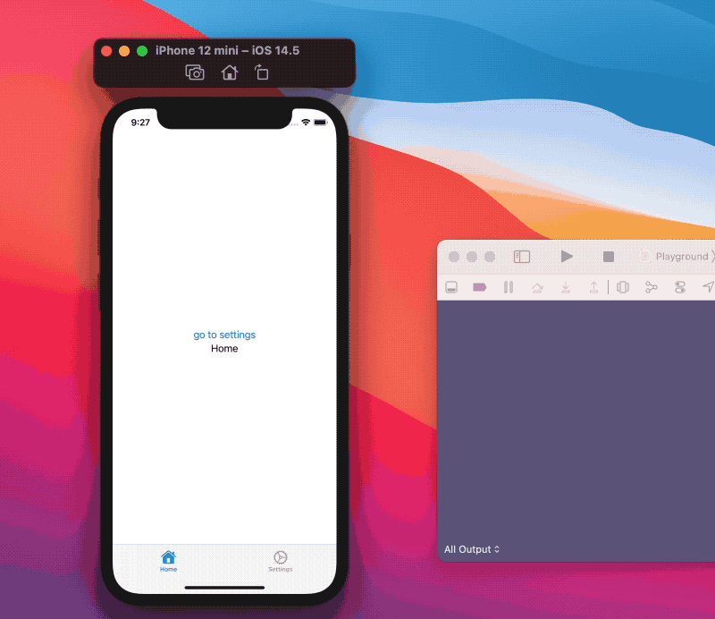

# SwiftUI: 全局状态管理

随着SwiftUI的采用，创建全局范围内状态的新趋势正在形成。这是非常合理的，因为它是为数不多的正确处理深度链接、[HUDs](https://github.com/zhuzhuxingtianxia/GitBlog/blob/master/2021/SwiftUI-%E8%87%AA%E5%AE%9A%E4%B9%89HUDs/SwiftUI-%E8%87%AA%E5%AE%9A%E4%B9%89HUDs.md)等的方法之一。
在本文中，让我们看看这种方法，以及如何避免其使用弊端。

## App

我们将构建一个只有两个tabs的小应用:home和settings 两个tab。
> 我们将以`TabView`为例，但同样的方法也可以用于导航、表、所有其他SwiftUI视图演示等等。


```
struct ContentView: View {
  var body: some View {
   TabView {
      HomeView()
        .tabItem { Label("Home", systemImage: "house.fill") }

      SettingsView()
        .tabItem { Label("Settings", systemImage: "gear") }
    }
  }
}

struct HomeView: View {
  var body: some View {
    Text("Home")
  }
}

struct SettingsView: View {
  var body: some View {
    Text("Settings")
  }
}
```
这里我们已经声明了一个`TabView`和两个视图，`HomeView`和`SettingsView`，每个视图都有一个相关的`Text`文本。

## 控制tab的选择

我们的应用要求以编程方式选择活动标签:例如，我们希望有一个快捷方式让用户从`Home`页跳转到`Settings`标签，或者我们希望切换标签作为深度链接的响应，等等。

我们需要自己管理`TabView`状态，这可以通过`TabView`初始化器来`Binding`参数实现。


```
enum Tab: Hashable {
  case home
  case settings
}

struct ContentView: View {
  @State private var selectedTab: Tab = .home

  var body: some View {
    TabView(selection: $selectedTab) {
      HomeView(selectedTab: $selectedTab)
        .tabItem { Label("Home", systemImage: "house.fill") }
        .tag(Tab.home)

      SettingsView()
        .tabItem { Label("Settings", systemImage: "gear") }
        .tag(Tab.settings)
    }
  }
}

struct HomeView: View {
  @Binding var selectedTab: Tab

  var body: some View {
    VStack {
      Button("go to settings") {
        selectedTab = .settings
      }
      Text("Home")
        .onAppear(perform: { print("home on appear")})
    }
  }
}

struct SettingsView: View {
  ... // same as before
}
```

这次我们更新了如下内容：

* 声明了一个带有所有可能`TabView`状态的`Tab`枚举
* 为`ContentView`添加了`selectedTab`属性，用于控制`TabView`的状态
* 在`Home`页添加了一个按钮可以让我们跳转到`Setting`选项

虽然这已经实现了需求，它让我们可以通过编程方式改变标签状态，但我们仍然需要直接访问`ContentView`的`selectedTab`属性，然后才能改变标签栏状态。

更重要的是，随着应用的发展，将`tab`状态从一个视图传递到另一个视图是不现实的,因此我们需要将状态移出`TabView`，并通过应用范围内的状态将它放到环境中。

## App全局状态

目前的限制是`TabView`的状态可访问性，我们可以通过创建一个全局状态并在环境中设置它来克服这个挑战:
```
class AppWideState: ObservableObject {
  @Published var selectedTab: Tab = .home
}
```
`AppWideState`只保存选项卡状态，并在`selectedTab`即将更改时发送一个新的发布事件。

我们希望这个状态在任何地方都可以访问，我们将把它附加到我们的主`App`，然后把它注入到环境中:

```
@main
struct FiveStarsApp: App {
  @StateObject var appWideState = AppWideState()

  var body: some Scene {
    WindowGroup {
      ContentView()
        .environmentObject(appWideState) // injected in the environment
    }
  }
}
```
一切就绪，让我们更新我们的视图来使用用这个新状态:
```
struct ContentView: View {
  @EnvironmentObject var state: AppWideState // environment object

  var body: some View {
    TabView(selection: $state.selectedTab) { // state from the environment object
      HomeView()
        .tabItem { Label("Home", systemImage: "house.fill") }
        .tag(Tab.home)

      SettingsView()
        .tabItem { Label("Settings", systemImage: "gear") }
        .tag(Tab.settings)
    }
  }
}

struct HomeView: View {
  @EnvironmentObject var state: AppWideState // environment object

  var body: some View {
    VStack {
      Button("go to settings") {
        state.selectedTab = .settings // sets the state from the environment object
      }
      Text("Home")
    }
  }
}

struct SettingsView: View {
  ... // same as before
}
```

> `HomeView`仍然可以使用`@Binding`

这个新结构的工作方式和之前完全一样，但是我们现在可以从主应用和环境到达的任何地方更改所选的标签。

## 几周后

几周过去了，我们的`AppWideState`获得了一些新的`@Published`属性，更多的视图观察到这个对象，我们的应用程序开始变慢:每次我们改变全局状态，我们会注意到在更改选项卡或新导航被推送之前有轻微的延迟，等等。

我们可以通过我们的例子来研究这个谜团。让我们在我们的`HomeView`中添加一个小的副作用，一个打印语句告诉我们`HomeView`主体什么时候执行:
```
struct HomeView: View {
  @EnvironmentObject var state: AppWideState

  var body: some View {
    let _ = print("HomeView body") // side effect
    VStack {
      Button("go to settings") {
        state.selectedTab = .settings
      }
      Text("Home")
    }
  }
}
```
我们可以再次运行应用程序,我们会注意到,每次我们改变标签(点击标签栏或`go to settings`按钮)`HomeView`的`body`重新计算:这是真的,尽管`HomeView`没有真正的读取这个状态而只是设置了它。



如果我们删除了按钮操作，那么`@EnvironmentObject`状态根本就不需要做任何事情，这种情况仍然会发生
```
struct HomeView: View {
  @EnvironmentObject var state: AppWideState

  var body: some View {
    let _ = print("HomeView body") // side effect
    VStack {
      Button("go to settings") {
        // does nothing
      }
      Text("Home")
    }
  }
}
```


现在让我们想象一下:

* 我们有一个导航堆栈(或多个导航堆栈)
* 堆栈中的一些界面使用我们的AppWideState环境对象
* 用户在堆栈的多个层次深处

我们对`AppWideState`所做的每一个改变都将为观察`AppWideState`的所有视图触发一个新的`body`渲染评估，而不仅仅是用户当前正在查看的最后一个视图。
现在很容易解释为什么应用程序变得越来越慢:我们使用和扩展`AppWideState`越多，更多的视图会在每次更改时重新渲染它们的`body`。

这个陷阱其实是意料之中的，因为`EnvironmentObject`只是我们的视图订阅的另一个`ObservableObject`实例，SwiftUI正在做它一直承诺要做的事情:自动订阅和对状态变化做出反应。

## 解决方案
虽然大多数视图可能需要通过`AppWideState`来设置它，但实际上很少需要观察它的状态:以tabbar状态为例，只有`TabView`需要观察它，所有其他视图只需要改变它。

要做到这一点，一种方法是创建一个包含全应用范围状态的容器，容器本身不发布任何东西:
```
class AppStateContainer: ObservableObject {
  ...
}
```
不同于将每个状态声明为该容器的`@Published`属性，每个状态都将嵌套到自己的`ObservableObject`中，然后`ObservableObject`将成为容器的一部分:
```
class TabViewState: ObservableObject {
  @Published var selectedTab: Tab = .home
}

class AppStateContainer: ObservableObject {
  var tabViewState = TabViewState()
}

```
容器符合`ObservableObject`，因为它是环境对象的需求，但是它不发布任何东西，同时我们把`selectedTab`状态移动到它自己的`TabViewState`。

这种方法还将每个应用程序状态隔离到它自己的“迷你容器”中(上面的`TabViewState`)，因此我们可以将每个特定状态的所有逻辑(如果有的话)集中到它自己的类中，而不是将其共享在一个大类中。

有了这些，我们现在可以把`AppStateContainer`和`TabViewState`设置到环境中了:
```
@main
struct FiveStarsApp: App {
  @StateObject var appStateContainer = AppStateContainer()

  var body: some Scene {
    WindowGroup {
      ContentView()
        .environmentObject(appStateContainer)
        .environmentObject(appStateContainer.tabViewState)
    }
  }
}
```
需要观察状态变化的视图将直接观察`TabViewState`，而只需要改变状态的视图将直接作用于容器:
```
struct ContentView: View {
  @EnvironmentObject var state: TabViewState

  var body: some View {
    TabView(selection: $state.selectedTab) {
      HomeView()
        .tabItem {
          Label("Home", systemImage: "house.fill")
        }
        .tag(Tab.home)

      SettingsView()
        .tabItem {
          Label("Settings", systemImage: "gear")
        }
        .tag(Tab.settings)
    }
  }
}

struct HomeView: View {
  @EnvironmentObject var container: AppStateContainer

  var body: some View {
    let _ = print("Home body")
    VStack {
      Button("go to settings") {
        container.tabViewState.selectedTab = .settings
      }
      Text("Home")
        .onAppear(perform: { print("home on appear")})
    }
  }
}
```

有了这个改变，我们的应用性能又回来了，没有多余的视图`body`计算。
在这个例子中，我们让`HomeView`直接访问`AppStateContainer`并改变`TabView`状态本身，然而，我们也可以在容器上添加一些方便的API来让这变得更简单.


