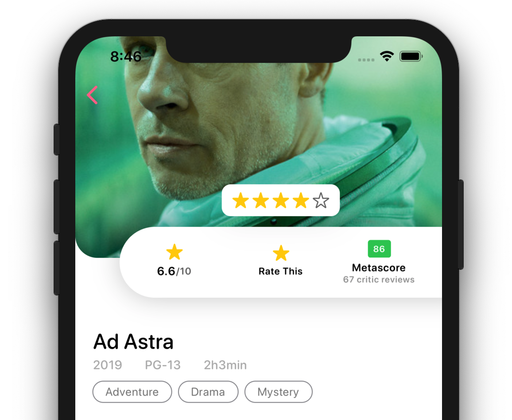
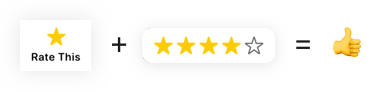
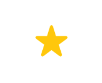
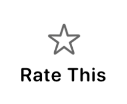
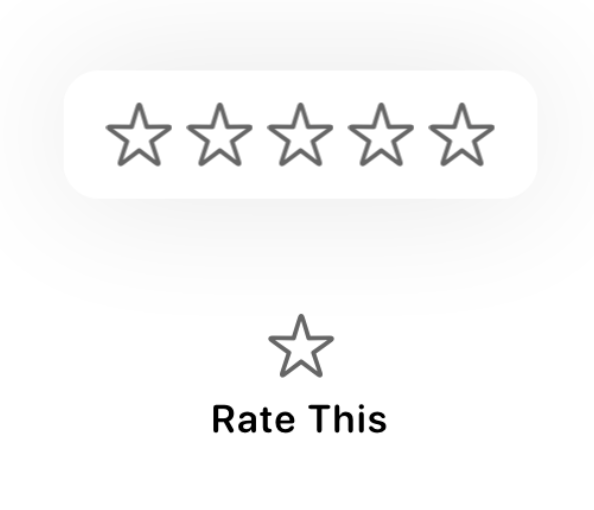

# SwiftUI:制作评价按钮

以下是我们今天要创建的内容。在本教程中，你将能够在你的应用程序中使用这个弹出评论按钮，根据需求对类似服务或质量进行评价。



## 开始

创建一个新的名为`ReviewButton`的SwiftUI文件来生成一个模板,这个视图将把所有东西联系在一起。一旦我们完成了按钮的构建，我们将把它添加到我们的应用程序中。
```
import SwiftUI

struct ReviewButton: View {
    var body: some View {
        Text("Hello, World!")
    }
}

struct ReviewButton_Previews: PreviewProvider {
    static var previews: some View {
        ReviewButton()
    }
}
```

## 视图分解
我们将把这个`ReviewButton`分解为两部分。第一个是星`Image`和“Rate This”`Text`，第二个是弹出的5颗星。



很明显，在这个项目中会有很多Star出现，所以让我们继续创造一个对我们有利的Star按钮。

1. 再创建一个SwiftUI视图命名为`StarIcon`
2. 为`StarIcon`添加一个属性变量`filled`
  	```
  	var filled: Bool = false
	```

3. 用一个`Image`替换模版中的代码，用于显示一个star。这里的关键是改变使用系统提供的`star.fill`或`star`图标。我们将使用刚才定义的属性来决定。
	```
	Image(systemName: filled ? "star.fill" : "star")
	```

4. 然后我们设置StarIcon中的Image是否填充颜色
 	```
 	Image(systemName: filled ? "star.fill" : "star")
    .foregroundColor(filled ? Color.yellow : Color.black.opacity(0.6))
	```

组合一下代码，如下：
```
import SwiftUI

struct RatingIcon: View {
    
    var filled:Bool = true
    
    var body: some View {
        Image(systemName: filled ? "star.fill" : "star")
            .foregroundColor(filled ? Color.yellow : Color.black.opacity(0.6))
    }
}

struct RatingIcon_Previews: PreviewProvider {
    static var previews: some View {
        RatingIcon(filled: true)
    }
}
```



## 使用Star

就像我之前说的，我们要先创建Star星号和Label标签，然后是Popup。

回到`ReviewButton`，让我们开始第一部分。

替换body中的代码：
```
Button(action: {
    // Empty for now...
}) {
    VStack(alignment: .center, spacing: 8) {
        //Star Icon and Label Here...
        StarIcon()
        Text("Rate This")
            .foregroundColor(Color.black)
            .font(Font.system(size: 11, weight: .semibold, design: .rounded))
    }
}
```



## 创建Popup
现在我们要创建一个显示5颗星组的弹出窗口。我们将重用之前创建的`StarIcon`。

1. 在`RatingButton`视图中，像这样在`Button`的顶部添加一个覆盖层。

```
Button(action: {
    // Empty for now...
}) {
    VStack(alignment: .center, spacing: 8) {
        //Star Icon and Label Here...
        StarIcon()
        Text("Rate This")
            .foregroundColor(Color.black)
            .font(Font.system(size: 11, weight: .semibold, design: .rounded))
    }
}.overlay( /* Star Icons Here */ )
```

2. 使用`HStack`将五个`StarIcons`放在一起。确保对齐方式为`center`，并且`HStack`使用的`spacing`值为4。

```
.overlay(
    HStack(alignment: .center, spacing: 4) {
        RatingIcon(filled: false)
        RatingIcon(filled: false)
        RatingIcon(filled: false)
        RatingIcon(filled: false)
        RatingIcon(filled: false)
    }
)
```

3. 现在让我们给弹出框添加一些样式`padding` `background` `cornerRadius` `shadow`

```
.overlay(
    HStack(alignment: .center, spacing: 4) {
        RatingIcon(filled: false)
        RatingIcon(filled: false)
        RatingIcon(filled: false)
        RatingIcon(filled: false)
        RatingIcon(filled: false)
    } // Start styling the popup...
    .padding(.all, 12)
    .background(Color.white)
    .cornerRadius(10)
    .shadow(color: Color.black.opacity(0.1), radius: 20, x: 0, y: 0)
)
```

4. 现在将弹出窗口向上偏移，这样它就不会直接位于按钮的顶部。
 ```
 .overlay(
   HStack(alignment: .center, spacing: 4) {
       RatingIcon(filled: false)
       RatingIcon(filled: false)
       RatingIcon(filled: false)
       RatingIcon(filled: false)
       RatingIcon(filled: false)
   }
   .padding(.all, 12)
   .background(Color.white)
   .cornerRadius(10)
   .shadow(color: Color.black.opacity(0.1), radius: 20, x: 0, y: 0)
   .offset(x: 0, y: -70) // Move the view above the button
)
```




## 显示弹出框

接下来，我们需要隐藏弹出窗口，直到点击按钮。为`ReviewButton`添加`bool`属性，用于控制弹出窗口的状态。
```
@State var popupOpen:Bool = false
```

现在回到我们之前声明的`Button`。将此代码片段添加到`action`参数中。

```
Button(action: {
    withAnimation { self.popupOpen = !self.popupOpen }
})
```

然后将这些代码添加到`overlay`覆盖层内的`HStack`中，以调整不透明度`opacity`。你应该把它放在我们设置覆盖的偏移量的下面。

```
.opacity(popupOpen ? 1.0 : 0)
```

现在让我们尝试一下吧！


## 添加评论功能

接下来，我们需要根据用户评价开始给星星上色。为了跟踪这一点，添加一个属性来跟踪星级评级。

```
@State var stars:Int = 0
```
我们将使用这个属性给按钮和弹出框上的星号改变颜色。让我们修改代码来反映这一点。

1. 如果当前星级评分大于`0`，则将按钮内的`StarIcon`更改为黄色。
```
// Inside the Button
VStack(alignment: .center, spacing: 8) {
    //Star Icon and Label Here...
    StarIcon(filled: stars > 0)
    // "Rate This" Label Below
```
2. 也可以修改弹出窗口覆盖层内的`StarIcon`s来改变颜色。

```
HStack(alignment: .center, spacing: 4) {
    RatingIcon(filled: stars > 0)
    RatingIcon(filled: stars > 1)
    RatingIcon(filled: stars > 2)
    RatingIcon(filled: stars > 3)
    RatingIcon(filled: stars > 4)
}
```
既然`StarIcon`s将随着评级的变化而改变颜色，我们需要允许用户选择评级。我们会使用`DragGesture`来实现这个。

在我们声明`popupOpen`和`stars`属性的下面，创建一个`DragGesture`。将`minimumDistance`设置为`0`，将`coordinateSpace`设置为`.local`。

```
var gesture: some Gesture {
    return DragGesture(minimumDistance: 0, coordinateSpace: .local)
        .onChanged({ val in
            // Update Rating Here
        })
        .onEnded { val in
           // Update Rating Here
        }
}
```
最后，要做的最后一件事是根据用户的点击或拖动的`x`位置计算已经选择了多少颗星星。

在上面声明一个闭包，返回`DragGesture`，并让它接受`x`位置的`CGFloat`。然后，我们将快速计算确定用户选择了哪个`StarIcon`并更新状态。

```
let updateRating: (CGFloat)->() = { x in
    let percent = max((x / 110.0), 0.0)
    self.stars = min(Int(percent * 5.0) + 1, 5)
}
```

然后调用我们之前设置的`onChanged`和`onEnded`函数。

```
return DragGesture(minimumDistance: 0, coordinateSpace: .local)
.onChanged({ val in
    updateRating(val.location.x)
})
.onEnded { val in
    updateRating(val.location.x)
    DispatchQueue.main.asyncAfter(deadline: .now() + 0.1) {
        withAnimation {
            self.popupOpen = false
        }
    }
}
```

最后要做的是在弹出框中添加手势!只需在`HStack`之后直接添加这段代码。

```
HStack(alignment: .center, spacing: 4) {
    RatingIcon(filled: stars > 0)
    RatingIcon(filled: stars > 1)
    RatingIcon(filled: stars > 2)
    RatingIcon(filled: stars > 3)
    RatingIcon(filled: stars > 4)
}
.gesture(dragGesture)
```

## 最终效果


