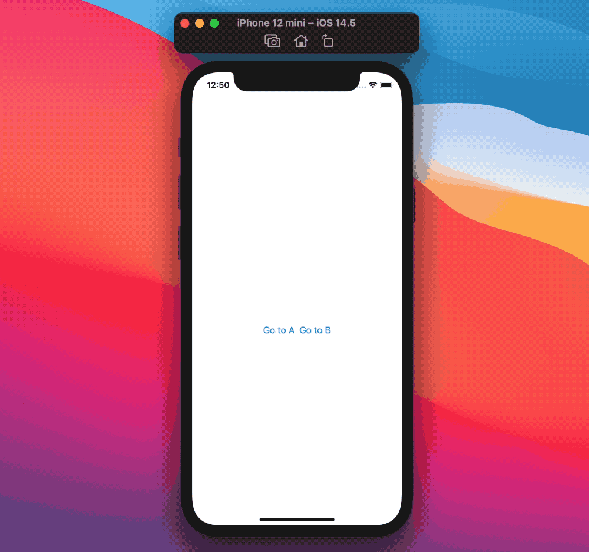

# SwiftUI:反射探究图谱

SwiftUI团队在去年的WWDC上给我们的一个性能提示是让视图初始化器越轻越好:这是因为我们的视图每秒可以创建和销毁多次。
从另一个角度来看，我们的`Views`视图并不是实际的视图，它们应该更多地被视为视图的外观和行为的方法，但是它们的实际实现是由SwiftUI在幕后处理的。
此外，这也解释了为什么我们使用`@State`和`@StateObject`这样的属性包装器:我们的`View`视图并不拥有/持有这样的值，而是它们的SwiftUI实现的对应对象拥有/持有这样的值。
SwiftUI是一个状态驱动的框架:事情发生是因为某些事情发生了变化，而另一些事情正在观察这些变化。

在[SwiftUI:@State原理解析]()中，我们已经介绍了如何创建SwiftUI所观察到的自己的属性包装器，在这篇新文章中，我们将探索SwiftUI如何首先知道要观察什么。

> 像往常一样，我无法访问实际的SwiftUI代码/实现。我们在这里发现的是对原始行为的最佳猜测/模仿，在实际实现中可能有更多的内容。

## SwiftUI的图谱
在图论中，树是一种特殊的图结构。这篇文章同时使用了“图”和“树”。
当我们显示SwiftUI视图时，SwiftUI将创建并跟踪其关联的视图的图结构。

假设这是我们的应用主视图:
```
struct ContentView: View {
  var body: some View {
    NavigationView {
      HStack {
        NavigationLink(
          "Go to A",
          destination: ViewA()
        )

        NavigationLink(
          "Go to B",
          destination: ViewB()
        )
      }
    }
  }
}
```
其中`ViewA`和`ViewB`的定义如下:

```
struct ViewA: View {
  @State var stringState: String = "A"

  var body: some View {
    VStack {
      Text(stringState)
      Button("Change string") {
        stringState = ["A", "AA", "AAA", "AAAA"].randomElement()!
      }
    }
  }
}

struct ViewB: View {
  var body: some View {
    Text("B")
  }
}
```



在[SwiftUI：views检查Mirror]()中使用相同的方法，我们可以浏览相关的视图树，它大致匹配SwiftUI的内部图结构:
```
NavigationView<
  HStack<
    TupleView<
      (
        NavigationLink<Text, ViewA>, 
        NavigationLink<Text, ViewB>
      )
    >
  >
>
```
其中`NavigationView`是树的根，而每个`NavigationLink`是一个叶节点。

我们看到`ContentView`上面的树就是SwiftUI需要担心的。
让我们假设用户接下来点击`Go to A`，此时活动的SwiftUI图形将展开，包含`ViewA`自己的树:

```
VStack<
  TupleView<
    (
      Text, 
      Button<Text>
    )
  >
>
```
新的活跃SwiftUI图谱:
```
NavigationView<
  HStack<
    TupleView<
      (
        NavigationLink<
          Text, 
          VStack<
            TupleView<
              (
                Text, 
                Button<Text>
              )
            >
          >
        >, 
        NavigationLink<Text, ViewB>
      )
    >
  >
>
```
`ViewA`不是一个静态视图，但它有自己的`@State`属性包装器，而`@State`属性包装器又有自己的`storage`存储和`publisher`发布器:

* 只要`ViewA`是活动图的一部分，SwiftUI就需要分配、保存和订阅`ViewA`的动态属性。
* 当用户返回到`ContentView`时，`ViewA`将从SwiftUI的活动图中删除，所有`ViewA`的动态属性和关联的`storage`存储和`publisher`发布器也需要释放。

SwiftUI如何知道哪个存储/发布者与每个视图相关联?下面我们来回答这个问题。

## 动态 VS 静态试图
假如我们的应用需要显示`ViewA`:在这样做之前，SwiftUI需要弄清楚`ViewA`是动态的(也就是有自己的storage/publishers)还是静态的(也就是它是一组原语，如`Int`, `String`等)。

这个问题的答案取决于视图的属性包装器。
需要注意的是，SwiftUI的属性包装器并没有提供实际的关联值，而是只提供了对它们的引用:这些值不是`View`本身的一部分。
也就是说，我们可以初始化动态`View`，即使它的关联存储尚未被分配。

考虑到这一点，SwiftUI可以在视图成为活动图的一部分之前，使用反射来确定视图拥有哪些动态属性:
```
extension View {
  /// Finds and returns the dynamic properties of a view instance.
  func dynamicProperties() -> [(String, DynamicProperty)] {
    Mirror(reflecting: self)
      .children
      .compactMap { child in
        if var name = child.label,
           let property = child.value as? DynamicProperty {

          // Property wrappers have underscore-prefixed names.
          name = String(name.first == "_" ? name.dropFirst(1) : name.dropFirst(0))

          return (name, property)
        }
        return nil
      }
  }
}
```
这个新的`View`方法:

* 获取视图的`Mirror`表示
* 通过mirror反射的子属性提取视图属性
* 过滤并返回视图的每个`DynamicProperty`的name名称和value值。

> 我们在[@State原理解析]()中了解到,所有SwiftUI的属性包装器都符合`DynamicProperty`协议。

通过`dynamicProperties()`(或类似的方法)，SwiftUI可以确定视图是静态的还是动态的，并可以将这些发现添加到其内部图谱中的关联视图节点。
SwiftUI拥有了让用户在其图形中导航所需要的东西，并知道在每次变化时什么时候实例化或销毁试图。

## ViewA例子

为了让事情更清楚，让我们在`ViewA`上调用`dynamicProperties()`。
首先，让我们在`ViewA`的初始化中这样做:

```
struct ViewA: View {
  @State var stringState: String = "A"

  init() {
    print(dynamicProperties())
  }

  var body: some View {
    ...
  }
}
```
它第一次执行是在SwiftUI计算`ContentView`的body主体时，因为`ViewA()`是一个`NavigationLink`声明的一部分。
`dynamicProperties()`输出：
```
[
  (
    "stringState",
    SwiftUI.State<Swift.String>(_value: "A", _location: nil)
  )
]
```
`dynamicProperties()`正确地找到`ViewA`的`@State`属性`stringState`，但是此时`ViewA`不是SwiftUI活动图的一部分，因此还没有相关`storage`存储属性,所以`_location: nil`。

现在让我们在`ViewA`生命周期的地方调用`dynamicProperties()`，例如`onAppear`:
```
struct ViewA: View {
  @State var stringState: String = "A"

  var body: some View {
    VStack {
      ...
    }
    .onAppear(perform: {
      print(dynamicProperties())
    })
  }
}
```
`ViewA`的`onAppear`触发的唯一方法是将视图显示给用户，使`ViewA`成为SwiftUI活动图形的一部分，在这种情况下，`dynamicProperties()`的输出如下:
```
[
  (
    "stringState", 
    SwiftUI.State<Swift.String>(
      _value: "A", 
      _location: Optional(SwiftUI.StoredLocation<Swift.String>)
    )
  )
]
```
然而我们的`@State`属性再次被发现，因为`ViewA`现在是SwiftUI活动图形的一部分，它的关联状态已完全初始化和被管理，我们可以从`_location`值确认这一点。

一旦用户返回到`ContentView`，这个`@State`(及其`SwiftUI.StoredLocation`)将被销毁，并且不会被重新创建，直到`ViewA`将再次成为活动图形的一部分。

## 结束
在这篇文章中，我们了解了SwiftUI是如何工作和管理视图的:

大多数情况下，我们不需要深究，但这些知识可能帮助我们理解一些东西:事情有时不像我们期望的那样工作。

