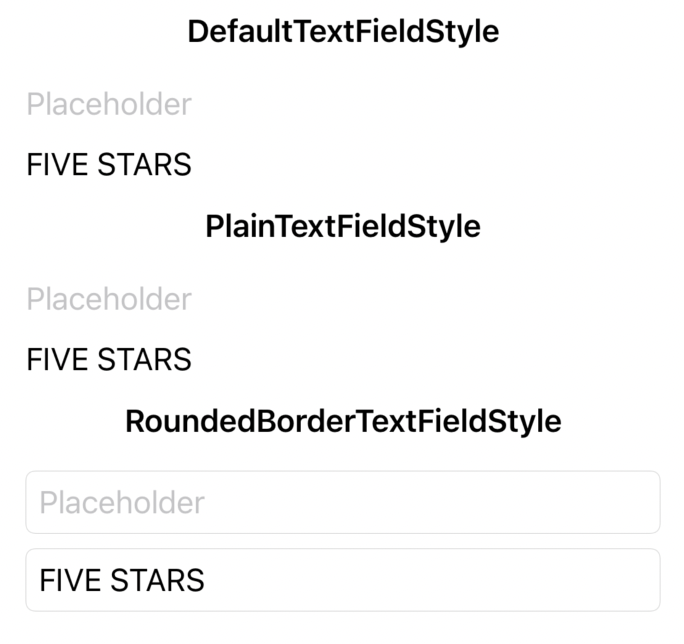
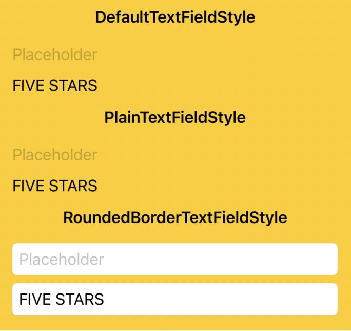
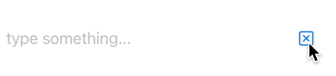
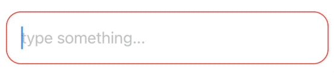
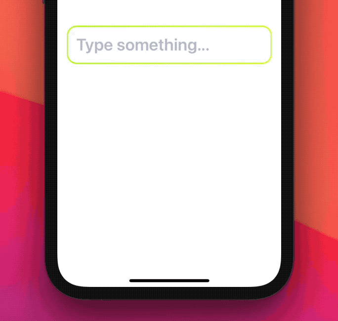
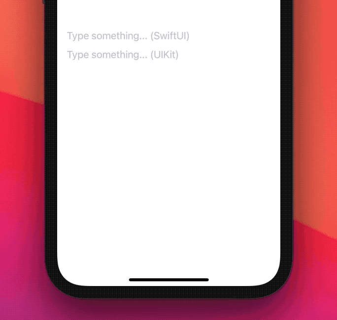
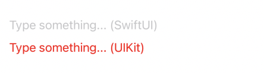
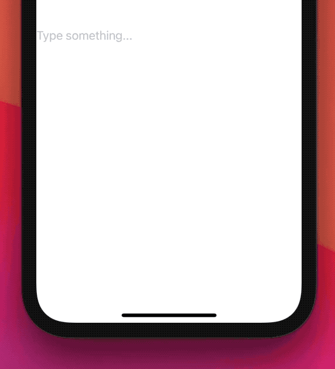

# SwiftUI：四种方式自定义TextField

## TextFieldStyle
在考虑自定义之前，我们应该考虑SwiftUI提供什么。`TextField`有自己的风格，给我们提供了一些选项:

* `DefaultTextFieldStyle`
* `PlainTextFieldStyle`
* `RoundedBorderTextFieldStyle`



```
VStack {
  Section(header: Text("DefaultTextFieldStyle").font(.headline)) {
    TextField("Placeholder", text: .constant(""))
    TextField("Placeholder", text: $text)
  }
  .textFieldStyle(DefaultTextFieldStyle())

  Section(header: Text("PlainTextFieldStyle").font(.headline)) {
    TextField("Placeholder", text: .constant(""))
    TextField("Placeholder", text: $text)
  }
  .textFieldStyle(PlainTextFieldStyle())

  Section(header: Text("RoundedBorderTextFieldStyle").font(.headline)) {
    TextField("Placeholder", text: .constant(""))
    TextField("Placeholder", text: $text)
  }
  .textFieldStyle(RoundedBorderTextFieldStyle())
}
```
`DefaultTextFieldStyle`是`TextField`的默认样式，在iOS中，这匹配了`PlainTextFieldStyle`。

`PlainTextFieldStyle`和`RoundedBorderTextFieldStyle`区别似乎只是一个圆角和边框,然而一个`RoundedBorderTextFieldStyle`的`TextField`还带有一个白色/黑色背景(取决于环境外观),而`TextField` `PlainTextFieldStyle`是透明的:



```
VStack {
  Section(header: Text("DefaultTextFieldStyle").font(.headline)) {
    TextField("Placeholder", text: .constant(""))
    TextField("Placeholder", text: $text)
  }
  .textFieldStyle(DefaultTextFieldStyle())

  Section(header: Text("PlainTextFieldStyle").font(.headline)) {
    TextField("Placeholder", text: .constant(""))
    TextField("Placeholder", text: $text)
  }
  .textFieldStyle(PlainTextFieldStyle())

  Section(header: Text("RoundedBorderTextFieldStyle").font(.headline)) {
    TextField("Placeholder", text: .constant(""))
    TextField("Placeholder", text: $text)
  }
  .textFieldStyle(RoundedBorderTextFieldStyle())
}
.background(Color.yellow)
```
这是系统的方式，下面让我们说说自定义的方式

## TextFieldStyle的Configuration
如何创建一个样式，添加一个清除的按钮?
```
struct ContentView: View {
  @State var text = "FIVE STARS"

  var body: some View {
    TextField(
      "type something...",
      text: $text
    )
    .textFieldStyle(ClearStyle())
  }
}

struct ClearStyle: TextFieldStyle {
  @ViewBuilder
  func _body(configuration: TextField<_Label>) -> some View {
    let mirror = Mirror(reflecting: configuration)
    let text: Binding<String> = mirror.descendant("_text") as! Binding<String>
    configuration
      .overlay(
        Button { text.wrappedValue = "" } label: { Image(systemName: "clear") }
          .padding(),
        alignment: .trailing
      )
  }
}
```



或者我们希望根据是否满足文本字段的要求来获得不同的视觉效果:
```
struct ContentView: View {
  @State var text = "FIVE STARS"

  var body: some View {
    TextField(
      "type something...",
      text: $text
    )
    .textFieldStyle(RequirementStyle())
  }
}

struct RequirementStyle: TextFieldStyle {
  @ViewBuilder
  func _body(configuration: TextField<_Label>) -> some View {
    let mirror = Mirror(reflecting: configuration)
    let text: String = mirror.descendant("_text", "_value") as! String
    configuration
      .padding()
      .background(
        RoundedRectangle(cornerRadius: 16)
          .strokeBorder(text.count > 3 ? Color.green : Color.red)
      )
  }
}
```



我们也可以随意调用`onEditingChanged`或`onCommit`:
```
struct DeceiveStyle: TextFieldStyle {
  @ViewBuilder
  func _body(configuration: TextField<_Label>) -> some View {
    let mirror = Mirror(reflecting: configuration)
    let onCommit: () -> Void = mirror.descendant("onCommit") as! () -> Void

    VStack {
      configuration
      Button("Trigger onCommit event", action: onCommit)
    }
  }
}
```
这种方法的一个限制是我们不能订阅我们的样式到`onEditingChanged`或`onCommit`事件。
一旦官方api是公开的，这可能是可能的，可能有一个新的`TextField`初始化器接受`TextFieldConfiguration`和两个可选的`onEditingChanged`或`onCommit`块。

## 方式1: swiftUI方式

没有公共的API来创建新的`TextField`的样式的，推荐的方式就是对`TextField`进行一次包装：

```
public struct FSTextField: View {
  var titleKey: LocalizedStringKey
  @Binding var text: String

  /// Whether the user is focused on this `TextField`.
  @State private var isEditing: Bool = false

  public init(_ titleKey: LocalizedStringKey, text: Binding<String>) {
    self.titleKey = titleKey
    self._text = text
  }

  public var body: some View {
    TextField(titleKey, text: $text, onEditingChanged: { isEditing = $0 })
      // Make sure no other style is mistakenly applied.
      .textFieldStyle(PlainTextFieldStyle())
      // Text alignment.
      .multilineTextAlignment(.leading)
      // Cursor color.
      .accentColor(.pink)
      // Text color.
      .foregroundColor(.blue)
      // Text/placeholder font.
      .font(.title.weight(.semibold))
      // TextField spacing.
      .padding(.vertical, 12)
      .padding(.horizontal, 16)
      // TextField border.
      .background(border)
  }

  var border: some View {
    RoundedRectangle(cornerRadius: 16)
      .strokeBorder(
        LinearGradient(
          gradient: .init(
            colors: [
              Color(red: 163 / 255.0, green: 243 / 255.0, blue: 7 / 255.0),
              Color(red: 226 / 255.0, green: 247 / 255.0, blue: 5 / 255.0)
            ]
          ),
          startPoint: .topLeading,
          endPoint: .bottomTrailing
        ),
        lineWidth: isEditing ? 4 : 2
      )
  }
}
```



这是可以真正的自定义一个`TextField`。没有办法改变占位符文本的颜色，或者设置不同文本的字体的大小：我们可以通过使用外部文本甚至在跟踪TextField状态时应用掩码来绕过一些限制，但是我们会很快遇到其他的困境，例如键盘操作相关的一些内容。

在ios15之后，你可以通过使用`FocusState`属性包装器消除SwiftUI上的键盘:
```
@FocusState private var textFieldFocused: Bool

VStack {
    if showName {
        Text("Your name is \(name)")
    }
    TextField("Name", text: $name)
        .submitLabel(.next)
        .focused($textFieldFocused)

    Button("Submit") {
        showName = true
        textFieldFocused = false
    }
}.padding()
```


## 方式2: 桥接UIKit方式

当`TextField`不能满足我们的需求时，我们可以回到UIKit的`UITextField`.这需要创建一个`UIViewRepresentable`:
```
struct UIKitTextField: UIViewRepresentable {
  var titleKey: String
  @Binding var text: String

  public init(_ titleKey: String, text: Binding<String>) {
    self.titleKey = titleKey
    self._text = text
  }

  func makeUIView(context: Context) -> UITextField {
    let textField = UITextField(frame: .zero)
    textField.delegate = context.coordinator
    textField.setContentHuggingPriority(.defaultHigh, for: .vertical)
    textField.setContentCompressionResistancePriority(.defaultLow, for: .horizontal)
    textField.placeholder = NSLocalizedString(titleKey, comment: "")

    return textField
  }

  func updateUIView(_ uiView: UITextField, context: Context) {
    if text != uiView.text {
        uiView.text = text
    }
  }

  func makeCoordinator() -> Coordinator {
    Coordinator(self)
  }

  final class Coordinator: NSObject, UITextFieldDelegate {
    var parent: UIKitTextField

    init(_ textField: UIKitTextField) {
      self.parent = textField
    }

    func textFieldDidChangeSelection(_ textField: UITextField) {
      guard textField.markedTextRange == nil, parent.text != textField.text else {
        return
      }
      parent.text = textField.text ?? ""
    }

    func textFieldShouldReturn(_ textField: UITextField) -> Bool {
      textField.resignFirstResponder()
      return true
    }
  }
}
```
与SwiftUI的`TextField`使用比较：

```
struct ContentView: View {
  @State var text = ""

  var body: some View {
    VStack {
      TextField("Type something... (SwiftUI)", text: $text)
      UIKitTextField("Type something... (UIKit)", text: $text)
    }
  }
}
```



一旦我们有了这个基本`TextField`文本框，我们可以继续获取所有需要的UIKit功能，例如，改变占位符的文本颜色现在需要在`UIKitTextField`的`makeUIView(context:)`方法中添加以下代码:

```
textField.attributedPlaceholder = NSAttributedString(
  string: NSLocalizedString(titleKey, comment: ""),
  attributes: [.foregroundColor: UIColor.red]
)
```



有了UIKit，我们可以做更多的事情，而不仅仅是简单的定制。例如，我们可以将日期/选择器和键盘类型与我们的`TextField`文本字段关联起来，这两种类型在SwiftUI中都不支持。更重要的是，我们可以使任何文本字段成为第一响应者。

对于一个高级的`TextField` `UIViewRepresentable`示例，我建议查看[SwiftUIX's CocoaTextField](https://github.com/SwiftUIX)。

## 方式3: Introspect

尽管SwiftUI APIs 与UIKit非常不同，但通常UIKit仍然在幕后使用。在iOS 14中，`TextField`的底层仍然是使用的`UITextField`:记住这一点,我们可以遍历`TextField`的UIKit层次结构，并寻找相关的`UITextField`。

SwiftUI库`Introspect`所要做的就是，允许我们接触到与SwiftUI视图对应的UIKit视图，从而让我们解锁UIKit的性能和管理，而无需创建我们自己的`UIViewRepresentable`:

```
import Introspect

struct ContentView: View {
  @State var text = ""

  var body: some View {
    TextField("Type something...", text: $text)
      .introspectTextField { textField in
        // this method will be called with our view's UITextField (if found)
        ...
      }
  }
}
```

例如，SwiftUI没有办法将工具栏与给定的文本字段关联起来，我们可以使用`Introspect`来修补它:

```
struct ContentView: View {
  @State var text = ""

  var body: some View {
    TextField("Type something...", text: $text)
      .introspectTextField(customize: addToolbar)
  }

  func addToolbar(to textField: UITextField) {
    let toolBar = UIToolbar(
      frame: CGRect(
        origin: .zero,
        size: CGSize(width: textField.frame.size.width, height: 44)
      )
    )
    let flexButton = UIBarButtonItem(
      barButtonSystemItem: UIBarButtonItem.SystemItem.flexibleSpace,
      target: nil,
      action: nil
    )
    let doneButton = UIBarButtonItem(
      title: "Done",
      style: .done,
      target: self,
      action: #selector(textField.didTapDoneButton(_:))
    )
    toolBar.setItems([flexButton, doneButton], animated: true)
    textField.inputAccessoryView = toolBar
  }
}

extension  UITextField {
  @objc func didTapDoneButton(_ button: UIBarButtonItem) -> Void {
    resignFirstResponder()
  }
}
```

超过20行添加一个`Done`按钮!




虽然这种方法现在很有效，但不能保证在未来的iOS版本中也能有效，因为我们依赖于SwiftUI的私有实现细节。
使用`Introspect`是安全的:当SwiftUI的`TextField`将不再使用`UITextField`时，我们的自定义方法(`addToolbar(to)`在上面的例子)将不会被调用。

## 方式4: TextFieldStyle

在文章的开头提到了SwiftUI不允许我们创建自己的`TextFieldStyle`。
在Xcode 12.5中，这是完整的`TextFieldStyle`声明:

```
/// A specification for the appearance and interaction of a text field.
@available(iOS 13.0, macOS 10.15, tvOS 13.0, watchOS 6.0, *)
public protocol TextFieldStyle {

}
```

然而，它实际上可以通过一个“hidden”`_body`方法来创建我们自己的样式，因此我们可以这样考虑实际的`TextFieldStyle`声明如下:

```
public protocol TextFieldStyle {
  associatedtype _Body: View
  @ViewBuilder func _body(configuration: TextField<Self._Label>) -> Self._Body
  typealias _Label = _TextFieldStyleLabel
}
```

这让创建我们自己的样式成为可能：

```
struct FSTextFieldStyle: TextFieldStyle {
  func _body(configuration: TextField<_Label>) -> some View {
     //
  }
}
```

下面是我们如何用一个新的`FSTextFieldStyle`来替换之前的`FSTextField`声明:

```
struct ContentView: View {
  @State var text = ""

  /// Whether the user is focused on this `TextField`.
  @State private var isEditing: Bool = false

  var body: some View {
    TextField("Type something...", text: $text, onEditingChanged: { isEditing = $0 })
      .textFieldStyle(FSTextFieldStyle(isEditing: isEditing))
  }
}

struct FSTextFieldStyle: TextFieldStyle {
  /// Whether the user is focused on this `TextField`.
  var isEditing: Bool

  func _body(configuration: TextField<_Label>) -> some View {
    configuration
      .textFieldStyle(PlainTextFieldStyle())
      .multilineTextAlignment(.leading)
      .accentColor(.pink)
      .foregroundColor(.blue)
      .font(.title.weight(.semibold))
      .padding(.vertical, 12)
      .padding(.horizontal, 16)
      .background(border)
  }

  var border: some View {
    RoundedRectangle(cornerRadius: 16)
      .strokeBorder(
        LinearGradient(
          gradient: .init(
            colors: [
              Color(red: 163 / 255.0, green: 243 / 255.0, blue: 7 / 255.0),
              Color(red: 226 / 255.0, green: 247 / 255.0, blue: 5 / 255.0)
            ]
          ),
          startPoint: .topLeading,
          endPoint: .bottomTrailing
        ),
        lineWidth: isEditing ? 4 : 2
      )
  }
}
```


不幸的是，这种方法使用了私有API，使用起来不安全:希望我们很快就能得到一个正式的API。


