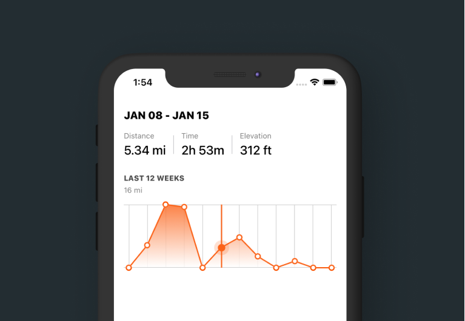
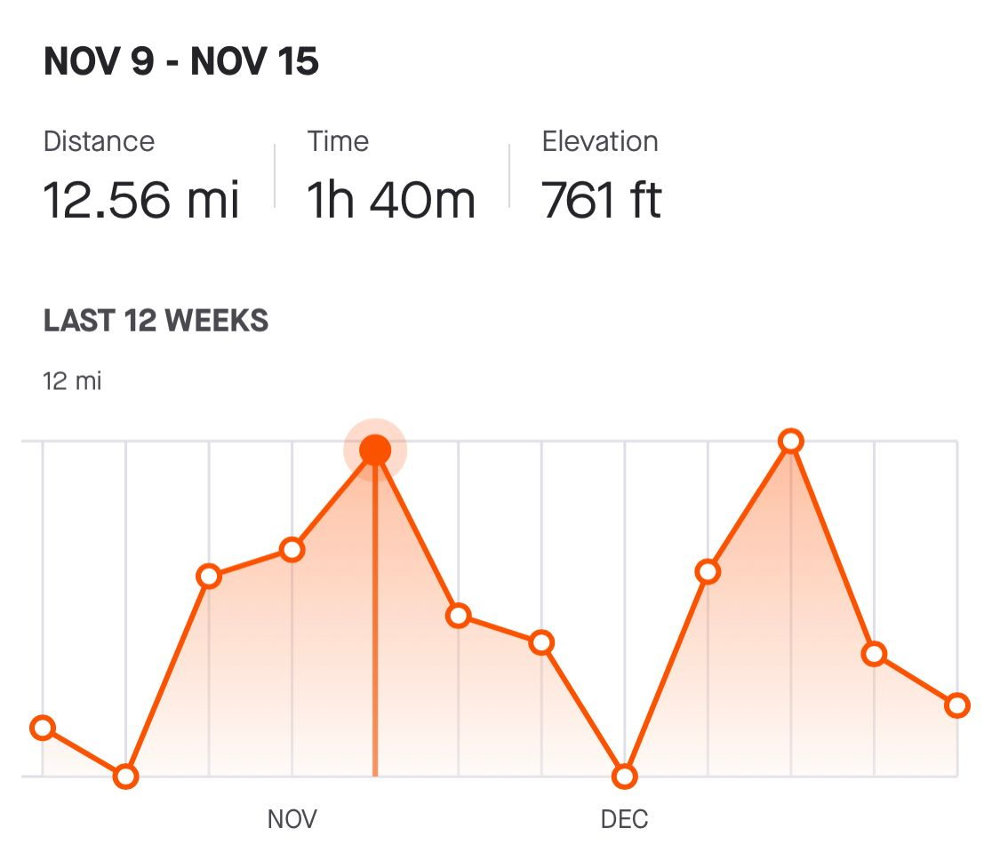
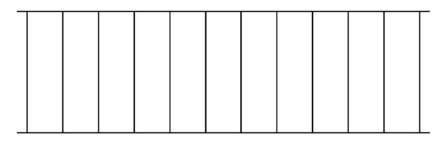
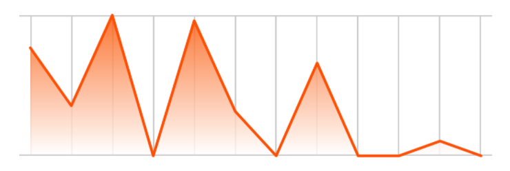
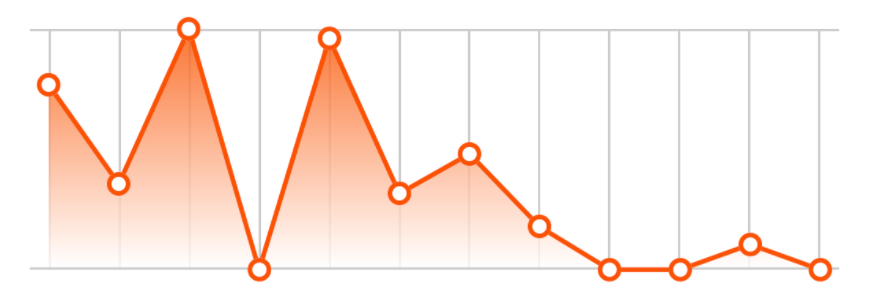
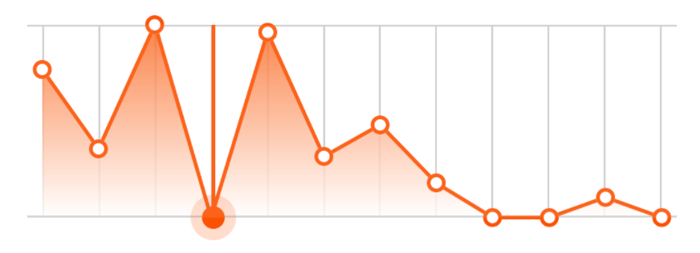
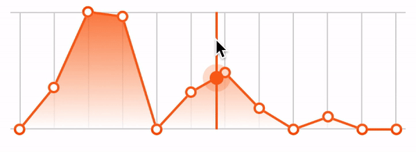

# SwiftUI:图表绘制
<!--- https://trailingclosure.com/recreating-the-strava-activity-graph/ --->



在这篇文章中，我将演示如何创建显示在一个流行的跑步和自行车应用程序中的活动历史图表。这次我将把它分解成小块，并在此过程中进行解释。



## 概述
我们将把这篇文章分成几个不同的部分。你可以随意点击某个部分的链接，直接跳转过去。

* [Model-`ActivityLog`](#Model-`ActivityLog`)
* [构建活动图表](#构建活动图表)

	* [Logs按周分组](#Logs按周分组)
	* [绘制网格](#绘制网格)
	* [绘制渐变线](#绘制渐变线)
	* [绘制活动线](#绘制活动线)
	* [绘制点](#绘制点)
	* [添加用户交互](#添加用户交互)
	
* [构造活动统计文本](#构造活动统计文本)

## Model-`ActivityLog`
如果我们要重新创建一个显示活动历史的视图，那么我们需要一些方法来组织和存储数据。下面是`ActivityLog`的结构体定义。我们将使用它来存储活动数据，并将其显示在图形和文本中。(在这里，我们不会实现单位转换)
```
struct ActivityLog {
    var distance: Double // Miles
    var duration: Double // Seconds
    var elevation: Double // Feet
    var date: Date
}
```
除此之外，我们还将定义一些测试数据来帮助我们。

```
class ActivityTestData {
    static let testData: [ActivityLog] = [
            ActivityLog(distance: 1.77, duration: 2100, elevation: 156, date: Date(timeIntervalSince1970: 1609282718)),
            ActivityLog(distance: 3.01, duration: 2800, elevation: 156, date: Date(timeIntervalSince1970: 1607813915)),
            ActivityLog(distance: 8.12, duration: 3400, elevation: 156, date: Date(timeIntervalSince1970: 1607381915)),
            ActivityLog(distance: 2.22, duration: 3400, elevation: 156, date: Date(timeIntervalSince1970: 1606604315)),
            ActivityLog(distance: 3.12, duration: 3400, elevation: 156, date: Date(timeIntervalSince1970: 1606604315)),
            ActivityLog(distance: 9.01, duration: 3200, elevation: 156, date: Date(timeIntervalSince1970: 1605653915)),
            ActivityLog(distance: 7.20, duration: 3400, elevation: 156, date: Date(timeIntervalSince1970: 1605653915)),
            ActivityLog(distance: 4.76, duration: 3200, elevation: 156, date: Date(timeIntervalSince1970: 1604876315)),
            ActivityLog(distance: 12.12, duration: 2100, elevation: 156, date: Date(timeIntervalSince1970: 1604876315)),
            ActivityLog(distance: 6.01, duration: 3400, elevation: 156, date: Date(timeIntervalSince1970: 1604185115)),
            ActivityLog(distance: 8.20, duration: 3400, elevation: 156, date: Date(timeIntervalSince1970: 1603234715)),
            ActivityLog(distance: 4.76, duration: 2100, elevation: 156, date: Date(timeIntervalSince1970: 1603234715))
    ]
}
```
现在我们已经定义了模型，我们可以将注意力转移到创建自定义SwiftUI视图上。

## 构建活动图表

我们将创建一个新的SwiftUI`View`文件，并命名为`ActivityGraph`.它将接受一个`ActivityLog`数组以及当前选定的星期索引的绑定。该程序只显示了过去的12周，所以这是我们的索引值将涵盖(0-11)。
```
struct ActivityGraph: View {
    
    var logs: [ActivityLog]
    @Binding var selectedIndex: Int
    
    init(logs: [ActivityLog], selectedIndex: Binding<Int>) {
        self._selectedIndex = selectedIndex
        self.logs = logs // 我们接下来将对日志进行分组
    }
    
    var body: some View {
        // Nothing yet...
    }
}
```

### Logs按周分组
如果你回想一下我们的模型，`ActivityLog`结构体只代表一个活动(比如跑步、散步、徒步等)。然而，我们也可以使用它来将整个星期的统计数据聚集到一个`ActivityLog`中。我们将在`ActivityGraph`的`init()`中这样做.通过将`logs`数组压缩到仅12个实例，我们可以简化图形的创建。看看下面是怎么做的。
> 注意，这是时间的滚动视图。统计数据不会从每周的开始分组，而是从当前开始的7天。

```
init(logs: [ActivityLog], selectedIndex: Binding<Int>) {
    self._selectedIndex = selectedIndex
    
    let curr = Date() // 今天的日期
    // 按时间顺序对日志进行排序
    let sortedLogs = logs.sorted { (log1, log2) -> Bool in
        log1.date > log2.date
    } 
    
    var mergedLogs: [ActivityLog] = []
    
	 // 回顾过去12周的情况
    for i in 0..<12 { 

        var weekLog: ActivityLog = ActivityLog(distance: 0, duration: 0, elevation: 0, date: Date())

        for log in sortedLogs {
            // 如果日志在特定的星期内，那么添加到每周总数
            if log.date.distance(to: curr.addingTimeInterval(TimeInterval(-604800 * i))) < 604800 && log.date < curr.addingTimeInterval(TimeInterval(-604800 * i)) {
                weekLog.distance += log.distance
                weekLog.duration += log.duration
                weekLog.elevation += log.elevation
            }
        }

        mergedLogs.insert(weekLog, at: 0)
    }

    self.logs = mergedLogs
}
```

### 绘制网格
目前，`body`主体代码是空的。让我们先画出图形的网格。我将为图的每一部分编写函数，使主体代码更容易阅读。例如:
```
var body: some View {
    drawGrid()
        //.opacity(0.2)
        //.overlay(drawActivityGradient(logs: logs))
        //.overlay(drawActivityLine(logs: logs))
        //.overlay(drawLogPoints(logs: logs))
        //.overlay(addUserInteraction(logs: logs))
}
```
这将是我们在body中看到的最终代码的样子。我们将首先编写`drawGrid`函数，在编写函数时取消后面的注释。`drawGrid()`函数相当简单。界面有两条水平的黑线，并且包含了一组垂直的黑线。你可以看到，我们用SwiftUI做的唯一一件事就是设置线的宽度或高度。
```
func drawGrid() -> some View {
    VStack(spacing: 0) {
        Color.black.frame(height: 1, alignment: .center)
        HStack(spacing: 0) {
            Color.clear
                .frame(width: 8, height: 100)
            ForEach(0..<11) { i in
                Color.black.frame(width: 1, height: 100, alignment: .center)
                Spacer()

            }
            Color.black.frame(width: 1, height: 100, alignment: .center)
            Color.clear
                .frame(width: 8, height: 100)
        }
        Color.black.frame(height: 1, alignment: .center)
    }
}
```



### 绘制渐变线
接下来，我们将编写`drawActivityGradient(logs:)`函数。这将为图层添加一些样式，以便更好地展示数据的高低。思路是在这个矩形中创建一个`LinearGradient`,然后覆盖到图层中。让我们看下代码：
```
func drawActivityGradient(logs: [ActivityLog]) -> some View {
    LinearGradient(gradient: Gradient(colors: [Color(red: 251/255, green: 82/255, blue: 0), .white]), startPoint: .top, endPoint: .bottom)
        .padding(.horizontal, 8)
        .padding(.bottom, 1)
        .opacity(0.8)
        .mask(
            GeometryReader { geo in
                Path { p in
                    // 用于视图缩放的数据
                    let maxNum = logs.reduce(0) { (res, log) -> Double in
                        return max(res, log.distance)
                    }

                    let scale = geo.size.height / CGFloat(maxNum)

                    //每个周的绘制索引 (0-11)
                    var index: CGFloat = 0

                    // 添加绘制的起始的x,y点坐标
                    p.move(to: CGPoint(x: 8, y: geo.size.height - (CGFloat(logs[Int(index)].distance) * scale)))

                    // 绘制添加线
                    for _ in logs {
                        if index != 0 {
                            p.addLine(to: CGPoint(x: 8 + ((geo.size.width - 16) / 11) * index, y: geo.size.height - (CGFloat(logs[Int(index)].distance) * scale)))
                        }
                        index += 1
                    }

                    // 形成闭环路径
                    p.addLine(to: CGPoint(x: 8 + ((geo.size.width - 16) / 11) * (index - 1), y: geo.size.height))
                    p.addLine(to: CGPoint(x: 8, y: geo.size.height))
                    p.closeSubpath()
                }
            }
        )
}
```
如果您现在取消对在`body`代码中`.overlay(drawActivityGradient(logs: logs))
`绘制渐变的调用的注释:
```
var body: some View {
    drawGrid()
    .opacity(0.2)
    .overlay(drawActivityGradient(logs: logs))
    //.overlay(drawActivityLine(logs: logs))
    //.overlay(drawLogPoints(logs: logs))
    //.overlay(addUserInteraction(logs: logs))
}
```

然后您应该会看到类似下图的内容。


### 绘制活动线
绘制线条函数的工作原理与渐变函数类似。唯一的区别是，我们不会关闭路径并使用它作为一个遮罩。我们简单地画一条线，给它一些颜色。参见下面的`drawActivityLine(logs:)`函数。
```
func drawActivityLine(logs: [ActivityLog]) -> some View {
    GeometryReader { geo in
        Path { p in
            let maxNum = logs.reduce(0) { (res, log) -> Double in
                return max(res, log.distance)
            }

            let scale = geo.size.height / CGFloat(maxNum)
            var index: CGFloat = 0

            p.move(to: CGPoint(x: 8, y: geo.size.height - (CGFloat(logs[0].distance) * scale)))

            for _ in logs {
                if index != 0 {
                    p.addLine(to: CGPoint(x: 8 + ((geo.size.width - 16) / 11) * index, y: geo.size.height - (CGFloat(logs[Int(index)].distance) * scale)))
                }
                index += 1
            }
        }
        .stroke(style: StrokeStyle(lineWidth: 2, lineCap: .round, lineJoin: .round, miterLimit: 80, dash: [], dashPhase: 0))
        .foregroundColor(Color(red: 251/255, green: 82/255, blue: 0))
    }
}
```
取消`body`变量中的行注释后，您应该会在预览画布中看到如下图所示的内容。



### 绘制点
我们的下一个函数，`drawLogPoints(logs:)`将在图形上放置圆圈点作为覆盖。请参见下面的代码:
```
func drawLogPoints(logs: [ActivityLog]) -> some View {
    GeometryReader { geo in

        let maxNum = logs.reduce(0) { (res, log) -> Double in
            return max(res, log.distance)
        }

        let scale = geo.size.height / CGFloat(maxNum)

        ForEach(logs.indices) { i in
            Circle()
                .stroke(style: StrokeStyle(lineWidth: 4, lineCap: .round, lineJoin: .round, miterLimit: 80, dash: [], dashPhase: 0))
                .frame(width: 10, height: 10, alignment: .center)
                .foregroundColor(Color(red: 251/255, green: 82/255, blue: 0))
                .background(Color.white)
                .cornerRadius(5)
                .offset(x: 8 + ((geo.size.width - 16) / 11) * CGFloat(i) - 5, y: (geo.size.height - (CGFloat(logs[i].distance) * scale)) - 5)
        }
    }
}
```
通过在`body`变量中取消注释绘制点的那行代码，您应该在画布预览中获得以下结果。



### 添加用户交互
现在我们已经到了构建图表的最后一步。我们将为用户添加拖动图形的能力。这将在图形选择的位置显示一条垂直线。



它的工作方式是通过向视图添加一个`DragGesture`，在这个过程中我们将获得用户的触摸位置。
使用该位置，我们将沿着活动图形放置一条垂直线和一个点。

同样，我们将编写一个名为`addUserInteraction(logs:)`的函数让它返回一个`View`视图。
```
func addUserInteraction(logs: [ActivityLog]) -> some View {
    GeometryReader { geo in

        let maxNum = logs.reduce(0) { (res, log) -> Double in
            return max(res, log.distance)
        }

        let scale = geo.size.height / CGFloat(maxNum)

        ZStack(alignment: .leading) {
            // 线和点叠加

            // 添加拖动手势代码
            
        }

    }
}
```
首先让我们设计垂直的线和圆点覆盖叠加。

```
func addUserInteraction(logs: [ActivityLog]) -> some View {
    GeometryReader { geo in

        let maxNum = logs.reduce(0) { (res, log) -> Double in
            return max(res, log.distance)
        }

        let scale = geo.size.height / CGFloat(maxNum)

        ZStack(alignment: .leading) {
            // 线和点叠加
            Color(red: 251/255, green: 82/255, blue: 0)
                .frame(width: 2)
                .overlay(
                    Circle()
                        .frame(width: 24, height: 24, alignment: .center)
                        .foregroundColor(Color(red: 251/255, green: 82/255, blue: 0))
                        .opacity(0.2)
                        .overlay(
                            Circle()
                                .fill()
                                .frame(width: 12, height: 12, alignment: .center)
                                .foregroundColor(Color(red: 251/255, green: 82/255, blue: 0))
                        )
                    , alignment: .bottom) // 设置和圆底部对齐
            // 添加拖动手势代码
            
        }

    }
}
```
为了让视图遵循用户的触摸，我们需要偏移视图，包括垂直线和圆覆盖。
为此，我们需要添加一些新的`@State`变量。这样做的目的是，当用户选择垂直线时，垂直线会捕捉到用户的触摸位置，但当用户抬起手指时，垂直线又会捕捉到最近的记录点。
```
@State var lineOffset: CGFloat = 8 // 垂直线的偏移量
@State var selectedXPos: CGFloat = 8 // 手势位置X点
@State var selectedYPos: CGFloat = 0 // 手势位置Y点
@State var isSelected: Bool = false // 用户是否触摸图形
```
现在定义了这些变量后，我们可以添加使视图偏移的代码。
```
func addUserInteraction(logs: [ActivityLog]) -> some View {
    GeometryReader { geo in

        let maxNum = logs.reduce(0) { (res, log) -> Double in
            return max(res, log.distance)
        }

        let scale = geo.size.height / CGFloat(maxNum)

        ZStack(alignment: .leading) {
            // 线和点叠加
            Color(red: 251/255, green: 82/255, blue: 0)
                .frame(width: 2)
                .overlay(
                    Circle()
                        .frame(width: 24, height: 24, alignment: .center)
                        .foregroundColor(Color(red: 251/255, green: 82/255, blue: 0))
                        .opacity(0.2)
                        .overlay(
                            Circle()
                                .fill()
                                .frame(width: 12, height: 12, alignment: .center)
                                .foregroundColor(Color(red: 251/255, green: 82/255, blue: 0))
                        )
                        .offset(x: 0, y: isSelected ? 12 - (selectedYPos * scale) : 12 - (CGFloat(logs[selectedIndex].distance) * scale))
                    , alignment: .bottom)

                .offset(x: isSelected ? lineOffset : 8 + ((geo.size.width - 16) / 11) * CGFloat(selectedIndex), y: 0)
                .animation(Animation.spring().speed(4))

            // 添加拖动手势代码
			}
    }
}
```

这样我们就可以添加`DragGesture`代码了。我们将添加这是一个几乎完全透明的视图，它将捕获用户触摸事件。
```
func addUserInteraction(logs: [ActivityLog]) -> some View {
    GeometryReader { geo in

        let maxNum = logs.reduce(0) { (res, log) -> Double in
            return max(res, log.distance)
        }

        let scale = geo.size.height / CGFloat(maxNum)

        ZStack(alignment: .leading) {
            // 线和点叠加的代码放在前面
            // ....
            
            // 拖动手势代码
            Color.white.opacity(0.1)
                .gesture(
                    DragGesture(minimumDistance: 0)
                        .onChanged { touch in
                            let xPos = touch.location.x
                            self.isSelected = true
                            let index = (xPos - 8) / (((geo.size.width - 16) / 11))

                            if index > 0 && index < 11 {
                                let m = (logs[Int(index) + 1].distance - logs[Int(index)].distance)
                                self.selectedYPos = CGFloat(m) * index.truncatingRemainder(dividingBy: 1) + CGFloat(logs[Int(index)].distance)
                            }


                            if index.truncatingRemainder(dividingBy: 1) >= 0.5 && index < 11 {
                                self.selectedIndex = Int(index) + 1
                            } else {
                                self.selectedIndex = Int(index)
                            }
                            self.selectedXPos = min(max(8, xPos), geo.size.width - 8)
                            self.lineOffset = min(max(8, xPos), geo.size.width - 8)
                        }
                        .onEnded { touch in
                            let xPos = touch.location.x
                            self.isSelected = false
                            let index = (xPos - 8) / (((geo.size.width - 16) / 11))

                            if index.truncatingRemainder(dividingBy: 1) >= 0.5 && index < 11 {
                                self.selectedIndex = Int(index) + 1
                            } else {
                                self.selectedIndex = Int(index)
                            }
                        }
                )
        }

    }
}
```



## 构造活动统计文本

现在我们的图表已经完成了，我们把它放到项目中用于显示活动统计信息。我继续创建了一个名为`ActivityStatsText`的新的swifitUI视图，并传递了与图表相同的参数。这里我不会深入讲解，但是我将日志按周分组，就像图表一样，并在视图中显示了这些周的里程、持续时间和海拔统计数据。`selectedIndex`变量绑定在父视图上，它与提供给图表的父视图相同。这样，当用户点击图形时，统计文本根据用户选择的活动日志而变化。
```
struct ActivityHistoryText: View {
    
    var logs: [ActivityLog]
    var mileMax: Int
    
    @Binding var selectedIndex: Int
    
    var dateFormatter: DateFormatter {
        let formatter = DateFormatter()
        formatter.dateFormat = "MMM dd"
        return formatter
    }
    
    init(logs: [ActivityLog], selectedIndex: Binding<Int>) {
        self._selectedIndex = selectedIndex
        
        let curr = Date() // 当前日期
        let sortedLogs = logs.sorted { (log1, log2) -> Bool in
            log1.date > log2.date
        } // 按时间顺序对日志进行排序
        
        var mergedLogs: [ActivityLog] = []

        for i in 0..<12 {

            var weekLog: ActivityLog = ActivityLog(distance: 0, duration: 0, elevation: 0, date: Date())

            for log in sortedLogs {
                if log.date.distance(to: curr.addingTimeInterval(TimeInterval(-604800 * i))) < 604800 && log.date < curr.addingTimeInterval(TimeInterval(-604800 * i)) {
                    weekLog.distance += log.distance
                    weekLog.duration += log.duration
                    weekLog.elevation += log.elevation
                }
            }

            mergedLogs.insert(weekLog, at: 0)
        }

        self.logs = mergedLogs
        self.mileMax = Int(mergedLogs.max(by: { $0.distance < $1.distance })?.distance ?? 0)
    }
    
    var body: some View {
        VStack(alignment: .leading, spacing: 16) {
            Text("\(dateFormatter.string(from: logs[selectedIndex].date.addingTimeInterval(-604800))) - \(dateFormatter.string(from: logs[selectedIndex].date))".uppercased())
                .font(Font.body.weight(.heavy))
            
            HStack(spacing: 12) {
                VStack(alignment: .leading, spacing: 4) {
                    Text("Distance")
                        .font(.caption)
                        .foregroundColor(Color.black.opacity(0.5))
                    Text(String(format: "%.2f mi", logs[selectedIndex].distance))
                        .font(Font.system(size: 20, weight: .medium, design: .default))
                }
                
                Color.gray
                    .opacity(0.5)
                    .frame(width: 1, height: 30, alignment: .center)
                    
                VStack(alignment: .leading, spacing: 4) {
                    Text("Time")
                        .font(.caption)
                        .foregroundColor(Color.black.opacity(0.5))
                    Text(String(format: "%.0fh", logs[selectedIndex].duration / 3600) + String(format: " %.0fm", logs[selectedIndex].duration.truncatingRemainder(dividingBy: 3600) / 60))
                        .font(Font.system(size: 20, weight: .medium, design: .default))
                }
                
                Color.gray
                    .opacity(0.5)
                    .frame(width: 1, height: 30, alignment: .center)
                
                VStack(alignment: .leading, spacing: 4) {
                    Text("Elevation")
                        .font(.caption)
                        .foregroundColor(Color.black.opacity(0.5))
                    Text(String(format: "%.0f ft", logs[selectedIndex].elevation))
                        .font(Font.system(size: 20, weight: .medium, design: .default))
                }
                
                Spacer()
            }
            
            VStack(alignment: .leading, spacing: 5) {
                Text("LAST 12 WEEKS")
                    .font(Font.caption.weight(.heavy))
                    .foregroundColor(Color.black.opacity(0.7))
                Text("\(mileMax) mi")
                    .font(Font.caption)
                    .foregroundColor(Color.black.opacity(0.5))
            }.padding(.top, 10)
            
            
        }
    }
```

## 活动数据视图

这是父视图，它包含图表视图和文本视图：
```
struct ActivityHistoryView: View {
    
    @State var selectedIndex: Int = 0
    
    var body: some View {
        VStack(spacing: 16) {
            // 统计数据文本视图
            ActivityHistoryText(logs: ActivityTestData.testData, selectedIndex: $selectedIndex)
            
            // 图表
            ActivityGraph(logs: ActivityTestData.testData, selectedIndex: $selectedIndex)
            
        }.padding()
    }
}
```

