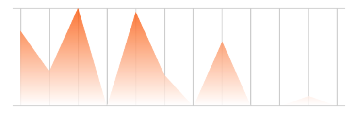

# SwiftUI:图表绘制


在这篇文章中，我将演示如何创建显示在一个流行的跑步和自行车应用程序中的活动历史图表。这次我将把它分解成小块，并在此过程中进行解释。


## 概述
我们将把这篇文章分成几个不同的部分。你可以随意点击某个部分的链接，直接跳转过去。

* [Model-`ActivityLog`](#Model-`ActivityLog`)
* [构建活动图表](#构建活动图表)

	* [Logs按周分组](#Logs按周分组)
	* [绘制网格](#绘制网格)
	* [绘制活动渐变线](#绘制活动渐变线)
	* [绘制活动线](#绘制活动线)
	* [绘制点](#绘制点)
	* [添加用户交互](#添加用户交互)
	
* [构造活动统计文本](#构造活动统计文本)

## Model-`ActivityLog`
如果我们要重新创建一个显示活动历史的视图，那么我们需要一些方法来组织和存储数据。下面是`ActivityLog`的结构体定义。我们将使用它来存储活动数据，并将其显示在图形和文本中。(在这里，我们不会实现单位转换)
```
struct ActivityLog {
    var distance: Double // Miles
    var duration: Double // Seconds
    var elevation: Double // Feet
    var date: Date
}
```
除此之外，我们还将定义一些测试数据来帮助我们。

```
class ActivityTestData {
    static let testData: [ActivityLog] = [
            ActivityLog(distance: 1.77, duration: 2100, elevation: 156, date: Date(timeIntervalSince1970: 1609282718)),
            ActivityLog(distance: 3.01, duration: 2800, elevation: 156, date: Date(timeIntervalSince1970: 1607813915)),
            ActivityLog(distance: 8.12, duration: 3400, elevation: 156, date: Date(timeIntervalSince1970: 1607381915)),
            ActivityLog(distance: 2.22, duration: 3400, elevation: 156, date: Date(timeIntervalSince1970: 1606604315)),
            ActivityLog(distance: 3.12, duration: 3400, elevation: 156, date: Date(timeIntervalSince1970: 1606604315)),
            ActivityLog(distance: 9.01, duration: 3200, elevation: 156, date: Date(timeIntervalSince1970: 1605653915)),
            ActivityLog(distance: 7.20, duration: 3400, elevation: 156, date: Date(timeIntervalSince1970: 1605653915)),
            ActivityLog(distance: 4.76, duration: 3200, elevation: 156, date: Date(timeIntervalSince1970: 1604876315)),
            ActivityLog(distance: 12.12, duration: 2100, elevation: 156, date: Date(timeIntervalSince1970: 1604876315)),
            ActivityLog(distance: 6.01, duration: 3400, elevation: 156, date: Date(timeIntervalSince1970: 1604185115)),
            ActivityLog(distance: 8.20, duration: 3400, elevation: 156, date: Date(timeIntervalSince1970: 1603234715)),
            ActivityLog(distance: 4.76, duration: 2100, elevation: 156, date: Date(timeIntervalSince1970: 1603234715))
    ]
}
```
现在我们已经定义了模型，我们可以将注意力转移到创建自定义SwiftUI视图上。

## 构建活动图表

我们将创建一个新的SwiftUI`View`文件，并命名为`ActivityGraph`.它将接受一个`ActivityLog`数组以及当前选定的星期索引的绑定。该程序只显示了过去的12周，所以这是我们的索引值将涵盖(0-11)。
```
struct ActivityGraph: View {
    
    var logs: [ActivityLog]
    @Binding var selectedIndex: Int
    
    init(logs: [ActivityLog], selectedIndex: Binding<Int>) {
        self._selectedIndex = selectedIndex
        self.logs = logs // 我们接下来将对日志进行分组
    }
    
    var body: some View {
        // Nothing yet...
    }
}
```

### Logs按周分组
如果你回想一下我们的模型，`ActivityLog`结构体只代表一个活动(比如跑步、散步、徒步等)。然而，我们也可以使用它来将整个星期的统计数据聚集到一个`ActivityLog`中。我们将在`ActivityGraph`的`init()`中这样做.通过将`logs`数组压缩到仅12个实例，我们可以简化图形的创建。看看下面是怎么做的。
> 注意，这是时间的滚动视图。统计数据不会从每周的开始分组，而是从当前开始的7天。

```
init(logs: [ActivityLog], selectedIndex: Binding<Int>) {
    self._selectedIndex = selectedIndex
    
    let curr = Date() // 今天的日期
    // 按时间顺序对日志进行排序
    let sortedLogs = logs.sorted { (log1, log2) -> Bool in
        log1.date > log2.date
    } 
    
    var mergedLogs: [ActivityLog] = []
    
	 // 回顾过去12周的情况
    for i in 0..<12 { 

        var weekLog: ActivityLog = ActivityLog(distance: 0, duration: 0, elevation: 0, date: Date())

        for log in sortedLogs {
            // 如果日志在特定的星期内，那么添加到每周总数
            if log.date.distance(to: curr.addingTimeInterval(TimeInterval(-604800 * i))) < 604800 && log.date < curr.addingTimeInterval(TimeInterval(-604800 * i)) {
                weekLog.distance += log.distance
                weekLog.duration += log.duration
                weekLog.elevation += log.elevation
            }
        }

        mergedLogs.insert(weekLog, at: 0)
    }

    self.logs = mergedLogs
}
```

### 绘制网格
目前，`body`主体代码是空的。让我们先画出图形的网格。我将为图的每一部分编写函数，使主体代码更容易阅读。例如:
```
var body: some View {
    drawGrid()
        //.opacity(0.2)
        //.overlay(drawActivityGradient(logs: logs))
        //.overlay(drawActivityLine(logs: logs))
        //.overlay(drawLogPoints(logs: logs))
        //.overlay(addUserInteraction(logs: logs))
}
```
这将是我们在body中看到的最终代码的样子。我们将首先编写`drawGrid`函数，在编写函数时取消后面的注释。`drawGrid()`函数相当简单。界面有两条水平的黑线，并且包含了一组垂直的黑线。你可以看到，我们用SwiftUI做的唯一一件事就是设置线的宽度或高度。
```
func drawGrid() -> some View {
    VStack(spacing: 0) {
        Color.black.frame(height: 1, alignment: .center)
        HStack(spacing: 0) {
            Color.clear
                .frame(width: 8, height: 100)
            ForEach(0..<11) { i in
                Color.black.frame(width: 1, height: 100, alignment: .center)
                Spacer()

            }
            Color.black.frame(width: 1, height: 100, alignment: .center)
            Color.clear
                .frame(width: 8, height: 100)
        }
        Color.black.frame(height: 1, alignment: .center)
    }
}
```


### 绘制渐变线
接下来，我们将编写`drawActivityGradient(logs:)`函数。这将为图层添加一些样式，以便更好地展示数据的高低。思路是在这个矩形中创建一个`LinearGradient`,然后覆盖到图层中。让我们看下代码：
```
func drawActivityGradient(logs: [ActivityLog]) -> some View {
    LinearGradient(gradient: Gradient(colors: [Color(red: 251/255, green: 82/255, blue: 0), .white]), startPoint: .top, endPoint: .bottom)
        .padding(.horizontal, 8)
        .padding(.bottom, 1)
        .opacity(0.8)
        .mask(
            GeometryReader { geo in
                Path { p in
                    // 用于视图缩放的数据
                    let maxNum = logs.reduce(0) { (res, log) -> Double in
                        return max(res, log.distance)
                    }

                    let scale = geo.size.height / CGFloat(maxNum)

                    //每个周的绘制索引 (0-11)
                    var index: CGFloat = 0

                    // 添加绘制的起始的x,y点坐标
                    p.move(to: CGPoint(x: 8, y: geo.size.height - (CGFloat(logs[Int(index)].distance) * scale)))

                    // 绘制添加线
                    for _ in logs {
                        if index != 0 {
                            p.addLine(to: CGPoint(x: 8 + ((geo.size.width - 16) / 11) * index, y: geo.size.height - (CGFloat(logs[Int(index)].distance) * scale)))
                        }
                        index += 1
                    }

                    // 形成闭环路径
                    p.addLine(to: CGPoint(x: 8 + ((geo.size.width - 16) / 11) * (index - 1), y: geo.size.height))
                    p.addLine(to: CGPoint(x: 8, y: geo.size.height))
                    p.closeSubpath()
                }
            }
        )
}
```
如果您现在取消对在`body`代码中`.overlay(drawActivityGradient(logs: logs))
`绘制渐变的调用的注释:
```
var body: some View {
    drawGrid()
    .opacity(0.2)
    .overlay(drawActivityGradient(logs: logs))
    //.overlay(drawActivityLine(logs: logs))
    //.overlay(drawLogPoints(logs: logs))
    //.overlay(addUserInteraction(logs: logs))
}
```

然后您应该会看到类似下图的内容。



### 绘制活动线


### 绘制点


### 添加用户交互


## 构造活动统计文本


