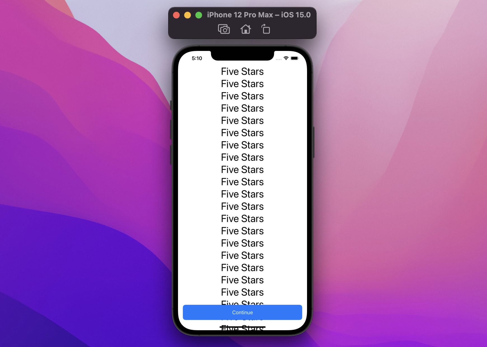

# SwiftUI:如何控制safeAreaInset

WWDC21已经结束，`safeAreaInset()`是一个全新的SwiftUI视图修饰符，它允许我们定义成为观察安全区的一部分的视图。让我们深入研究这个新的、强大的特性。

## 滚动视图

最常见的`safeAreaInset`用例可能是滚动视图。以下面的屏幕为例，我们有一个带有一些内容的`ScrollView`和一个按钮:



```
struct ContentView: View {
  var body: some View {
    ScrollView {
      ForEach(1..<30) { _ in
        Text("Five Stars")
          .font(.largeTitle)
      }
      .frame(maxWidth: .infinity)
    }
    .overlay(alignment: .bottom) {
      Button {
        ...
      } label: {
        Text("Continue")
          .frame(maxWidth: .infinity)
      }
      .buttonStyle(.bordered)
      .controlSize(.large)
      .controlProminence(.increased)
      .padding(.horizontal)
    }
  }
}
```
> 注意：`.buttonStyle(.bordered)` `.controlSize(.large)` `.controlProminence(.increased)`是iOS15的视图修饰符

因为按钮只是一个覆盖，滚动视图不受它的影响，当我们滚动底部时，这就成为一个问题:


`ScrollView`中的最后一个元素被遮挡在按钮下面!
现在我们把`.overlay(alignment: .bottom)`和`.safeAreaInset(edge: .bottom)`交换:
```
struct ContentView: View {
  var body: some View {
    ScrollView {
      ForEach(1..<30) { _ in
        Text("Five Stars")
          .font(.largeTitle)
      }
      .frame(maxWidth: .infinity)
    }
    .safeAreaInset(edge: .bottom) { // 👈🏻
      Button {
        ...
      } label: {
        Text("Continue")
          .frame(maxWidth: .infinity)
      }
      .buttonStyle(.bordered)
      .controlSize(.large)
      .controlProminence(.increased)
      .padding(.horizontal)
    }
  }
}
```


