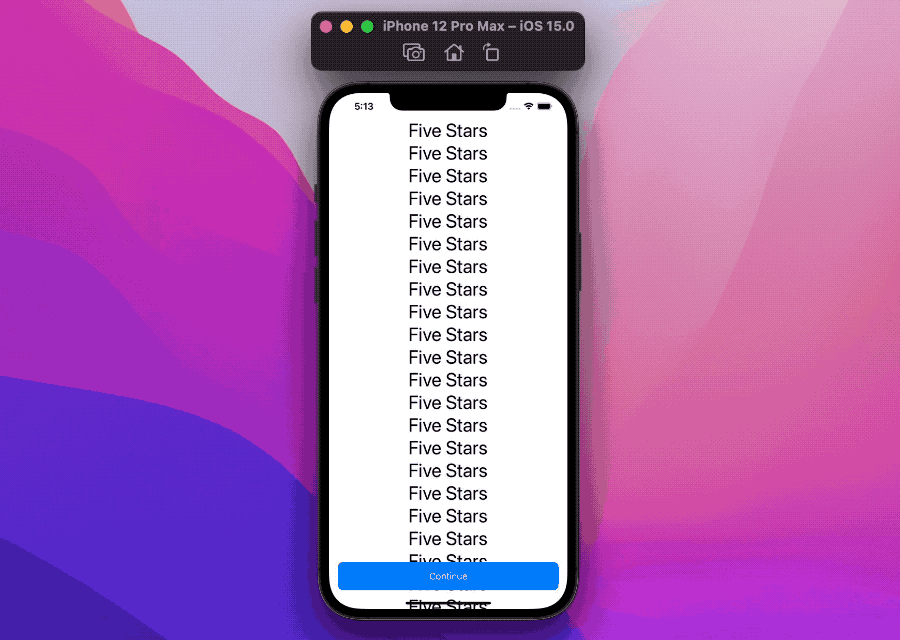
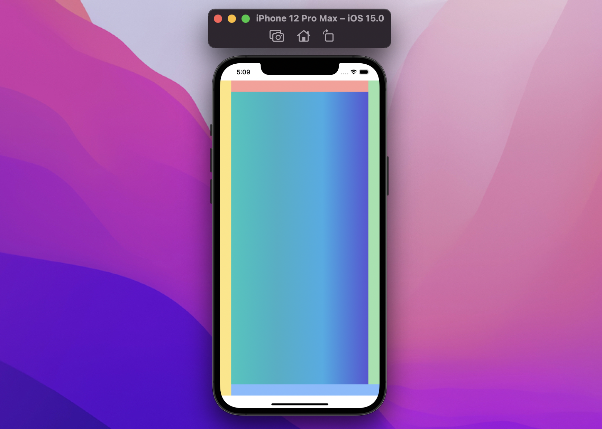

# SwiftUI:如何控制safeAreaInset

WWDC21已经结束，`safeAreaInset()`是一个全新的SwiftUI视图修饰符，它允许我们定义成为观察安全区的一部分的视图。让我们深入研究这个新的、强大的特性。

## 滚动视图

最常见的`safeAreaInset`用例可能是滚动视图。以下面的屏幕为例，我们有一个带有一些内容的`ScrollView`和一个按钮:


```
struct ContentView: View {
  var body: some View {
    ScrollView {
      ForEach(1..<30) { _ in
        Text("Five Stars")
          .font(.largeTitle)
      }
      .frame(maxWidth: .infinity)
    }
    .overlay(alignment: .bottom) {
      Button {
        ...
      } label: {
        Text("Continue")
          .frame(maxWidth: .infinity)
      }
      .buttonStyle(.bordered)
      .controlSize(.large)
      .controlProminence(.increased)
      .padding(.horizontal)
    }
  }
}
```
> 注意：`.buttonStyle(.bordered)` `.controlSize(.large)` `.controlProminence(.increased)`是iOS15的视图修饰符

因为按钮只是一个覆盖，滚动视图不受它的影响，当我们滚动底部时，这就成为一个问题:



`ScrollView`中的最后一个元素被遮挡在按钮下面!
现在我们把`.overlay(alignment: .bottom)`和`.safeAreaInset(edge: .bottom)`交换:
```
struct ContentView: View {
  var body: some View {
    ScrollView {
      ForEach(1..<30) { _ in
        Text("Five Stars")
          .font(.largeTitle)
      }
      .frame(maxWidth: .infinity)
    }
    .safeAreaInset(edge: .bottom) { // 👈🏻
      Button {
        ...
      } label: {
        Text("Continue")
          .frame(maxWidth: .infinity)
      }
      .buttonStyle(.bordered)
      .controlSize(.large)
      .controlProminence(.increased)
      .padding(.horizontal)
    }
  }
}
```

`ScrollView`观察通过`safeAreaInset`传递下来的新区域，最后的元素现在可见了:


接下来，让我们看看它是如何工作的。

## 定义
这个修饰符有两种变体，每个轴上有一个(水平/垂直):
```
/// Horizontal axis.
func safeAreaInset<V: View>(
  edge: HorizontalEdge,
  alignment: VerticalAlignment = .center,
  spacing: CGFloat? = nil,
  @ViewBuilder content: () -> V
) -> some View

/// Vertical axis.
func safeAreaInset<V: View>(
  edge: VerticalEdge, 
  alignment: HorizontalAlignment = .center, 
  spacing: CGFloat? = nil, 
  @ViewBuilder content: () -> V
) -> some View
```
它们有四个参数:

* `edge`-指定目标区域的边缘，垂直方向上`.top` 或 `.bottom`,水平方向`.leading`或`.trailing`
* `alignment` - 当`safeAreaInset`内容不适合可用空间时，我们指定如何对齐
* `spacing` - 在那里我们可以进一步移动安全区超出`safeAreaInset`内容的边界，默认情况下，这个参数有一个非零值，基于我们的目标平台约定
* `content`- 在这里定义`safeAreaInset`的内容

让我们在实践中使用它来理解这是怎么回事。

## 案例
默认情况下，SwiftUI将我们的内容放在安全区域，我们将从一个`LinearGradient`开始，它总是占用所有可用空间:


```
struct ContentView: View {
  var body: some View {
    LinearGradient(
      colors: [.mint, .teal, .cyan, .indigo],
      startPoint: .leading,
      endPoint: .trailing
    )
  }
}
```

假设我们想要扩展顶部安全区域，这现在是可能的，感谢新的`safeAreaInset`视图修改器:


```
struct ContentView: View {
  var body: some View {
    LinearGradient(
      colors: [.mint, .teal, .cyan, .indigo],
      startPoint: .leading,
      endPoint: .trailing
    )
    .safeAreaInset(edge: .top, spacing: 0) {
      Color.red.frame(height: 30).opacity(0.5)
    }
  }
}
```

我们传递了一个透明的视图作为视图修改器内容:注意`LinearGradient`是如何在它下面扩展的。

这是因为我们的`safeAreaInset`:
1. 取观察区域
2. 将其内容(上面的红色)放置在该区域(根据其参数)
3. 基于`content`大小和参数，减少可用区域，并将其传递给`LinearGradient`

这是一个很大的区别与`overlay`视图修改器，其中:
1. `overlay`应用于放置自身在观察区域
2. `overlay`继承视图位置和大小
3. `overlay`被放置在该空间的顶部

事物摆放的方式基本上是相反的。

## Size
因为`safeAreaInset`只关心观察到的区域，它的`content`可以超过它应用到的视图的大小:


```
struct ContentView: View {
  var body: some View {
    LinearGradient(
      colors: [.mint, .teal, .cyan, .indigo],
      startPoint: .leading,
      endPoint: .trailing
    )
    .frame(width: 50)
    .safeAreaInset(edge: .top, spacing: 0) {
      Color.red.frame(height: 30).opacity(0.5)
    }
  }
}
```

在这个例子中,受到`.frame(width: 50)`修饰符的影响，这个视图被`safeAreaInset`作用的区域只有50像素。然而，`safeAreaInset`的内容仍然占用了它所需要的观测区域的所有空间。


## 间距Spacing
spacing参数将进一步改变安全区域`safeAreaInset`内容的边界,在上面的例子中我们都是把它设置为0，这次我们把它设置为50:


```
struct ContentView: View {
  var body: some View {
    LinearGradient(
      colors: [.mint, .teal, .cyan, .indigo],
      startPoint: .leading,
      endPoint: .trailing
    )
    .safeAreaInset(edge: .top, spacing: 50) {
      Color.red.frame(height: 30).opacity(0.5)
    }
  }
}
```

现在在我们的`Color.red`和`LinearContent`之间有50个点的差距：这个间距总是减少我们原始视图(例子中的`LinearGradient`)提供的区域，并且只针对我们的目标边缘。

如果我们传递一个负间距，那么我们将减少安全区域:


```
struct ContentView: View {
  var body: some View {
    LinearGradient(
      colors: [.mint, .teal, .cyan, .indigo],
      startPoint: .leading,
      endPoint: .trailing
    )
    .safeAreaInset(edge: .top, spacing: -10) {
      Color.red.frame(height: 30).opacity(0.5)
    }
  }
}
```

正如所料,`safeAreaInset`内容没有移动，然而，`LinearGradient`现在重叠`Color.red`10个像素点，因为`safeAreaInset`的`spacing`为`-10`。

## Alignment
`alignment`参数的工作原理类似于它在`overlay`上的做法，当`safeAreaInset`内容不完全适合可用空间时，将其定位在正确的位置。

使用`Color.red.frame(height: 30)`,`safeAreaInset`内容总是占用所有的水平可用空间，让我们将其宽度限制为30，并声明一个`.trailing`对齐:


```
struct ContentView: View {
  var body: some View {
    LinearGradient(
      colors: [.mint, .teal, .cyan, .indigo],
      startPoint: .leading,
      endPoint: .trailing
    )
    .safeAreaInset(edge: .top, alignment: .trailing, spacing: 0) {
      Color.red.frame(width: 30, height: 30)
    }
  }
}
```

在介绍完了之后，让我们尝试用我们的新修改器做更多的实验。

## 累积视图修饰符

当我们将多个`safeAreaInset`应用到同一个视图时会发生什么?
```
struct ContentView: View {
  var body: some View {
    LinearGradient(
      colors: [.mint, .teal, .cyan, .indigo],
      startPoint: .leading,
      endPoint: .trailing
    )
    .safeAreaInset(edge: .bottom, spacing: 0) {
      Color.red.frame(height: 30).opacity(0.5)
    }
    .safeAreaInset(edge: .bottom, spacing: 0) {
      Color.green.frame(height: 30).opacity(0.5)
    }
    .safeAreaInset(edge: .bottom, spacing: 0) {
      Color.blue.frame(height: 30).opacity(0.5)
    }
  }
}
```

让我们回到文章的开头，我们描述了`safeAreaInset`的三个步骤:

1. 取观察区域
2. 将其内容(上面的红色)放置在该区域(根据其参数)
3. 基于`content`大小和参数，减少可用区域，并将其传递给`LinearGradient`

第一个应用的视图修改器是最外面的一个，带有`Color.blue`那个，它执行上面的三个步骤，并将减少的可用区域向下传递到倒数第二个`safeAreaInset`，即`Color.green`，其他的也一样。

这是最终的结果：


## 多个边缘
我们已经看到了如何“堆叠”多个`safeAreaInsets`,然而，我们不需要在一条边停止:完全可以应用多个`safeAreaInset`修改器，应用到不同的边:

```
struct ContentView: View {
  var body: some View {
    LinearGradient(
      colors: [.mint, .teal, .cyan, .indigo],
      startPoint: .leading,
      endPoint: .trailing
    )
    .safeAreaInset(edge: .top, spacing: 0) {
      Color.red.frame(height: 30).opacity(0.5)
    }
    .safeAreaInset(edge: .trailing, spacing: 0) {
      Color.green.frame(width: 30).opacity(0.5)
    }
    .safeAreaInset(edge: .bottom, spacing: 0) {
      Color.blue.frame(height: 30).opacity(0.5)
    }
    .safeAreaInset(edge: .leading, spacing: 0) {
      Color.yellow.frame(width: 30).opacity(0.5)
    }
  }
}
```


同样的逻辑仍然有效，不管每个`safeAreaInset`修饰符的目标是什么边缘:

* 首先我们应用/放置(最外面的)`Color.yellow``safeAreaInset`，它将占用所有需要的空间，并向下传递缩小的区域
* 然后我们转到`Color.blue``safeAreaInset`也会做同样的事情

## ignoresSafeArea

先前的`ignoresSafeArea`意味着让我们的视图被放置在Home指示符、键盘或状态栏下:
在iOS15中，`ignoresSafeArea`也意味着重置任何`safeAreaInset`。

在下面的例子中，我们首先放置`safeAreaInset`，然后在放置最终视图之前忽略它:


```
struct ContentView: View {
  var body: some View {
    LinearGradient(
      colors: [.mint, .teal, .cyan, .indigo],
      startPoint: .leading,
      endPoint: .trailing
    )
    .ignoresSafeArea(edges: .bottom)
    .safeAreaInset(edge: .bottom, spacing: 0) {
      Color.red.frame(height: 30).opacity(0.5)
    }
  }
}
```

> 在Xcode 13b1，只有`ScrollView`正确地遵守了`safeAreaInsets`:希望列表和表单将在即将到来的Xcode种子中被修复

## 结论

WWDC21给我们带来了很多新的SwiftUI功能，让我们可以将我们的应用程序推向下一个层次:`safeAreaInset`是那些你不知道你需要的视图修改器之一，它有一个伟大的，简单的API。


