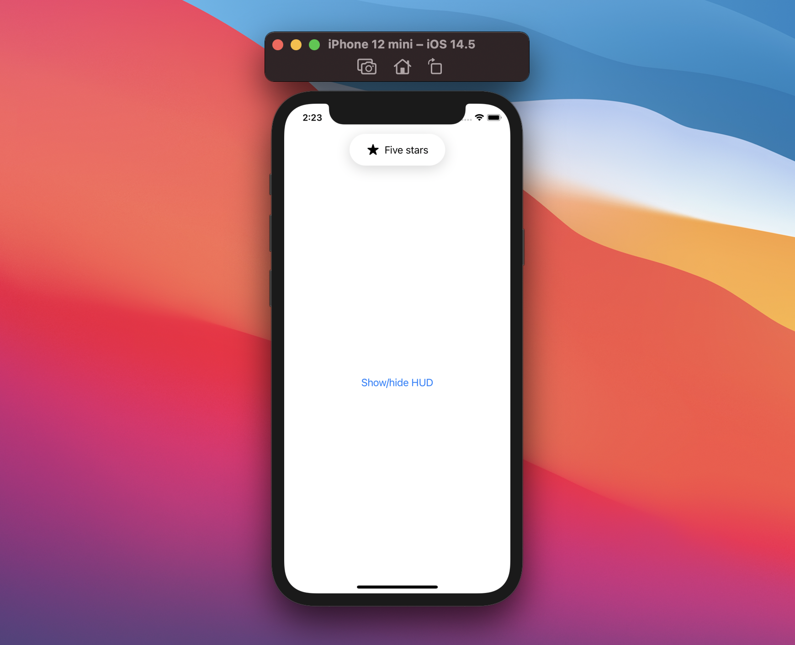
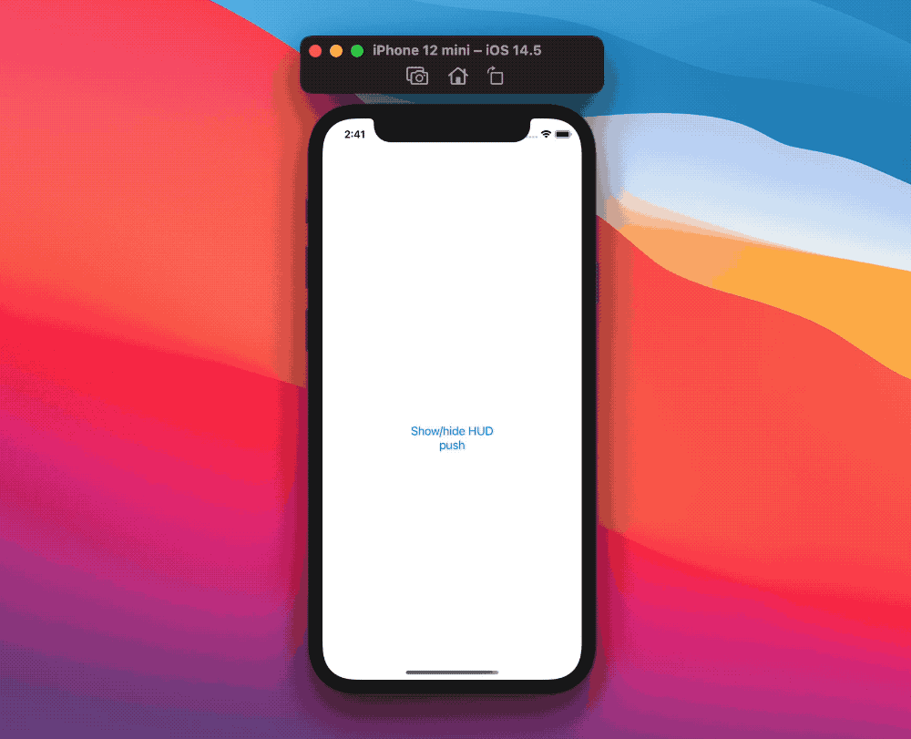

# SwiftUI:自定义HUDs

iOS一直都有一些系统HUD:
每次我们从邮箱发送电子邮件时都可以看到一个。或者当我们切换iOS的静音模式，以及许多其他方式。
但是iOS并没有为开发者开放一个API，让他们可以随意显示hud 。

幸运的是，苹果公司也为我们带来了SwiftUI，这使得制作这样的hud不会太麻烦:在这篇文章中，让我们看看如何自己制作这样的hud !

## HUD

我们将重新创建“静音模式”HUD，为了最大限度的灵活性，我们将让开发者输入HUD内容，而HUD将定义形状和阴影:
```
struct HUD<Content: View>: View {
  @ViewBuilder let content: Content

  var body: some View {
    content
      .padding(.horizontal, 12)
      .padding(16)
      .background(
        Capsule()
          .foregroundColor(Color.white)
          .shadow(color: Color(.black).opacity(0.16), radius: 12, x: 0, y: 5)
      )
  }
}
struct HUD<Content: View>: View {
  @ViewBuilder let content: Content

  var body: some View {
    content
      .padding(.horizontal, 12)
      .padding(16)
      .background(
        Capsule()
          .foregroundColor(Color.white)
          .shadow(color: Color(.black).opacity(0.16), radius: 12, x: 0, y: 5)
      )
  }
}
```
例如，我们可以用以下方法创建预览:
```
HUD {
  Label("我就是HUD", systemImage: "star.fill")
}
```
太棒了!现在我们已经设计好了，让我们把它添加到一个视图中，并实现它的显示/隐藏动画。

## 显示和隐藏HUD
我们将在`ZStack`中嵌入HUD，它将是最顶部的元素:

```
struct ContentView: View {
  var body: some View {
    ZStack(alignment: .top) {
      NavigationView {
        Button("Show/hide HUD") { }
      }

      HUD {
        Label("Five stars", systemImage: "star.fill")
      }
      .zIndex(1)
    }
  }
}
```



现在我们的HUD已经显示出来了，让我们引入一个控制HUD是否显示的新状态:
```
struct ContentView: View {
  @State private var showingHUD = false

  var body: some View {
    ZStack(alignment: .top) {
      NavigationView {
        Button("Show/hide HUD") {
          showingHUD.toggle()
        }
      }

      if showingHUD {
        HUD {
          Label("Five stars", systemImage: "star.fill")
        }
        .zIndex(1)
      }
    }
  }
}
```
很好，这工作，然而我们可能想要一些更华丽的动画，我们可以通过:

* 在按钮操作中使用`withAnimation`修饰符
* 声明一个过渡，我们从屏幕顶部显示HUD，以及默认的不透明度效果

最后，HUD需要在几秒钟后自动解散，我们可以通过添加倒计时通过`onAppear`修改器触发:
```
struct ContentView: View {
  @State private var showingHUD = false

  var body: some View {
    ZStack(alignment: .top) {
      NavigationView {
        Button("Show/hide HUD") {
          withAnimation {
            showingHUD.toggle()
          }
        }
      }

      if showingHUD {
        HUD {
          Label("Five stars", systemImage: "star.fill")
        }
        .transition(AnyTransition.move(edge: .top).combined(with: .opacity))
        .onAppear {
          DispatchQueue.main.asyncAfter(deadline: .now() + 3) {
            withAnimation {
              showingHUD = false
            }
          }
        }
        .zIndex(1)
      }
    }
  }
}
```
从用户的角度来看，这要好得多!然而，我们相对简单的视图代码现在被HUD逻辑淹没了，让我们通过创建一个新的`hud`视图修饰符来解决这个问题:

```
extension View {
  func hud<Content: View>(
    isPresented: Binding<Bool>,
    @ViewBuilder content: () -> Content
  ) -> some View {
    ZStack(alignment: .top) {
      self

      if isPresented.wrappedValue {
        HUD(content: content)
          .transition(AnyTransition.move(edge: .top).combined(with: .opacity))
          .onAppear {
            DispatchQueue.main.asyncAfter(deadline: .now() + 3) {
              withAnimation {
                isPresented.wrappedValue = false
              }
            }
          }
          .zIndex(1)
      }
    }
  }
}
```

使用新的定义，我们的主视图声明只关注实际的内容:
```
struct ContentView: View {
  @State private var showingHUD = false

  var body: some View {
    NavigationView {
      Button("Show/hide HUD") {
        withAnimation {
          showingHUD.toggle()
        }
      }
    }
    .hud(isPresented: $showingHUD) {
      Label("Five stars", systemImage: "star.fill")
    }
  }
}
```
注意我们是如何将`.hud(ispresenting:content:)`视图修饰符放在NavigationView的顶部的，这意味着我们的HUD即使在导航多个屏幕时也会保持不变:



## 优化HUD
由于HUD内容是一个参数，它可以随时交换我们愿意。这是特别有用的，如果我们想我们的应用程序有一个全局HUD:由于这种动态，我们可以为HUD创建一个环境对象，只有需要或希望触发HUD的视图才会触及它。

例如，让我们改变HUD的`Label`标题和图像成为可能，我们通过创建一个新的`HUDState` `ObservableObject`对象来实现:
```
final class HUDState: ObservableObject {
  @Published var isPresented: Bool = false
  var title: String = ""
  var systemImage: String = ""
}
```
然后我们移动我们的`.hud(ispresenting:content:)`修饰符到App级(或者SceneDelegate，如果我们仍然使用UIKit生命周期)，使用新的状态:
```
@main
struct RatingApp: App {
  @StateObject var hudState = HUDState()

  var body: some Scene {
    WindowGroup {
      ContentView()
        .environmentObject(hudState)
        .hud(isPresented: $hudState.isPresented) {
          Label(hudState.title, systemImage: hudState.systemImage)
        }
    }
  }
}
```
在这一点上`HUDState`是`environment`环境的一部分，这使得它可以从任何视图触发HUD，例如，我们可以回到我们的原始视图，并更新它与这些新的变化:
```
struct ContentView: View {
  @EnvironmentObject var hudState: HUDState

  var body: some View {
    NavigationView {
      Button("Show/hide HUD") {
        hudState.title = "Five stars"
        hudState.systemImage = "star.fill"
        withAnimation {
          hudState.isPresented.toggle()
        }
      }
    }
  }
}
```
在调用站点仍然有改进的空间，例如，开发人员可能会忘记更新hud图像，或将`isPresented`的变化包装在动画`withAnimation`中。

为了避免这种情况，我们不需要让开发者自己手动修改每个参数，我们可以让他们通过`show(title:systemImage:)`函数来触发HUD:
```
final class HUDState: ObservableObject {
  @Published var isPresented: Bool = false
  private(set) var title: String = ""
  private(set) var systemImage: String = ""

  func show(title: String, systemImage: String) {
    self.title = title
    self.systemImage = systemImage
    withAnimation {
      isPresented = true
    }
  }
}
```

最终调用方式：
```
struct ContentView: View {
  @EnvironmentObject private var hud: HUDState

  var body: some View {
    NavigationView {
      Button("Show/hide HUD") {
        hud.show(title: "Five stars", systemImage: "star.fill")
      }
    }
  }
}
```

现在我们真正拥有了一个全局HUD，并且几乎没有HUD逻辑，如果不是从任何视图触发它的话。当然，还有改进的空间，但是这已经是一个很好的设置了。

