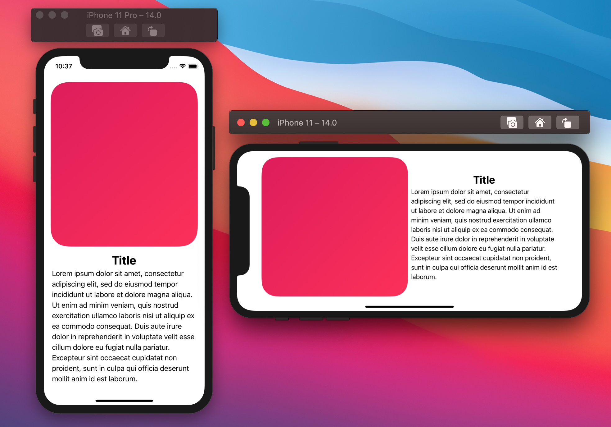
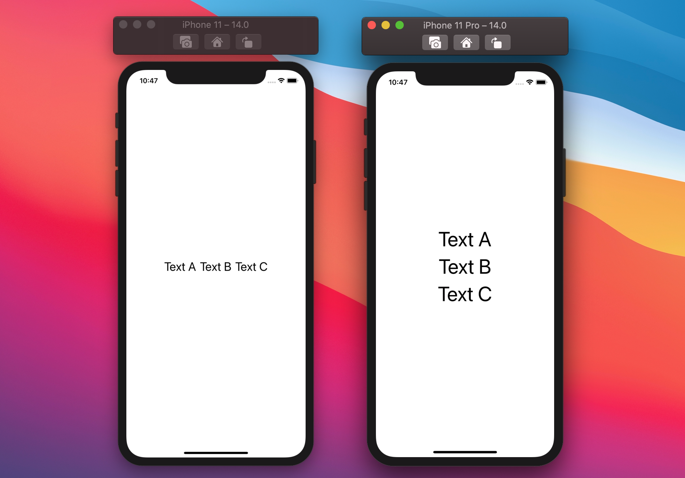
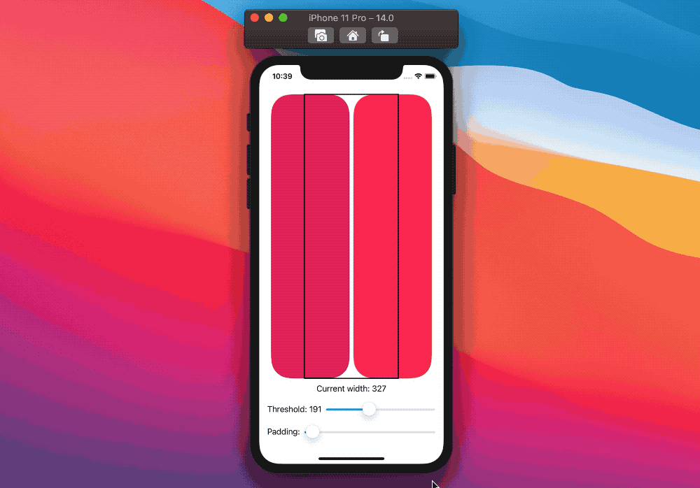
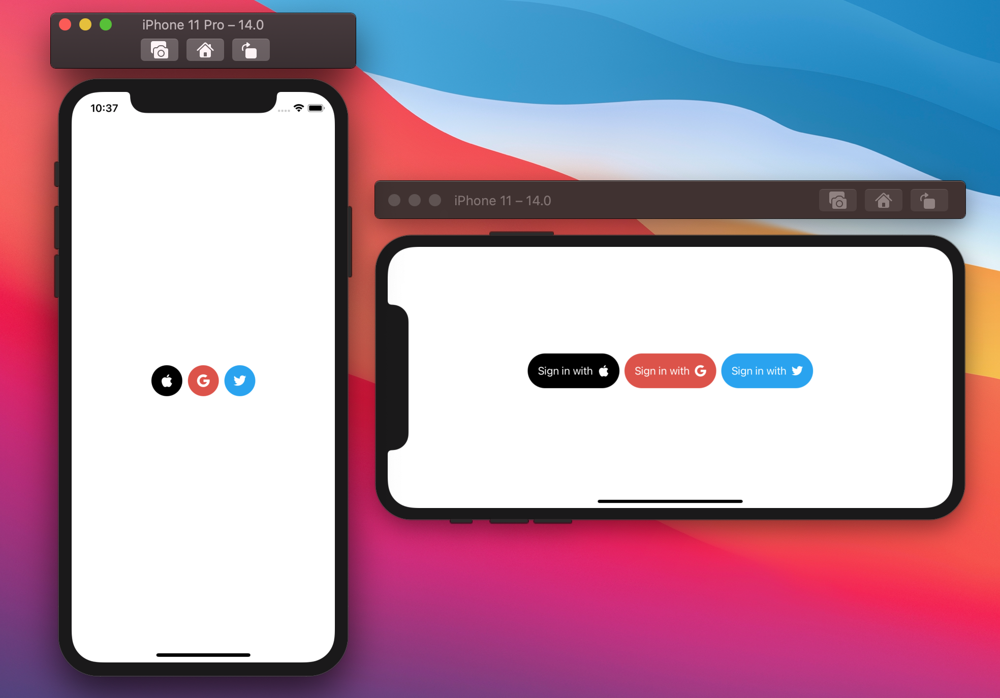

# SwiftUI:自适应Views

<!--- https://fivestars.blog/swiftui/adaptive-swiftui-views.html --->

SwiftUI最强大的一个方面是它如何根据上下文进行调整，这是SwiftUI的承诺，适用于所有苹果设备，从38mm的Apple Watch到27英寸的iMac(不考虑外部显示器!)

虽然这可以节省很多时间，但有时我们想让UI声明更具适应性:在本文中，让我们看看如何做到这一点。

## 事例
在我们的应用中，我们希望根据可用空间调整视图。

我们定义了两种布局，一种是内容垂直堆叠，另一种是内容水平堆叠：



在考虑如何选择布局之前，让我们定义一个通用的可重用视图`AdaptiveView`:
```
struct AdaptiveView<Content: View>: View {
  var content: Content

  public init(@ViewBuilder content: () -> Content) {
    self.content = content()
  }

  var body: some View {
    if /* condition here */ {
      HStack {
        content
      }
    } else {
      VStack {
        content
      }
    }
  }
}
```
> 我们稍后再填写这个条件

我们的示例视图将能够使用这个新的定义，其中它所需要声明的只是内容，其他一切都由`AdaptiveView`管理:
```
var body: some View {
  AdaptiveView {
    RoundedRectangle(...)
      .fill(...)
      .frame(maxHeight: 400)

    VStack {
      Text("Title")
        .bold()
        .font(.title)

      Text(...)
        .fixedSize(horizontal: false, vertical: true)
    }
  }
}
```

下面让我们看看如何填充`AdaptiveView`条件。
> 为了简单起见，我们将重点讨论基于水平空间可用的条件:同样的概念也适用于垂直空间。

## Size classes


> 所有大尺寸的iphone在横屏时都有一个标准的水平尺寸类。

每个SwiftUI视图都可以通过两个`environment`环境值来观察屏幕尺寸的变化：`horizontalSizeClass `和`verticalSizeClass`。
在SwiftUI中，它们都返回一个`UserInterfaceSizeClass`实例，在UIKit中`UIUserInterfaceSizeClass`是和它相对应的。
```
public enum UserInterfaceSizeClass {
  case compact
  case regular
}
```
在这个例子中，我们可以使`AdaptiveView`切换布局基于environment环境的`horizontalSizeClass`:

```
struct AdaptiveView<Content: View>: View {
  @Environment(\.horizontalSizeClass) var horizontalSizeClass
  var content: Content

  init(...) { ... }

  var body: some View {
    if horizontalSizeClass == .regular {
      // We have a "regular" horizontal screen estate: 
      // we lay the content horizontally.
      HStack {
        content
      }
    } else {
      VStack {
        content
      }
    }
  }
}
```

## 动态类型



`AdaptiveView`可以使用的另一种方法是基于environment的`ContentSizeCategory`:
`UserInterfaceSizeClass`告诉我们在当前方向上设备屏幕的compact/regular大小，而`ContentSizeCategory`告诉我们用户首选的内容大小(也就是动态类型)。
```
public enum ContentSizeCategory: Hashable, CaseIterable {
  case extraSmall
  case small
  case medium
  case large
  case extraLarge
  case extraExtraLarge
  case extraExtraExtraLarge
  case accessibilityMedium
  case accessibilityLarge
  case accessibilityExtraLarge
  case accessibilityExtraExtraLarge
  case accessibilityExtraExtraExtraLarge
}
```

我们可以在`AdaptiveView`中使用这些情况中的任何一种作为条件阈值，例如，我们可以切换比`.large`更大的布局:
```
struct AdaptiveView<Content: View>: View {
  @Environment(\.sizeCategory) var sizeCategory: ContentSizeCategory
  var content: Content

  init(...) { ... }

  var body: some View {
    if sizeCategory > .large {
      VStack {
        content
      }
    } else {
      HStack {
        content
      }
    }
  }
}
```
SwiftUI也为`ContentSizeCategory` 提供了`isAccessibilityCategory`属性，我们也可以这么使用：
```
struct AdaptiveView<Content: View>: View {
  @Environment(\.sizeCategory) var sizeCategory: ContentSizeCategory
  var content: Content

  init(...) { ... }

  var body: some View {
    if sizeCategory.isAccessibilityCategory {
      // When the user prefers an accessibility category, lay the content vertically.
      VStack {
        content
      }
    } else {
      HStack {
        content
      }
    }
  }
}
```
当`ContentSizeCategory`实例以"`accessibility`"开头时，`isAccessibilityCategory`返回`true`，这似乎是一个很好的默认阈值:

当然，我们应该测试一下我们的实现，看看是否适合我们，如果不行，我们可以回到另一个阈值。

## 自定义阈值

到目前为止提供的方法适用于大多数视图，但是，它们也有一个很大的缺点:它们依赖于全局值。

当一个单一的`AdaptiveView`是屏幕的主要内容，但如果我们有多个视图，应该适应?

如果我们在这种情况下，我们可能不能依赖这些全局环境属性:相反，我们应该为每个视图分别做出决定。
这样，两个或更多的视图可以根据自己的空间和阈值进行不同的布局。
为了做到这一点，我们需要采取两步:
1. 获取每个`AdaptiveView`的可用水平空间
2. 基于这个空间创建一个条件

### 1. 获取可用的水平空间
幸运的是，我们已经在[SwiftUI:灵活的布局]()中遇到了这个问题，并取得了以下结果：
```
struct FlexibleView: View {
  @State private var availableWidth: CGFloat = 0

  var body: some View {
    ZStack {
      Color.clear
        .frame(height: 1)
        .readSize { size in
          availableWidth = size.width
        }

      // 我们要实现的部分
    }
  }
}
```

我们可以在我们的通用`AdaptiveView`中实现它:
```
struct AdaptiveView<Content: View>: View {
  @State private var availableWidth: CGFloat = 0
  var content: Content

  public init(...) { ... }

  var body: some View {
    ZStack {
      Color.clear
        .frame(height: 1)
        .readSize { size in
          availableWidth = size.width
        }

      if /* condition */ {
        HStack {
          content
        }
      } else {
        VStack {
          content
        }
      }
    }
  }
}
```
```
extension View {
  func readSize(onChange: @escaping (CGSize) -> Void) -> some View {
    background(
      GeometryReader { geometryProxy in
        Color.clear
          .preference(key: SizePreferenceKey.self, value: geometryProxy.size)
      }
    )
    .onPreferenceChange(SizePreferenceKey.self, perform: onChange)
  }
}

private struct SizePreferenceKey: PreferenceKey {
  static var defaultValue: CGSize = .zero
  static func reduce(value: inout CGSize, nextValue: () -> CGSize) {}
}
```

第一步完成了

## 基于这个空间创建一个条件
一旦我们有了可用的空间，剩下要决定的就是如何使用它。
在构建通用视图时，最好将阈值决定留给实现者，他们对视图的使用位置和实际内容有更多的了解。

由于这些原因，我们可以添加一个新的属性`threshold`，它将在`AdaptiveView`条件中使用:
```
struct AdaptiveView<Content: View>: View {
  @State private var availableWidth: CGFloat = 0
  var threshold: CGFloat
  var content: Content

  public init(
    threshold: CGFloat, 
    @ViewBuilder content: () -> Content
  ) {
    self.threshold = threshold
    self.content = content()
  }

  var body: some View {
    ZStack {
      Color.clear
        .frame(height: 1)
        .readSize { size in
          availableWidth = size.width
        }

      if availableWidth > threshold {
        HStack {
          content
        }
      } else {
        VStack {
          content
        }
      }
    }
  }
}
```
到这里，我们的自定义`AdaptiveView`就完成了。

## 验证

因为我们现在拥有了阈值，所以测试不同的阈值/布局/设备也很容易，事例如下



```
struct ContentView: View {
  @State var currentWidth: CGFloat = 0
  @State var padding: CGFloat = 8
  @State var threshold: CGFloat = 100

  var body: some View {
    VStack {
      AdaptiveView(threshold: threshold) {
        RoundedRectangle(cornerRadius: 40.0, style: .continuous)
          .fill(
            Color(red: 224 / 255.0, green: 21 / 255.0, blue: 90 / 255.0, opacity: 1)
          )
        RoundedRectangle(cornerRadius: 40.0, style: .continuous)
          .fill(
            Color.pink
          )
      }
      .readSize { size in
        currentWidth = size.width
      }
      .overlay(
        Rectangle()
          .stroke(lineWidth: 2)
          .frame(width: threshold)
      )
      .padding(.horizontal, padding)

      Text("Current width: \(Int(currentWidth))")
      HStack {
        Text("Threshold: \(Int(threshold))")
        Slider(value: $threshold, in: 0...500, step: 1) { Text("") }
      }
      HStack {
        Text("Padding:")
        Slider(value: $padding, in: 0...500, step: 1) { Text("") }
      }
    }
    .padding()
  }
}
```
完整的`AdaptiveView`代码：
```
```

## 多种布局
到目前为止，我们看到的例子根据我们的条件调整布局方向，但是这不是唯一的用例，例如，我们可以使用类似的方法来显示/隐藏UI的一部分：



事例代码：
```
struct SocialSignInView: View {
  @State private var availableWidth: CGFloat = 0

  private var buttonMode: SignInButton.Mode {
    availableWidth > 500 ? .regular : .compact
  }

  var body: some View {
    ZStack {
      Color.clear
        .frame(height: 1)
        .readSize { size in
          availableWidth = size.width
        }

      HStack {
        SignInButton(action: {}, tintColor: .appleTint, imageName: "apple", mode: buttonMode)
        SignInButton(action: {}, tintColor: .googleTint, imageName: "google", mode: buttonMode)
        SignInButton(action: {}, tintColor: .twitterTint, imageName: "twitter", mode: buttonMode)
      }
    }
  }
}

struct SocialSignInView_Previews: PreviewProvider {
  static var previews: some View {
    Group {
      SocialSignInView()
        .previewLayout(.fixed(width: 568, height: 320))
      SocialSignInView()
        .previewLayout(.fixed(width: 320, height: 528))
    }
  }
}
```

SignInButton:
```
extension Color {
  static let appleTint = Color.black
  static let googleTint = Color(red: 222 / 255.0, green: 82 / 255.0, blue: 70 / 255.0)
  static let twitterTint = Color(red: 29 / 255.0, green: 161 / 255.0, blue: 242 / 255.0)
}

struct SignInButton: View {

  enum Mode {
    case regular
    case compact
  }

  var action: () -> Void
  var tintColor: Color
  var imageName: String
  var mode: Mode

  var body: some View {
    Button(action: action) {
      switch mode {
      case .compact:
        Circle()
          .fill(tintColor)
          .overlay(Image(imageName))
          .frame(width: 44, height: 44)
      case .regular:
        HStack {
          Text("Sign in with")
          Image(imageName)
        }
        .padding()
        .background(
          Capsule()
            .fill(tintColor)
        )
      }
    }
    .foregroundColor(.white)
  }
}

struct SignInButton_Previews: PreviewProvider {
  static var previews: some View {
    Group {
      SignInButton(action: {}, tintColor: .appleTint, imageName: "apple", mode: .regular)
      SignInButton(action: {}, tintColor: .appleTint, imageName: "apple", mode: .compact)
      SignInButton(action: {}, tintColor: .googleTint, imageName: "google", mode: .regular)
      SignInButton(action: {}, tintColor: .googleTint, imageName: "google", mode: .compact)

      SignInButton(action: {}, tintColor: .twitterTint, imageName: "twitter", mode: .regular)
      SignInButton(action: {}, tintColor: .twitterTint, imageName: "twitter", mode: .compact)
    }
    .previewLayout(.sizeThatFits)
  }
}
```

## 总结
SwiftUI尽其所能地适应每一个给定的场景:让框架来做所有繁重的工作是完全没问题的，但是如果我们多做一点工作，就可以帮助我们提供更好的用户体验。


