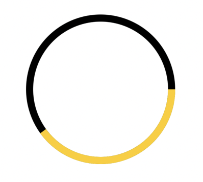
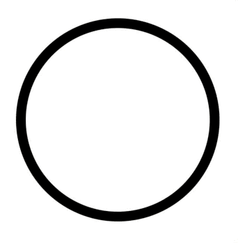

# SwiftUI:进度环

## Shapes

SwiftUI提供了许多形状，如`Rectangle`矩形和`Circle`圆形:我们可以通过定义实现这些形状协议的形状来扩展SwiftUI的目录，而不是将我们的选择限制在内置产品中。

形状的协议有：

* Shape
* InsettableShape

```
struct ContentView: View {
  var body: some View {
    ZStack {
      Circle()
        .stroke(Color.black, lineWidth: 10)

      ProgressCircle(progress: 0.4)
        .stroke(Color.yellow, lineWidth: 10)
    }
  }
}

struct ProgressCircle: Shape {
  var progress: CGFloat

  func path(in rect: CGRect) -> Path {
    let centerX: CGFloat = rect.width / 2
    let centerY: CGFloat = rect.height / 2

    var path = Path()
    path.addArc(
      center: CGPoint(x: centerX, y: centerY),
      radius: min(centerX, centerY),
      startAngle: Angle(degrees: 0),
      endAngle: Angle(degrees: 360 * Double(progress)),
      clockwise: false
    )

    return path
  }
}
```




## 添加Animations
SwiftUI的声明性，动画bug基本上已经消失了:我们不再需要跟踪和管理取消的过渡，根据手势速度计算正确的spring值，等等。

SwiftUI中的动画是基于状态的:只要我们的视图还在屏幕上，给定状态变化的正确动画就会自动发生。

```
struct ContentView: View {
  @State var progress: CGFloat = 0

  var body: some View {
    ZStack {
      Circle()
        .stroke(Color.black, lineWidth: 10)

      ProgressCircle(progress: progress)
        .stroke(Color.yellow, lineWidth: 10)
        .animation(Animation.linear.speed(0.4))
        .onAppear {
          progress = 1
        }
    }
  }
}

struct ProgressCircle: Shape {
  var progress: CGFloat

  // 👇🏻 Animatable 协议必须要实现的.
  var animatableData: CGFloat {
    get { progress }
    set { progress = newValue }
  }

  func path(in rect: CGRect) -> Path {
    let centerX: CGFloat = rect.width / 2
    let centerY: CGFloat = rect.height / 2

    var path = Path()
    path.addArc(
      center: CGPoint(x: centerX, y: centerY),
      radius: min(centerX, centerY),
      startAngle: Angle(degrees: 0),
      endAngle: Angle(degrees: 360 * Double(progress)),
      clockwise: false
    )

    return path
  }
}
```



## Environment中的协议
Environment中的协议有`EnvironmentKey`和`EnvironmentalModifier`。
SwiftUI的`Environment`是我们在视图层次结构中传递数据的许多方式之一，`EnvironmentKey`让我们将自己的数据注入到环境中，而`EnvironmentalModifier`让我们基于当前环境返回视图修饰符:

```
struct AnimatableEnvModifier: EnvironmentalModifier {
  func resolve(in environment: EnvironmentValues) -> some ViewModifier {
    AnimatableModifier(
    	isReduceMotionEnabled: environment.accessibilityReduceMotion
    )
  }

  struct AnimatableModifier: ViewModifier {
    let isReduceMotionEnabled: Bool

    func body(content: Content) -> some View {
      content
        .animation(isReduceMotionEnabled ? .none : .easeInOut)
    }
  }
}

FSView()
  .modifier(AnimatableEnvModifier())
```


