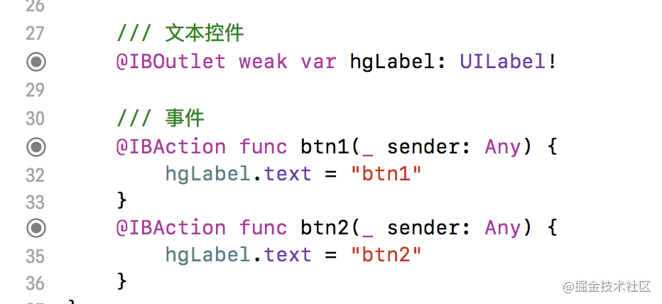

# Xcode 常用 LLDB 指令

本文转载自[这篇文章](https://juejin.cn/post/6844903837489168392)
LLDB是**Xcode**中自带的一个调试工具，在开发的过程中使用好了这个调试工具，不仅是能力的一种提升，更是一种装逼的**神器**。

## 一、如何进入 LLDB
通常当程序 crash 或者有断点的时候，会自动的变成 LLDB 模式。也可以手动 处理，直接点击这里：


打断点也会变成 LLDB 模式。最终的效果是这样的：


## 二、使用 LLDB

### 2.1 expr 指令
这个指令的意思，能实时的执行代码中的代码逻辑。就像下面这样的：


当点击下一步执行的时候，NSLog 打印的值是 **CoderHG** 而不是 **Coder**。这个功能想想都感觉挺不错的。

### 2.2 call

这个指令与 **expr** 类似，调用一行代码，形如这样的：
> call self.view.backgroundColor = [UIColor redColor];


### 2.3 打印
其实关于打印，应该所有的小伙伴都知道的。接着上面的步骤，做如下的操作：


在 LLDB 中有两个常见的打印指令 **p** 与 **po**。

* 1、**p** 通常用于打印基本数据类型的值。这个指令会默认生出一个临时变量，如**$1**，学习过 **Shell** 的小伙伴看到这个应该很激动。
* 2、**po** 打印变量的内容，如果是对象，其打印的内容由 **-debugDescription** 决定。


### 2.4 操作内存
对内存的操作，无非就是读写操作。 修改内存中的值：
> memory write 内存地址 数值

如：memory write **0x7ffee685dba8** 25

读取内存操作：
> memory read/数量 _ 格式 _ 字节数 内存地址
或者
> x/数量 _ 格式 _ 字节数 内存地址

#### 2.4.1 格式

* x ：代表16进制
* f ：代表浮点数
* d ：代表10进制

#### 2.4.2 字节大小

* b ：byte 代表1个字节
* h ：half word 代表2个字节
* w ：word 代表4个字节
* g ：giant word 代表8个字节

如：
> memory read/1wx 0x7ffee14a5ba8 memory read/1wd 0x7ffee14a5ba8

寓意是：读取 0x7ffee14a5ba8 中 4 个字节的内容。 示例如下：


### 2.5 bt
bt 返回所有的调用栈， 形如：
```
(lldb) bt
* thread #1, queue = 'com.apple.main-thread', stop reason = step over
  * frame #0: 0x000000010758b6fd LLDBDev`-[ViewController viewDidLoad](self=0x00007fedad7057e0, _cmd="viewDidLoad") at ViewController.m:27
  **中间被我干掉了很多。**
    frame #34: 0x000000010758b79f LLDBDev`main(argc=1, argv=0x00007ffee8674108) at main.m:14
    frame #35: 0x000000010c2d1d81 libdyld.dylib`start + 1
    frame #36: 0x000000010c2d1d81 libdyld.dylib`start + 1

```
这个指令很强大，现在的 Xcode 在这里都显示不全了： 


所以只能借助**bt**指令。

## 三、实战

没有实战的纸上谈兵，都是耍流氓。 在开始之前，先定义一个 Class，代码如下所示：
```
#import <Foundation/Foundation.h>

@interface HGObject : NSObject

/** 年龄 */
@property (nonatomic, assign) NSInteger age;
/** 身高 */
@property (nonatomic, assign) NSInteger height;

@end


#import "HGObject.h"

@implementation HGObject

@end
#import <Foundation/Foundation.h>

@interface HGObject : NSObject

/** 年龄 */
@property (nonatomic, assign) NSInteger age;
/** 身高 */
@property (nonatomic, assign) NSInteger height;

@end


#import "HGObject.h"

@implementation HGObject

@end

```
很简单的一个Class。

### 3.1 查看一个对象的 isa 指针
大家都说一个instance 对象中的 isa 的值就是当前 instance 对象的 class 对象的值，接下来求证一下。先写一段简单的代码：

```
Class cls = NSClassFromString(@"HGObject");
id obj = [[cls alloc] init];
NSLog(@"%@, %@", cls, obj);

```


运行代码发现：
	* 1、cls 没有显示具体的地址值。
	* 2、在 obj 中也根本没有看到 isa 这个成员变量。

看不到任何的地址显示，所以只能是借助 **LLDB** 调试工具，这里既是是使用简单的 **p** 或者 **po**指令都是不可以的。需要借助上面说的 **操作内存** 的指令。	


轻松搞定，上图中是不是就说明了一个 Class 对象的 instance 对象的 isa 的值就是其 class 对象本身的值呢？是的，本来就是这样的。

### 3.2 对象中的地址查看
简单的实现如下代码：
```
HGObject* obj = [[HGObject alloc] init];
obj.age = 18;
obj.height = 2;

NSLog(@"%@", obj);

```
在 NSLog 处打一个断点，运行代码，打开内存查看视图：


刚打开是这样的：


将 obj 的地址写入，再看下面这张图： 


看到上面的内存图，发现一个规律，请看下图：


上图中的内存分布，如红框框所示，分别是 isa，_age 与 _height。为了验证其正确性，可以修改一下其中的值，看一下效果： 


上图中的逻辑大概为：查找 _age 与 _height 对应的地址，然后修改其地址的值，然后刷新看内存视图。

## 四、内存断点

顾名思义，给一个内存打一个断点。其实在开发中，还是挺实用的，有点像 KVO 监听。下图为简单的测试代码，图中在 viewDidLoad 有一个手动打的一个断点，目的是进入 lldb 环境： 


进入 lldb 环境之后，我们可以执行如下指令：
```
watchpoint set variable self->_name
```
log 为：
```
Watchpoint created: Watchpoint 1: addr = 0x7fcfaf9061d0 size = 8 state = enabled type = w
    watchpoint spec = 'self->_name'
    new value: 0x0000000000000000

```
即为断点成功。修改 **_name**的值，即为修改 _name 所在内存的值，所以应该是这样的：


值得注意的是，log 能将旧值、新值一起打印出来。

当然，设置内存断点的指令，还可以这样：
```
watchpoint set expression &_name
```

**内存断点**， 在分析数据流转的特别有用，比如就想知道某个变量在什么情况下为 nil 了。

## 五、UI 控件查看

这个功能可厉害了，先看一个问题：


其实这个就是我们在做自动布局是后的一个问题，在控制台会给出这样的提示。如果界面简单，那么很好排查，如果界面复杂，那么就很难定位问题所在。那么如何找到具体的视图呢？可以这样来： 


这样就能实时的定位到是界面上的哪个UI 了，具体的命令如下：

```
(lldb) e id $hgView = (id)0x7fdfc66127f0
(lldb) e (void)[$hgView setBackgroundColor:[UIColor redColor]]
(lldb) e (void)[CATransaction flush]

```
**注意**：后面的那个命令一定要执行，否则在 lldb 的状态下是看不到效果的。

## 六、动态注入代码逻辑

看到这个小标题就很诡异，意思就是在代码运行的过程中如何去通过修改代码的方式修改代码的逻辑。有点绕，先简单的举个例子。

### 6.1 场景一

有如下的代码：


主要看 `yesOrNo` 属性，当在代码已经运行起来的时候，想重新运行，就要把 `yesOrNo` 的值给改成 `true`。你会怎么做？其实在上面已经介绍了，使用 `expr` 可以搞定，但是这里还有可以有更高级的。 如下图所示，弄一个断点，双击让断点变成编辑状态。


点击上图中的红框框部分，如下所示：


写上 `expression yesOrNo = true` 会发现这样的话不用每次运行到这个断点的时候都去 lldb 一次。


选中了这个复选框，都感觉不到断点的存在。
**这样的断点， 是不是很高大上！？？**

### 6.2 场景二

就想知道某个属性的值是在什么时候改变的，应该怎么办呢？因为很多的时候，某个属性的改变会发生在很多的地方，那如何做到统一的跟踪呢？ 在很多年前我是这样做的：重写 `set` 方法，然后在 `set` 方法中打一个断点。这样做是很优秀的，但是也是最不雅观的。因为重写了 `set` 方法之后，还需要再次删除，太 TM 繁琐了。何尝不弄一个断点呢？再者说，如果去跟踪系统属性的变动呢？接下来就介绍一个比较牛逼的方法。以监听 `-[UILabel setText:]` 方法为例。
第一步就是盘她： 


然后再这样的盘她：


`-[UILabel setText:]` 这一句大家都能看懂。之后是这样子的：


这样之后，会惊奇的发现，什么也没有干，这个断点就触发了：


是的，这是汇编代码。本来 UILabel 中的系统方法都是没有暴露实现的，跳到这样的界面也是很正常的。这到底是怎么回事呢？我们可以简单的来一波下面的操作：


从上面的这张图中，就能看出端倪。在看到这样强大的断点方式的同时，也带来了很多的思考。这样打断点就显得有点流氓了，只要是这个方法被触发的地方都会被断点到。那么就看一下下面这张图：



我只想监听在 `btn1` 方法中被触发的 `-[UILabel setText:]` ，应该怎么办？在实际的开发中， 可能 `btn1` 方法会很复杂。直接给出最终的处理方案：


这张图似曾相识。其中关键的命令是这样的 `breakpoint set -one-shot true --name "-[UILabel setText:]"` 这句命令的大意是如果在 `btn1` 方法中有 `-[UILabel setText:]` 操作的话，会被自动触发跟踪。
 

## 其他相关优秀文章

熟悉一些常见的 LLDB 调试技巧之后，在实际的开发中可以节省我们一大堆的调试时间。

1. [与调试器共舞 - LLDB](https://objccn.io/issue-19-2/)
2. [戴铭：Xcode调试之LLDB](https://github.com/ming1016/study/wiki/Xcode%E8%B0%83%E8%AF%95%E4%B9%8BLLDB)

