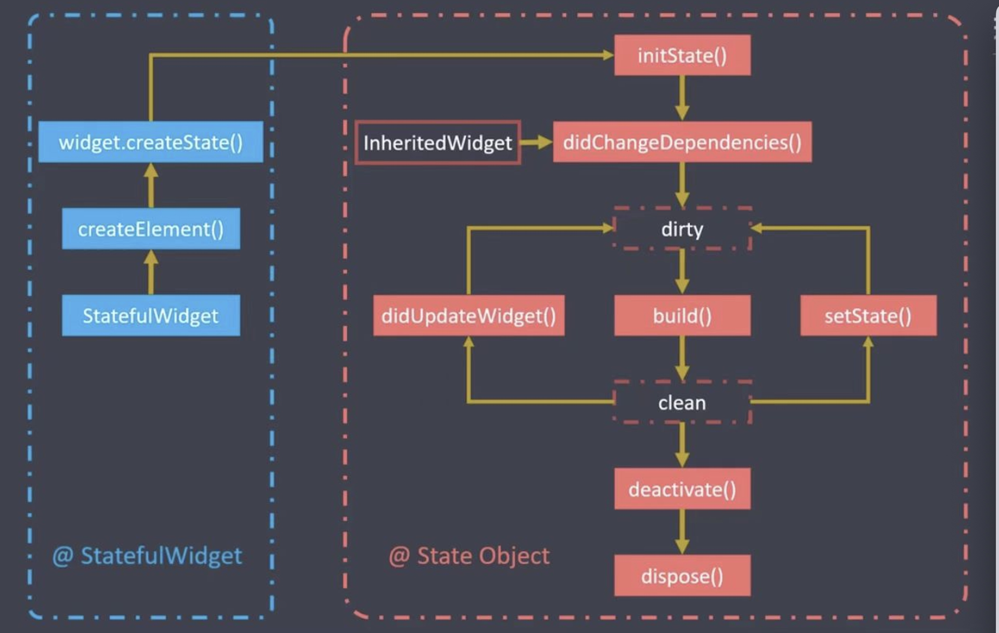

# Flutter

## Flutter原理

Flutter 既不使用WebView，也不使用操作系统的原生控件，而是实现了一个自绘引擎，使用自身的布局、绘制系统。Flutter 使用自己的高性能渲染引擎来绘制 Widget（组件）。

Flutter 从上到下可以分为三层：框架层、引擎层和嵌入层：

* 框架层：一个纯Dart实现的SDK，它实现了一套基础库。
* 引擎层：该层主要是C++实现，其中包括了Skia引擎(3.3版本使用渲染引擎Impeller取代Skia)、Dart运行时、文字排版引擎等。在代码调用 `dart:ui`库时，调用最终会走到引擎层，然后实现真正的绘制和显示。
* 嵌入层: Flutter最终渲染、交互是要依赖其所在平台的操作系统API，嵌入层主要是将Flutter引擎采用当前平台的语言编写 ”安装“ 到特定平台上。嵌入层可以方便扩展支持新的平台


## 生命周期



* initState(): 状态组件对象插入到元素树中时
* didChangeDependencies():当前状态对象依赖改变时
* build(): 组件渲染时
* setState(): 组件对象内部状态变更时
* didUpdateWidget(): 组件配置更新时
* deactivate(): 组件对象在元素树中暂时移除时,例如导航操作
* dispose(): 组件对象从元素树中永远移除时

## provider


## 路由

* Route: 一个路由是一个屏幕或页面的抽象
* Navigator: 管理路由组件，通过路由的入栈和出栈来实现页面之间的跳转
	* initialRoute: 初始路由，即默认页面
	* onGenerateRoute: 动态路由，根据规则匹配动态路由
	* onUnknownRoute: 未知路由即404的情况
	* routes: 路由集合

### 匿名路由

* push(跳转到指定组件)
```
Navigator.push(
context,
MaterialPageRoute(builder: (context) => 组件名称())
)
```

* pop(回退)
```
Navigator.pop(context)
```

### 命名路由

* 声明路由
	* routes路由表（Map类型）
	* initialRoute(初始路由)
	* onUnknownRoute(未知路由-404)
* 跳转到命名路由
	* Navigator.pushNamed(context, '路由名称')

例子：
```
MaterialApp(
	// ... //其他配置
	routes: {
		//注册路由表
		'first': (context) => FirstPage(),
		'second': (context) => SecondPage(),
	},
	initialRoute: 'first', //初始界面
	onUnknownRoute: (RouteSettings setting) => MaterialPageRoute(
		builder: (context) => UnknownPage()
	),
);
```
跳转:
```
Navigator.pushNamed(context, 'second')
//返回
Navigator.pop(context)
```

### 动态路由


## 第三方插件

* fluro: 路由框架
* provider: 数据共享库
* dio: 网络库
* flutter_swiper: 轮播组件库(star1.6k)
* carousel_slider: 轮播库(star3.5k)
* shared_preferences: 数据存储库
* redux: 状态管理库
	* redux_logging: 打印Action日志
	* redux_persist: 持久化状态
	* redux_thunk: 支持异步操作
	* flutter_redux: 其提供StoreConnector组件来获取状态和监听状态修改，也可使用StoreProvider来直接获取store对象
* video_player: 视频播放库
* image_picker: 图片选择库
* cached_network_image: 图片缓存库
* fluttertoast: toast弹框


