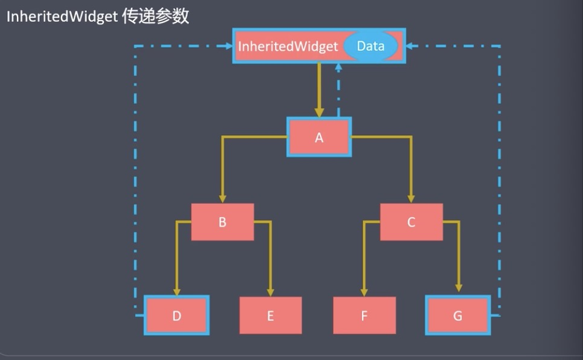
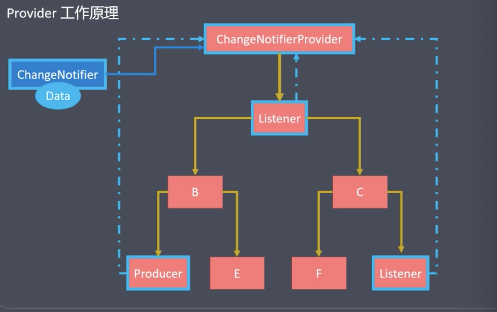

# Flutter

## Flutter原理

Flutter 既不使用WebView，也不使用操作系统的原生控件，而是实现了一个自绘引擎，使用自身的布局、绘制系统。Flutter 使用自己的高性能渲染引擎来绘制 Widget（组件）。

Flutter 从上到下可以分为三层：框架层、引擎层和嵌入层：

* 框架层：一个纯Dart实现的SDK，它实现了一套基础库。
* 引擎层：该层主要是C++实现，其中包括了Skia引擎(3.3版本使用渲染引擎Impeller取代Skia)、Dart运行时、文字排版引擎等。在代码调用 `dart:ui`库时，调用最终会走到引擎层，然后实现真正的绘制和显示。
* 嵌入层: Flutter最终渲染、交互是要依赖其所在平台的操作系统API，嵌入层主要是将Flutter引擎采用当前平台的语言编写 ”安装“ 到特定平台上。嵌入层可以方便扩展支持新的平台

## Flutter安装遇到的问题

执行`flutter doctor -v`报错：

`HTTP host https://maven.google.com/ is not reachable`
`HTTP host https://cloud.google.com/ is not reachable`

1. 找到`fultter/packages/flutter_tools/lib/src/http_host_validator.dart`文件，把
   `if (!platform.environment.containsKey(kEnvCloudUrl))
      'https://maven.google.com/',`
      修改为
	`if (!platform.environment.containsKey(kEnvCloudUrl))
	      'https://maven.aliyun.com/repository/google/',
	`
2. 把文件中的`const String kgCloudHttpHost = 'https://cloud.google.com/';`修改为`const String kgCloudHttpHost = 'https://storage.flutter-io.cn/';`
3. 删除fultter/bin/cache文件；
4. 重新运行`flutter doctor -v`

## Flutter生命周期


* initState(): 状态组件对象插入到元素树中时
* didChangeDependencies():当前状态对象依赖改变时
* build(): 组件渲染时
* setState(): 组件对象内部状态变更时
* didUpdateWidget(): 组件配置更新时
* deactivate(): 组件对象在元素树中暂时移除时,例如导航操作
* dispose(): 组件对象从元素树中永远移除时

## InheritedWidget

* 提供了沿树向下，共享数据的功能即子组件可以获取父组件(InheritedWidget的子类)的数据。
* 不依赖于构造函数的方式传递数据，可以更好的跨组件数据传输



构建数据共享类
```
class ShareDataWidget extends InheritedWidget {
	final int num; // 共享的数据
	final Widget child;
	ShareDataWidget(Key key, this.child, @required this.num): super(Key key, child: child);
	
	static ShareDataWidget of(BuildContext context) {
		return context.dependOnInheritedWidgetOfExactType<ShareDataWidget>();
	}
	
	@override
	bool updateShouldNotify(ShareDataWidget oldWidget){
		// 根据需求是否需要刷新
		return true;
	}
	
}
```
设置共享组件，使用`ShareDataWidget`包裹根组件：
```
@override
Widget build(BuildContext context) {
	return ShareDataWidget(
		num: _num,
		child: 根组件(),
	);
}
```

获取共享数据：
```
int num = ShareDataWidget.of(context).num;
```


## Provider
Provider是一个三方库，是对InheritedWidget的封装，使用了懒加载，优化可资源的分配与处理。



* ChangeNotifier: 被观察者，数据模型，类似MVC中的Model
* Provider: 观察者，监听数据变化,类似MVC中的ViewModel
* Producer: 生成者，生成新数据即触发数据的变化,类似MVC中的View
* Listener: 消费者，数据发生变化触发UI刷新,类似MVC中的View

Producer产生新数据 -> 被Provider监控到变化 -> ChangeNotifier更新数据模型数据 -> 更新所有使用数据的子组件Listener

**使用Provider:**

* 安装Provider
* 创建数据模型 (T extends ChangeNotifier)
* 创建Provider，并注册数据模型
	* Provider(): 不会被要求随着变动而变动
	* ChangeNotifierProvider(): 随着某些数据改变而被通知更新
* 子组件获取数据模型并更细UI
	* 可通过context上下文获取
	* 也可通过静态方法(`Provider.of<T>(context)`)获取

```
// 1. 创建数据模型
class AppModel extends ChangeNotifier {
	int _counter = 0;
	int get counter => _counter;
	
	incrementCounter() {
		_counter++;
		// 通知UI更新
		notifyListeners();
	}
	
}

// 2. 创建Provider，注册数据模型
@override
Widget build(BuildContext context) {
	// 后代组件均可获取数据模型
	return ChangeNotifierProvider(
		create: (BuildContext context) => AppModel(),
		child: Scaffold(
			appBar: ...
			body: ...
		),
	);
}

// 3. Provider子组件获取数据模型
Text('${context.watch<AppModel>().counter}')
// 4. 触发操作
TextButton(
	onPressed: Provider.of<AppModel>(context).incrementCounter,
	child: Icon(Icons.thumb_up)
)

```


## 路由

* Route: 一个路由是一个屏幕或页面的抽象
* Navigator: 管理路由组件，通过路由的入栈和出栈来实现页面之间的跳转
	* initialRoute: 初始路由，即默认页面
	* onGenerateRoute: 动态路由，根据规则匹配动态路由
	* onUnknownRoute: 未知路由即404的情况
	* routes: 路由集合

### 匿名路由

* push(跳转到指定组件)
```
Navigator.push(context,
	MaterialPageRoute(builder: (context) => 组件名称())
)
```
传参：
```
Navigator.push(context,
	MaterialPageRoute(builder: (context){
		return Detail(id: item['id'])
	})
);
```

* pop(回退)
```
Navigator.pop(context);
```

### 命名路由

* 声明路由
	* routes路由表（Map类型）
	* initialRoute(初始路由)
	* onUnknownRoute(未知路由-404)
* 跳转到命名路由
	* 无参数： Navigator.pushNamed(context, '路由名称')
	* 有参数：Navigator.pushNamed(context, routename, {arguments})
	* 接收参数：ModalRoute.of(context).settings.arguments

例子：
```
MaterialApp(
	// ... //其他配置
	routes: {
		//注册路由表
		'first': (context) => FirstPage(),
		'second': (context) => SecondPage(),
	},
	initialRoute: 'first', //初始界面
	onUnknownRoute: (RouteSettings setting) => MaterialPageRoute(
		builder: (context) => UnknownPage()
	),
);
```
跳转:
```
Navigator.pushNamed(context, 'second')
//或 跳转传参
Navigator.pushNamed(context, 'second', 
	arguments: {'title': '传递的参数'}
)
//返回
Navigator.pop(context)
```

接收参数：
```
class SecondPage extends StatelessWidget {
	// 获取参数
	final Map arguments = ModalRoute.of(context).settings.arguments;
	String title = arguments['title'];
}
```

### 动态路由

```
MaterialApp(
	//通过onGenerateRoute生成动态路由
	onGenerateRoute: (settings) {
		// 匹配处理
		if(settings.name == '/') {
			return MaterialPageRoute(builder: (context) => HomeScreen());
		}
		// 处理详情 '/details/:id'
		var uri = Uri.parse(settings.name);
		if(uri.pathSegments.length == 2 && uri.pathSegments.first == 'details') {
			var id = uri.pathSegments[1];
			return MaterialPageRoute(builder: (context) => DetailScreen(id: id));
		}
		
		// 未知路由
		return MaterialPageRoute(builder: (context) => UnknownScreen());
		
	},
);
```
跳转传参：
```
Navigator.pushNamed(context, '/details/102')
```

### fluro路由
这是一个第三方路由，用法可[参考这里](https://pub.dev/packages/fluro)

1. 编写路由配置文件`routes.dart`

```
import 'package:fluro/fluro.dart'

class Routes {
	// 1. 定义路由名称
	static String home='/';
	static String login='/login';
	static String detail='/detail/:id';
	
	// 2. 定义路由处理函数
	static Handler _homeHandler = Handler(handlerFunc:(context, params){
		return HomePage();
	});
	static Handler _loginHandler = Handler(handlerFunc:(context, params){
		return LoginPage();
	});
	static Handler _detailHandler = Handler(handlerFunc:(context, params){
		return DetailPage(id: params['id'][0]);
	});
	static Handler _notFoundHandler = Handler(handlerFunc:(context, params){
		return NotFoundPage();
	});
	
	// 3. 编写函数configureRoutes关联路由名称和处理函数
	static void configureRoutes(FluroRouter router){
		router.define(home, handler: _homeHandler);
		router.define(login, handler: _loginHandler);
		router.define(detail, handler: _detailHandler);
		
		router.notFoundHandler = _notFoundHandler;
	}
	
}

```

2. 路由关联

```
class Application extends StatelessWidget {
	Application({Key key}): super(key: key);
	
	@override
	Widget build(BuildContext context) {
		FluroRouter router = FluroRouter();
		FluroRouter.configureRoutes(router);
		return MaterialApp(
			home: LoginPage();
			onGenerateRoute: router.generator,
		);
	}
	
}
```

3. 路由跳转
```
Navigator.pushNamed(context, Routes.home);
// 或
Navigator.pushNamed(context, '/detail/102');
```

## 第三方插件

* fluro: 路由框架
* provider: 数据共享库
* dio: 网络库
* flutter_swiper: 轮播组件库(star1.6k)
* carousel_slider: 轮播库(star3.5k)
* shared_preferences: 数据存储库
* redux: 状态管理库
	* redux_logging: 打印Action日志
	* redux_persist: 持久化状态
	* redux_thunk: 支持异步操作
	* flutter_redux: 其提供StoreConnector组件来获取状态和监听状态修改，也可使用StoreProvider来直接获取store对象
* video_player: 视频播放库
* image_picker: 图片选择库
* cached_network_image: 图片缓存库
* fluttertoast: toast弹框
* cupertino_icons: iOS样式的icons


