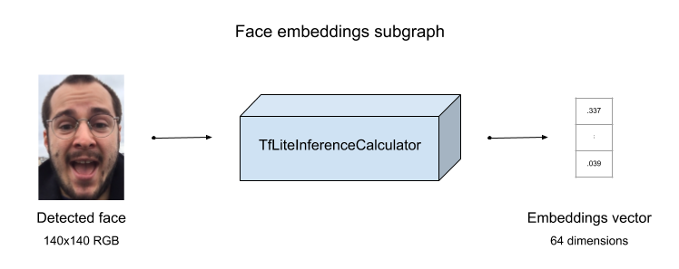
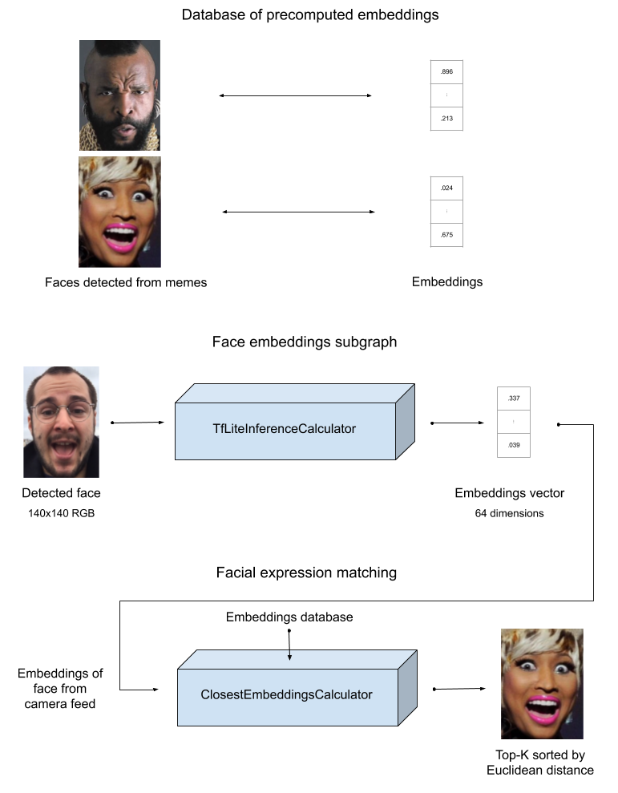
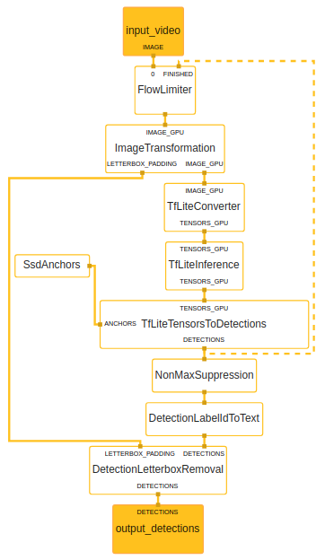
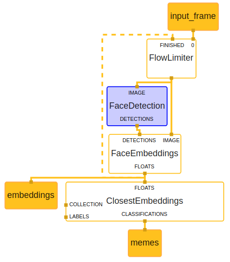
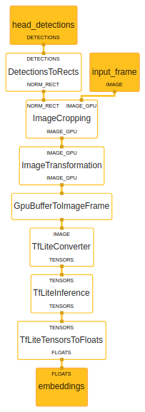

# MediaPipe教程：查找与面部表情匹配的模因

## 介绍

我们正在努力帮助玩家通过手机上的机器学习编辑精彩内容。人工智能、模因、声音和视觉效果构成了我们旨在为世界各地的人们提供的工具包，以帮助他们更好地相互理解。我们的团队一直在广泛使用[MediaPipe](https://mediapipe.dev/)为玩家创建支持机器学习的视频编辑应用程序。我们创建此教程是为了演示如何使用MediaPipe创建下一个支持ML的应用程序。

## 目标和要求

说你正在用手机和一些朋友聊天。你的朋友写了一些有趣的东西，你想贴一张与她相关的有趣图片。你真的很想贴这张图片，但它不在你的手机上，现在你只是在你选择的搜索引擎中尝试不同的单词，但没有成功。这张图片在你的脑海中是如此清晰，查找它的单词不知何故都不正确。如果你能在手机上做出同样滑稽的表情，它就会为你找到它！

让我们构建一个计算机视觉管道，将手机前摄像头中的一张脸与至少包含一张脸的图像集合进行比较：互联网模因(memes)集合。

这是我们正在构建的应用程序。


## 机器学习模型管线

我们需要一个机器学习模型来确定两幅图像与面部表情的相似程度。我们使用的情绪/面部表情识别模块基于Raviteja Vemulapalli和Aseem Agarwala于2019年发表的一篇论文，该论文名为《面部表情相似性的紧凑嵌入》。在这基础上，我们重新实现了该论文中描述的方法。然后，我们通过使用[知识蒸馏](https://arxiv.org/abs/1503.02531)改进了这种方法，通过这种技术，一个通常[较小的学生网络被训练来模拟教师网络](https://medium.com/neuralmachine/knowledge-distillation-dc241d7c2322)的预测。我们发现，使用知识蒸馏可以得到更精确的模型。我们还在知识提取过程中添加了数百万张未标记的图像，探索并进一步提高了性能。

具体来说，谷歌的原始论文报告称，在他们的脸三胞胎数据集上，他们的模型有81.8%的“三胞胎预测准确率”。我们重新实现这种方法的准确率接近79%，下降可能是因为我们没有完全复制其数据集（因为源图像被从Flickr中删除）。通过对附加的未标记数据进行知识提取，我们可以将分数提高到85%。

我们最初的培训计划是用Pytorch编写的。考虑到我们想使用MediaPipe创建推理管道，该管道对TensorFlow和TFlite模型具有现成的支持。我们很快将我们的培训管道从Pytorch迁移到TensorFlow。对于本教程，我们公开发布了TFlite模型的提炼版MobileNetV2，准确率接近75%。这个模型应该足以演示MediaPipe的功能，并有点有趣地将模因与人脸进行匹配。

图例：说明什么模型进行图像->嵌入的框图



快速介绍[MediaPipe](https://mediapipe.dev/)

## 在桌面上制作管道原型

为了使用MediaPipe原型化推理管道，从视频中找到具有相似面部表情的模因，我们开始构建桌面原型，因为迭代比在移动的周期速度快得多。在桌面原型之后，我们可以为我们的主要目标平台：苹果iPhone进行优化。我们首先创建一个与所提供的桌面示例类似的C++演示程序，并从中构建图形。

尽管可以创建独立于MediaPipe的存储库（如[本文所示](https://github.com/mgyong/mediapipe_addons/tree/master/helloworld)），但我们更喜欢在自己的项目分支中开发图形(graphs)和计算器(calculators)。通过这种方式升级到最新版本的MediaPipe只需要一个git-rebase。

为了避免与MediaPipe代码的潜在冲突，我们将文件夹结构复制到MediaPipe的子目录下：graphs图形、calculators计算器和所需的BUILD文件。

MediaPipe附带了许多计算器，这些计算器经过了记录、测试，有时还针对多个平台进行了优化，因此我们尽可能地利用它们。当我们真的需要创建新的计算器时，我们会尝试设计它们，以便它们可以在不同的图形中重用。例如，我们设计了一个calculator计算器，它将其输入流显示到OpenCV窗口，并在按下一个键时关闭。这样，我们可以快速插入管道的各个部分，并浏览流经的图像。

## MediaPipe Graph-人脸检测，然后进行人脸嵌入

我们构造一个graph图，在视频中查找人脸，进行第一次检测，然后提取描述该人脸的64维向量。最后，它通过一个定制的计算器，将这些嵌入与一大组矢量图像对进行比较，并使用Euclidean欧氏距离对前3个结果进行排序。

FacialSearch背后的算法:



人脸检测使用MediaPipe自己的基于[SSD的自拍人脸检测器](https://google.github.io/mediapipe/solutions/face_detection)图形执行。我们把它的要点变成了一个子图，这样我们的图就可以很容易地链接到它以及其他一些图上。子图非常便于重用，可以看作是模块。鉴于封装的好处，我们倾向于为每个模型创建一个。

嵌入是使用我们的Tensorflow Lite模型在FaceEmbeddingsSubgraph中提取的，并以64个浮点向量的形式输出。此子图负责调整输入图像的大小，并与Tensorflow tensors相互转换。

然后，我们的ClosestEmbeddingsCalculator期望这个向量，计算到嵌入式数据库中每个向量的距离，并将最匹配的作为Classifications流式输出，将距离作为分数。数据库作为端包加载，可以在Shell脚本的帮助下生成。提供了一个包含大约400个条目的示例数据库。

主图:


人脸检测子图:


人脸嵌入子图:


## 面临的问题

您可能已经注意到在上面的GPU FaceEmbeddingsSubgraph中使用了[GpuBufferToImageFrame](https://github.com/google/mediapipe/blob/master/mediapipe/gpu/gpu_buffer_to_image_frame_calculator.cc)计算器。这会将图像从GPU移动到主机CPU。事实证明，我们的模型使用了当前版本的Tensorflow Lite GPU解释器不支持的指令。运行它将始终返回相同的值，并在初始化图形时输出以下警告：

```
ERROR: Next operations are not supported by GPU delegate:
MAXIMUM: Operation is not supported.
MEAN: Operation is not supported.
First 0 operations will run on the GPU, and the remaining 81 on the CPU.
```

有多种方法可以解决此问题：

* 您可以重新训练模型，使生成的tflite文件只使用支持的操作。
* 您可以在C++中实现这些操作，并使用MediaPipe的[TfLiteCustomOpResolverCalculator](https://github.com/google/mediapipe/blob/master/mediapipe/calculators/tflite/tflite_custom_op_resolver_calculator.cc)将它们提供给解释器。
* 如果您的模型在CPU上运行良好，您可以通过将其输入移动到CPU来确保推理始终在CPU上进行。然而，将数据从GPU移动到主机CPU并不是免费的，所以推断应该会慢一些。

我们为本教程选择了最简单的选项，因为运行时成本似乎最低。我们可能会提供一种未来可以在GPU上运行的模型。

## 在桌面上运行

首先确保我们数据库的图像在您的系统中。这些来自[https://imgflip.com/]()选择的标准是它们至少包含一张人脸。大部分是图片，但也有一些图纸。下载时使用：
```
python mediapipe/examples/facial_search/images/download_images.py
```
然后您可以自由地重新生成嵌入数据。这个过程使用我们下载的图像上的图形来提取每个图像的浮点向量。然后将它们写入C++头文件以构成数据库。请记住，不同平台的浮点精度可能有所不同，因此您可能希望在目标平台上生成嵌入。运行：
```
./mediapipe/examples/facial_search/generate_header.sh mediapipe/examples/facial_search/images
```

现在在CPU上运行演示：

并使用以下工具在GPU上运行演示：
按任意键退出程序。

## 从桌面到app应用

Tulsi可用于生成Xcode应用程序项目，Bazel可用于从命令行编译iOS应用程序。作为iOS应用程序开发人员，我们希望能够将图形导入到现有的Xcode项目中。我们还计划在不久的将来开发Android应用程序，因此我们押注于MediaPipe的多平台支持，以减少代码重复。

我们设计了一种将图形打包为iOS框架的自动化方法。这是我们与macOS GitHub Actions的持续集成管道的一部分，依赖于Bazel和一些脚本。框架编译和导入是两个独立的步骤，我们的移动开发人员不必担心图形中的C++和Objective-C部分，可以用Swift构建应用程序。


### 步骤

1. 检查我们的示例代码：
  ```
  git clone — single-branch facial-search https://github.com/fenollp/mediapipe.git && cd mediapipe
  ```
2. 在Xcode中创建新的“Single View App”Swift应用程序
3. 从新项目中删除这些文件： `AppDelegate.swift`和`ViewController.swift`
4. 将这些文件从`mediapipe/examples/facial_search/ios/`路径复制到应用程序,请不要创建桥接文件：
 ```
 AppDelegate.swift
 Cameras.swift
 DotDot.swift
 FacialSearchViewController.swift
 ```
 5. 编辑app的Info.plist：添加key为`NSCameraUsageDescription`, 值为`此应用程序使用摄像头演示实时视频处理`
 6. 编辑Main.storyboard，将自定义类设置为FacialSearchViewController
 7. 构建iOS framework：
  ```
  bazel build — copt=-fembed-bitcode — apple_bitcode=embedded — config=ios_arm64 mediapipe/examples/facial_search/ios:FacialSearch
  ```
  可能会出现一些关于全局C++符号的链接器警告。设置标志`— copt=-fembed-bitcode — apple_bitcode=embedded`开启bitcode
 
 8. 修复Bazel生产，以便正确导入：
 ```
 ./mediapipe/examples/facial_search/ios/patch_ios_framework.sh bazel-bin/mediapipe/examples/facial_search/ios/FacialSearch.zip ObjcppLib.h
 ```
 注意：追加FRAMEWORK_HEADERS的内容，用空格分隔（此处：ObjcppLib.h）

9. 打开`bazel-bin/mediapipe/examples/facial_search/ios`拖放FacialSearch.framework文件夹到应用程序文件中（选中：Copy items if needed > Finish）
10. 确保framework嵌入到应用程序中。在`General > Frameworks, Libraries, and Embedded Content` 设置 FacialSearch.framework 为 “Embed & Sign”。
11. 连接设备运行：
   请注意`FacialSearchViewController.swift`顶部的预处理器语句。有两种方法可以导入我们的框架。
    * 如果是使用上述技术导入的，只需使用：`import FacialSearch`
    * 如果您使用Tulsi或Bazel构建应用程序，则必须使用较长的表单来反映框架提供的库的Bazel目标：`import mediapipe_examples_facial_search_ios_ObjcppLib`

## 面临的问题

为什么需要`patch_ios_framework.sh`？事实证明，Bazel的Apple规则尚未生成可导入的iOS frameworks。这并不是`ios_framework`的预期用途。但是，有一个跟踪此功能添加的公开问题。

我们的脚本是一个临时的变通方法，它添加了Bazel没有创建的头文件和模块映射。这将列出框架的Objective-C headers以及iOS系统库（代码或MediaPipe运行所需的）。


## 结论

我们构建了一个机器学习推理图，它使用了两个Tensorflow Lite模型，一个是由MediaPipe团队提供的，另一个是我们自己开发的。然后讨论了使用子图和创建我们自己的MediaPipe计算器。最后，我们描述了如何将我们的图形绑定到一个iOS框架中，该框架可以很容易地导入到其他Xcode项目中。

这里有一个指向GitHub存储库的[链接](https://github.com/fenollp/mediapipe/tree/facial-search)，其中包含本文中提到的代码和资产。


本教程来自外网翻译，并没有实际操作，只是希望能对学习MediaPipe的同学有所帮助。


