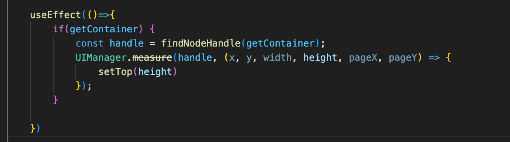

# RN报错问题

在rn的tabs的第三个tab点击跳转到二级界面，然后在二级界面`navigate`到第二个tab页。报错如下：


然后测试跳转三级界面，结果得到的也是同样的错误。这是什么原因呢？
而且在iOS中一切都是正常的，真是郁闷的不行。android坑是真的多啊！

## 分析问题
**假设1**
跳转的页面有问题，这个界面嵌套了react-native-webview,难道是webview或其中的交互有问题？
跳转另外一个项目的webview界面却是正常的。
那就跳转rn原生界面呢？结果也是有的界面正常，有的也是不行。

**假设2**
在第四个tab点击跳转到二级界面，然后在二级界面`navigate`到第二个tab页。结果正常，
猜测第三个tab界面或组件有问题？

检查每一个组件，发现`PointGoods`有问题导致的。这个组件使用了`React.forwardRef`,内部引用的组件`Popover`也使用了`React.forwardRef`,是嵌套导致的问题吗？

`PointGoods`组件去除`React.forwardRef`，问题依然存在。去掉`Popover`问题不存在了，难道是`Popover`使用`React.forwardRef`导致有问题。

`Popover`组件去除`React.forwardRef`，问题依然存在。说明并不是`React.forwardRef`有问题。继续细化定位代码位置。

**假设3**

发现不传`getContainer`的时候没有问题，



说明问题在这段代码里了，`UIManager.measure`接口被废弃，难道是android中已经移除了这个api了吗？但是其他地方也有使用，并没有什么问题啊。所以猜测错误。

在`useEffect`中添加`getContainer`监听，则没有问题但是不能获取到getContainer的真实高度。


查了一下资料说是`UIManager.measure`可以替换成`onLayout`，或需要在组件`onLayout`之后调用。说明要在组件渲染完成后才能调用，在`useEffect`中并没有做属性值的监听，组件的任何变化都会触发该钩子函数。多次交互跳转后`getContainer`元素被卸载但并没有销毁，只是不在界面上渲染。这就导致`findNodeHandle`无法找到`node`节点而报错。


传递`getContainer`目的是为了获取dom元素的高度。最后改为在元素的`onLayout`中获取高度,直接将高度传递即可。

总结：在react-native中操作dom要谨慎，iOS和android端底层处理视图的逻辑并不完全相同，所以`findNodeHandle`方法查找的dom的id并非实时的动态绑定。


## RN对View做高度动画报错
**Error: Style property 'height' is not supported by  native animated module**

源代码：
```
const adjustHeight = (height)=> {
   if(height == animHeight.__getValue()) return;
   Animated.timing(animHeight, {
       toValue: height,
       duration: 100,
       useNativeDriver: true,
   }).start();
   
}
```
解决：
```
Animated.timing(animHeight, {
  toValue: height,
  duration: 300,
  useNativeDriver: false, // 改为false
}).start();
```

## 小米手机rn运行闪退
`getLine1NumberForDisplay: Neither user 10298 nor current process has android.permission.READ_PHONE_STATE, android.permission.READ_SMS, or android.permission.READ_PHONE_NUMBERS`

需要在AndroidManifest.xml文件添加相应的权限：
```
<uses-permission android:name="android.permission.READ_PHONE_STATE" />
//targetSdkVersion=30是小米手机必需
<uses-permission android:name="android.permission.READ_PHONE_NUMBERS" />

```

## android 引入三方库报错
android使用`@react-native-community/masked-view`库报错：
`requiredNativeComponent: "RNCMaskedView" was not found in the UIManager`

