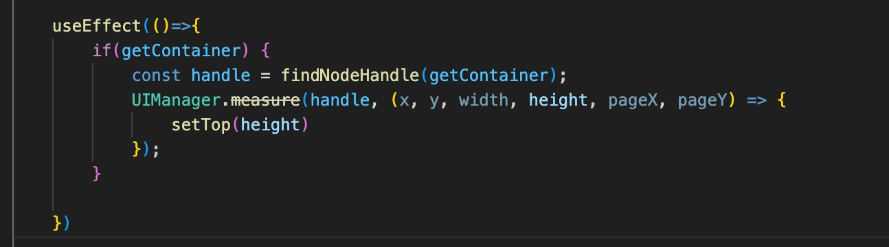
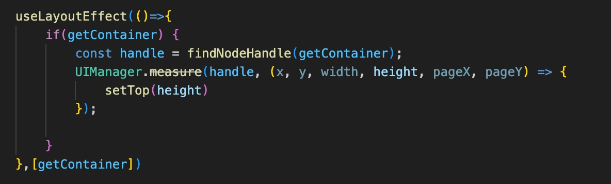

# ReactNative开发
## 创建React Native项目
rn0.72版本
```
//之前全局安装过旧的先卸载
npm uninstall -g react-native-cli @react-native-community/cli

// 创建最新版本项目
npx react-native@latest init ProjectName
```

0.73以上版本使用下面命令
```
npx @react-native-community/cli@latest init ProjectName

//或expo app可扫码预览
npx create-expo-app@latest
```

指定版本或项目模板， 0.71开始默认支持ts
```
npx react-native@0.70.2 init MyApp --template react-native-template-typescript
// 0.73以上版本使用下面命令
npx @react-native-community/cli init ProjectName --version X.XX.X
//或
npx create-expo-app --template
```

rn0.73版本需node18.x, 创建项目命令也有所不同。
也可使用[Expo](https://docs.expo.dev/)创建新项目，网络原因不建议国内用户使用expo，不支持原生sdk接入，需要弹出原生项目。

**0.74到0.76** android 工程发生了巨大变化。

## RN渲染原理

React Native基于react, 允许开发者使用js和react组件来构建原生应用，通过js描述用户界面，最终交给原生平台渲染。

它用虚拟dom来优化UI渲染，当组件状态或属性发生变化时，react会创建新的虚拟dom, 与之前的虚拟dom进行差异化比较，只需更新发生变化的部分，从而减少不必要的渲染开销。

老的架构渲染0.68：

React Native 在 JavaScript 和Native之间建立桥接（Bridge）的方式进行通信。js执行代码构建虚拟dom,当组件状态或属性发生变化时会重新计算虚拟dom并将变化的部分通过桥接的方式传递给native端，native拿到变化后的数据进行UI更新。桥接的方式在传输的过程中会有一定的性能开销。


新架构渲染0.70：

新架构使用**Fabric**渲染引擎，优化了UI渲染流程，通过jsi与native代码交互，取代了原来的桥接机制，减少桥接开销，jsi允许js直接访问原生模块，显著提高了性能。


## rn与native如何交互
* js调用原生代码的方法：
1. 模块需要实现`RCTBridgeModule`协议
2. 类中需要包含`RCT_EXPORT_MODULE()`宏,用于导出模块和自定义模块名称
3. 通过`RCT_EXPORT_METHOD()`宏声明要给 JavaScript 导出的方法（在新架构Turbo中可直接调用，先声明接口，codegen生成c++接口，配置模块及native接口）
4. 导出的方法参数`RCTResponseSenderBlock`可用于数据的回调
5. 防止js方法命名冲突也可使用`RCT_REMAP_METHOD`宏导出promise异步回调方法
6. RN端使用`NativeModules.ModulesName`调用原生端导出的方法

* 原生代码调用js方法：
1. 原生类需继承`RCTEventEmitter`
2. 实现`suppportEvents`方法,并返回支持的事件名称
3. 在需要发送事件的时候调用`sendEventWithName`方法设置事件名称和参数
4. js端通过创建`NativeEventEmitter`实例来通过事件名称添加监听订阅事件

## react native如何优化
1. 导航路由使用懒加载的方式`lazy(() => import('./HomeScreen'))`
2. 组件模块使用`React.lazy` 和 `Suspense` 动态加载，减少初始加载包大小
3. 使用memo、useMemo、useCallback等减少不必要的计算和渲染更新
4. 减少匿名函数的使用
5. 组件封装重用减少不必要的加载和渲染开销
6. 减少外部依赖库，减少包体积和依赖管理的复杂度

## 搭建RN库

使用[create-react-native-library](https://qdfish.github.io/sakamoto.blog/2024/04/03/rn/create_library/)来构建，或使用[create-react-native-module](https://github.com/brodycj/create-react-native-module)**(推荐)**， `create-react-native-module`基于`ative-create-library`的。

```
npx create-react-native-library@latest libray_name
// 可以添加参数
react-native-create-library --package-identifier com.quenice.libray_name --platforms android,ios libray_name
// 重命名项目
mv libray_name react-native-libray_name

//或全局安装
npm install -g create-react-native-module
create-react-native-module libray_name

```

因为利用`react-native-create-library`生产的项目, 组件相关的名称或者类会默认加上react-native或者RN前缀。所以上面先不加前缀，然后使用`mv`重命名项目。

## Codegen配置说明

```
  "codegenConfig": {
    "name": "<SpecName>",
    "type": "<types>",
    "jsSrcsDir": "<source_dir>",
    "android": {
      "javaPackageName": "<java.package.name>"
    }
  },
```

* `name`: 用于创建包含规范的文件的名称。按照惯例，它应该有后缀 `Spec`，但这不是必须的
* `type`: 需要生成的代码类型。允许的值是 `modules`, `components`, `all`
	* `modules`:如果只需要为 Turbo 原生模块生成代码，请使用此值.Turbo 原生模块要求规范文件以 `Native`开头。例如，`NativeLocalStorage.ts` 是一个有效的规范文件名
	* `components`:如果只需要为原生 Fabric 组件生成代码，请使用此值.原生 Fabric 组件要求规范文件以 `NativeComponent` 结尾。例如，`WebViewNativeComponent.tx`是一个有效的规范文件名
	* `all`: 如果有组件和模块的混合，请使用此值
* `jsSrcsDir`: 所有规范所在的根文件夹
* `android.javaPackageName`: 这是 Android 特有的设置，让 Codegen 在自定义包中生成文件

在项目根目录的`package.json`中配置Codegen, 会在`ios/build`和`android/app/build/generated/source/codegen`目录下生成相应的代码,
如果是组件则还会在`node_modules/组件名/android/build/generated/source/codegen`生成代码

### 工具统一处理(推荐)

```
npx create-react-native-library@latest module-name
```
* 询问是否创建本地库，选择`y`
* 指定库的位置默认在项目根目录创建`modules`文件夹
* 设置npm包的名称，默认会加上`react-native-`前缀，例如`react-native-module-name`可以改为`module-name`
* 设置包的描述，随便设置后面可以修改
* 库类型：
  * JavaScript library - supports Expo Go and Web
  * Native module - bridge for native APIs to JS
  * Native view - bridge for native views to JS
  * Turbo module with backward compat - supports new arch (experimental)
  * Turbo module - requires new arch (experimental)
  * Fabric view with backward compat - supports new arch (experimental)
  * Fabric view - requires new arch (experimental)
  这里我们选择`Turbo module - requires new arch (experimental)`的方式
  然后选择想要的语言：
* Kotlin & Objective-C
* C++ for Android & iOS
选择第一个。
运行脚本后，会在`modules`文件夹下自动生成一个名为`module-name`的文件夹:
* `package.json`: 文件中包含`codegenConfig`字段，用于配置Codegen及说明。
* `src`: 文件夹中声明定义需要的规范。
* `android`: 文件夹中包含Android平台相关的代码。
* `ios`: 文件夹中包含iOS平台相关的代码。
* `podspec`: 文件中包含iOS平台pods相关的配置。
* `react-native.config.js`: 文件中配置Android平台cmake相关。

```
cd TurboTest1
# 使用软连接的方式添加依赖 yarn 使用link, npm使用file。之后会在iOS项目下生成build文件夹
yarn add link:./modules/RNCalculator

```
在ios下编写原生代码完成后:
```
cd ios
rm -rf build & bundle exec pod install
```
在android下编写原生代码:
```
cd android
./gradlew generateCodegenArtifactsFromSchema

```
开发原生功能时，可以在原生开发工具中编写原生代码，测试完成后再移到组件库中。

## rn中android报错：
```
Build file '/Users/jion/Desktop/CodeSource/hil-leasing-assistant-rn/android/app/build.gradle' line: 57 * What went wrong: A problem occurred evaluating project ':app'.
```

根据提示是指向：build.gradle文件中react->`autolinkLibrariesWithApp()`。但是该方法并没有问题。执行`./gradlew clean`还是报同样的错误。

删除 android目录下的build文件夹中的文件，然后再执行`./gradlew clean`

## rn新建项目android报错：
```Settings file '/Users/jion/Desktop/My/LandApp/android/settings.gradle' line: 2

A problem occurred evaluating script.
> A problem occurred starting process 'command 'node''
```
rn版本: 0.74.6
Android Studio: Android Studio Ladybug | 2024.2.1 Patch 2
JDK: 17.0.3
**暂不知道如何解决** 0.75.4没有问题

Rn0.76.5安卓打release包时报了同样的问题:
```
cd android
./gradlew assembleRelease --warning-mode all
```
通过命令打包可以成功！

## rn**项目运行报错**

```

Error: EMFILE: too many open files, watch

  at FSEvent.FSWatcher._handle.onchange (internal/fs/watchers.js:178:28)

Emitted 'error' event on NodeWatcher instance at:

  at NodeWatcher.checkedEmitError (/Users/libida/Desktop/app/gktapp/node_modules/sane/src/node_watcher.js:143:12)

  at FSWatcher.emit (events.js:315:20)

  at FSEvent.FSWatcher._handle.onchange (internal/fs/watchers.js:184:12) {

 errno: -24,

 syscall: 'watch',

 code: 'EMFILE',

 filename: null

}


```

**解决**：这个问题有可能是node版本问题，也有可能是watch。我这是watch问题导致的。

`brew install watchman` 安装好，重新启动就可以了。

## RN报错问题

在rn的tabs的第三个tab点击跳转到二级界面，然后在二级界面`navigate`到第二个tab页。报错如下：


然后测试跳转三级界面，结果得到的也是同样的错误。这是什么原因呢？
而且在iOS中一切都是正常的，真是郁闷的不行。android坑是真的多啊！

## 分析问题
**假设1**
跳转的页面有问题，这个界面嵌套了react-native-webview,难道是webview或其中的交互有问题？
跳转另外一个项目的webview界面却是正常的。
那就跳转rn原生界面呢？结果也是有的界面正常，有的也是不行。

**假设2**
在第四个tab点击跳转到二级界面，然后在二级界面`navigate`到第二个tab页。结果正常，
猜测第三个tab界面或组件有问题？

检查每一个组件，发现`PointGoods`有问题导致的。这个组件使用了`React.forwardRef`,内部引用的组件`Popover`也使用了`React.forwardRef`,是嵌套导致的问题吗？

`PointGoods`组件去除`React.forwardRef`，问题依然存在。去掉`Popover`问题不存在了，难道是`Popover`使用`React.forwardRef`导致有问题。

`Popover`组件去除`React.forwardRef`，问题依然存在。说明并不是`React.forwardRef`有问题。继续细化定位代码位置。

**假设3**

发现不传`getContainer`的时候没有问题，



说明问题在这段代码里了，`UIManager.measure`接口被废弃，难道是android中已经移除了这个api了吗？但是其他地方也有使用，并没有什么问题啊。所以猜测错误。

在`useEffect`中添加`getContainer`监听，则没有问题但是不能获取到getContainer的真实高度。


查了一下资料说是`UIManager.measure`可以替换成`onLayout`，或需要在组件`onLayout`之后调用。说明要在组件渲染完成后才能调用，在`useEffect`中并没有做属性值的监听，组件的任何变化都会触发该钩子函数。多次交互跳转后`getContainer`元素被卸载但并没有销毁，只是不在界面上渲染。这就导致`findNodeHandle`无法找到`node`节点而报错。

传递`getContainer`目的是为了获取dom元素的高度。最后改为在元素的`onLayout`中获取高度,直接将高度传递即可。



总结：在react-native中操作dom要谨慎，iOS和android端底层处理视图的逻辑并不完全相同，所以`findNodeHandle`方法查找的dom的id并非实时的动态绑定。


## RN对View做高度动画报错
**Error: Style property 'height' is not supported by  native animated module**

源代码：
```
const adjustHeight = (height)=> {
   if(height == animHeight.__getValue()) return;
   Animated.timing(animHeight, {
       toValue: height,
       duration: 100,
       useNativeDriver: true,
   }).start();
   
}
```
**解决：**
```
Animated.timing(animHeight, {
  toValue: height,
  duration: 300,
  useNativeDriver: false, // 改为false
}).start();
```

## 小米手机rn运行闪退
`getLine1NumberForDisplay: Neither user 10298 nor current process has android.permission.READ_PHONE_STATE, android.permission.READ_SMS, or android.permission.READ_PHONE_NUMBERS`

**解决：**
需要在AndroidManifest.xml文件添加相应的权限：
```
<uses-permission android:name="android.permission.READ_PHONE_STATE" />
//targetSdkVersion=30是小米手机必需
<uses-permission android:name="android.permission.READ_PHONE_NUMBERS" />

```

## android 引入三方库报错
android使用`@react-native-community/masked-view`库报错：
`requiredNativeComponent: "RNCMaskedView" was not found in the UIManager`
**解决：**
需要在android项目中添加对应的包：
```
@Override
protected List<ReactPackage> getPackages() {
  List<ReactPackage> packages = new LocalPackageList(this).getPackages();
  packages.add(...其他包)
  packages.add(new RNCMaskedViewPackage());
  return packages;
}

```

## android studio运行报错
真机运行无法直接安装，
```
Unable to determine application id: com.android.tools.idea.run.ApkProvisionException: Error loading build artifacts from: /Users/jion/Desktop/公司项目/gktapp/android/app/build/outputs/apk/dev/debug/output-metadata.json
```

在该目录`build/outputs/apk/dev/debug`下未发现`output-metadata.json`文件而是一个`output.json`文件。

**解决：**


## Xcode16 打包RN项目
首次安装，启动app后本地图片资源无法渲染问题。
前期有报错：
```
xxx/Release-iphoneos/gktapp.app/main.jsbundle does not exist. This must be a bug with
```
然后执行了
```
"build:ios": "react-native bundle --entry-file index.js --bundle-output ./ios/main.jsbundle --platform ios --assets-dest ./ios --dev false",

```
在iOS目录下生成了`main.jsbundle`和`assets`两个文件。
还是报错的话，删除`main.jsbundle`然后重新添加进来。
在Xcode16上执行上面命令时会生成一个`build`文件(xcode14.3并没有生成该文件，会直接将main.jsbundle和assets拷贝到包文件里)，与`main.jsbundle`同级。运行发现首次启动图片不渲染。
查看`build/Release-iphoneos/gktapp.app`文件夹下的应用程序文件，发现`assets`资源包没有被打进去。

**解决**
**暂未找到问题根源。**
方案一(未验证)：执行`yarn build:ios`, 然后在构建app之前，
终端执行：`export NODE_OPTIONS=--openssl-legacy-provider`
方案二(未验证)：现在终端执行`sudo xcode-select --reset`, 然后执行`yarn build:ios`
方案三(未验证)：执行`yarn build:ios`, 然后拖拽`main.jsbundle`和 `assets`到Xcode项目，添加到Xcode选择`reference`的方式链接，不要选`group`。

**临时解决方案**就是把`assets`资源包复制到`gktapp.app`中。打包release环境时，在上传包之前也同样把`assets`资源包复制到`gktapp.app`中。


## RN0.76版本创建TurboModule问题
ios目录运行`bundle install`报错：
```
An error occurred while installing nkf (0.2.0), and Bundler cannot continue.
Make sure that `gem install nkf -v '0.2.0' --source 'https://rubygems.org/'` succeeds before bundling.

In Gemfile:
  cocoapods was resolved to 1.16.2, which depends on
    xcodeproj was resolved to 1.27.0, which depends on
      CFPropertyList was resolved to 3.0.7, which depends on
        nkf
```

**解决**: 因为我使用brew安装了ruby@3.3的版本，系统自带的是ruby2.6，版本冲突了，
在`.zshrc`文件中配置brew安装的ruby路径`export PATH="/usr/local/opt/ruby/bin:$PATH"`,并使用source执行让其立即生效。
关闭编译器重新打开运行`bundle install`就可以了

## rn自定义Location库
在iOS中库中CLLocationManager的代理方法一直不执行，将代码直接copy到项目中，却没有问题。

## android多渠道变体
app/build.gradle 配置如下：
```
flavorDimensions "default" 
productFlavors {
   dev {
       dimension "default"
       applicationId "com.hil.platform"
       versionNameSuffix "-dev"
       buildConfigField "boolean", "IS_STORE", "false"

       resValue "string", "app_name", '"和运行开发"'
       resValue "string", "CodePushDeploymentKey", '""'
   }
   prod {
       dimension "default"
       applicationId "com.hil.hyx"
       buildConfigField "boolean", "IS_STORE", "true"

       resValue "string", "CodePushDeploymentKey", '""'
       resValue "string", "app_name", '"和运行"'
   }
}

```

rn命令指定变体：
```
react-native run-android --variant=devDebug
```
报错如下：uunknown option '--variant=devDebug'

在新的版本参数发生变化，改为如下：
```
react-native run-android --mode=devDebug
```

打包指定变体，命令如下：
```
// 打测试的release包
react-native run-android --tasks=assembleDevRelease
// 打生产的release包
react-native run-android --tasks=assembleProdRelease

```

