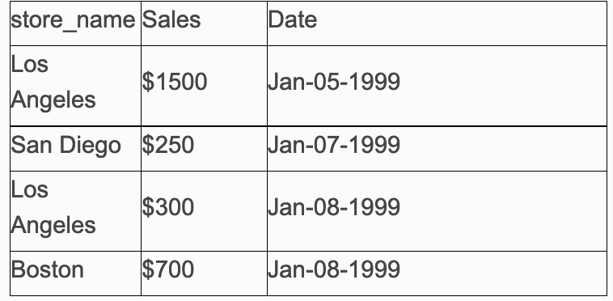

# SQL语句教程
这是一个非常简单明了的SQL语句教程,看了这篇文本,非常利于大家对数据库的学习。把它写在这里，以后用到了可以查看一下

* SQL 指令 SELECT
* DISTINCT WHERE
* AND OR
* IN
* BETWEEN LIKE
* ORDER BY 函数
* COUNT
* GROUP BY HAVING
* ALIAS 表格链接 外部链接 CONCATENATE SUBSTRING TRIM
* 表格处理
* CREATE TABLE CONSTRAINT NOT NULL UNIQUE CHECK
* 主键
* 外来键
* CREATE VIEW CREATE INDEX ALTER TABLE DROP TABLE TRUNCATE TABLE INSERT INTO
* UPDATE
* DELETE FROM
* 进阶 SQL UNION
* UNION ALL INTERSECT MINUS 子查询 EXISTS CASE 算排名
* 算中位数
  算总合百分比
  算累积总合百分比
* SQL 语法

无论您是一位 SQL 的新手,或是一位只是需要对 SQL 复习一下的资料仓储业界老将,您 就来对地方了。这个 SQL 教材网站列出常用的 SQL 指令,包含以下几个部分:

1. SQL 指令: SQL 如何被用来储存、读取、以及处理数据库之中的资料。
2. 表格处理: SQL 如何被用来处理数据库中的表格
3. 进阶 SQL: 介绍 SQL 进阶概念,以及如何用 SQL 来执行一些较复杂的运算
4. SQL 语法: 这一页列出所有在这个教材中被提到的 SQL 语法

对于每一个指令,我们将会先列出及解释这个指令的语法,然后用一个例子来让读者了解这 个指令是如何被运用的。当您读完了这个网站的所有教材后,您将对 SQL 的语法会有一个 大致上的了解。另外,您将能够正确地运用 SQL 来由数据库中获取信息。笔者本身的经验 是,虽然要对 SQL 有很透彻的了解并不是一朝一夕可以完成的,可是要对 SQL 有个基本 的了解并不难。希望在看完这个网站后,您也会有同样的想法。

## SQL 指令

**SELECT**

是用来做什么的呢?一个最常用的方式是将资料从数据库中的表格内选出。从这一句回答 中,我们马上可以看到两个关键字: 从 (FROM) 数据库中的表格内选出 (SELECT)。(表 格是一个数据库内的结构,它的目的是储存资料。在表格处理这一部分中,我们会提到如何 使用 SQL 来设定表格。) 我们由这里可以看到最基本的 SQL 架构:

SELECT "栏位名" FROM "表格名" 我们用以下的例子来看看实际上是怎么用的。假设我们有以下这个表格:



若要选出所有的店名 (store_Name),我们就打入: `SELECT store_name FROM Store_Information`

结果:我们一次可以读取好几个栏位,也可以同时由好几个表格中选资料。

**DISTINCT**

SELECT 指令让我们能够读取表格中一个或数个栏位的所有资料。这将把所有的资料都抓 出,无论资料值有无重复。在资料处理中,我们会经常碰到需要找出表格内的不同资料值的 情况。换句话说,我们需要知道这个表格/栏位内有哪些不同的值,而每个值出现的次数并 不重要。这要如何达成呢?在 SQL 中,这是很容易做到的。我们只要在 SELECT 后加上 一个 DISTINCT 就可以了。DISTINCT 的语法如下:

```
SELECT DISTINCT "栏位名" FROM "表格名"
```
举例来说,若要在以下的表格,Store_Information,找出所有不同的店名时,
Store_Information 表格


我们就键入,`SELECT DISTINCT store_name FROM Store_Information`

结果: store_name
     Los Angeles
     San Diego
     Boston


**WHERE**

我们并不一定每一次都要将表格内的资料都完全抓出。在许多时候,我们会需要选择性地抓 资料。就我们的例子来说,我们可能只要抓出营业额超过 $1,000 的资料。要做到这一点, 我们就需要用到 `WHERE` 这个指令。这个指令的语法如下:
```
SELECT "栏位名" FROM "表格名" WHERE "条件"
```
若我们要由Store_Information表格抓出营业额超过 $1,000 的资料


我们就键入,
`SELECT store_name FROM Store_Information WHERE Sales > 1000`

结果:
store_name
Los Angeles

**AND OR**

在上一页中,我们看到 `WHERE` 指令可以被用来由表格中有条件地选取资料。 这个条件 可能是简单的 (像上一页的例子),也可能是复杂的。复杂条件是由二或多个简单条件透过 `AND` 或是 `OR` 的连接而成。一个 SQL 语句中可以有无限多个简单条件的存在。

复杂条件的语法如下:
```
SELECT "栏位名"
FROM "表格名"
WHERE "简单条件" {[AND|OR] "简单条件"}+
```
`{}+` 代表`{}`之内的情况会发生一或多次。在这里的意思就是 `AND` 加简单条件及 `OR` 加简单条件的情况可以发生一或多次。另外,我们可以用 `()` 来代表条件的先后次序。

举例来说,我们若要在 Store_Information 表格中选出所有 Sales 高于 $1,000 或是 Sales 在 $500 及 $275 之间的资料的话,


我们就键入,
```
SELECT store_name
FROM Store_Information
WHERE Sales > 1000
OR (Sales < 500 AND Sales > 275)
```
结果:
store_name
Los Angeles
San Francisco

**IN**

在 SQL 中,在两个情况下会用到 `IN` 这个指令;这一页将介绍其中之一:与 `WHERE` 有 关的那一个情况。在这个用法下,我们事先已知道至少一个我们需要的值,而我们将这些知 道的值都放入 `IN` 这个子句。 IN 指令的语法为下:
```
SELECT "栏位名"
FROM "表格名"
WHERE "栏位名" IN ('值一', '值二', ...)
```
在括号内可以有一或多个值,而不同值之间由逗点分开。值可以是数目或是文字。若在括号 内只有一个值,那这个子句就等于`WHERE "栏位名" = '值一'`,举例来说,若我们要在 Store_Information 表格中找出所有含盖 Los Angeles 或 San Diego的资料, Store_Information 表格


我们就键入,
```
SELECT *
FROM Store_Information
WHERE store_name IN ('Los Angeles', 'San Diego')
```

**BETWEEN**

IN 这个指令可以让我们依照一或数个不连续 (discrete) 的值的限制之内抓出资料库中的 值,而 `BETWEEN` 则是让我们可以运用一个范围 (range) 内抓出资料库中的值。`BETWEEN` 这个子句的语法如下:
```
SELECT "栏位名"
FROM "表格名"
WHERE "栏位名" BETWEEN '值一' AND '值二'

```
这将选出栏位值包含在值一及值二之间的每一笔资料。

举例来说,若我们要由 Store_Information 表格中找出所有介于 January 6, 1999 及 January 10, 1999 中的资料,Store_Information 表格


我们就键入,
```
SELECT *
FROM Store_Information
WHERE Date BETWEEN 'Jan-06-1999' AND 'Jan-10-1999'
```
请读者注意:在不同的数据库中,日期的储存法可能会有所不同。在这里我们选择了其中一 种储存法。

**LIKE**

`LIKE` 是另一个在 `WHERE` 子句中会用到的指令。基本上, `LIKE` 能让我们依据一个模式 (pattern) 来找出我们要的资料。相对来说,在运用 `IN` 的时候,我们完全地知道我们需要的条件;在运用 `BETWEEN` 的时候,我们则是列出一个范围。 LIKE 的语法如下:
```
SELECT "栏位名"
FROM "表格名"
WHERE "栏位名" LIKE {模式}

```
`{模式}` 经常包括野卡 (wildcard). 以下是几个例子:

* 'A_Z': 所有以 'A' 起头,另一个任何值的字原,且以 'Z' 为结尾的字符串。 'ABZ' 和 'A2Z'都符合这一个模式,而 'AKKZ' 并不符合 (因为在 A 和 Z 之间有两个字原,而不是一个字原)
* 'ABC%': 所有以 'ABC' 起头的字符串。举例来说,'ABCD' 和 'ABCABC' 都符合这个模式。
* '%XYZ': 所有以 'XYZ' 结尾的字符串。举例来说,'WXYZ' 和 'ZZXYZ' 都符合这个模式。
* '%AN%': 所有含有 'AN'这个模式的字符串。举例来说, 'LOS ANGELES' 和 'SAN FRANCISCO' 都符合这个模式。

我们将以上最后一个例子用在我们的 Store_Information 表格上:


```
SELECT *
FROM Store_Information
WHERE store_name LIKE '%AN%'
```

**ORDER BY**

到目前为止,我们已学到如何用 `SELECT` 及 `WHERE` 这两个指令将资料由表格中抓出。 不过我们尚未提到这些资料要如何排列。这其实是一个很重要的问题。事实上,我们经常需 要能够将抓出的资料做一个有系统的显示。这可能是由小往大 (ascending) 或是由大往小 (descending)。在这种情况下,我们就可以运用 `ORDER BY` 这个指令来达到我们的目的。`ORDER BY` 的语法如下:

```
SELECT "栏位名"
FROM "表格名"
[WHERE "条件"]
ORDER BY "栏位名" [ASC, DESC]

```
`[]` 代表 `WHERE` 子句不是一定需要的。不过,如果 `WHERE` 子句存在的话,它是在 `ORDER BY` 子句之前。 `ASC` 代表结果会以由小往大的顺序列出,而 `DESC` 代表结果会以 由大往小的顺序列出。如果两者皆没有被写出的话,那我们就会用 `ASC`。

我们可以照好几个不同的栏位来排顺序。在这个情况下, `ORDER BY` 子句的语法如下(假设有两个栏位):
`ORDER BY "栏位一" [ASC, DESC], "栏位二" [ASC, DESC]`

若我们对这两个栏位都选择由小往大的话,那这个子句就会造成结果是依据 "栏位一" 由小往大排。若有好几笔资料 "栏位一" 的值相等,那这几笔资料就依据 "栏位二" 由小往大排。 
举例来说,若我们要依照 `Sales` 栏位的由大往小列出 Store_Information 表格中的资料,


```
SELECT store_name, Sales, Date
FROM Store_Information
ORDER BY Sales DESC
```
在以上的例子中,我们用栏位名来指定排列顺序的依据。除了栏位名外,我们也可以用栏位 的顺序 (依据 SQL 句中的顺序)。在 SELECT 后的第一个栏位为 1,第二个栏位为 2,以 此类推。在上面这个例子中,我们用以下这句 SQL 可以达到完全一样的效果:
```
SELECT store_name, Sales, Date
FROM Store_Information
ORDER BY 2 DESC
```

**函数**
既然数据库中有许多资料都是已数字的型态存在,一个很重要的用途就是要能够对这些数字 做一些运算,例如将它们总合起来,或是找出它们的平均值。SQL 有提供一些这一类的函 数。它们是:

* AVG (平均)
* COUNT (计数)
* MAX (最大值)
* MIN (最小值)
* SUM (总合)
运用函数的语法是:

```
SELECT "函数名"("栏位名") FROM "表格名"

```

举例来说,若我们要由我们的范例表格中求出 Sales 栏位的总合,

```
SELECT SUM(Sales) FROM Store_Information
```

结果:
SUM(Sales)
$2750
$2750 
代表所有 Sales 栏位的总合: `$1500 + $250 + $300 + $700`.

除了函数的运用外,SQL 也可以做简单的数学运算,例如加(`+`)和减(`-`)。对于文字类的资料, SQL 也有好几个文字处理方面的函数,例如文字相连 (`concatenation`),文字修整 (`trim`),以 及子字符串 (`substring`)。不同的数据库对这些函数有不同的语法,所以最好是参考您所用数 据库的信息,来确定在那个数据库中,这些函数是如何被运用的。

**COUNT**

`COUNT` 是函数之一。由于它的使用广泛,我们在这里特别提出来讨论。 基本上, `COUNT` 让我们能够数出在表格中有多少笔资料被选出来。它的语法是:

```
SELECT COUNT("栏位名") FROM "表格名"
```
举例来说,若我们要找出我们的范例表格中有几笔 store_name 栏不是空白的资料时,


```
SELECT COUNT(store_name)
FROM Store_Information
WHERE store_name is not NULL
```
结果:
Count(store_name)
4

"is not NULL" 是 "这个栏位不是空白" 的意思。

`COUNT` 和 `DISTINCT` 经常被合起来使用,目的是找出表格中有多少笔不同的资料 (至于 这些资料实际上是什么并不重要)。举例来说,如果我们要找出我们的表格中有多少个不同 的 store_name,我们就键入,

```
SELECT COUNT(DISTINCT store_name)
FROM Store_Information
```
结果:
Count(DISTINCT store_name)
3

**GROUP BY**

我们现在回到函数上。记得我们用 SUM 这个指令来算出所有的 Sales (营业额)吧!如果我 们的需求变成是要算出每一间店 (`store_name`) 的营业额 (`sales`),那怎么办呢?在这个情况 下,我们要做到两件事:第一,我们对于 `store_name` 及 `Sale`s 这两个栏位都要选出。第二, 我们需要确认所有的 `sales` 都要依照各个 `store_name` 来分开算。这个语法为:

```
SELECT "栏位 1", SUM("栏位 2") FROM "表格名"
GROUP BY "栏位 1"
```


```
SELECT store_name, SUM(Sales)
FROM Store_Information
GROUP BY store_name

```

结果:
store_name SUM(Sales)
Los Angeles $1800
San Diego $250
Boston $700

当我们选不只一个栏位,且其中至少一个栏位有包含函数的运用时,我们就需要用到 `GROUP BY` 这个指令。在这个情况下,我们需要确定我们有 `GROUP BY` 所有其他的栏位。 换句话说,除了有包括函数的栏位外,我们都需要将其放在 `GROUP BY` 的子句中。

**HAVING**

那我们如何对函数产生的值来设定条件呢?举例来说,我们可能只需要知道哪些店的营业额 有超过 `$1,500`。在这个情况下,我们不能使用 `WHERE` 的指令。那要怎么办呢?很幸运地, SQL 有提供一个 `HAVING` 的指令,而我们就可以用这个指令来达到这个目标。 `HAVING` 子句通常是在一个 SQL 句子的最后。一个含有 `HAVING` 子句的 SQL 并不一定要包含 `GROUP BY` 子句。`HAVING` 的语法如下:

```
SELECT "栏位 1", SUM("栏位 2") FROM "表格名"
GROUP BY "栏位 1"
HAVING (函数条件)
```
请读者注意: 如果被 `SELECT` 的只有函数栏, 那就不需要 `GROUP BY` 子句。 在我们 Store_Information 表格这个例子中,


若我们要找出 Sales 大于 $1,500 的 store_name,我们就键入,
```
SELECT store_name, SUM(sales)
FROM Store_Information
GROUP BY store_name
HAVING SUM(sales) > 1500
```
结果:
store_name SUM(Sales)
Los Angeles $1800


**ALIAS**

接下来,我们讨论 alias (别名) 在 SQL 上的用处。最常用到的别名有两种:栏位别名及表格别名。

简单地来说,栏位别名的目的是为了让 SQL 产生的结果易读。在之前的例子中,每当我们 有营业额总合时,栏位名都是 SUM(sales)。虽然在这个情况下没有什么问题,可是如果这 个栏位不是一个简单的总合,而是一个复杂的计算,那栏位名就没有这么易懂了。若我们用 栏位别名的话,就可以确认结果中的栏位名是简单易懂的。

第二种别名是表格别名。要给一个表格取一个别名,只要在 FROM 子句中的表格名后空一 格,然后再列出要用的表格别名就可以了。这在我们要用 SQL 由数个不同的表格中获取资 料时是很方便的。这一点我们在之后谈到连接 (join) 时会看到。

我们先来看一下栏位别名和表格别名的语法:

```
SELECT "表格别名"."栏位 1" "栏位别名"
FROM "表格名" "表格别名"
```
基本上,这两种别名都是放在它们要替代的物件后面,而它们中间由一个空白分开。我们继 续使用 Store_Information 这个表格来做例子:


我们用跟 SQL `GROUP BY` 那一页一样的例子。这里的不同处是我们加上了栏位别名以及 表格别名:
```
SELECT A1.store_name Store, SUM(A1.Sales) "Total Sales"
FROM Store_Information A1
GROUP BY A1.store_name
```
在结果中,资料本身没有不同。不同的是栏位的标题。这是运用栏位别名的结果。在第二个 栏位上,原本我们的标题是 "Sum(Sales)",而现在我们有一个很清楚的 "Total Sales"。很明 显地, "Total Sales" 能够比 "Sum(Sales)" 更精确地阐述这个栏位的含意。用表格别名的好处在这里并没有显现出来,不过这在 下一页就会很清楚了。

**表格链接**

现在我们介绍连接(`join`)的概念。要了解连接,我们需要用到许多我们之前已介绍过的指令。 我们先假设我们有以下的两个表格,

而我们要知道每一区 (region_name) 的营业额 (sales)。 Geography 这个表格告诉我们每一 区有哪些店,而 Store_Information 告诉我们每一个店的营业额。若我们要知道每一区的营 业额,我们需要将这两个不同表格中的资料串联起来。当我们仔细了解这两个表格后,我们 会发现它们可经由一个相同的栏位,store_name,连接起来。我们先将 SQL 句列出,之后 再讨论每一个子句的意义:

```
SELECT A1.region_name REGION, SUM(A2.Sales) SALES FROM Geography A1, Store_Information A2
WHERE A1.store_name = A2.store_name
GROUP BY A1.region_name
```
结果:
REGION SALES
East         $700
West       $2050

在第一行中,我们告诉 SQL 去选出两个栏位:
第一个栏位是 Geography 表格中的 region_name 栏位 (我们取了一个别名叫做 REGION);
第二个栏位是 Store_Information 表 格中的 sales 栏位 (别名为 SALES)。

请注意在这里我们有用到表格别名:Geography 表格 的别名是 A1,Store_Information 表格的别名是 A2。若我们没有用表格别名的话,第一行就会变成`SELECT Geography.region_name REGION, SUM(Store_Information.Sales) SALES`很明显地,这就复杂多了。在这里我们可以看到表格别名的功用:它能让 SQL 句容易被了 解,尤其是这个 SQL 句含盖好几个不同的表格时。

接下来我们看第三行,就是 `WHERE` 子句。这是我们阐述连接条件的地方。在这里,我们 要确认 Geography 表格中 store_name 栏位的值与 Store_Information 表格中 store_name 栏位的值是相等的。这个 WHERE 子句是一个连接的灵魂人物,因为它的角色是确定两个 表格之间的连接是正确的。如果 WHERE 子句是错误的,我们就极可能得到一个笛卡儿连 接 (Cartesian join)。笛卡儿连接会造成我们得到所有两个表格每两行之间所有可能的组合。 在这个例子中,笛卡儿连接会让我们得到 4 x 4 = 16 行的结果。

**外部链接**

之前我们看到的左连接 (`left join`),又称内部连接 (`inner join`)。在这个情况下,要两个表格内都有同样的值,那一笔资料才会被选出。那如果我们想要列出一个表格中每一笔的资料, 无论它的值在另一个表格中有没有出现,那该怎么办呢?在这个时候,我们就需要用到 SQL `OUTER JOIN` (外部连接) 的指令。

外部连接的语法是依数据库的不同而有所不同的。举例来说,在 Oracle 上,我们会在 WHERE 子句中要选出所有资料的那个表格之后加上一个 `"(+)"` 来代表说这个表格中的所有资料我们都要。

假设我们有以下的两个表格:

我们需要知道每一间店的营业额。如果我们用一个普通的连接,我们将会漏失掉 'New York' 这个店,因为它并不存在于 Store_Information 这个表格。所以,在这个情况下,我们需要用外部连接来串联这两个表格:
```
SELECT A1.store_name, SUM(A2.Sales) SALES
FROM Georgraphy A1, Store_Information A2
WHERE A1.store_name = A2.store_name (+)
GROUP BY A1.store_name
```
们在这里是使用了 Oracle 的外部连接语法。 结果:

store_name      SALES
Boston               $700
New York
Los Angeles      $1800
San Diego          $250

请注意:当第二个表格没有相对的资料时,SQL 会传回 NULL 值。在这一个例子中,'New York' 并不存在于 Store_Information 表格,所以它的 "SALES" 栏位是 NULL.

**CONCATENATE**

有的时候,我们有需要将由不同栏位获得的资料串连在一起。每一种数据库都有提供方法来 达到这个目的:

* MySQL: CONCAT()
* Oracle: CONCAT(), ||
* SQL Server: +

CONCAT() 的语法如下:

CONCAT(字符串 1, 字符串 2, 字符串 3, ...): 将字符串 1、字符串 2、字符串 3,等字符串连 在一起。

请注意,Oracle 的 CONCAT()只允许两个参数;换言之,一次只能将两个字符串串 连起来。不过,在 Oracle 中,我们可以用'||'来一次串连多个字符串。

例子 1:
```
MySQL/Oracle:
SELECT CONCAT(region_name,store_name) FROM Geography
WHERE store_name = 'Boston';
```

结果:
'EastBoston'

例子 2:

```
Oracle:
SELECT region_name || ' ' || store_name FROM Geography
WHERE store_name = 'Boston';
```
结果:
'East Boston'

例子 3:
```
SQL Server:
SELECT region_name + ' ' + store_name FROM Geography
WHERE store_name = 'Boston';
```
结果:
'East Boston'

**SUBSTRING**

SQL 中的 `substring` 函数是用来抓出一个栏位资料中的其中一部分。这个函数的名称在不同的数据库中不完全一样:

* MySQL: SUBSTR(), SUBSTRING()
* Oracle: SUBSTR()
* SQL Server: SUBSTRING()

最常用到的方式如下 (在这里我们用 SUBSTR()为例):

1. SUBSTR(str,pos): 由中,选出所有从第位置开始的字符。请注意,这个语法不适用于 SQL Server 上。
2. SUBSTR(str,pos,len): 由中的第位置开始,选出接下去的个字符。

例1:
```
SELECT SUBSTR(store_name, 3)
FROM Geography
WHERE store_name = 'Los Angeles';
```
结果:
's Angeles'

例2:
```
SELECT SUBSTR(store_name,2,4) FROM Geography
WHERE store_name = 'San Diego';
```
结果: 'an D'

**TRIM**

SQL 中的 `TRIM` 函数是用来移除掉一个字符串中的字头或字尾。最常见的用途是移除字首 或字尾的空白。这个函数在不同的数据库中有不同的名称:

* MySQL: TRIM(), RTRIM(), LTRIM()
* Oracle: RTRIM(), LTRIM()
* SQL Server: RTRIM(), LTRIM()

各种 trim 函数的语法如下:

1. TRIM([[位置] [要移除的字符串] FROM ] 字符串): [位置] 的可能值为 LEADING (起头), TRAILING (结尾), or BOTH (起头及结尾)。这个函数将把 [要移除的字符串] 从字符串的起 头、结尾,或是起头及结尾移除。如果我们没有列出 [要移除的字符串] 是什么的话,那空 白就会被移除。
2. LTRIM(字符串): 将所有字符串起头的空白移除。
3. RTRIM(字符串): 将所有字符串结尾的空白移除。

例 1:
```SELECT TRIM('  Sample  ');```
结果:
'Sample'

例 2:
```SELECT LTRIM('  Sample   ');```
结果:
'Sample    '

例 3:
```SELECT RTRIM('    Sample     ');```
结果:
'    Sample'


## 表格处理

**CREATE TABLE**

表格是数据库中储存资料的基本架构。在绝大部份的情况下,数据库厂商不可能知道您需要 如何储存您的资料,所以通常您会需要自己在数据库中建立表格。虽然许多数据库工具可以 让您在不需用到 SQL 的情况下建立表格,不过由于表格是一个最基本的架构,我们决定包 括 `CREATE TABLE` 的语法在这个网站中。

在我们跳入 `CREATE TABLE` 的语法之前,我们最好先对表格这个东西有些多一点的了解。 表格被分为栏位 (column) 及列位 (row)。每一列代表一笔资料,而每一栏代表一笔资料的 一部份。举例来说,如果我们有一个记载顾客资料的表格,那栏位就有可能包括姓、名、地 址、城市、国家、生日‧‧‧等等。当我们对表格下定义时,我们需要注明栏位的标题,以及那 个栏位的资料种类。

那资料种类是什么呢?资料可能是以许多不同的形式存在的。它可能是一个整数 (例如 1),、一个实数 (例如 0.55)、一个字符串 (例如 'sql')、一个日期/时间 (例如 '2000-JAN-25 03:22:22')、或甚至是以二进法 (binary) 的状态存在。当我们在对一个表格下定义时,我们 需要对每一个栏位的资料种类下定义。 (例如 '姓' 这个栏位的资料种类是 char(50)──代表这是一个 50 个字符的字符串)。我们需要注意的一点是不同的数据库有不同的资料种类, 所以在对表格做出定义之前最好先参考一下数据库本身的说明。

CREATE TABLE 的语法是:
```
CREATE TABLE "表格名" ("栏位 1" "栏位1资料种类", "栏位 2" "栏位2资料种类", ... )

```

若我们要建立我们上面提过的顾客表格,我们就键入以下的 SQL:

```
CREATE TABLE customer (First_Name char(50), Last_Name char(50), Address char(50),
City char(50), Country char(25), Birth_Date date)

```

#### CONSTRAINT

我们可以限制哪一些资料可以存入表格中。这些限制可以在表格初创时藉由 `CREATE TABLE` 语句来指定,或是之后藉由 `ALTER TABLE` 语句来指定。
常见的限制有以下几种:

**NOT NULL**

在没有做出任何限制的情况下,一个栏位是允许有 `NULL` 值得。如果我们不允许一个栏位 含有 `NULL` 值,我们就需要对那个栏位做出 `NOT NULL` 的指定。举例来说,在以下的语句中,

```
CREATE TABLE Customer
(SID integer NOT NULL, Last_Name varchar (30) NOT NULL, First_Name varchar(30));
```
"SID" 和 "Last_Name" 这两个栏位是不允许有 `NULL` 值,而 "First_Name" 这个栏位是可以有`NULL`值得。

**UNIQUE**

`UNIQUE` 限制是保证一个栏位中的所有资料都是有不一样的值。 举例来说,在以下的语句中,
```
CREATE TABLE Customer (SID integer Unique, Last_Name varchar (30), First_Name varchar(30));
```
"SID" 栏位不能有重复值存在,而 "Last_Name" 及 "First_Name" 这两个栏位则是允许有重复值存在。
请注意,一个被指定为主键的栏位也一定会含有 UNIQUE 的特性。相对来说,一个 UNIQUE 的栏位并不一定会是一个主键。

**CHECK**

`CHECK` 限制是保证一个栏位中的所有资料都是符合某些条件。
举例来说,在以下的语句中,
```
CREATE TABLE Customer (SID integer CHECK (SID > 0), Last_Name varchar (30), First_Name varchar(30));
```
"SID" 拦只能包含大于 0 的整数。
请注意,`CHECK` 限制目前尚未被执行于 MySQL 数据库上。 主键和外来键将于下两页中讨论。


**主键**

主键 (Primary Key) 中的每一笔资料都是表格中的唯一值。换言之,它是用来独一无二地确 认一个表格中的每一行资料。主键可以是原本资料内的一个栏位,或是一个人造栏位 (与原 本资料没有关系的栏位)。主键可以包含一或多个栏位。当主键包含多个栏位时,称为组合 键 (Composite Key)。

主键可以在建置新表格时设定 (运用 CREATE TABLE 语句),或是以改变现有的表格架构 方式设定 (运用 ALTER TABLE)。

以下举几个在建置新表格时设定主键的方式:

```
MySQL:
CREATE TABLE Customer (SID integer,
Last_Name varchar(30), First_Name varchar(30), PRIMARY KEY (SID));
Oracle:
CREATE TABLE Customer (SID integer PRIMARY KEY, Last_Name varchar(30), First_Name varchar(30));
SQL Server:
CREATE TABLE Customer (SID integer PRIMARY KEY, Last_Name varchar(30), First_Name varchar(30));
```
以下则是以改变现有表格架构来设定主键的方式:

```
MySQL:
ALTER TABLE Customer ADD PRIMARY KEY (SID);
Oracle:
ALTER TABLE Customer ADD PRIMARY KEY (SID);
SQL Server:
ALTER TABLE Customer ADD PRIMARY KEY (SID);
```

请注意,在用 `ALTER TABLE` 语句来添加主键之前,我们需要确认被用来当做主键的栏位是 设定为`NOT NULL`;也就是说,那个栏位一定不能没有资料

**外来键**

外来键是一个(或数个)指向另外一个表格主键的栏位。外来键的目的是确定资料的参考完整 性(referential integrity)。换言之,只有被准许的资料值才会被存入数据库内。

举例来说,假设我们有两个表格:一个 `CUSTOMER` 表格,里面记录了所有顾客的资料; 另一个 `ORDERS` 表格,里面记录了所有顾客订购的资料。在这里的一个限制,就是所有的 订购资料中的顾客,都一定是要跟`CUSTOMER` 表格中存在。在这里,我们就会在 `ORDERS` 表格中设定一个外来键,而这个外来键是指向 `CUSTOMER` 表格中的主键。这样一来,我们就可以确定所有在 `ORDERS` 表格中的顾客都存在 `CUSTOMER `表格中。换句说,`ORDERS` 表格之中,不能有任何顾客是不存在于 `CUSTOMER` 表格中的资料。

这两个表格的结构将会是如下:

在以上的例子中,ORDERS 表格中的 customer_SID 栏位是一个指向 CUSTOMERS 表格 中 SID 栏位的外来键。
以下列出几个在建置 ORDERS 表格时指定外来键的方式:
```
MySQL:
CREATE TABLE ORDERS
(Order_ID integer,
Order_Date date,
Customer_SID integer,
Amount double,
Primary Key (Order_ID),
Foreign Key (Customer_SID) references CUSTOMER(SID));
Oracle:
CREATE TABLE ORDERS
(Order_ID integer primary key,
Order_Date date,
Customer_SID integer references CUSTOMER(SID), Amount double);
SQL Server:
CREATE TABLE ORDERS (Order_ID integer primary key,
Order_Date datetime,
Customer_SID integer references CUSTOMER(SID), Amount double);
```

以下的例子则是藉着改变表格架构来指定外来键。这里假设 ORDERS 表格已经被建置,而 外来键尚未被指定:

```
MySQL:
ALTER TABLE ORDERS
ADD FOREIGN KEY (customer_sid) REFERENCES CUSTOMER(sid);
Oracle:
ALTER TABLE ORDERS
ADD (CONSTRAINT fk_orders1) FOREIGN KEY (customer_sid) REFERENCES CUSTOMER(sid);
SQL Server:
ALTER TABLE ORDERS
ADD FOREIGN KEY (customer_sid) REFERENCES CUSTOMER(sid);
```

**CREATE VIEW**

视观表 (Views) 可以被当作是虚拟表格。它跟表格的不同是,表格中有实际储存资料,而 视观表是建立在表格之上的一个架构,它本身并不实际储存资料。
建立一个视观表的语法如下:
```
CREATE VIEW "VIEW_NAME" AS "SQL 语句"
```
`"SQL 语句"` 可以是任何一个我们在这个教材中有提到的 SQL。 来看一个例子。假设我们有以下的表格:

```
TABLE Customer (First_Name char(50), Last_Name char(50), Address char(50), City char(50), Country char(25), Birth_Date date)
```
若要在这个表格上建立一个包括 First_Name, Last_Name, 和 Country 这三个栏位的视 观表,我们就打入:
```
CREATE VIEW V_Customer
AS SELECT First_Name, Last_Name, Country FROM Customer
```

现在,我们就有一个叫做 V_Customer 的视观表:
```
View V_Customer (First_Name char(50), Last_Name char(50), Country char(25))
```
我们也可以用视观表来连接两个表格。在这个情况下,使用者就可以直接由一个视观表中找 出她要的信息,而不需要由两个不同的表格中去做一次连接的动作。


