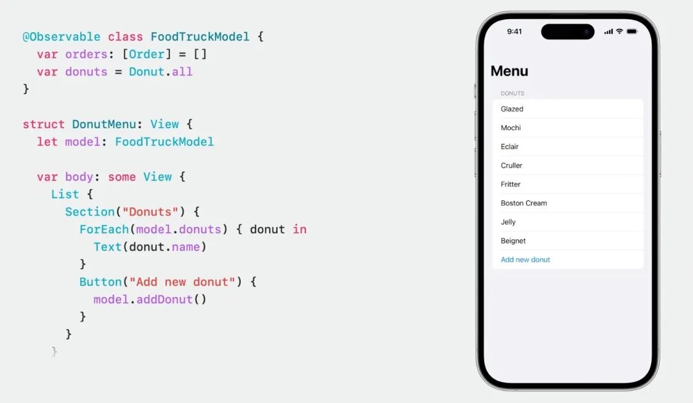
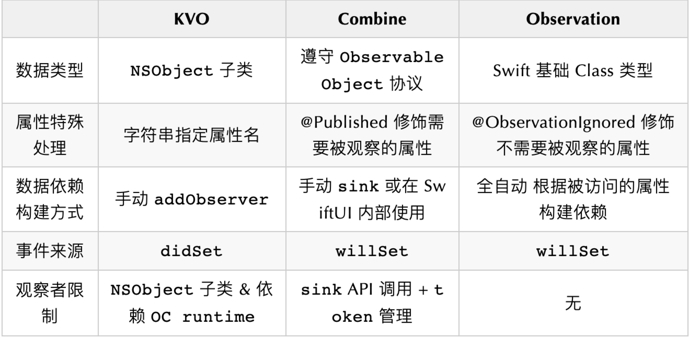
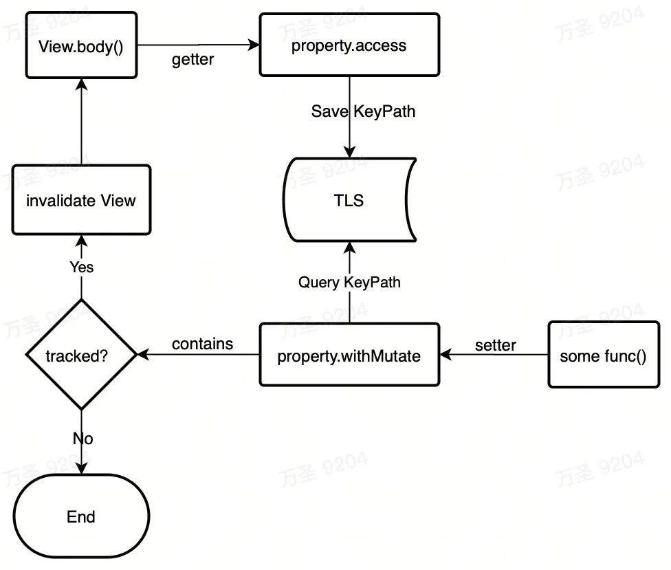
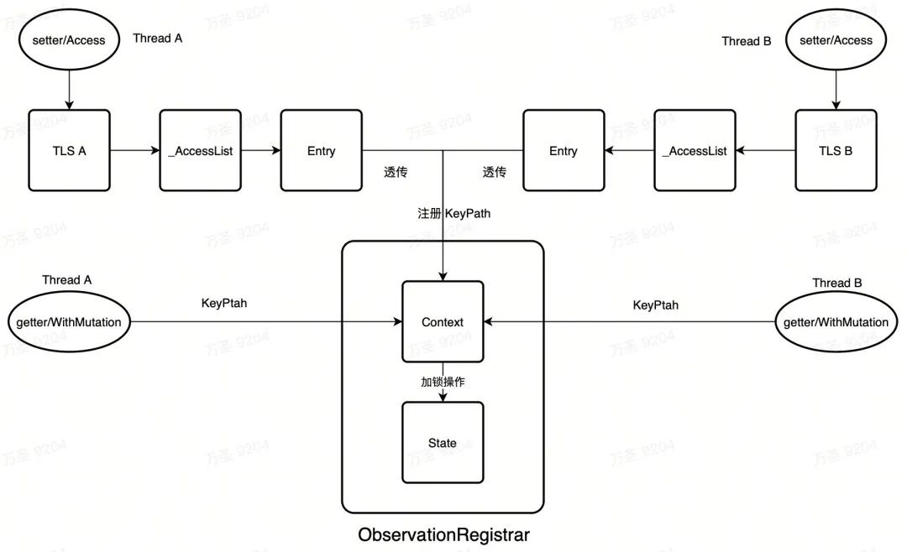
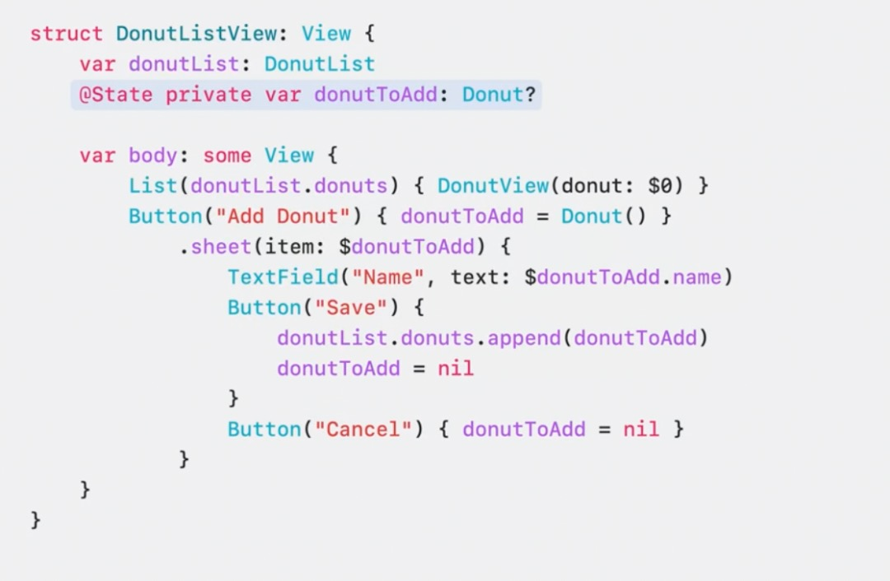
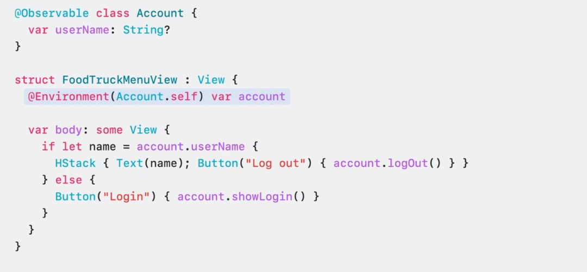
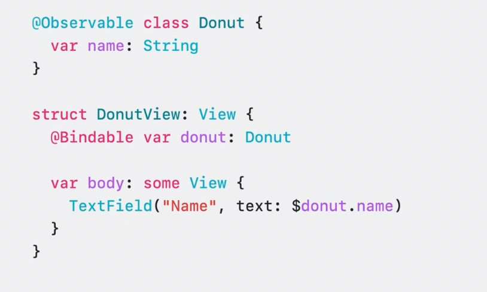
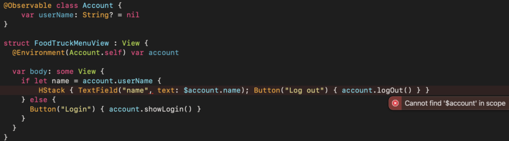
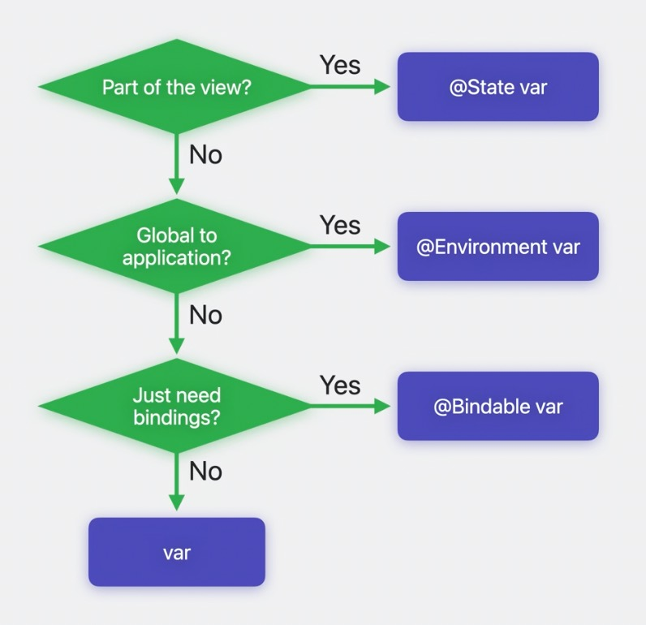

# SwiftUI: Observation


> Observation 是基于 Swift 5.9 宏系统推出的全新特性，它可以帮助开发者简化数据模型并提高应用程序性能，让 SwiftUI 的数据驱动 UI 体验更加出色。本文将介绍 Observation 的基础知识和实现原理，并通过一些案例来感受 Observation 的实际应用体验，以及了解如何将现有的 `ObservableObject` 迁移到 `@Observable`

## Observation 概述
数据驱动 UI 是 SwiftUI 的核心特性之一。在 SwiftUI 中，开发者需要编写一系列的适配代码才能让数据模型实现数据驱动 UI。

Observation 是 Swift 的一个新特性，它可以通过宏将 Swift 基本类型转换为可以被追踪属性变化的类型。这让开发者只需使用 Swift 基础类型来定义数据模型就可以在 SwiftUI 中实现数据驱动 UI。极大地简化了开发者在设计和实现数据模型方面的负担。

```
@Observable class FoodTruckModel {    
    var orders: [Order] = []
    var donuts = Donut.all
}
```

**回顾之前的模型设计:**

之前在设计实现 SwiftUI 数据模型时，我们可能需要最少三步才能让它实现数据驱动 UI ：

1. 要求数据模型遵守 `ObservableObject` 协议;
2. 将数据变更需要触发 UI 刷新的具体属性增加 `@Published` 描述;
  ```
  class FoodTruckModel: ObservableObject {    
      @Published
      var orders: [Order] = []
      
      @Published
      var donuts = Donut.all
  }
  ```
3. 在 View 中通过 `@ObservedObject` 或者 `@StateObject` 来描述我们持有的数据模型

  ```
  struct ContentView: View {

   @ObservedObject
   var model: FoodTruckModel
   
   var body: some View {
    // ... //
   }
  }
  ```
  以上三步完成之后，数据模型才能响应 SwiftUI 的数据驱动 UI 刷新流程。

现在，想要实现上面的效果，只需要在数据模型声明的最前面加上 `@Observable` 描述即可，而无需其他工作。
```
@Observable class FoodTruckModel {    
    var orders: [Order] = []
    var donuts = Donut.all
}

struct ContentView {
    var model: FoodTruckModel
    
    var body: View {
        // ... //    
    }
}
```

可以看到，从 `ObservableObject` 迁移到 Observation 简化了模型设计。不再需要 `@Published`、`ObservableObject` 和 `@ObservedObject` 或 `@StateObject`。

这一切都源自于 Swift 的宏系统，接下来我们详细介绍下 Observation 提供的几个 Swift 宏。

##### @Observable

`@Observable` 是一个 Swift 宏，用于修饰模型。使用它后，Swift 编译器会将你的代码从普通类型扩展成可被监听的类型。这样一来，我们就无需使用任何类似于 `@Published` 的 `propertyWrapper`，就可以让数据模型驱动 SwiftUI 视图的更新。



在 `View` 的 `body` 调用过程中，使用 `@Observable` 修饰的类型会被 SwiftUI 识别到具体属性的访问记录，从而自动生成数据依赖。

在上面的例子中，SwiftUI 在 `DonutMenu` 的 `body` 调用中识别到了对 `FoodTruckModel` 属性 `donuts` 的访问，并根据访问记录生成了从 `DonutMenu` 到 `donuts` 的数据依赖关系。随后，当属性数据发生变化时，SwiftUI 就会根据这些数据依赖关系来决定是否需要触发 UI 更新。

当点击按钮 `addDonut` 修改 `dounts` 属性时，由于在 `DonutMenu.body` 中访问 `donuts` 属性时已被 SwiftUI 跟踪并建立了数据依赖关系，因此对其进行修改会使之前的 `DonutMenu` 失效，从而更新 UI。

巧妙的是，当修改模型的 `orders` 属性时，`DonutMenu` 不会被无效化。因为 `orders` 属性并没有在 `DonutMenu.body` 调用中被访问，因此 SwiftUI 也没有建立与之相关的数据依赖。

##### @ObservationTracked 和 @ObservationIgnored

如前所述，SwiftUI 会自动识别 `body` 调用中的属性访问，并建立相应的数据依赖关系。由于该过程是自动完成的，因此所有存储属性的访问都会被识别并建立数据依赖关系。

如果需要更细粒度的控制每个属性是否要建立数据依赖就要用到：

* `@ObservationTracked` - 需要被追踪访问，自动完成开发者不需要手动添加
* `@ObservationIgnored` - 忽略被追踪访问

就像之前使用 `ObservableObject` 一样，我们可以通过是否将属性标记为 `@Published` 来指定该属性的变化是否应该触发 UI 刷新。 在 Observation 中，使用上述的两个 Swift 宏可以让我们更细致地控制 SwiftUI 的数据依赖关系。

以下代码展示了如何使用 Observation 和 `ObservableObject` 来指定何时触发 UI 刷新

```
class FoodTruckModel: ObservableObject {    
    @Published 
    var orders: [Order] = [] // 触发 UI 刷新
    
    var donuts = Donut.all // 不触发 UI 刷新
}
// 等同于
@Observable class FoodTruckModel {    
    var orders: [Order] = []  // 触发 UI 刷新
    
    @ObservationIgnored
    var donuts = Donut.all // 不触发 UI 刷新
}
```

可以看到，Observation 默认情况下，所有的属性都可以支持数据驱动 UI。而对于 ObservableObject，我们则需要使用 @Published 标记每个需要被观察的属性。这种改变明显提高了开发体验，因为在实际开发中，需要被观察的属性通常比不需要被观察的属性更多。

此外，Observation 通过根据属性的访问情况来自动构建数据依赖关系的方式还使得开发者不再需要额外思考哪些属性需要支持数据驱动 UI，进而降低了负担。


## Observation 开发动机
在深入讲解 Observation 的具体实现原理之前，我们先了解一下它的开发动机。通过了解这一点，我们可以更好地理解 Observation 带来的提升，以及它解决了哪些具体问题。

###### 为什么会有 Observation
在开发数据驱动 UI 程序时，我们需要监听一些基础数据的变化，并根据变化更新 UI 展示。为了实现监听，通常需要使用观察者模式。在 Swift 中，官方提供的观察机制只有 KVO 和 Combine 中的 ObservableObject，但它们都有各自的局限性。

比如，KVO 只能用于 NSObject 的子类，Combine 只能在 Drawing 平台上工作，同时不支持 Concurrency。通过吸取这两个系统的经验，可以建立一个更通用的系统，使其适用于所有 Swift 类型，而不仅仅是 NSObject；能够跨平台，并支持 async/await 等语言特性。

KVO / Combine 和 Observation 的对比:




## Observation 实现原理

接下来简要介绍下 Observation 的实现原理。了解原理可以帮助我们更好地了解其功能的优势和可能带来的问题。

##### 宏展开
上面提到 `@Observable` 是一个 Swift 宏。它在编译阶段会通过编译器转译扩展我们的代码

假设这是我们定义的数据模型，如果我们使用 @Observable 宏来修饰它，那么最终它会被转译成什么样子呢？
```
@Observable class FoodTruckModel {    
    var orders: [Order] = []
    var donuts = Donut.all
}
```

转译过程分为三步：

**一、存储属性标记 @ObservationTracked**

首先，`@Observable` 会遍历其所修饰的类型内部的所有存储属性，并将所有未被标记为 `@ObservationIgnored` 的属性都标记为 `@ObservationTracked`。

这也是为什么一般情况下不需要开发者主动添加`@ObservationTracked` 标记的原因，因为如果不写，默认情况下属性就会被标记为 `@ObservationTracked`。

我们的数据模型经过第一步转译之后变成这样：
```
class FoodTruckModel {
    
    @ObservationTracked
    var orders: [Order] = []
    
    @ObservationTracked
    var donuts = Donut.all
}
```

**二、将 @ObservationTracked 宏展开转译为计算属性**

接着，所有被标记为 `@ObservationTracked` 的存储属性都会被转换为同名的计算属性，并在计算属性的 `getter` 和 `setter` 方法中增加额外的方法调用 `access & withMutation:`。原有的存储属性被转换为带下划线前缀的私有存储属性，并被标记为 `@ObservationIgnored`。

```
class FoodTruckModel {
    
    var orders: [Order] {
        get {
            access(keyPath: \.orders)
            return _orders
        }
        set {
            withMutation(keyPath: \.orders) {
                _orders = newValue
            }
        }
    }
    
    
    var donuts: Donut {
        get {
            access(keyPath: \.donuts)
            return _donuts
        }
        set {
            withMutation(keyPath: \.donuts) {
                _donuts = newValue
            }
        }
    }
    @ObservationIgnored private var _orders: [Order] = []
    
    @ObservationIgnored private var _donuts  = Donut.all
}
```

**三、加入其他辅助代码**

`@Observable` 还会在新的类型里面加入一些 Observation 的功能辅助代码。包括 `access` 和 `withMutation` 的定义等等。

```
@ObservationIgnored private let _$observationRegistrar = ObservationRegistrar()

internal nonisolated func access<Member>(keyPath: KeyPath<FoodTruckModel , Member>) {
 _$observationRegistrar.access(self, keyPath: keyPath)
}

internal nonisolated func withMutation<Member, T>(keyPath: KeyPath<FoodTruckModel , Member>,
                   _ mutation: () throws -> T) rethrows -> T {
 try _$observationRegistrar.withMutation(of: self, keyPath: keyPath, mutation)
}
```

最终在编译阶段之前的模型会被转义成这样的类型:

```
class FoodTruckModel {
 @ObservationIgnored private let _$observationRegistrar = ObservationRegistrar()

 internal nonisolated func access<Member>(keyPath: KeyPath<FoodTruckModel , Member>) {
  _$observationRegistrar.access(self, keyPath: keyPath)
 }

 internal nonisolated func withMutation<Member, T>(keyPath: KeyPath<FoodTruckModel , Member>,
                                                   _ mutation: () throws -> T) rethrows -> T {
  try _$observationRegistrar.withMutation(of: self, keyPath: keyPath, mutation)
 }
 
 var orders: [Order] {
    get {
   access(keyPath: \.orders)
   return _orders
  }
  set {
   withMutation(keyPath: \.orders) {
    _orders = newValue
   }
  }
 }

 var donuts: Donut {
  get {
   access(keyPath: \.donuts)
   return _donuts
  }
         
  set {
   withMutation(keyPath: \.donuts) {
   _donuts = newValue
   }
  }
 }
 
 @ObservationIgnored private var _orders: [Order] = []

 @ObservationIgnored private var _donuts  = Donut.all
}
```

简化一下，看重点：

这是 `@Observable` 宏转译后的核心代码，将模型的存储属性转换成了计算属性，需要特别关注 `getter`和 `setter` 方法的实现。

```
class FoodTruckModel {
    // ... ///
    var donuts: Donut {
        get {
            access(keyPath: \.donuts)
            return _donuts
        }
        set {
            withMutation(keyPath: \.donuts) {
                _donuts = newValue
            }
        }
    }
}
```

##### access 和 withMutaion
`access` 和 `withMutation` 方法分别对应 `getter` 和 `setter` 方法，并都接受 `keyPath` 作为参数。SwiftUI 通过这两个方法来识别属性的访问情况。

每当程序在 `View` 的 `body` 中访问属性时，`access` 方法会将访问信息（即 `keyPath`）存储在 `TLS`（线程局部存储）中。当后续对数据模型的属性变更发生时，Observation 会通过 `withMutation` 方法查询 `TLS` 中记录的属性访问信息，如果发现变更的属性已被记录，则会通知 SwiftUI 刷新 UI。




###### _AccessList
上面说到的 `TLS` 中其实存放的是 `_AccessList` 的指针。

```
public func access<Subject: Observable, Member>( _ subject: Subject,
                            keyPath: KeyPath<Subject, Member>) {
 if let trackingPtr = _ThreadLocal.value?
      .assumingMemoryBound(to: ObservationTracking._AccessList?.self) {
  if trackingPtr.pointee == nil {
   trackingPtr.pointee = ObservationTracking._AccessList()
  }
  trackingPtr.pointee?.addAccess(keyPath: keyPath, context: context)
 }
}
  
public func withMutation<Subject: Observable, Member, T>(
    of subject: Subject,
    keyPath: KeyPath<Subject, Member>,
    _ mutation: () throws -> T) rethrows -> T {
 willSet(subject, keyPath: keyPath)
 defer { didSet(subject, keyPath: keyPath) }
  return try mutation()
 }
}

public struct _AccessList: Sendable {
    internal var entries = [ObjectIdentifier : Entry]( "ObjectIdentifier : Entry")

    internal init() { }
    
    internal mutating func addAccess<Subject: Observable>(
      keyPath: PartialKeyPath<Subject>,
      context: ObservationRegistrar.Context
    ) {
      entries[context.id, default: Entry(context)].insert(keyPath)
    }
    
    internal mutating func merge(_ other: _AccessList) {
      for (identifier, entry) in other.entries {
        entries[identifier, default: entry].formUnion(entry.properties)
      }
    }
}
  
```

`_AccessList` 管理了一组 `Entry`

```
struct Entry: @unchecked Sendable {
    let registerTracking: @Sendable (Set<AnyKeyPath>, @Sendable @escaping () -> Void) -> Int
    let cancel: @Sendable (Int) -> Void
    var properties = Set<AnyKeyPath>()
    
    init(_ context: ObservationRegistrar.Context) {
      registerTracking = { properties, observer in
        context.registerTracking(for: properties, observer: observer)
      }
      cancel = { id in
        context.cancel(id)
      }
    }
    
    func addObserver(_ changed: @Sendable @escaping () -> Void) -> Int {
      return registerTracking(properties, changed)
    }
    
    func removeObserver(_ token: Int) {
      cancel(token)
    }
}
```
目前来看，`Entry` 其实是很薄的一层，它是回调闭包到  `ObservationRegistrar.Context` 的透传。因为一个 `@Observable` 数据模型可以被多个线程同时访问，那么各个线程的 TLS 中的 `_AccessList` 就会有相同的 `keyPath` 访问记录。需要有一个统一的地方做线程安全的数据回调调度。 这里看到，`Entry` 其实就是一条该线程的访问信息的记录。通过这条记录回溯到具体数据模型信息。

##### ObservationRegistrar.Context

```
struct Context: Sendable {
    let state = _ManagedCriticalState(State())
    
    var id: ObjectIdentifier { state.id }
    
    func registerTracking(for properties: Set<AnyKeyPath>, observer: @Sendable @escaping () -> Void) -> Int {
      state.withCriticalRegion { $0.registerTracking(for: properties, observer: observer) }
    }
    
    func cancel(_ id: Int) {
      state.withCriticalRegion { $0.cancel(id) }
    }
    
    func willSet<Subject, Member>(
       _ subject: Subject,
       keyPath: KeyPath<Subject, Member>
    ) {
      let actions = state.withCriticalRegion { $0.willSet(keyPath: keyPath) }
      for action in actions {
        action()
      }
    }
}
```
刚才说到 `Context` 是来做 `Observation` 多线程调度的。所以它一定要保证线程安全


##### 多线程安全
`Context` 内部的操作都是带锁的

```
internal struct _ManagedCriticalState<State> {
  final private class LockedBuffer: ManagedBuffer<State, UnsafeRawPointer> { }

  private let buffer: ManagedBuffer<State, UnsafeRawPointer>

  internal init(_ buffer: ManagedBuffer<State, UnsafeRawPointer>) {
    self.buffer = buffer
  }
  
  internal init(_ initial: State) {
    let roundedSize = (_lockSize() + MemoryLayout<UnsafeRawPointer>.size - 1) / MemoryLayout<UnsafeRawPointer>.size 
    self.init(LockedBuffer.create(minimumCapacity: Swift.max(roundedSize, 1)) { buffer in
      buffer.withUnsafeMutablePointerToElements { _lockInit(UnsafeRawPointer($0)) }
      return initial
    })
  }

  internal func withCriticalRegion<R>(
    _ critical: (inout State) throws -> R
  ) rethrows -> R {
    try buffer.withUnsafeMutablePointers { header, lock in
      _lockLock(UnsafeRawPointer(lock))
      defer {
        _lockUnlock(UnsafeRawPointer(lock))
      }
      return try critical(&header.pointee)
    }
  }
}
```

`withCriticalRegion` 是一个开关锁的过程，从中可以看出，`Context` 会通过锁来进行多线程调度，而实际的工作对象是 `State`。

##### ObservationRegistrar.State
我们再来看下 `State`：
```
struct State: @unchecked Sendable {
    struct Observation {
      var properties: Set<AnyKeyPath>
      var observer: @Sendable () -> Void
    }
    
    var id = 0
    var observations = [Int : Observation]( "Int : Observation")
    var lookups = [AnyKeyPath : Set<Int>]( "AnyKeyPath : Set<Int>")
    
    mutating func generateId() -> Int {
      defer { id &+= 1 }
      return id
    }
    
    mutating func registerTracking(for properties: Set<AnyKeyPath>, observer: @Sendable @escaping () -> Void) -> Int {
      let id = generateId()
      observations[id] = Observation(properties: properties, observer: observer)
      for keyPath in properties {
        lookups[keyPath, default: []].insert(id)
      }
      return id
    }
    
    mutating func cancel(_ id: Int) {
      if let tracking = observations.removeValue(forKey: id) {
        for keyPath in tracking.properties {
          if var ids = lookups[keyPath] {
            ids.remove(id)
            if ids.count == 0 {
              lookups.removeValue(forKey: keyPath)
            } else {
              lookups[keyPath] = ids
            }
          }
        }
      }
    }
    
    mutating func willSet(keyPath: AnyKeyPath) -> [@Sendable () -> Void] {
      var observers = [@Sendable () -> Void]( "@Sendable () -> Void")
      if let ids = lookups[keyPath] {
        for id in ids {
          if let observation = observations[id] {
            observers.append(observation.observer)
            cancel(id)
          }
        }
      }
      return observers
    }
  }
```

可以看出，`State` 才是真正处理 `Observation` 核心回调的地方。

State 存储了：

* 访问的 KeyPath 信息
* 回调的闭包信息

###### ObservationRegistrar

`ObservationRegistrar` 是整个数据信息的管理者，它内部持有 `Context`，而 `Context` 又持有 `State`，作为实际的闭包和访问信息的管理者。

当数据模型被转换后，它会持有一个 `ObservationRegistrar` 结构。所有的监听回调和访问信息都实际存储在其内部。

```
class FoodTruckModel {
 @ObservationIgnored private let _$observationRegistrar = ObservationRegistrar()
 // .... ///
 }
 ```
 

##### 原理小结
先回顾一下 `Observation` 中涉及的角色已经功能定位

* TLS: 线程局部存储，存放 `_AccessList` 指针
* _AccessList：`Entry` 管理着所有 `@Observable` 数据模型的访问信息 `Context`，并将这些 `Context` 进行归并和整理。
* Entry：基本透明的访问信息转发代理。
* Context: 持有 `State`，内部操作带锁，完成多线程调度。
* State：存储该 `@Observable` 数据模型的监听回调和访问信息（`keyPath`）
* ObservationRegistrar: 存储 `Context`

再来更加细粒度的看一次数据更新到回调的流程：



当多个线程同时访问 `@Observable` 的属性时，Observation 会通过各自线程的 TLS 中的 `_AccessList` 找到对应的 Entry，并将其注册到 `Registrar` 的 `Context` 中。在 `setter` 调用 `withMutaion` 时，它会直接通过 Context 对应 `keyPath` 进行查询并回调。

##### 性能提升
**单视图冗余计算**

从原理上来看，之前使用 `ObservableObject` + `@Published` 的方式是通过在属性的 `willSet` 方法中调用 `objectWillChange` 来触发 SwiftUI 进行 `View` 的 `Diff` 计算，从而尝试更新 UI。然而，这种方式难免会导致 SwiftUI 底层计算引擎进行冗余计算，因为 `willSet` 不等于 `didChange`。

举个例子：
以下代码简单模拟了一个数据驱动 UI 的场景。使用 `@StateObject` 持有一个 `ObservableObject`，通过修改 `ObservableObject` 数据模型并观察结果，以验证当修改与 UI 视图无关的数据时，是否会触发 UI 刷新。

```
class FoodTruckModel: ObservableObject {
    @Published
    var orders: [Order] = []
    @Published
    var donuts = Donut.all
}

struct ContentView: View {
    
    @StateObject
    var model = FoodTruckModel()
    
    var body: some View {
        let _ = Self._printChanges()
        Text("\(model.donuts.count)")
        Button("change orders") {
            model.orders.append(Order())
        }
    }
}
```
> 调用 `_printChanges` 方法可以告诉我们本次视图更新尝试刷新 UI 的数据变化来源。
这个方法通常在 `View.body` 中被调用，通过它我们可以清晰地了解到数据变化的具体来源是谁。
> 具体包含了
> * 使用 _printChanges 感知 UI 尝试刷新的数据变化来源
> * 了解 SwiftUI 如何通过 graph 组织数据依赖
> * 了解日常开发中容易踩坑造成 slow update(慢更新) 的错误使用方式
> * 如何提升 List 和 Tables 的性能

所以这里点击按钮修改 `model` 的 orders 属性时。`_printChanges` 会告诉我们 `model` 发生了变化（确实变化了）

但是我们的视图其实并没有依赖 `orders` 的数据用于展示，所以本次 View 的 Diff 计算完成之后不会有实际 UI 的刷新。但是这次计算是有性能开销的。

相比之下，Observation 是从 View 的 `body` 中根据属性的访问情况来建立数据依赖关系。这在一定程度上避免了冗余计算。

将上面的 Demo 代码用 Observation 替换 `ObservableObject` 实现。再次观察结果：

```
@Observable class FoodTruckModel {
    var orders: [Order] = []
    var donuts = Donut.all
}

struct ContentView: View {
    
    var model = FoodTruckModel()
    
    var body: some View {
        let _ = Self._printChanges()
        Text("\(model.donuts.count)")
        Button("change orders") {
            model.orders.append(Order())
        }
        Button("try to change donuts") {
            model.donuts = model.donuts
        }
    }
}
```
这里我们去修改 `donuts` 是不会触发 `_printChanges` 的 `log` 的。因为在 `ContentView` 的数据依赖中只存在 `donuts` 而没有 `orders`。所以无论 `orders` 发生什么样的变化都不会影响到 `ContentView` 的 UI 刷新。

**多视图冗余计算**

同样，当多个 View 共用同一个 `ObservableObject` 模型，但使用不同的 `@Published` 属性时，任何一个 `@Published` 属性的修改都会触发所有 View 的 Diff 计算来尝试刷新 UI，因为它们是 View 到模型之间数据依赖。 来看例子:

在之前的 Demo 基础上，我们增加了两个子 `View`: `OrderView` 和 `DonutsView`，它们分别使用 `StateObject` 持有同一个 `ObservableObject` 模型，但使用不同的数据。通过修改模型的某个属性，来观察是否会影响所有视图尝试刷新 UI。

```
struct ContentView: View {
    
    @StateObject
    var model = FoodTruckModel()
    
    var body: some View {
        let _ = Self._printChanges()
        OrderView(model: model)
        DonutsView(model: model)
        Button("change orders") {
            model.orders.append(Order())
        }
    }
}

struct OrderView: View {
    
    @ObservedObject
    var model: FoodTruckModel
    
    var body: some View {
        let _ = Self._printChanges()
        Text("\(model.donuts.count)")
    }
}

struct DonutsView: View {
    
    @ObservedObject
    var model: FoodTruckModel
    
    var body: some View {
        let _ = Self._printChanges()
        Text("\(model.orders.count)")
    }
}
```
当我们只修改 `orders` 时, `_printChanges` 会告诉我们两个子视图都被触发计算尝试刷新 UI。


其实 `DonutsView` 根本没有用到 `orders`，这是额外的性能开销。之前 SwiftUI 推荐我们规避这种性能开销的方式是：每个子视图使用独立的 `ViewModel`。

我们将 `FoodTruckModel` 拆分为两个 `ViewModel`，分别对应 `OrderView` 和 `DonutsView`。接下来，我们将重复之前的步骤，修改模型的某个属性，以观察是否会触发所有视图尝试刷新 UI。
```
class FoodTruckModel: ObservableObject {
    var orderModel: OrderModel
    var donuts: DonutModel
}

class OrderModel: ObservedObject {
    @Published
    var orders: [Order] = []
}

class DonutModel: ObservedObject {
    @Published
    var donuts = Donut.all
}

struct ContentView: View {
    
    @StateObject
    var model = FoodTruckModel()
    
    var body: some View {
        let _ = Self._printChanges()
        OrderView(model: model.orderModel)
        DonutsView(model: model.donuts)
        Button("change orders") {
            model.orders.append(Order())
        }
    }
}
```

但是现在有了 Observation。它的数据依赖关系是建立在 View 到具体属性之间的。因此，当多个 View 共用同一个模型时，只有依赖于某个属性的 View 会在该属性值发生变化时重新计算 View Diff，而不是所有使用该模型的View 都会重新计算。

我们不需要拆分一堆额外的 `ViewModel`。所有视图共用一个 `Model` 就可以。

下面使用 Observation 替换 `ObservableObject`，重复之前的步骤。

```
@Observable class FoodTruckModel {
    var orders: [Order] = []
    var donuts = Donut.all
}

struct ContentView: View {
    
    @StateObject
    var model = FoodTruckModel()
    
    var body: some View {
        let _ = Self._printChanges()
        OrderView(model: model)
        DonutsView(model: model)
        Button("change orders") {
            model.orders.append(Order())
        }
    }
}
```
修改 `orders` 时只会触发访问过它的 `OrderView` 的 UI 刷新，DonutsView 不受影响。由此看出，Observation 不仅简化了 SwiftUI 数据驱动的模型设计，还有一定的性能提升。

## 计算属性的处理

通过了解 Observation 的实现原理，我们知道 `@Observable` 会将模型中的所有存储属性都转换为计算属性。除此之外，Observation 还可以让本身就是计算属性的属性实现数据驱动 UI 刷新。开发者只需要告诉 Observation 模型的属性何时被访问，何时被修改即可。

基于对原理的分析，我们可以参考 `@Observable` 转换属性的第二步。对于本身就是计算属性的属性，我们无需进行额外的工作。只需要在计算属性的 `getter` 和 `setter` 方法中同样加入 `access`（属性被访问）和 `withMutation`（属性被修改）即可实现数据驱动。

我们为 Donut 模型新增了一个名为 name 的计算属性，并使其支持数据驱动 UI。
```
@Observable class Donut {
 var name: String {
  get {
   access(keyPath: \.name)
   return someNonObservableLocation.name
  }
  
  set {
   withMutation(keyPath: \.name) {
    someNonObservableLocation.name = newValue
   }
  }
  }
}
```
这是以前 `ObservableObject` + `@Published` 所无法直接做到的，因为 Swift 的 `propertyWrapper` 无法修饰计算属性。我们只能在计算属性的 `setter` 中加入 `objectWillChange` 的调用来手动触发 SwiftUI 视图更新。

`@Observable` 和 Swift 宏极大地简化了模型设计，避免之前需要写很多无用的存储属性。

## SwiftUI PropertyWrapper 使用
`@Observable` 搭配 SwiftUI 的 `PropertyWrapper` 的使用方式同样比之前更加方便简捷。 其中三个主要的 `PropertyWrapper`：

* @State

当视图需要一个本地临时的数据源时，需要用到 `@State`



* @Environment
@Environment 允许数据源在全局范围内传播访问，这意味着该数据可以被多处共享。



本次 SwiftUI 将之前的 `@Environment` 和 `@EnvironmentObject` 从概念上进行了整合。现在统一为 `@Environment`。

同样，`@Observable` 可以完美契合 `@Environment`，因为 `@Observable` 的数据依赖关系建立是基于数据访问的。

* @Bindable
`@Bindable` 是最新加入 SwiftUI `PropetyWrapper` 大家庭的一员。`@Bindable` 非常的轻量，它所做的只是允许从该类型中获取 `Binding`。开发者可以很轻松的通过 `$` 符号 从 `@Bindable` 修饰的属性中获取一个 `Binding`。



但是实际开发时可能会遇见这样的问题：属性无法同时被 `@Environment` 和 `@Bindable` 修饰。

这就导致了之前我们可以通过 `$` 符号来获取一个全局数据的 `Binding`，但是现在的 `@Environment` 无法通过 `$` 符号获取到 `Binding`。而且 `@Bindable` 又没有全局的访问范围。这意味着在开发时需要编写额外的代码才能实现之前只需使用 `$` 符号就能达到的效果。



另外补充一个 Observation 和  PropertyWrapper 配合不够好的案例

之前我们可以在 ObservableObject 中使用 @AppStorage

```
class ContentViewModel: ObservableObject {
    @AppStorage(AppStorageKeys.forceDarkMode.rawValue) var forceDarkMode = false
}
```

但是现在从 ObservableObject 迁移到 Observation 后则不行。只能通过下面的方式绕过。

```
@Observable
class ContentViewModel {
    var forceDarkMode: Bool {
        get {
            access(keyPath: \.forceDarkMode)
            return UserDefaults.standard.bool(forKey: AppStorageKeys.forceDarkMode.rawValue) ?? false
        }

        set {
            withMutation(keyPath: \.forceDarkMode) {
                UserDefaults.standard.setValue(newValue, forKey: AppStorageKeys.forceDarkMode.rawValue)
            }
        }
    }
}

```

##### PropertyWrapper 使用规则
Apple 提供了针对这三种 PropertyWrapper 的不同使用场景的选取规则（优先级降序）

1.	首先数据源是否是 View 本地的临时数据？如果是则使用 @State
2.	数据源是否是全局数据？如果是则使用 @Environment
3.	是否要通过数据获取 Binding 来绑定 UI 组件？如果是则使用 @Bindable
4.	不符合以上规则，则直接使用原始的基础数据模型即可。无需搭配任何 PropertyWrapper



## 进阶用法
上面的例子都是视图持有一个 `@Observable` 数据来实现的。但是 Observation 可以做的更多。因为它基于对每个实例的属性访问识别来建立数据依赖。所以视图可以不直接持有一个 `@Observable` 数据。它可以存放在数组， `Optional` 中，或者是任何一个自定义容器里都可以正常工作的，甚至 `@Observable`嵌套 `@Observable` 也是可以的。


## 总结
Observation 将 SwiftUI 的数据驱动 UI 开发流程提升到了新的高度，它可以帮助开发者更加简化和提升程序性能。本章介绍了 Observation 的基础知识，包括它提供的 Swift 宏的使用场景和处理计算属性的手动维护数据驱动。同时，我们也回顾了之前 SwiftUI 数据驱动 UI 的开发方式，以及如何从 `ObservableObject` 迁移到 Observation。 Observation 相较于之前的方式省略了 `@Published` 等“胶水”代码，让数据模型回归到原始的 Swift 语法。同时，SwiftUI 通过 Observation 帮助开发者在框架编码层面规避了可能的性能负担。让开发者更加不容易写出有性能问题的代码。这比用一个 WWDC 的 Session 来告诉开发者有哪些性能陷阱，让开发者自行规避的方式要好很多。不过，目前 Xcode 15 beta 2 SDK 的 SwiftUI 中 `Observable` 与 `_printChanges` 的组合还不够完善，需要在正式版本中得到解决。

[本文来源于](https://mp.weixin.qq.com/s/p7NOXJ5Fwlg7OtlrZ-BE_Q)https://mp.weixin.qq.com/s/p7NOXJ5Fwlg7OtlrZ-BE_Q

