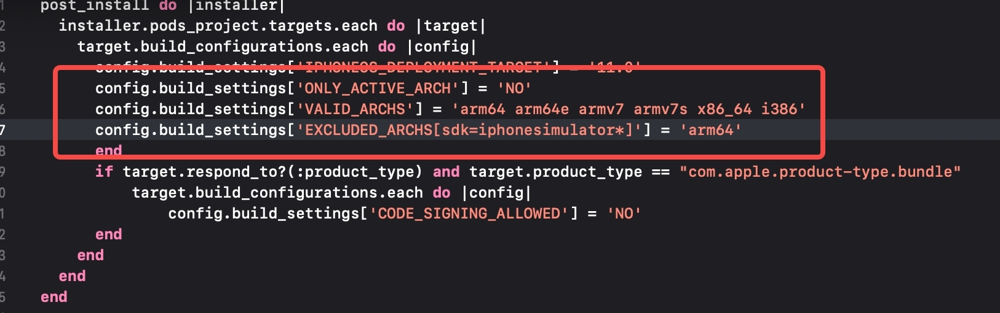
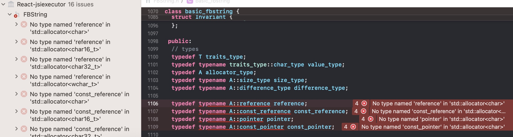
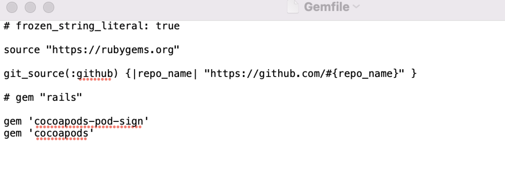

# Xcode报错问题收集

## UIGraphicsBeginImageContext() failed to allocate
iOS17、iOS18闪退，在iOS17及以上版本`UIGraphicsBeginImageContext`已经被标记为deprecated了。iOS 17以上使用UIGraphicsBeginImageContext()，size为0时，就会报错误。

**解决**
方案一：
保证api设置size的宽高不为零，则可正常使用。这样用到的地方都需要修改。

方案二：使用UIGraphicsImageRenderer替代
```

- (void)display {
    [super display];

    // short circuit when height or width are 0. Fixes CGContext errors throwing
    if (self.bounds.size.height == 0 || self.bounds.size.width == 0) {
      return;
    }

    BOOL hasAlpha = NO;

    for (NSInteger i = 0; i < self.colors.count; i++) {
        hasAlpha = hasAlpha || CGColorGetAlpha(self.colors[i].CGColor) < 1.0;
    }

    if (@available(iOS 10.0, *)) {
        UIGraphicsImageRendererFormat *format;
        if (@available(iOS 11.0, *)) {
            format = [UIGraphicsImageRendererFormat preferredFormat];
        } else {
            format = [UIGraphicsImageRendererFormat defaultFormat];
        }
        format.opaque = !hasAlpha;
        UIGraphicsImageRenderer *renderer = [[UIGraphicsImageRenderer alloc] initWithSize:self.bounds.size format:format];
        UIImage *image = [renderer imageWithActions:^(UIGraphicsImageRendererContext * _Nonnull ref) {
            [self drawInContext:ref.CGContext];
        }];

        self.contents = (__bridge id _Nullable)(image.CGImage);
        self.contentsScale = image.scale;
    } else {
        UIGraphicsBeginImageContextWithOptions(self.bounds.size, !hasAlpha, 0.0);
        CGContextRef ref = UIGraphicsGetCurrentContext();
        [self drawInContext:ref];

        UIImage *image = UIGraphicsGetImageFromCurrentImageContext();
        self.contents = (__bridge id _Nullable)(image.CGImage);
        self.contentsScale = image.scale;

        UIGraphicsEndImageContext();
    }
}

```

## Xcode16上传包报错
```
Invalid Executable. The executable 'jkt.app/Frameworks/ImSDK.framework/ImSDK' contains bitcode.

```
**解决**
通过pod导入的只需要在Podfile里添加下面代码：
```
post_install do |installer|  
  bitcode_strip_path = `xcrun --find bitcode_strip`.chop!
  def strip_bitcode_from_framework(bitcode_strip_path, framework_relative_path)
    framework_path = File.join(Dir.pwd, framework_relative_path)
    command = "#{bitcode_strip_path} #{framework_path} -r -o #{framework_path}"
    puts "Stripping bitcode: #{command}"
    system(command)
  end
  framework_paths = [
    "/Pods/TXIMSDK_iOS/ImSDK.framework/ImSDK",
  ]
  framework_paths.each do |framework_relative_path|
    strip_bitcode_from_framework(bitcode_strip_path, framework_relative_path)
  end
end

```
第二种方法：
```
cd /Pods/TXIMSDK_iOS/ImSDK.framework
xcrun bitcode_strip -r ImSDK -o ImSDK
```


## 升级Xcode16 rn编译报错
```
unexpected service error: The Xcode build system has crashed. Build again to continue.
```
**解决方案**: 目前官方还没有给出解决方案，临时解决方案就是[Xcode降级到15.4](https://xcodereleases.com/?scope=release)
无法降级的则查看是否用到这个库`react-native-image-crop-picker`,在pods->RNImageCropPicker->ImageCropPicker.h中有一个空的`#import` 删除重新编译或升级到`0.41.2`

## xcode16编译报错1:
升级后报错：
```
Undefined symbols for architecture x86_64:_OBJC_CLASS_$_AFHTTPSessionManager

Undefined symbols for architecture x86_64:_OBJC_CLASS_$_RCTEventEmitter
```
**原因** 缺少包的引用或缺少模拟器架构。先排查包有没有引入`Build phases-->Link Binaray With Libraries-->选择“+”号 -> 添加缺少的包`， 如果包已经存在则可能是缺少模拟器架构，使用真机测试下。我这里是缺少模拟器架构。
**解决：** 因为设备是[M系列架构](https://blog.csdn.net/w13776024210/article/details/121857456)，在Intel芯片上没有问题。
修改Build Settings -> Excluded Architectures选项，添加Any iOS Simulator SDK选项，并设置值为arm64。

如果已经设置还是报错且是使用Pods中的三方库文件报错，则可能是三方库没有兼容M系列架构。可以在podfile文件中做如下配置：


```
post_install do |installer|
    installer.pods_project.targets.each do |target|
      target.build_configurations.each do |config|
        config.build_settings['IPHONEOS_DEPLOYMENT_TARGET'] = '11.0'
        config.build_settings['ONLY_ACTIVE_ARCH'] = 'NO'
        config.build_settings['VALID_ARCHS'] = 'arm64 arm64e armv7 armv7s x86_64 i386'
        config.build_settings['EXCLUDED_ARCHS[sdk=iphonesimulator*]'] = 'arm64'
        end
        if target.respond_to?(:product_type) and target.product_type == "com.apple.product-type.bundle"
            target.build_configurations.each do |config|
                config.build_settings['CODE_SIGNING_ALLOWED'] = 'NO'
        end
      end
    end
  end
```
## xcode16编译报错2:

```
 Undefined symbol: __mh_execute_header

```
**原因** 只有在为arm64构建时，项目中接入了unity, 有一步设置了`[ufw setExecuteHeader: &_mh_execute_header];`
**解决**：Build Setting -> Build Options 设置Enable Debug Dylib Support为 `No`


## Xcode15.2 React-jsi报错

`*/ios/Pods/Folly/folly/FBString.h:1106:23 No type named 'reference' in 'std::allocator<char>'`



**解决**:
找到FBString.h修改`typedef A allocator_type;`下面的六行代码，把以`A`命名空间的类型定义进行修改:
```
//将这六行
typedef typename A::size_type size_type;
typedef typename A::difference_type difference_type;

typedef typename A::reference reference;
typedef typename A::const_reference const_reference;
typedef typename A::pointer pointer;
typedef typename A::const_pointer const_pointer;
 // 替换成下面的六行
typedef typename std::allocator_traits<A>::size_type size_type;
typedef typename std::allocator_traits<A>::difference_type difference_type;

typedef typename std::allocator_traits<A>::value_type& reference;
typedef typename std::allocator_traits<A>::value_type const& const_reference;
typedef typename std::allocator_traits<A>::pointer pointer;
typedef typename std::allocator_traits<A>::const_pointer const_pointer;
```

## Xcode14三方库签名报错

今天更新升级了一下Xcode14，打开项目运行居然报错了:

`Signing for "ESPullToRefresh-ESPullToRefresh" requires a development team. Select a development team in the Signing & Capabilities editor.`

这是什么情况，三方库也需要设置一个开发团队了。

## 如何解决

**解决方案1:**

修改Podfile文件，在Podfile中添加如下内容：

```
post_install do |installer|
        installer.generated_projects.each do |project|
            project.targets.each do |target|
                target.build_configurations.each do |config|
                        config.build_settings["DEVELOPMENT_TEAM"] = "Your Team ID"
                end
            end
        end
end

```

或使用下面这种：
```
installer.pods_project.targets.each do |target|
    target.build_configurations.each do |config|
        config.build_settings['CODE_SIGN_IDENTITY'] = ''
    end
end

```

**解决方案2:**

1. 终端执行`sudo gem install cocoapods-pod-sign`
2. 执行`bundle init`,此时生成一个Gemfile文件，看输出路径`Writing new Gemfile to /Users/xxx/Gemfile`
3. 修改Gemfile文件，将这两行代码复制粘贴到文件末尾

 	```
 	gem 'cocoapods-pod-sign'
 	gem 'cocoapods'
 	```
 

4. 执行`bundle install`,让文件的修改生效
5. cd 到项目目录执行`pod install --verbose`

##  Xcode15.2 在rn运行codegen生成代码运行报错
```
Build service could not create build operation: unknown error while handling message: MsgHandlingError(message: "unable to initiate PIF transfer session (operation in progress?)")
```
**解决**:
rm -rf ~/Library/Developer/Xcode/DerivedData
clean
clear all Issues
重启Xcode
重新build
还是报错结果发现是自定义的`podspec`文件中缺少react相关依赖
```
if respond_to?(:install_modules_dependencies, true)
    install_modules_dependencies(spec)
  else
    spec.dependency "React-Core"

    # Don't install the dependencies when we run `pod install` in the old architecture.
    if ENV['RCT_NEW_ARCH_ENABLED'] == '1' then
      spec.compiler_flags = folly_compiler_flags + " -DRCT_NEW_ARCH_ENABLED=1"
      spec.pod_target_xcconfig    = {
          "HEADER_SEARCH_PATHS" => "\"$(PODS_ROOT)/boost\"",
          "OTHER_CPLUSPLUSFLAGS" => "-DFOLLY_NO_CONFIG -DFOLLY_MOBILE=1 -DFOLLY_USE_LIBCPP=1",
          "CLANG_CXX_LANGUAGE_STANDARD" => "c++17"
      }
      spec.dependency "React-Codegen"
      spec.dependency "RCT-Folly"
      spec.dependency "RCTRequired"
      spec.dependency "RCTTypeSafety"
      spec.dependency "ReactCommon/turbomodule/core"
    end
  end
```


