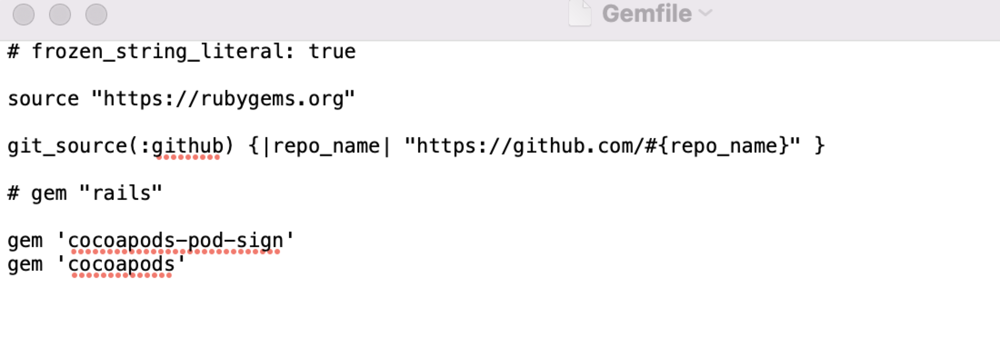

# Xcode14三方库签名报错

今天更新升级了一下Xcode14，打开项目运行居然报错了:

`Signing for "ESPullToRefresh-ESPullToRefresh" requires a development team. Select a development team in the Signing & Capabilities editor.`

这是什么情况，三方库也需要设置一个开发团队了。

## 如何解决

**解决方案1:**

修改Podfile文件，在Podfile中添加如下内容：

```
post_install do |installer|
        installer.generated_projects.each do |project|
            project.targets.each do |target|
                target.build_configurations.each do |config|
                        config.build_settings["DEVELOPMENT_TEAM"] = "Your Team ID"
                end
            end
        end
end

```

或使用下面这种：
```
installer.pods_project.targets.each do |target|
    target.build_configurations.each do |config|
        config.build_settings['CODE_SIGN_IDENTITY'] = ''
    end
end

```

**解决方案2:**

1. 终端执行`sudo gem install cocoapods-pod-sign`
2. 执行`bundle init`,此时生成一个Gemfile文件，看输出路径`Writing new Gemfile to /Users/xxx/Gemfile`
3. 修改Gemfile文件，将这两行代码复制粘贴到文件末尾

 	```
 	gem 'cocoapods-pod-sign'
	gem 'cocoapods'
 	```
 

4. 执行`bundle install`,让文件的修改生效
5. cd 到项目目录执行`pod install --verbose`

